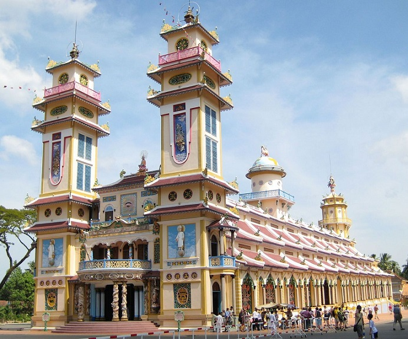
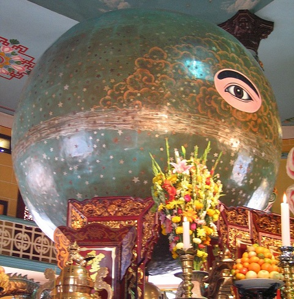

Wietnam, od połowy XIX przeorany wojnami i komunizmem, jest znany raczej ze swojej krwawej historii niż z bogactwa kulturowego. O państwie tym, znajdującym się na styku wpływów buddyjskich, konfucjańsko-taoistycznych i kolonialnych, świat Zachodu usłyszał szeroko w latach 50. i 60. XX w. Wtedy to okazało się, że oprócz tradycyjnych religii wschodnich, rozwija się prężnie kult, będący lokalnym produktem synkretyzmu – kaodaizm, liczący kilka milionów wiernych.

W czasach kolonialnej administracji francuskiej (XIX w.) do Wietnamu przybyło chrześcijaństwo, a wraz z nim popularne wtedy ruchy spirytystyczne i ezoteryczne. Większość Wietnamczyków pracujących na stanowiskach urzędniczych poddawało się tym wpływom, które były oznaką zachodniego luksusu i klas wyższych. Nie inaczej było w przypadku wietnamskiego urzędnika Ngo Minh Chieu (1878-1932), któremu podczas serii seansów spirytystycznych rozpoczętych w Wigilię 1925r. objawił się byt nazywający siebie Cao Dai. Nazwa ta oznacza dosłownie „Najwyższy Pałac” i odnosi się do fizycznego miejsca, w którym mieszka Bóg. Polecił on założenie nowej religii, której zadaniem było zjednoczyć wszystkie wyznania świata. W 1926r. podpisano „Deklarację założenia religii Cao Dai”, a już rok później zbudowano największą świątynie kaodaistyczną – katedrę w Tai Ninh pod Sajgonem.

Wykładnia kaodaizmu jest w miarę spójna i daje się zamknąć w jednym słowie – uniwersalizm. Doktryna tej religii została prawie całkowicie sformułowana na podstawie wizji uzyskanych podczas seansów spirytystycznych. Cao Dai, który wyłonił się z bezkresnego źródła Tao, stworzył świat i człowieka z nieśmiertelną duszą, która może się odradzać. Jednocześnie Cao Dai w ciągu całej historii świata manifestował się w różnych miejscach i w różnych okresach, wysyłał swoje wcielenia na ziemię, które tworzyły poszczególne religie mające zbliżyć ludzi do swojego boga. Wobec tego najważniejszymi postaciami kaodaizmu są Budda, Konfucjusz i Jezus, a obok nich Zaratusztra, Mojżesz, Maryja, Mahomet, Laozi i wielu innych, w tym bóstwa pierwotnych panteonów. Oprócz żywych wcieleń Cao Dai, na ziemię zsyłani byli święci, którzy swoim życiem i twórczością wskazywali drogę ludzkości. „Proces kanonizacyjny” był dość osobliwy – za świętą uznawano osobę, która (za sprawą i przyzwoleniem Cao Dai) ukazywała się w seansach spirytystycznych i udzielała wskazówek. Uczestnikami tych seansów był założyciel Ngo Minh, jego następcy i wysocy rangą duchowni. Ogłosili oni panteon świętych, który wydaje się być zaskakujący, wśród nich są: Juliusz Verne, Sun Jat-sen, Juliusz Cezar, Joanna d’Arc, William Szekspir, Włodzimierz Lenin, Perykles, Lai Bai (chiński poeta), Kartezjusz, Louis Pasteur, La Fontaine czy Ignacy Łukasiewicz. W okresie powstawania religii Wietnam pozostawał dalej w kulturowej strefie wpływów Francji, stąd większość świętych to postacie, o których uczy się we francuskich szkołach. W latach 60. władze wietnamskie zakazały seansów spirytystycznych, co fortunnie zbiegło się z dekretem duchownych, którzy stwierdzili, że cała niezbędna wiedza została już przekazana i seanse stały się zbędne.

Obrzędowość i organizacja religii również jest dość synkretyczna, hierarchia kościoła jest zapożyczona z katolicyzmu – na czele wspólnoty stoi papież (w sumie żyło dwóch kaodaistycznych papieży, od 1959r. nie został wybrany nowy papież), a duchowni (kobiety i mężczyźni) dzielą się na kardynałów, biskupów i szeregowych księży. Noszą oni szaty w trzech kolorach, oznaczających poszczególne gałęzie religii – żółty (buddyzm), czerwony (konfucjanizm) i niebieski (taoizm). Siedzibą papieża jest katedra w Tai Ninh (Stolica Apostolska kaodaizmu), która sama w sobie również łączy elementy różnych wyznań, a jej dokładny opis został przekazany w trakcie seansów spirytystycznych. Budowa z zewnątrz przypomina mieszankę chrześcijańskiej bazyliki z buddyjską pagodą, ozdobiona jest w fantastyczne motywy z mitologii wschodniej, a oprócz dwóch wież z przodu jej dach zdobi minaret (z rzeźbą hinduskiego Śiwy na szczycie) oraz wieża z hinduskiego mandiru. Sam wygląd świątyni wzbudzał skrajne opinie wśród zachodnich obserwatorów, określany był jako „groteskowe, architektoniczne bluźnierstwo” i „disnejowska fantazja o Dalekim Wschodzie w technikolorze”. Środek katedry wypełnia przestronna nawa, a dach podtrzymują kolumny ozdobione smokami, całość wnętrza wygląda iście bajkowo. Na samym końcu znajduje się nisza, w której umieszczony jest ołtarz z wyobrażeniem Cao Dai jako ogromnej kuli z wizerunkiem boskiego oka. Boskie oko wpisane w trójkąt jest wszak symbolem kaodaizmu. Nad ołtarzem znajdują się wizerunki najważniejszych wcieleń Cao Dai. Wszyscy duchowni i wierni podczas nabożeństwa siedzą na podłodze, zwróceni w kierunku ołtarza.

Po latach prześladowań i zakazów, kaodaizm został uznany w 1997r. za legalną religię i szybko stał się trzecim największym wyznaniem Wietnamu. Obecnie liczba wyznawców kaodaizmu w Wietnamie sięga według różnych szacunków od 3 do 6mln, dodatkowo 50 tys. wiernych żyje na całym świecie (głównie w USA i Francji). Religia dzieli się na kilka odłamów, które jednak nie konkurują ze sobą. Mimo to obserwuje się tendencje spadkową liczby wiernych, szczególnie wśród ludzi młodych. Świątynie i nabożeństwa kaodaistów są jedną z atrakcji turystycznych Wietnamu, przynosząc wspólnocie niemałe zyski.