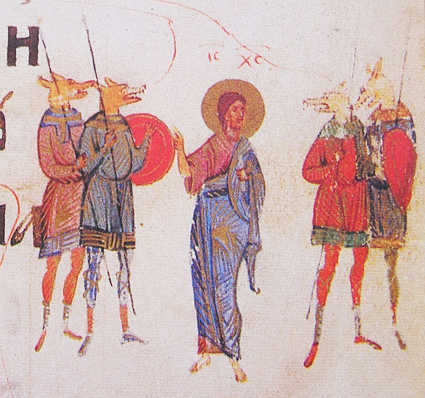
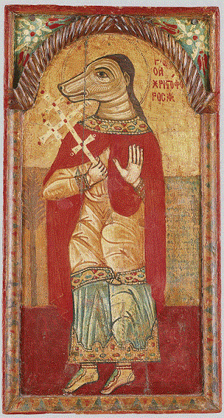

Od wieków w wielu kulturach pojawiają się mity o istotach czy bogach z ciałem ludzkim i psią lub wilczą głową. Nawet dzisiaj obecny i powszechny jest w kulturze wizerunek wilkołaka, choć raczej nikt nie wierzy w ich istnienie na poważnie. Tymczasem w średniowieczu plotki o istnieniu potomków wilkołaków zaprzątały głowę największym teologom chrześcijańskim.

Człowiek z głową psa/szakala pojawia się już w mitologii egipskiej w postaci Anubisa lub Duamuefa. Duamutef był synem Horusa, jego postać przyjmowała urna, w której przechowywano wnętrzności zmarłego poddanego mumifikacji (głównie żołądek). Anubis natomiast był jednym z bardziej czczonych bóstw, zmumifikował on Ozyrysa, opiekował się młodym Horusem, a co najważniejsze był przewodnikiem po krainie umarłych. Jego kult silny był nawet za czasów rzymskich, podupadł, kiedy do Egiptu zawitało chrześcijaństwo. Jednak Koptowie (bezpośredni potomkowie starożytnych Egipcjan) w pewnym sensie połączyli Anubisa z osobą św. Krzysztofa, który był popularnym świętym na tych terenach. Krzysztof bowiem profesję miał całkiem podobną – jako człowiek ogromnej postury służył za przewodnika i przenosił pielgrzymów przez rzekę, a raz nawet dostąpił zaszczytu przeniesienia Dzieciątka Jezus. Z tej krzyżówki powstał święty Krzysztof Psiogłowy, który w zależności od wersji legendy miał zwierzęcą głowę przez całe życie lub utracił ją w momencie chrztu. Tak czy inaczej, święty był przedstawiany z psią aparycją na obrazach i wschodnich ikonach nawet do XVIII wieku.

Święty Krzysztof pochodził z tajemniczego plemienia Kynocefalów, o którym wspominają już starożytni greccy pisarze. Ktezjasz, który był niewolnikiem króla perskiego, oraz Megastenenes, poseł joński na dworze króla Indii, wspominają w swoich dziełach o plemieniu ludzi z psimi głowami, którzy zamieszkują górskie rejony Indii. Herodot przytacza opinię mieszkańców Libii twierdzących, jakoby takie kreatury zamieszkują ich wschodnie ziemie. Natomiast mit o wyprawie Jazona i Argonautów wprost podaje opis bitwy z Kynocefalami, która miała rozegrać się gdzieś na terenie dzisiejszych wschodnich Węgier. Wzmiankę o ludziach z głowami wilków zawiera staroangielski traktat Beowulf, zaś chińscy podróżnicy opisują tajemniczą wyspę, ojczyznę tych stworów (identyfikowaną z Japonią lub Ameryką). Marco Polo w pamiętnikach z podróży opisywał Psiogłówców, którzy mieli zamieszkiwać Andamany. Nic więc dziwnego, że raczej mało kto wątpił w pochodzenie świętego Krzysztofa, wszak obecność jego przodków była porządnie udokumentowana.

Nie wątpił także św. Augustyn. Doktor Kościoła w swoim wielkim dziele „De Civitate Dei”, biorąc pod uwagę możliwość istnienia Kynocefalów wykazywał, że skoro mają ciało podobne do ludzkiego, muszą pochodzić od Adama i mimo zniekształcenia fizycznego, posiadają duszę i mogą dostąpić zbawienia. Twierdzenie to wywołało teologiczną burzę, św. Izydor Sewilski (twórca pierwszej naukowej encyklopedii) utrzymywał, że psiogłowi są dzicy i zachowują się jak zwierzęta, a zwierzęta duszy nie mają. Inni myśliciele i teologowie wskazywali, że skoro Psiogłowcy noszą odzienie, to znaczy że odczuwają wstyd, a więc mogą wybierać między dobrem a złem. Dyskusja między teologami urwała się gdzieś w XVI wieku, kiedy zaczęto odkrywać nowe lądy, a śladu po Kynocefalach nie było. Tym niemniej cały spór nie poszedł na marne, będzie dla Watykanu punktem wyjścia w momencie spotkania ludzi z cywilizacją pozaziemską, kiedy zajdzie potrzeba dostosowania chrześcijańskiej teologii.

