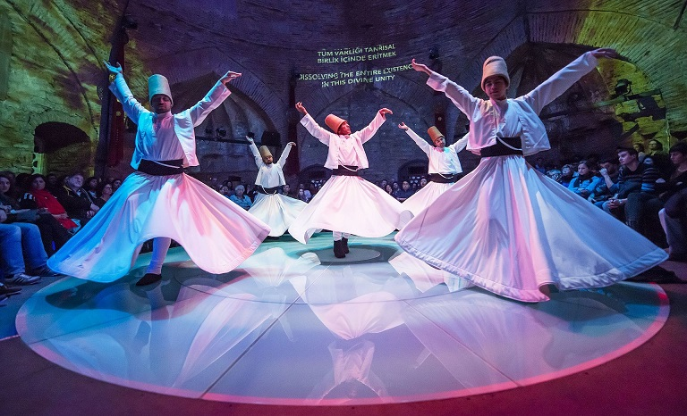
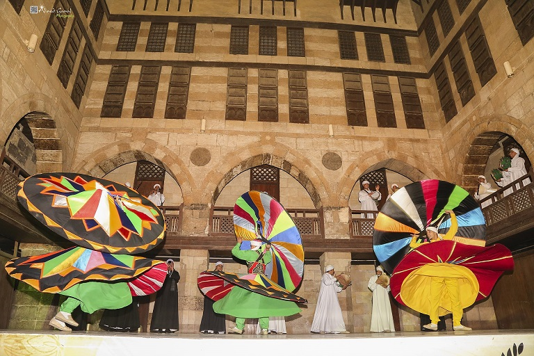

Islam, jak każda religia, nie obył się bez mistyki. O ile w chrześcijaństwie (a także w buddyzmie) mistyka rozwijała się głównie w klasztorach pośród duchownych, o tyle w islamie ze względu na brak jako takich kapłanów było to niemożliwe. Jednak wśród muzułmanów szybko wyłoniły się postacie o szczególnie bogatym życiu duchowym, a wokół nich zaczęli gromadzić się uczniowie. Cały ten proces był początkiem powstania mistyki islamskiej, określanej mianem sufizmu.

Mówi się, że islam nie może istnieć bez sufizmu, jak ciało ludzkie nie może istnieć bez serca. Sufizm zawdzięcza swoją nazwę wełnie (arab. suf), gdyż mistycy nosili szaty na wzór chrześcijańskich mnichów. Rzeczywistość była jednak mniej łagodna niż wełna, suficie bowiem ubierali się głównie we włosienice. Mistycy islamscy nazywani byli pirami lub szejkami (słowa te znaczą dosłownie „mistrz” odpowiednio z perskiego i arabskiego). Derwisze i fakirzy (pers. i arab. „biedni”) – uczniowie, muszą naśladować swojego mistrza, który z kolei pozostaje w duchowej łączności ze swoimi przodkami i Bogiem. W ten sposób możliwa jest duchowa droga, od ludzkiego do boskiego „ja”. Mistrz prowadzi ucznia przez kolejne etapy, które różnią się w zależności od tradycji, aby ostatecznie dzięki Bożej łasce doznać ponadnaturalnych przeżyć. Pomagają w tym żal, post, asceza, ubóstwo, a przede wszystkim medytacja – zikr (arab. „przypomnienie”). W praktyce polega ona na modlitwach w formie zbliżonej do mantr czy litanii, recytowane są imiona Allaha, wersety Koranu czy wyznanie wiary. Odmawianie ich jest połączone z ćwiczeniami cielesnymi, modlitwy są wyrażane nie tylko słowami , ale również ciałem. Zewnętrzna forma medytacji zikr jest różna, sudańska tradycja burhanijja cechuje się rytmiką, turecka nakszbandijja to szkoła wstrzemięźliwości i modlitwy w ciszy, a z irackiej rifaijji pochodzą stereotypowi fakirzy – połykający miecze i chodzący po rozpalonych węglach. Jednak najbardziej znanym bractwem sufickim była szkoła maulawijja (Mewlewici), czyli tańczący derwisze.

Założyciel szkoła mewlewitów, Dżalal-ad-Din (1207-1273r.) pochodził z okolic baktryjskiego miasta Balch, które było centrum islamskiej teologii, a wcześniej był to ważny ośrodek zaratusztriański, buddyjski, manichejski i nestoriański. Mnogość kultur, które się tam przenikały, sprzyjała synkretyzmowi, co z pewnością miało wpływ na młodego mistyka. Na zaproszenie sułtana państwa Rum, Dżalaluddin objął stanowisko szejka w szkole dla derwiszy , odtąd stał się znany jako Rumi. Już jako trzydziestolatek miał ponad 10 tysięcy uczniów. Z natchnienia swojego mistrza Shams ad-Din zaproponował taneczną formę medytacji. Wierzył, że poprzez wprawianie się w ciągły ruch i naśladowanie ciał niebieskich możliwe jest zbliżenie się do Boga i osiągnięcie jedności z Wszechświatem, czego efektem jest ekstaza. Rumi głosił, że „w istocie wszyscy jesteśmy jednym i tym samym światłem” oraz, że Bóg jest uniwersalnym bytem i dorgą do niego są wszystkie religie. Takie heterodoksyjne podejście do islamu było charakterystyczne dla sufickich mędrców, Rumi jednak miał więcej szczęścia niż jego koledzy po fachu.

Twierdzenia mistyków doprowadzały do wściekłości radykalnych wyznawców islamu, co niejednokrotnie kończyło się oskarżaniem o herezje i wykonywaniem kary śmierci. Już w 922r. (ok. 250 lat po Mahomecie) suficki mędrzec Mansur al-Haladż został stracony za twierdzenie wypowiedziane w ekstazie „jestem absolutną prawdą, mianowicie Bogiem”. Na domiar złego twierdził on, że obowiązek pielgrzymki do Mekki nie jest wcale taki obowiązkowy i można z powodzeniem zastąpić go pielgrzymką w głąb siebie. Irański mistyk Suhrawardi został w 1191r. zabity za herezję połączenia islamskiej mistyki z elementami tradycji greckiej, egipskiej i zaratusztrańskiej. Poszczęściło się natomiast Ibn Arabiemu, andaluzyjskiemu suficie, który nie raz unikał śmierci za swoje panteistyczne idee: „w moim sercu znajduje się miejsce dla kalsztoru dla mnichów, świątyni dla bożków, Kaaby dla procesji, tablicy Tory i księgi Koranu”. Do dzisiaj Ibn Arabi uważany jest albo za wybitnego świętego i „Największego Szacha” (Szajch al-Akbar), albo za heretyka czy wręcz innowiercę.

Sufizm dalej jest tępiony przez radykalne odłamy islamskie, ale mimo to w większości krajów muzułmańskich ma się dobrze. W Czeczeni lokalna odmiana sufizmu byłą spoiwem, który łączył ten naród w trudnych dla niego czasach (obecnie nasilają się tam tendencje fundamentalistyczne). Grupy bractw sufickich znajdują się także w Niemczech, Francji czy Wielkiej Brytanii. Kształcenie kandydatów jest trudne, ze względu na zróżnicowaną i bogatą w symbolikę treść. Mimo to sufizm przyciąga coraz więcej sympatyków, staje się w pewnym sensie modny (tak jak modna stała się w Europie medytacja zaczerpnięta z buddyzmu) i stanowi zdecydowanie najłagodniejszą odmianę współczesnego islamu.