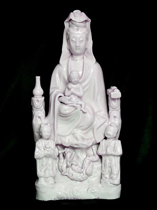

Kiedy w roku 1638 wszyscy Europejczycy, w tym katoliccy misjonarze, zostali wygnani z Japonii, władze kościelne w Rzymie sądziły, że to koniec katolicyzmu na tych odległych wyspach. Prozelityzm został zakazany, co gorliwsi chrześcijanie zostali zamordowani i rozpoczęły się lata prześladowań. Część katolików japońskich nie wyrzekła się swojej wiary, ale jednocześnie nie przyzwała się do niej zbyt głośno. Zeszli do podziemi i odcięci od zewnętrznego świata rozpoczęli próbę przechowywania religii katolickiej w Japonii.

Nie było to łatwe, władze wysyłały „inkwizytorów”, którzy kazali podejrzanym deptać i pluć na krucyfiksy lub wizerunki Maryi i świętych (tzw. fumi-e) a tych, którzy się nie odważyli - zabijano. Posiadanie obrazów lub rzeźb o tematyce chrześcijańskiej nie wchodziło w grę, jednak dewocjonalia buddyjskie lub lokalnej religii shinto mogły niekiedy ratować życie. W związku z tym wytworzył się osobliwy obyczaj – stawiano figurki bóstw japońskich, np. bogini Guanyin lub boddhisatwów, a za nimi umieszczano analogiczne wizerunki Maryi bądź Jezusa. Ten sposób zapewniał możliwość modlitw, które nie kończyły się śmiercią. Jednak nadal pozostawał problem braku nauczycieli i łączności z papieżem, wszelkie nauki i wierzenia przekazywane były przede wszystkim ustnie, co doprowadziło do pomieszania i przeinaczania pewnych faktów, powstania osobliwych nazw, a nawet pojawiły się poglądy heretyckie. Na szczęście do czasów współczesnych zachowało się 10 manuskryptów, które jako jedyne opowiadają o wierzeniach ukrytych chrześcijan.

Manuskrypty głoszą, że na początku był Deusu, Pan nieba i ziemi. Stworzył on Ewę i Adana, którzy żyli w Paraiso. Anioł Jusuheru poczęstował ich jabłkiem z drzewa dobra i zła, za co Deusu wyrzucił Adana, Ewę i Jusuheru potężnym kopniakiem. Dzieci Adana i Ewy zaczęły się mnożyć i grzeszyć i po śmierci trafiały do piekła. Deusu nie wiedział co robić, ale anioł poradził mu, żeby podzielił swoje ciało i zesłał na ziemię. W ten sposób Deusu wysłał najpierw proroka Sanjuwana, a potem anioła, który młodej dziewczynie Maruyi obiecał pomoc – potrzebowała jej gdyż król kraju Roson chciał ją pojąć za żonę. Kiedy Maruya nie zgodziła się na ożenek, król wściekł się i zażądał wyjaśnienia jej odmowy. W tym momencie Maruya (w środku lata) wymodliła śnieg i została zabrana kwietnym pojazdem do nieba. Spotkała tam Deusu, który nadał jej rangę Świętej Maruyi Śnieżnej i polecił powrócić na ziemi nad rzekę Abę. Tam stała się brzemienna i z wdzięczności wymówiła modlitwę Abe Maruya. Kiedy dziewczyna wróciła do rodziców, wywołała ich gniew, gdyż najpierw odmówiła ożenku, a potem zaszła w ciąże. Została wygnana i błąkała się, aż schroniła się w stajni, gdzie urodziła syna Ommi.

W tym czasie władcy sąsiednich krajów Mento, Kasuparu i Bautozaru ujrzeli gwiazdę i przybyli za nią do miejsca, gdzie urodziło się dziecko. W międzyczasie dowiedział się o tym król Yorotetsu i wysłał swoje zaufane sługi Ponsha i Piroto, aby znaleźli dziecko. Niestety nie udało im się tego uczynić, gdyż Ommi z Maruyą uciekli nad rzekę Bauchismo. Tam spotkali Sanjuwana, który ochrzcił dziecko imieniem Jiyusukirihito. Yorotetsu natomiast kazał zabić wszystkie niemowlęta płci męskiej.

Ommi studiował kanony buddyjsie i uczył się od mistrzów, lecz z czasem przewyższał ich mądrością. Stworzył piękną świątynię Santa Ekirenja ze złota i srebra w kraju Roma, a także dużo się modlił. Podczas jednej z modlitw objawił mu się Deusu. Powiedział, żeniemowlęta utraciły życie z winy Ommiego, dlatego Ommi będzie musiał cierpieć i umrzeć. Ommi dał się porwać królowi Yorotetsu i był torturowany przez kilka dni. Uczniowie pomagali ulżyć mu w cierpieniach, pomogła mu m.in. Beronika, która otarła mu twarz płótnem. Płótno oddała do świątyni Santa Ekirenja, za co została wzięta do nieba i dano jej tytuł Baranka Bożego. Ommi zaś ostatecznie umarł, następnie wstąpił do nieba, zszedł na ziemię by nauczać i wrócił do nieba, wraz z Maruyą, która wstąpiła tam o własnych siłach. I tak Deusu, Ommi i Maruya stanowią Trójcę Świętą.

Pod koniec I poł. XIX w. izolacja w Japonii skończyła się. Misjonarze, którzy tam dotarli, byli zaskoczeni, że chrześcijanom udało się przetrwać ponad 200 lat w tak niesprzyjających warunkach. Spora część z nim powróciła pod jurysdykcję Rzymu, z radością przyjęli zachodnich księży i ortodoksyjną naukę. Jednak powstała też grupa, która chciała za wszelką cenę utrzymać wytworzone przez siebie tradycje. Nie zerwali ze swoimi praktykami, ale dali początek wspólnocie nazwanej hanare-kirishitan (oddzieleni chrześcijanie), która istnieje do dzisiaj