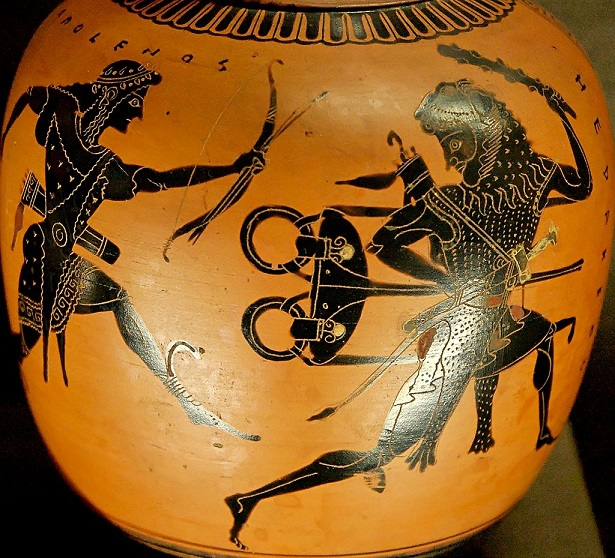
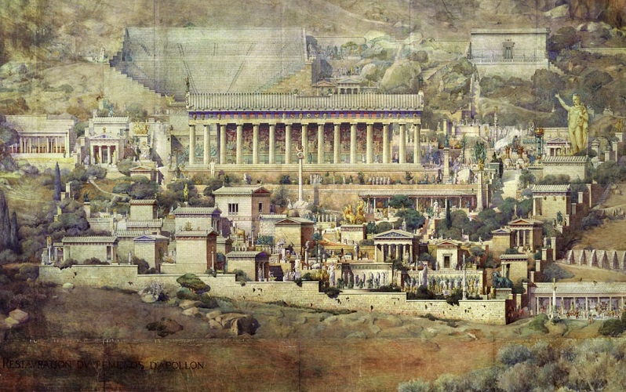

Zacznijmy od mitologii: Apollo był synem Zeusa i bogini Leto. Po urodzeniu bóg dostał od ojca lirę, złotą przepaskę i rydwan zaprzężony w łabędzie. Na rydwanie tym Apollo udał się do kraju Hiperboryjczyków, ludu żyjącego na dalekiej północy, którzy oddawali bóstwu szczególną cześć; niektóre obrzędy kultu Apolla miały wywodzić się od tego ludu. Z kraju Hiperboryjczyków udał się Apollo do Grecji, gdzie na dłużej zatrzymał się w Delfach. Tam miał swoją wyrocznię ogromny wąż Pyton, syn Gai – Ziemi. Pyton usiłował zabić Leto, bowiem według przepowiedni miał zginąć z ręki jej syna. Zaatakował więc Apolla, a ten zabił go strzałami z łuku. W miejsce wyroczni Pytona bóstwo założyło swoje sanktuarium, które odtąd stało się głównym ośrodkiem jego kultu, a także ustanowiło igrzyska pytyjskie. Kapłanka zwana Pytią zasiadała na trójnogu i wprowadzała się w trans, głosząc przepowiednie. Trójnóg był bardzo ważnym artefaktem, Apollo toczył raz o niego spór z Heraklesem, któremu odmówiono odpowiedzi na pytanie, i który chciał porwać trójnóg aby ustanowić własną wyrocznię. Walkę braci przerwał dopiero Zeus, pozostawiając trójnóg w rękach Apolla.

A teraz trochę historii: ślady obecności człowieka na zboczach Parnasu w miejscu wyroczni sięgają trzeciego tysiąclecia p.n.e., a odkrycia dotyczące religijnego charakteru miejsca datuje się na ok.1800-1500 p.n.e. Początkowo miał tam rozwijać się kult Matki Ziemi, dopiero kiedy w Grecji zaczęto czcić bogów znanych z mitologii, Delfy stały się sanktuarium Apolla (proces odzwierciedlony w micie o zabiciu węża). O kulcie Matki Ziemi świadczy obecność sanktuarium Ateny Pronoi nieco poniżej sanktuarium delfickiego. Przydomek bogini Pronoia znaczy „pierwsza”, „wcześniejsza”, gdyż jej świątynia była pierwszą, do której docierali pielgrzymi udający się do Delf, ale także być może dlatego, że jej kult był w tym miejscu starszy niż kult Apolla. Także kwestia trójnogu ma podłoże historyczne, mit o sporze Apolla z herosem jest reminiscencją rywalizacji wyroczni delfickiej i wyroczni Heraklesa, a być może nawet rzeczywistej próby opanowania sanktuarium przez zwolenników kultu bohatera.

Ostatecznie świątynia Apolla w Delfach stała się ogólnogreckim sanktuarium, gdzie mimo wewnętrznych konfliktów pielgrzymowali wszyscy mieszkańcy Hellady – bogaci, biedni, zwykli obywatele, kupcy, państwa-miasta, królowie i herosi. Wyrocznia delficka odegrała wielką rolę w okresie greckiej kolonizacji, wskazując miejsca, w które warto się udać. Oczywiście bardzo ważnym przedmiotem przepowiedni były wojny, wyrocznia podpowiadała szanse na zwycięstwo. Sanktuarium ofiarowano liczne wota, od małych przedmiotów po ogromne pomniki - w podzięce mieszkańcy różnych rejonów Grecji stawiali wzdłuż tzw. świętej drogi swoje skarbce – mieszkańcy Argos po podbiciu Sparty, Sparta po podbiciu Aten, a Ateńczycy po pokonaniu Persów.

Pytia, czyli wyrocznia nie była jedną osobą, ale był to tytuł nadawany kobietom po pięćdziesiątce, które miały zostać szczególnie naznaczone przez Apolla. Według przekazów żuły one liście lauru i wdychały opary, które miały wydobywać się z miejsca pochówku Pytona (co potwierdza m.in. Strabon czy Plutarch). Niedawne badania geologiczne wykazały, że świątynia Apolla leży dokładnie na przecięciu dwóch uskoków geologicznych, gdzie najprawdopodobniej w starożytności występowała szczelina, z której uwalniały się gazy, m.in. odurzający etylen. Obecnie sądzi się także, że kapłani, którzy interpretowali słowa wyroczni zbudowali siatkę szpiegów, a przepowiednie konstruowali tak, żeby realizować swoje interesy i zapewnić bezpieczeństwo i dobrobyt Delfom.

Znaczenie wyroczni zaczęło podupadać po wojnach peloponeskich, natomiast trzęsienie ziemi w 373 p.n.e. zrujnowało sanktuarium doszczętnie. Próbowano odbudować świątynię i przywrócić miejscu dawny prestiż, ale z marnym skutkiem. Władze rzymskie wywiozły większość skarbów z Delf do Rzymu, a to czego nie zabrano, zostało zrabowane przez najazdy plemion barbarzyńskich, m.in. Herulów. W XIX w. miały miejsce intensywne prace archeologiczne, dzisiaj natomiast Delfy są popularną atrakcją dla turystów, którzy przybywając tutaj, kultywują tradycję sięgającą ponad 3000 lat wstecz.