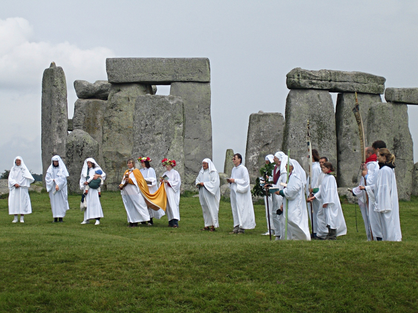
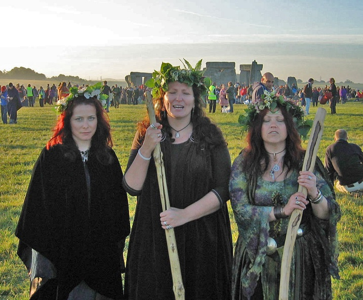

Kultura Celtów (lub Galów) była jedną z trzech najważniejszych starożytnych kultur, obok greckiej i scytyjskiej w starożytności. Ich kolebką zdaje się być dzisiejsza Bawaria, a zachód był głównym kierunkiem późniejszej ekspansji. Oprócz tego ślady obecności Celtów znajdowane są na terenach Polski a nawet Turcji (plemię Galatów, do których potem św. Paweł pisał listy wywodzi się od osiadłych tam Galów czyli Celtów). Zdominowali oni ludy dzisiejszej Francji, Hiszpanii i Wysp Brytyjskich, a ich wierzenia, język i kultura promieniowały z całą Europę. Jednym z najciekawszych i najbardziej znanych elementów celtyckiej kultury była kasta druidów. Niektórzy badacze twierdzą, że druidyzm stanowi relikt ludów, które zamieszkiwały Europę przed przybyciem Celtów (do takich ludów należeli przodkowie dzisiejszych Basków). Inni, w tym rzymski historyk Pliniusz, wywodzą genezę druidów ściśle z Galii, skąd rozprzestrzeniła się na resztę świata celtyckiego. Niezależnie od pochodzenia, druidzi byli stowarzyszeniem kapłanów, czymś w rodzaju magów w Persji czy braminów w Indiach. Juliusz Cezar zauważył, że byli oni kastą, która (razem z wojownikami) stała ponad plebsem. Kasta druidów wewnątrz dzieliła się na trzy stany: bardów, filidów (od celt. filid oznaczające wieszczów, proroków) oraz właściwych druidów.

Samo słowo druid pochodzi najprawdopodobniej od celtyckiego druis – czarownika albo od indoeuropejskiego słowa drys – dąb. Na czele druidów stał najwyższy kapłan, a urząd ten nie był dziedziczny (wspomina o tym Juliusz Cezar). Wiadomo też, że druidzi mieli żony i dzieci, brali udział w życiu społecznym i w wojnach. Sami Celtowie uważali ich za potężnych czarowników, zdolnych władać żywiołami i siłami przyrody, a spotykali się w świętych gajach i przy źródłach rzek, które były siedzibami bogów, dostępnymi tylko dla wybranych. Pozycja druidów była wysoka, zakładali szkoły, znali tajniki astronomii, wpajali cnoty moralne. Stąd, ze względu na funkcje dalece wykraczające poza kapłańskie, starożytni autorzy porównywali druidów do filozofów. Dlatego po podboju rzymskim ok. II w. p.n.e., święta gaje wycinano, a druidów tępiono, jako element wzmacniający tożsamość kulturową Galów i ewentualne zarzewie buntu. Druidyzm przetrwał w miejscach, gdzie nie dotarł but rzymskiego legionisty. Najsilniejsza pozycja druidów była w Irlandii, a ich wpływy promieniowały na zachodnie brzegi Brytanii. W niektórych irlandzkich królestwach władca miał zakaz wypowiadania się przed druidami. Był to przykład magicznego prawa geasa, dzięki którym druidzi mogli nakładać na pojedyncze osoby coś w rodzaju indywidualnego tabu – zakaz mówienia pewnych słów, zjadania potraw, odwiedzania miejsc. Złamanie tego zakazu ściągało zemstę sił nadprzyrodzonych. Druidowie określali zasady postepowania w wielu szczegółowych sprawach i biada temu, kto ich nie posłuchał.

Na krótko przed chrystianizacją do głosu doszli filidowie, mocno zagrażając wpływom druidów. Jedną z najważniejszych ich funkcji było wróżenie, a podczas wróżb ogromną rolę odgrywało natchnienie poetyckie, które miało szczególną moc magiczną. Filidowie więc miotali potężne czary, zaklinali duchy, pełnili rolę prawników, lekarzy czy historyków. Do filidów zaliczano także artystów, rzemieślników i muzyków, ale w odróżnieniu do druidów byli organizacją raczej zamkniętą i dziedziczną, która wyróżniała stopnie wtajemniczenia. Mieli oni prawo nietykalności i eksterytorialności, dzięki czemu mogli kultywować i upowszechniać tradycje historyczne i stać się twórcami świadomości narodowej Iryjczyków (Celtów irlandzkich). Konflikt druidów z filidami wynikał głównie z różnic w roli społecznej i prestiżu. Filidowie górowali jakością nauczania oraz solidarnością bractwa, natomiast druidowie cieszyli się wyższym prestiżem społecznym i silną pozycją u boku władców. Momentem ostatecznego zwycięstwa filidów uznaje się rok 574, kiedy uzyskali prawo prowadzenia szkół publicznych w całej Irlandii. Wcześniej jednak filidom przyszło w sukurs chrześcijaństwo, samo wiele wynosząc z tej współpracy.

W 432 rozpoczęła się misja św. Patryka, który wiedząc, jakim poważaniem wśród ludu cieszą się filidzi, zgłosił się do nich o pomoc. Bractwo filidów upatrzyło w nowej religii interes, a przede wszystkim zagrożenie dla znienawidzonych druidów i chętnie zgodziło się pomóc misjonarzowi. Pozwolili mu dołączyć do organizacji i korzystać z przywilejów społecznych. Patryk zaczął głosić Ewangelię tak, jak filidowie swoje opowieści. Naczelny fili Irlandii złożył hołd Świętemu, został ochrzczony i szerzył Słowo Boże, a razem z nim wielu innych filidów, a niektórzy z nich zostali później wyświęcani na biskupów. Patryk natomiast toczył walki z druidami. Legendy opowiadają o próbach sił magicznych z celtyckimi czarownikami, z których misjonarz zawsze wychodził cało. Prześladował on też demony, tropił i unicestwiał po lasach i bezdrożach. Jako mag Patryk był silniejszy od druidów i bóstw celtyckich, dzięki czemu mógł zaprowadzić swoją religię.

W ten sposób chrześcijaństwo stosunkowo łagodnie weszło do Irlandii, wplatając się w życie i obyczaje celtyckie. Nawet chrześcijańska legenda św. Patryka została ukształtowana na podobieństwo tradycyjnego mitu iryjskiego. Druidowie niełatwo ustąpili pola, w niektórych królestwach plemiennych długo utrzymali swoją pozycję. W 561 roku Diarmaid, ostatni król irlandzki otaczający się na dworze druidami odniósł klęskę. Nie słychać już później o żadnych formach zorganizowanego druidyzmu w Irlandii ani tym bardziej gdzie indziej. Tak też zakończyła swoje istnienie jedna z najbardziej interesujących instytucji świata Celtów, sięgająca praźródeł tego ludu, która wpłynęła na kształt jego życia religijnego i stała się jednym z najistotniejszych elementów mitu i legendy celtyckiej.