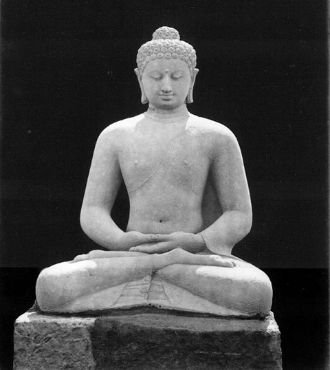
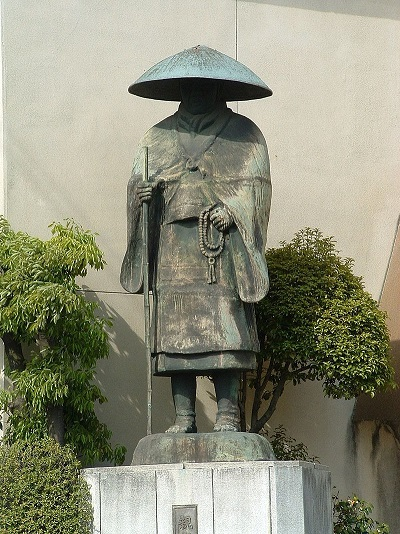

„Przeklęta protestancka herezja dotarła i tutaj. Kult Amidy jest tu tym, czym wiara luterska w Europie; bo twierdzą oni, że do zbawienia nie potrzeba niczego więcej niż imienia Buddy Amidy. Jego wspaniałym i zbawiennym dla ludzkości zasługom okazuje się niesprawiedliwość, jeśli się wierzy, że konieczne są oprócz nich własne cnotliwe uczynki i wysiłki”– tak w 1571 r. w Japonii opisywał amidyzm jezuita Franciscus Cabralis. Ten odłam buddyzmu związany jest z Buddą Amitabhą, którego kult narodził się w Indiach i ok. 150r. dotarł do Chin. Po około 200 latach powstał tam ruch zwany Szkołą Czystej Ziemi. W 552r. kult Amidy przedostał się z Korei do Japonii, aby tam przerodzić się w nową, silną religię.

W XIIw. Buddyzm w Japonii był arystokratyczną religią, przepełnioną magią – wyrocznie, interpretacja snów, wróżby, czy astrologia były typowymi przejawami pobożności. Kapłani natomiast skrupulatnie pilnowali, aby wierni przestrzegali ceremonii i spełniali „dobre uczynki”. Żyjący w tym czasie mnich Honen, który spędził życie w kilku klasztorach i poznał różne formy medytacji, doszedł do wniosku, że nawet najbardziej pobożne praktyki czy najcięższa asceza nie prowadzą do zbawienia. Stwierdzenie to legło u podstaw jodoshu - japońskiej szkoły Czystej Ziemi, której wyznawcy kierowali się jedną zasadą - wszystko zależy od pełnego oddania powtarzania słów Nembutsu: „Namu Amida Butsu”– jap. „Chwała Buddzie Amitabhie”.

Amithaba jest jednym z tzw. buddów medytacyjnych, czyli niehistorycznych. W odróżnieniu od Buddy Siakjamuniego (popularnie nazywanego po prostu Buddą), ich istnienia nie potwierdzają źródła historyczne, a jedynie praktyki religijne. Tym niemniej święte pisma szkoły Czystej Ziemi podają, że Amitabha żył kiedyś jako mnich Dharmakara i złożył 48 ślubowań uwolnienia od cierpienia wszystkich istot, które mu zaufają bez lęki i zwątpienia. Doznał on oświecenia i odtąd pomaga wiernym jako Amitabha przepełniając świat miłością i współczuciem.

Shinran Shonin, uczeń Honena, jeszcze bardziej zradykalizował to wyobrażenie miłosierdzia i założył jodo shinshu – Prawdziwą Szkołę Czystej Ziemi. Wierzył on, że żył w czasach tuż przed apokalipsą, dlatego konieczne było odnowienie religii poprzez wyzbycie się wiary we własny wkład w zbawienie. Według Shinrana Nembutsu nie było warunkiem zbawienia, ale już dziękczynieniem za otrzymane zbawienie. Nawet samo recytowanie tych słów nie jest własnym wysiłkiem człowieka, ponieważ może on to czynić jedynie dlatego, że zezwala mu na to Budda Amithaba. Nauki Honena i Shinrana stały się bardzo popularnei wyparły tradycyjne kulty, że obaj mnisi zostali wygnani z Japonii przez ortodoksyjnych hierarchów buddyjskich. Po ok. 30 latach mnisi zostali zrehabilitowani, wrócili i na powrót głosili swoje nauki w Japonii. Po śmierci Shinrana działalność szkoły prowadziła jego najmłodsza córka oraz wnuk. Rozkwit amidyzmu przypadł na XVw., kiedy ósmy patriarcha Rennyo rozszerzył nauki na cały kraj, założył wiele świątyń i poprawił pozycję kobiet w społeczeństwie. Spór pomiędzy jego następcami doprowadził do rozłamu szkoły na dwa kierunki.

Obecnie do obu odłamów amidyzmu należy ok. 10000 świątyń oraz 13 mln wiernych w Japonii oraz wierni w Europie i obu Amerykach. Praktyki religijne obejmują typowe nabożeństwa, składające się z medytacji, wyznania wiary i recytowania sutr, a także ceremonie inicjacji dziecka, ślubne i pogrzebowe, podobne do typowych kultowych czynności buddyjskich. Amidyści nie są wegetarianami, tylko w niektóre dni powstrzymują się od jedzenia mięsa aby upamiętnić śmierć Shinrana. Amidyzm kładzie szczególny nacisk na równość wszystkich ludzi, niezależnie od płci, stanu majątkowego czy zawodu, dlatego kobiety mogą być kapłankami. W pismach Shinrana można zauważyć chęć do zrównania poddanych ze szlachtą i rycerzami, a w konsekwencji do powstania społeczeństwa bezklasowego, dlatego amidyzm był popularną religią szczególnie w niższych warstwach społecznych i jest popularny również dziś. 