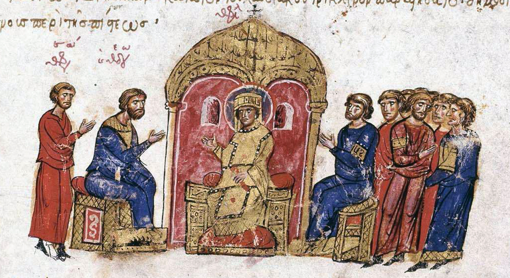
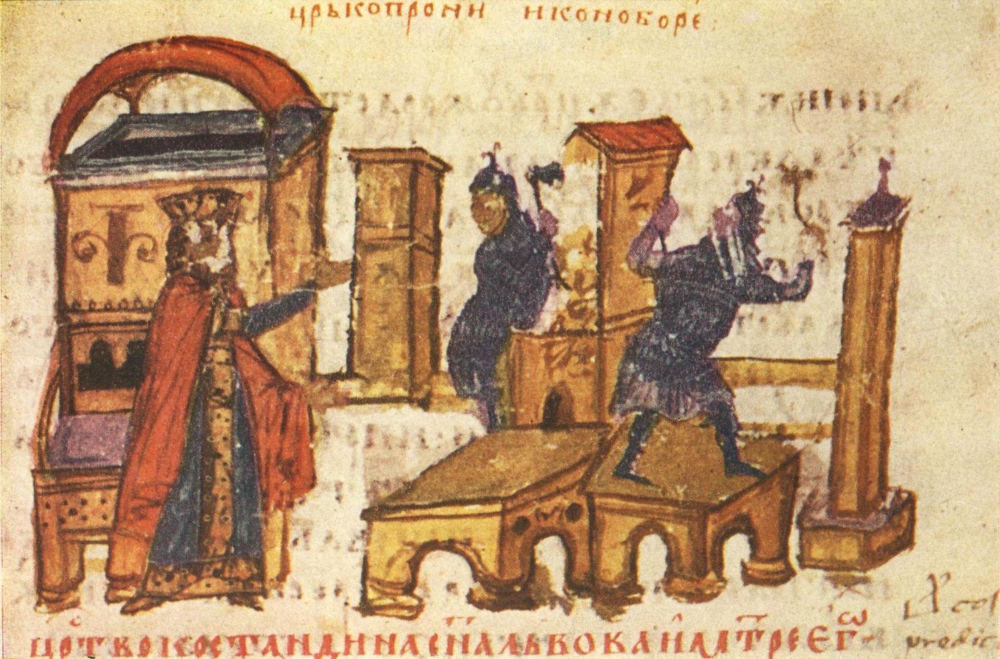

Ikonoklazm, czyli dosłownie „kruszenie obrazów”, to jedno z nielicznych bizantyjskich słów, które są używane do dzisiaj. Słowem tym określa się odłam chrześcijaństwa, który był wyrazem ponadczasowego konfliktu, tak starego, jak stary jest Stary Testament. Bowiem to w Księdze Wyjścia oraz w Księdze Powtórzonego Prawa znajduje się fragment Dekalogu, przywołany częściowo w tytule odcinka, który wzbudzał i nadal wzbudza kontrowersje w świecie chrześcijańskim. Jednak bynajmniej studiowanie Pisma Świętego dało początek tej herezji.

Chrześcijanie od początku tworzyli wizerunki Boga i świętych, w Bizancjum zaś rozwinięto tę sztukę, czerpiąc z dokonań kultury rzymskiej i greckiej. Ikony i obrazy uważano za „Biblię ubogich”, Słowo Boże dla tych, którzy nie umieli czytać. Poza tym ikonom przypisywano szczególną moc - w Bizancjum podczas oblężeń miasta powszechny był zwyczaj obnoszenia ikon Matki Bożej i świętych wokół murów miasta, co miało zapewnić bezpieczeństwo. W wielu przypadkach takiej procesji miasto wychodziło z bitwy obronną ręką. Jednak kult ikon szybko zaczął rodzić nadużycia, duchowość chrześcijańska mieszała się z praktykami magicznymi i pogańskimi. Bizantyjczycy potrafili wybierać ikony na chrzestnych swoich dzieci albo dodawać farbę z obrazów do chleba i wina konsekrowanych podczas mszy. Jednak do przyczyn teologicznych powstania herezji doszły także przyczyny polityczne.

W latach 695-717 w Cesarstwie Bizantyjskim nastąpiło aż siedem zmian panującego. Wynikająca stąd niestabilność dała okazję do zwycięskich najazdów Arabów w Azji Mniejszej oraz Bułgarów na Bałkanach. Bizantyjczycy, którzy byli pobożnym narodem, wiedzieli, że to Bóg przyznaje zwycięstwo w boju. Zaczęli więc zastanawiać się, dlaczego aktualnie pozwala triumfować Arabom. Wiadomo było od dawna, że Arabowie gardzą chrześcijańskim kultem obrazów, wielu teologów więc, w tym doradcy ówczesnego cesarza Leona III, stwierdzili, że w tym tkwi przyczyna niepowodzeń. Leon chcąc przywrócić cesarstwu chwałę militarną, w 730r. osobiście rozkazał usunięcie ikony Chrystusa z fasady Cesarskiego Pałacu, rozpoczynając tym samym pierwszą fazę ikonoklazmu.

W całym cesarstwie zabroniono czcić ikony i wizerunki. Tej heterodoksji ostro sprzeciwił się patriarcha Germanos. Został natychmiast usunięty, a na jego miejsce wkroczył Anastazjusz. Podobny los spotkał innych biskupów ikonodułów (czcicieli ikon), jednak same ikony z reguły pozostawały nietknięte. Już rok po tych wydarzeniach papież Grzegorz III zwołał synod, na którym potępiono ikonoklazm, co doprowadziło do schizmy między Rzymem a Konstantynopolem. Zanim Leon III zmarł zdołał zadać kilka druzgocących ciosów Arabom, wydawać by się więc mogło, że odzyskano boską przychylność bez masowego niszczenia ikon. Jednak następca Leona miał inną wizję ikonoklazmu.

Konstantyn V, syn Leona, opowiadał się za wyłącznie duchową formą kultu, nakazał niszczyć wszystkie ikony. Przygotowując grunt pod sobór powszechny legitymizujący panujące wyznanie zorganizował szereg debat teologicznych, których celem było nie tyle ustalenie nowej doktryny, co upewnienie się, że wszyscy ikonoklastyczni biskupi potępiają ikony jako bałwochwalstwo. W 754r. sobór zebrał się w Hierei i potępił obrazy oraz wizerunki, co zapoczątkowało prześladowania czcicieli i twórców ikon. Rzym nie uczestniczył w soborze i odrzucił jego postanowienia, co pozwoliło wielu prześladowanym malarzom (najczęściej mnichom) szukać schronienia w Italii. Z tego powodu ikona i mozaika przeżywały rozkwit na Zachodzie w VIII i IX w., podczas gdy w tym samym czasie na Wschodzie są surowo zakazane.

Ikonoklaści sumiennie niszczyli wszelkie wizerunki Jezusa, Maryi i świętych, zastępując je krzyżem jako najbardziej wymownym znakiem chrześcijanina. Na równi jednak z ikonodulami używali krzyża do błogosławieństw, ochrony, egzorcyzmów i uzdrawiania. Pierwsza faza ikonoklazmu trwała 45 lat, do momentu, kiedy cesarzowa Irena (synowa Konstantyna V) jako regentka swojego syna zdobyła przychylność mnichów żyjących na wygnaniu. Zwołała sobór, na który tym razem przybyli przedstawiciele papieża rzymskiego oraz trzech starożytnych patriarchatów. Pierwsze posiedzenie zostało zerwane, ale szybko zebrano się ponownie i w 787r. w Nicei potępiono ikonoklazm oraz przywrócono kult ikon. Był to ostatni sobór powszechny przyjmowany przez większość kościołów chrześcijańskich, znany jako Drugi Sobór Nicejski. Irena zaś, po osiągnięciu przez syna pełnoletności, oślepiła go i sama rządziła cesarstwem przez ponad 20 lat.

Na odrodzenie się ikonoklazmu nie trzeba było długo czekać, bo już w 815r. cesarz Leon V ustanowił go religią państwową. Odwoływał się oczywiście do dziedzictwa i sukcesów militarnych Konstantyna V. Kolejni cesarze odnoszący sporo sukcesów militarnych coraz chętniej wspierali nowe wyznanie oraz coraz gorliwiej tępili ikony i ich czcicieli. Działo się tak aż do 842r., kiedy cesarzową regentką została Teodora, żona zmarłego cesarza Teofila. Ponownie to kobieta odstąpiła od ikonoklazmu, uroczyście przywracając kult obrazów 10 marca 843r. Na pamiątkę tego wydarzenia do dzisiaj kościoły prawosławne obchodzą święto Triumfu Ortodoksji w pierwszą niedzielę Wielkiego Postu. Teodora jednocześnie zręcznie pokierowała duchownymi, aby pośmiertnie wybaczyli jej mężowi herezję, dzięki czemu potępieni zostali wszyscy cesarze ikonoklaści, w tym Leon III i Konstantyn V, ale nie Teodor.

Mimo triumfu ortodoksji nad herezją, obawiano się powrotu ikonoklazmu jeszcze długo po wydarzeniach z VIII i IX wieku. Próbowano zatrzeć wszelki ślad po herezji, literackie dzieła ikonoklastów znamy obecnie tylko z traktatów teologicznych, które rozprawiają się z nimi zdanie po zdaniu. Zachowały się jednak przykłady sakralnej sztuki ikonoklazmu, głównie zdobione krzyże, gdyż nawet ikonoduli nie mogli im niczego zarzucić. Ortodoksyjna twórczość zaś przeżyła prawdziwy rozkwit – o ile zachowało się mało religijnych dzieł sprzed IX wieku, o tyle wiek X i późniejsze są pełne pięknych ikon, mozaik i fresków. Chrześcijaństwo znów mogło nie niepokojone cieszyć się pięknem dzieł sztuki dość długo, bo aż do okresu reformacji.