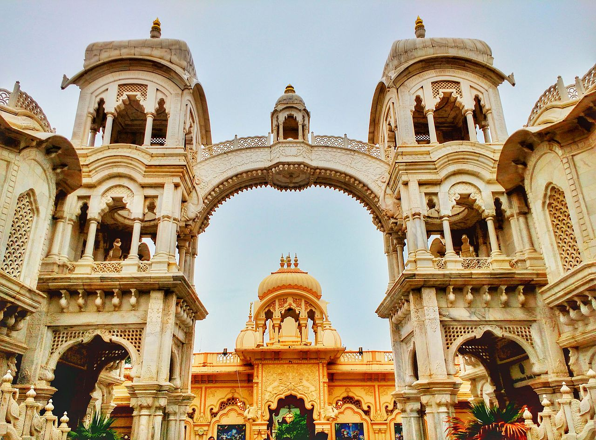
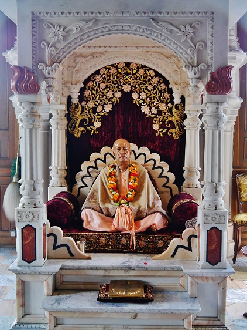

ISKCON czyli Międzynarodowe Towarzystwo Świadomości Kryszny (tzw. Hare Kryszna albo krzysznaici) znane jest w Polsce głównie za sprawą Pokojowej Wioski na Woodstocku oraz kolorowych procesji i śpiewów w centrach dużych miast. Jest to bodaj jedyna hinduistyczna grupa wyznaniowa kojarzona na Zachodzie, choć z tradycyjnym hinduistycznym politeizmem kult ten ma mało wspólnego.

Postać Kryszny (sanskr. „Czarny”) wywodzi się jeszcze z przedaryjskich (a więc sprzed II tysiąclecia p.n.e.) ludowych wierzeń, a zawiera w sobie mieszankę bóstw wedyjskich i niewedyjskich. Był jednym z wcieleń boga Wisznu i dość szybko jego kult rozprzestrzenił się na wszystkie warstwy społeczne, wynosząc Krysznę do godności najważniejszego awatara, a w końcu samodzielnego bóstwa. Głównym elementem kultu tego boga był element bhakti – miłości, oddania najwyższej istocie, zahaczającej o religijny erotyzm.

Bezpośrednich korzeni ruchu Hare Kryszna należy natomiast szukać trochę później, bo w gaudija wisznuizmie, nurcie założonym w XVw. przez mistyka Ćantanję Mahaprabhu. Najważniejszym elementem jego nauki jest Najwyższa Osoba Boga, w tym przypadku Kryszna. Kryszna, jako Najwyższy Bóg jest ojcem wszystkiego i energią podtrzymującą wszystko. Mimo, że imię „Kryszna” jest najpełniejszym imieniem, to Najwyższy Bóg może objawiać się w innych formach i niejednokrotnie to robił – jako Wisznu, Jezus czy Budda. Oprócz tego nauki Mahaprabhu zakładają nieśmiertelność, boskie pochodzenie i reinkarnację duszy, odrębność duszy i ciała oraz bhakti jako najważniejszy przejaw czci.

Gaudija wisznuizm został prawie zapomniany w XVIII w., ale odrodził się w wieku XX m.in. dzięki Bhaktivedancie Swamiemu Prabhupadzie. Ten odnoszący sukcesy biznesmen dostał od swojego duchowego mistrza polecenie misyjnej działalności na Zachodzie. Pierwszy ośrodek misyjny został założony przez niego w Nowym Jorku w 1966r., a ruch szybko rozprzestrzenił się po całym świecie – do Polski dotarł w latach 70. XX w. Po śmierci Prabhupady w 1977r. we wspólnocie doszło do zamieszania i ruch o mało nie przestał istnieć. Przewodnictwo przejęło gremium 11 guru, z czego kilku zostało wykluczonych, gdyż byli zamieszani w różnego rodzaju przestępstwa. Nastąpił także rozłam na skrzydło fundamentalistyczne i liberalne. Liberalni krysznaici doprowadzili do większego otwarcia grupy na ludzi Zachodu.

Każdy uczeń Kryszny powinien wcielać w życie „cztery zasady” – miłosierdzie, opanowanie zmysłów, czystość i prawdę. Oznacza to m.in. zakaz spożywania używek, abstynencję alkoholowa, ograniczenie i ukierunkowanie seksualności na płodzenie dzieci oraz dietę laktowegetariańską. Wszystkie potrawy są najpierw ofiarowane Krysznie, a dopiero potem spożywane. Podobnie podczas odwiedzenia świątyni wypada ofiarować Krysznie owoc lub kwiat. Nabożeństwa składają się zazwyczaj z uczty, wykładów, składania ofiar i wspólnego śpiewania pieśni. Najważniejszym elementem krysznaickiej duchowości jest intonowanie mantry „Hare Kryszna” wspomagając się drewnianymi koralikami – każdy wyznawca powinien zrobić 16 „okrążeń” na sznurze składającym się ze 108 korali (w sumie mantra powinna być intonowana 1728 razy dziennie). Bardzo często członków ISCKON można spotkać w dużych miastach podczas harinamu – kolorowej procesji połączonej z tańcem, śpiewem i zagadywaniem przechodniów.

Ruch Hare Kryszna, z racji swojej doktryny, jest otwarty na dialog z wyznawcami innych religii. Jako, że Kryszna jest Najwyższym Bogiem, można być jego wiernym czcicielem pozostając w ramach innej religii, np. będąc chrześcijaninem. Wielbiciele Kryszny uznają boskie pochodzenie innych religii i zachęcają wszystkich do autentycznego i szczerego przestrzegania ich zasad. Ten uniwersalizm ISCKON-u jest jedną z przyczyn popularności ruchu i mimo licznych kontrowersji organizacja zdaje się rozwijać (szczególnie mocno w Rosji i Indiach), choć ciężko znaleźć oficjalne statystyki. Najczęściej mówi się o 700 tys.-1 mln. wiernych na całym świecie, w tym 2000 w Polsce, gdzie ISCKON jest oficjalnie zarejestrowanym związkiem wyznaniowym. Grupie jednak zarzuca się praktyki sekciarskie i manipulowanie członkami, sami jednak wyznawcy podejmują liczne działania charytatywne, m.in. pomoc bezdomnym.
