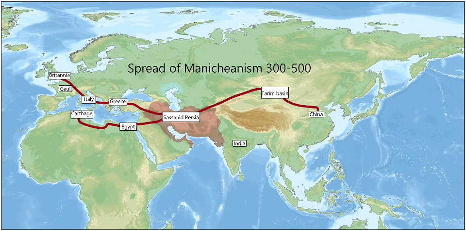
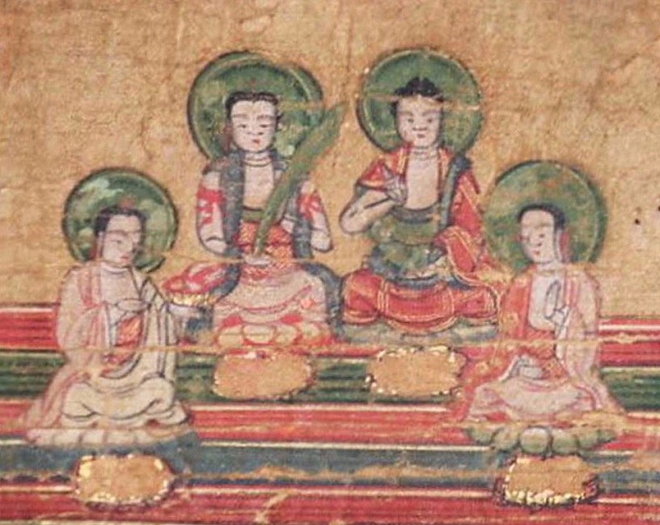

Chrześcijanie nazywali go herezją. Gnostycy odwoływali się do niego jako źródła wiedzy o świecie. Wielkie imperia przez wieki na zmianę wpierały i prześladowały jego wyznawców. Obecnie jednak mało mówi się powszechnie o manicheizmie – religii, która swego czasu głoszona była od Gibraltaru po Morze Żółte.

Założycielem manicheizmu był mistyk Mani, syn partyjskiego księcia, który urodził się w 216r.. Tak jak ojciec, Mani studiował teologię w ramach judeochrześcijańskiej sekty elkezaitów. Żyjąc na ziemiach perskich, miał naturalnie styczność z tamtejszą wielką religią – zaratusztrianizmem. Mani doznał dwóch objawień w wieku 12 i 24 lat. Podczas nich objawił mu się anioł Taum, wysłannik Wielkiego Ducha, który pouczył młodzieńca, aby ten głosił „Religię Światła”. Mani zebrał pierwszych wyznawców i udał się z nimi do Indii, gdzie zetknął się z filozofią buddyjską i hinduistyczną. Jednak prawdziwy rozkwit był możliwy dopiero, gdy Mani zyskał poparcie perskiego króla Szapura I ok.243r. Wtedy Mani zaczął głosić swoją religię w całej Persji. Sielanka jednak skończyła się po śmierci Szapura w 273r. i dojściu do władzy Bahrama I, który za namową kapłańskich stronnictw zaczął zwalczać wyznawców nowej religii. W 275r. Mani został schwytany, torturowany i zabity, a jego wyznawcy rozproszyli się po całym ówczesnym świecie.

Religia Światła znalazła poparcie wśród wielu warstw społeczeństwa w różnych krajach. Było to zasługą synkretyzmu, na którym oparty jest manicheizm: łączy on elementy judeochrześcijańskie, buddyjskie i zaratusztrianskie z domieszką lokalnych wierzeń i mitologii. Podstawą manicheizmu jest popularny w perskich wierzeniach dualizm i odwieczna walka dobra ze złem. W manicheizmie jednak obie strony mają równe siły i to od człowieka zależy zwycięstwo dobra lub zła. Siły Ciemności nieustannie atakują siły Światłości, tak jak na początku świata, kiedy został stworzony idealny Pierwszy Człowiek do walki ze złem. Został on jednak schwytany przez Ciemność, która naśladując materię stworzoną przez siły dobra przybrała materialną formę demiurga. Zły stwarza materialny świat oraz pierwszych ludzi – Adama i Ewę, którzy rozmnażają się i tym samym pomnażają zło. Aby zwyciężyć zło, Światłość wyemanowała na ziemię Wysłanników: Buddę, Zaratusztrę, Jezusa Świetlistego, a w końcu Maniego, którzy dawali ludziom wskazówki do czynienia dobra.

Ten swoisty uniwersalizm manicheizmu był przyczyną zarówno ogromnej popularności jak i licznych oskarżeń o herezję wszędzie tam gdzie się pojawił. Manicheiści byli prześladowani najpierw w ojczystym Iranie przez zaratusztriańskich kapłanów. Liczne diaspory wyrosły w Cesarstwie Rzymskim, gdzie były podwójnie tępione: najpierw przez administrację państwową, a potem dodatkowo przez młode, ale zhierarchizowane już chrześcijaństwo. Muzułmańscy Arabowie z początku tolerowali manichejczyków, jednak wraz z nadejściem dynastii Abbasydów rozpoczęły się nowe prześladowania. Najdłużej religia Światła zachowała się w Azji: władcy Ujgurscy uczynili manicheizm swoją religią państwową i rozwijał się on na stepach azjatyckich aż do najazdu Czyngis-chana (1220r.). Także w Chinach manichejczycy cieszyli się poważaniem, szczególnie jako astronomowie, na dworze cesarskim do czasu prześladowań za dynastii Ming. Z 1370r. pochodzą zapiski o czystkach na tle religijnym w Chinach – jest to zarazem ostatnia wzmianka o manichejczykach w Chinach i na świecie w ogóle.

Manicheizm był ścisłe zhierarchizowany, na czele Kościoła Światła stał Archegos z siedzibą w Babilonie. Miał on pod sobą 12 mistrzów, 72 biskupów i w końcu 360 prezbiterów. Uznawano trzy sakramenty: nałożenie rąk, „eucharystię” – wspólny posiłek poświęconego chleba i roślin oraz sakrament udzielany umierającym. Niektóre źródła wspominają także o chrzcie czy spowiedzi. Wspólnoty dzieliły się na szeregowych wiernych „słuchaczy” oraz wtajemniczonych „wybranych”, którzy składali śluby czystości. Wierzono w reinkarnację duszy i jej istotny wkład w walkę dobra ze złem. Ten dualizm był głośnym echem religii Światła długo po jej zniknięciu – odwoływały się do niego herezje katarów, albigensów i bogomiłów, a także pisma św. Tomasza albo św. Augustyna. Mimo to manicheizm, jedna z największych religii świata, przestała istnieć i dzisiaj nie posiada już żadnej struktury ani wyznawców.