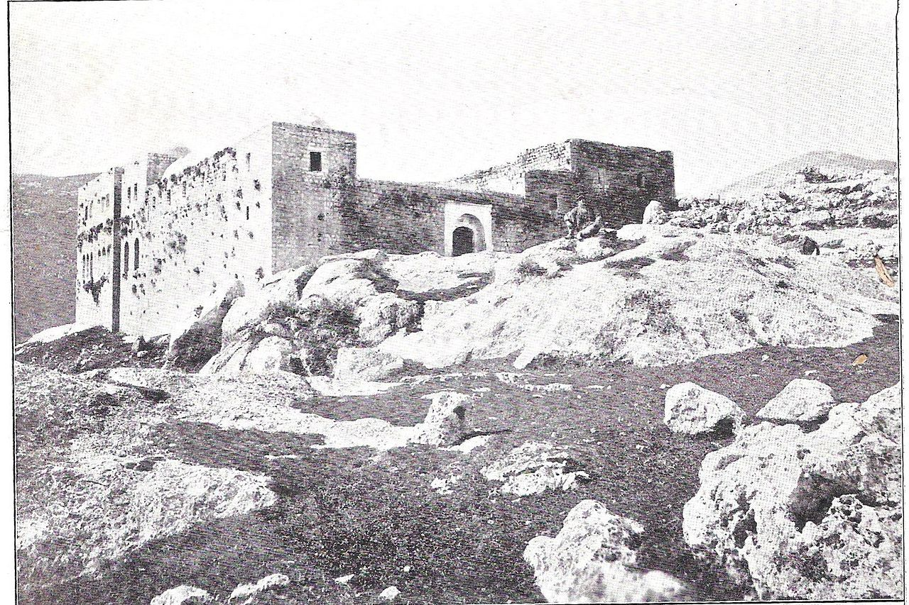
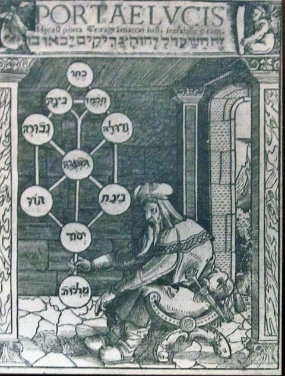

Kabała (hebr. „otrzymywanie”) to nurt mistyki żydowskiej rozwijający się w średniowieczu, ale korzeniami sięgającymi w starożytną gnozę i idee neoplatońskie. Za piewszego kabalistę uważany jest rabin Szymon bar Jochaj, działający w IIw. Tradycje przekazywane ustnie zaczęły się krystalizować w XIIw. W Prowansji, a pod koniec kolejnego stulecia powstała Sefer ha-zohar („Księga blasku”). Księga ta, spisana po aramejsku przez Mojżesza z Leonu, do dzisiaj stanowi centrum kabalistyki. Kabała była popularna wśród Żydów sefardyjskich, toteż wygnanie ich z Hiszpanii w 1492r. przyczyniło się do upowszechnienia tej idei w całej Europie i jej rozkwitu, szczególnie w ramach ruchów chasydzkich.

Najbardziej charakterystyczną cechą kabały jest koncepcja bezgranicznego Boga – Ein Sof, a także sefirot, czyli boskich atrybutów, które emanują z niepoznawalnej Nieskończoności. Sefiry są jednocześnie słowami i światłami stworzenia i sferami boskiej rzeczywistości. Za ich pomocą Bóg stwarza świat i utrzymuje go w istnieniu. Sefiry znajdują więc odzwierciedlenie w stworzonym świecie i jego historii. Są one najczęściej przedstawiane w formie Drzewa Życia.

Jeden z największych kabalistów, Izaak Luria, uważał, że zanim doszło do emanacji boskich sefirot, wszechobecny Bóg musiał zrobić miejsca dla stworzenia. Uczynił to poprzez cimcum – akt „skurczenia się”. W powstałej przestrzeni pojawił się świat sefirot tworzący system naczyń, przez które przepływało światło stworzenia. Doszło jednak do kosmicznej katastrofy, naczynia pękły z powodu nadmiaru światła i opadły w postaci skorup, co dało początek postrzegalnej rzeczywistości. Zadaniem człowieka jest naprawa wszechświata poprzez odnalezienie iskier Bożego światła. Człowiek może to uczynić poprzez przestrzeganie przykazań Tory.

Inna kabalistyczna wizja świata przedstawia go jako oddzielony przepaścią od Nieskończoności. Sefiry jawią się tu jako pośrednie światy, duchowe mosty, które łączą materialny wszechświat i Ein Sof. Poprzez te „kanały mediacyjne” objawia się Bóg. Zadaniem kabały jest tutaj poznanie i opisanie relacji między światem materialnym, sefirot, a Bogiem. Doświadczony kabalista może wpływać na sefirot i poprzez swoje działania pobudzać lub opóźniać mediacje pomiędzy poszczególnymi światami. Każdy grzech ma swoje negatywne skutki w wyższych światach, a każdy czyn pobożny według Tory, wpływa pozytywnie na relacje między Ein Sof, sefirot i wszechświatem. W tym kontekście wszystkie akty i rytuały żydowskie zyskują nowe znaczenie.

Bliskie konotacje kabały z ezoteryką i magią szybko przeniosły ją na pogranicze mistyki i okultyzmu. W średniowieczu kabałą parali się alchemicy i przez wieki miała być ona narzędziem do osiągnięcia nieśmiertelności. Kabałę dostosowali do swojej religii chrześcijanie, a w XIXw. najpierw uległa synkretyzmowi ze wschodnimi wierzeniami, a następnie została całkowicie oddzielona od religii. Obecnie kabała jest propagowana jako jedna z nowoczesnych metod samodoskonalenia. Przykładem zeświecczonej kabały jest Kabbalah Centre, niemające wiele wspólnego z judaizmem. Żydzi nie odcięli się jednak od kabały i jest ona wciąż żywo praktykowana m.in. wśród Chasydów.