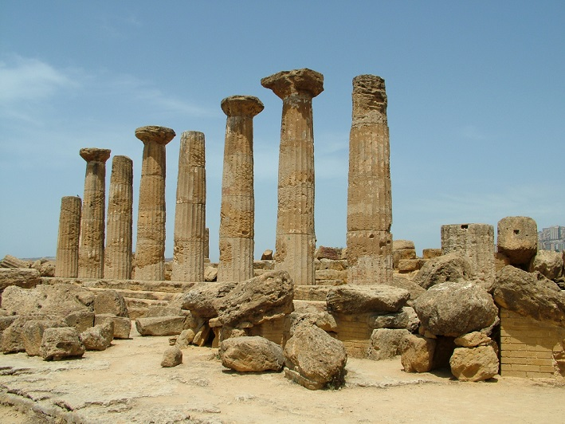
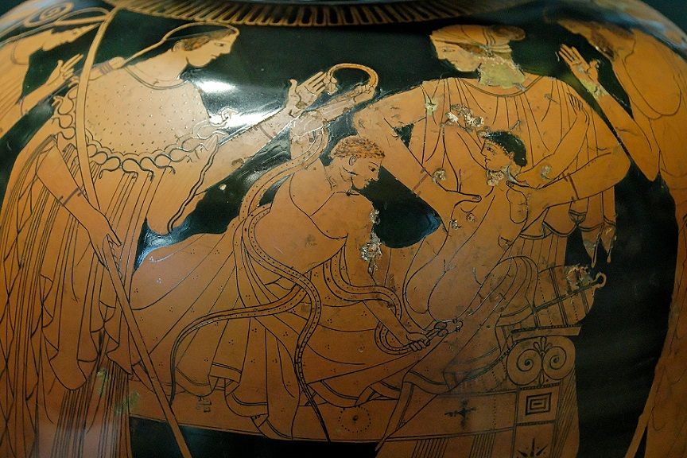

Postać Heraklesa jest i była znana przez całe wieki. Sięgająca korzeniami w epokę brązu, niezwykle popularna w starożytności, „odkryta” na nowo w epoce renesansu i klasycyzmu, a wreszcie przywoływana w kulturze masowej XX i XXI w. I tak jak my oglądamy dzisiaj z wypiekami na twarzy wyczyny superbohaterów, tak starożytni śledzili przygody Heraklesa.

Herakles był synem Zeusa i śmiertelniczki Alkmeny. Uważany był za protoplastę plemion doryckich, przez które był czczony i które podbiły tereny dzisiejszej Grecji w II tysiącleciu p.n.e. Jednak obecnie uważa się, że pierwsze wersje mitów są jeszcze wcześniejsze. Reminiscencją inwazji doryckiej jest prawdopodobnie mit o Heraklidach, potomkach Heraklesa, którzy zostali wygnani z Peloponezu, aby po czasie z powrotem go zająć i podzielić na królestwa. Głównym ośrodkiem kultu Heraklesa było Argos, ale stopniowo stał się on herosem panhelleńskim. Mity o Heraklesie stanowiły łącznik między klasycznymi opowieściami o bogach a cyklami heroicznymi (jak np. Iliada i Odyseja, albo wyprawa Argonautów) i były bardzo popularne wśród zwykłych Greków. Znalazło to odzwierciedlenie w praktykach religijnych – w niektórych ośrodkach był on czczony jako heros a w niektórych jako bóg, wszędzie jednak był znany i poważany.

Najpopularniejszym cyklem mitów heraklijskich było 12 prac Heraklesa, opowiadające o zmaganiach herosa z potworami i niesieniu ludziom pomocy. Temat ten był często wykorzystywany na zdobienia świątyń i przybytków. Innym często spotykanym tematem w sztuce było wstąpienie herosa na Olimp, a także zmagania z Apollem o trójnóg delficki. Ten ostatni odnosi się do związków Heraklesa z wróżbiarstwem – poświęcona mu była wyrocznia, gdzie wróżono z rzutu kostkami. Mit o walce Apolla z synem Zeusa jest wspomnieniem rywalizacji wyroczni tych dwóch bóstw, a być może reminiscencją rzeczywistej próby przejęcia sanktuarium w Delfach przez zwolenników Heraklesa (patrz: Odc.15). W sztuce i opowieściach heros był przedstawiany jako symbol cnoty, wytrwałości i męstwa, nieustraszony bojownik w walce z siłami zła, swoisty święty. Cechy te odzwierciedlone były w ikonografii.

Sława Heraklesa wybiegała poza Helladę i dotarła między innymi do Italii. Tam heros występował pod zmienionym imieniem Herkulesa, gdyż jego kult przeszedł nie wprost od Greków, a od Etrusków lub Osków. Ludy te miały żywe kontakty z Grekami osiadłymi w południowej Italii i na Sycylii, gdzie kult Heraklesa był bardzo rozpowszechniony. Sam Herkules miał odwiedzić półwysep Apeniński podczas zdobywania trzody olbrzyma Geriona (w ramach jednej z dwunastu prac). Herkules zatrzymał się na zboczu Palatynu (na terenie przyszłego Rzymu), gdzie uciął sobie drzemkę. W tym czasie jedną z krów uprowadził syn Wulkana, olbrzym Kakus. Herkules odnalazł go i zabił, a wdzięczny Ewander, założyciel osady na Palatynie, ugościł herosa. Herakles zaś zbudował ołtarz, na którym złożył ofiarę Jowiszowi oraz polecił dwom rodzinom kapłańskim składać sobie ofiary. Ołtarz otrzymał miano Ara Maxima (ołtarz najstarszy). Do roku 312 p.n.e. kapłanami byli rzeczywiście członkowie obu wybranych przez Herkulesa rodów. Potem ofiary składał corocznie jeden z pretorów, a następnie wyznaczeni niewolnicy państwowi (jeszcze za czasów cesarza Konstantyna). Sam ołtarz cieszył się ogromnym poważaniem, to tu składano przysięgi i zawierano umowy, a dziesiątą część zysku ofiarowano Herkulesowi. W ceremoniach zakaz udziału miały jednak kobiety.

Greccy i rzymscy historycy często dopatrywali się podobieństw między swoimi a cudzymi bóstwami. I tak w Egipcie istniało miasto Thonis (gr. Heraklejon), gdzie czczony był bóg Chonsu, syn Amuna, utożsamiany z greckim herosem. Za celtyckiego Herkulesa uważali starożytni bóstwo imieniem Ogmios,. Jego potega polegała jednak nie na sprawności fizycznej, a na sile wymowy, gdyż to on był wynalazcą celtyckiego pisma ogam. Także w Indiach zaczęto doszukiwać się podobieństw, po podbojach Aleksandra Wielkiego sztuka grecka mocno wpłynęła na wyobrażenia bóstw Dalekiego Wschodu i podobnie do Herkulesa zaczęto przedstawiać bodhisattwę Wadżrapaniego. Pytanie na ile kult Heraklesa przenikał do niesąsiadujących z Grecją kultur pozostanie chyba bez odpowiedzi. Pewne jest natomiast, że współcześnie pamięć o nim pozostała żywa, nie mniej niż w starożytności.
