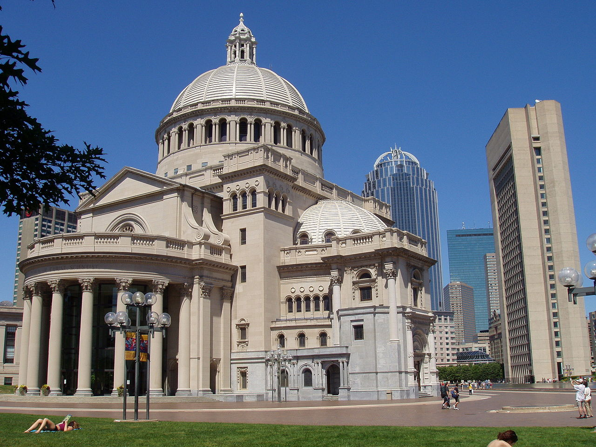

Popularne ostatnio grupy antyszczepionkowców (lub proepidemików) z wiarą godną fanatyzmu głoszą swoje teorie o nieskuteczności, a wręcz szkodliwości szczepionek. Można by pomyśleć, że ich wiara we własne przekonania może stanowić fundament nowej religii. Tymczasem prawie 150 lat temu w USA powstałą grupa wyznaniowa, która w imię Jezusa odrzuca nie tylko szczepionki, ale całą współczesną medycynę.

W 1821 roku w New Hampshire przyszła na świat Mary Baker Eddy. Wychowana w kongregacjonistycznym nurcie kalwinizmu, była bardzo wierzącą osobą i często studiowała Biblię. Szybko zainteresowała się wczesnymi ruchami antropozoficznymi i mistycznymi. Utrzymywała kontakty i dyskutowała z amerykańskim lekarzem Fineaszem Quimbym, który był twórcą ruchu Mental Science i zwolennikiem teorii leczenia za pomocą „prawidłowego myślenia” oraz magnetycznych fluidów. W pewnym momencie Mary ciężko zachorowała i lekarze nie upatrywali większych szans na przeżycie. Zwróciła się więc ku studiowaniu Biblii i podczas rozmyślaniu nad opisem uzdrowienia paralityka (Mt 9, 1-8), sama doznała cudownego wyleczenia z choroby i objawienia. Zdarzyło się to w 1866 roku i od tej kobieta pory zaczęła głosić Chrześcijańską Naukę.

Eddy pod wpływem cudownego uzdrowienia i nawrócenia stwierdziła, że modlitwa ma moc leczącą. Co więcej, tak naprawdę tylko modlitwa jest stanie wyleczyć cierpiącego człowieka, gdyż choroba jest wynikiem grzechu. Tak jak niegdyś Jezus chodził po Izraelu uzdrawiając i wypędzając duchy, tak też dzieje się dzisiaj, za przyczyną uzdrowicieli. Głównym założeniem nowej idei było twierdzenie, że Bóg jest wszystkim, a cały świat zewnętrzny i duchowy, zjawiska i odczucia są jedynie złudzeniami. Również szatan, zło i cierpienie są nierealne. Uświadomiwszy to sobie, odrzuciwszy złudzenia i zwróciwszy się do Jezusa, człowiek jest w stanie wpłynąć na negatywne zjawiska (nierzeczywiste przecież) i je wyeliminować. Zatem jedynym lekarstwem jest modlitwa i nauczanie, a nie konwencjonalne leki, należące do nierzeczywistego świata materialnego.

10 lat po objawieniach Mary Baker Eddy spisała swoje nauki w podręczniku „Nauka i Zdrowie z Kluczem do Pisma świętego”, który obecnie jest traktowany na równi z Biblią. Trzy lata później założyła Stowarzyszenie Chrześcijańskich Naukowców, które w 1879r. przekształciło się w oddzielny Kościół Chrystusa Naukowca z siedzibą w Bostonie. Założycielka cały czas otrzymywała objawienia i kierowała wspólnotą, uważana za osobę nieomylną. Zredagowała ona prawdy wiary Kościoła, które zawierają oczywiście zwrócenie uwagi na zbawczą moc modlitwy, ale odrzucają chrzest, eucharystię i inne sakramenty. Obrzędowość Chrześcijańskich Naukowców sprowadza się do coniedzielnych spotkań, lektury świętych ksiąg oraz świadectw uzdrowionych i nauczania uzdrowicieli. Ci ostatni są specjalnie szkoleni do uzdrawiania i szerzenia Chrześcijańskiej Nauki.

Po śmierci założycielki doszło do rozłamów, jednak bezpośredni spadkobierca jej idei – Stowarzyszenie Chrześcijańskiej Nauki, wciąż jest dużym wyznaniem. Centrum Stowarzyszenia stanowi Boston, gdzie znajduje się Kościół Matka. Oprócz tego w 80 krajach znajduje się prawie 1800 kościołów filialnych, a samo stowarzyszenie liczy ok. 2 mln wiernych. Wspólnota wydaje własną prasę i periodyki oraz cieszy się dużymi względami politycznymi w USA. W Polsce wyznawcy nauczania Eddy obecni byli już przed wojną, aktualnie Stowarzyszenie w Polsce liczy około 30 osób. Być może jednak, patrząc na ostatnie trendy, wspólnota zyska nowych wyznawców.
