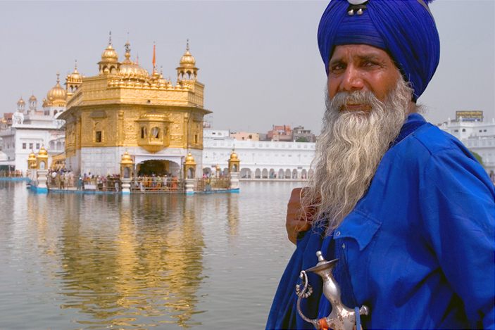
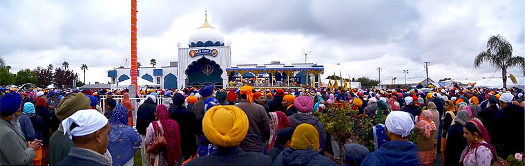

Turban, długa broda, powłóczyste szaty i ciemna karnacja - taki zestaw cech budzi skojarzenia ze stereotypowym muzułmaninem. Tak jednak, oprócz bohaterów "Alladyna" wyglądają wyznawcy religii rodem z Pendżabu, która stanowiła swoistą "reformację" islamu i hiduizmu, a ostatnie wyrosła w odrębny system religijny.

Pewnego słonecznego dnia 1497 roku Nanak, mistyk i zarządca ziemski urodzony w hinduskiej rodzinie w Pendżabie, udał się jak zwykle wziąć kąpiel w rzece i poddać się medytacjom. Tym razem jednak zniknął na trzy dni, a kiedy wrócił, jego pierwsze słowa brzmiały "Nie ma muzułmanina ani hindusa". To zdanie legło u podstaw nowej religii, którą Nanak nauczał w Pendżabie stając się guru. Jego idee obejmowały elementy z islamu i hinduizmu - głównych wyznań wśród mieszkańców Pendżabu. Głosił, że istnieje jeden uniwersalny Bóg, którego można czcić pod wieloma imionami, reinkarnacja rządzi duszami ludzi, a kontakt z Absolutem można uzyskać poprzez medytację. Udało mu się zebrać pokaźną grupę sikhów - uczniów, z którymi założył langar (jadłodajnię dla ubogich) w Kartarpurze, gdzie mogli stołować się wszyscy bez względu na wyznanie czy pochodzenie. Tam też Guru Nanak zaczął spisywać swoje wierzenia i w końcu zmarł w 1539 r.

Schedę przejął jego uczeń, Lehna Agad, który stał się kolejnym przywódcą sikhów. W ten sposób sukcesja przekazywana była na kolejnych guru, w sumie dziesięciu. Każdy z liderów wniósł wkład w rozwój sikhizmu - drugi guru wynalazł nowy alfabet pendżabski, trzeci zniósł kasty i nierówności kobiet, a piąty wybudował Złotą świątynię w Amritsarze. Każdy guru spisywał też hymny i modlitwy, tworząc Adi Granth – świętą księgę, ogłoszoną ostatnim jedenastym guru. Od tej pory Adi Granth jest otoczona kultem, spoczywa pod baldachimem i jest uroczyście odczytywana. Oryginał Adi Granth spoczywa w Złotej Świątyni, lecz jej przekłady są równie czczone w sikhijskich świątyniach – gurdwarach.

Sikhowie wierzą w osobowego Boga, który objawia się ludziom pod różnymi postaciami, ale nie przybiera materialnej formy. Pobożny człowiek po śmierci idzie prosto do nieba, natomiast pozostali odradzają się na Ziemi. Poprzez miłość i medytacje można osiągnąć zbawienie już za życia. Rytuały obejmują pieśni, modlitwy i recytacje świętych wersetów. Zakazane są używki oraz mięso pochodzące z uboju rytualnego muzułmanów lub żydów.

Sikhizm był pokojowo nastawioną religią, jednak po śmierci ostatniego guru nastąpiły okrutne prześladowania. Sikhowie przekształcili się z ruchu duchowego w sprawne bractwo wojowników. Byli tępieni zarówno przez hindusów, jak i przez muzułmanów. Udało im się stworzyć niezależne państwo na przełomie XVIII i XIX wieku na terenie Pendżabu, ostatecznie teren ten został jednak wcielony do Indii. Do dziś istnieją sikhijscy nacjonaliści żądający własnego państwa. W 1984 roku indyjska premier Indira Gandhi podejrzewała, że separatyści uczynili sobie bazę w Złotej Świątyni. Przypuszczono szturm, podczas którego zginęło tysiące sikhów. W odwecie za to świętokradztwo Indira Gandhi została zamordowana przez swoich sikhijskich ochroniarzy.

Obecnie na świecie żyje około 20 milionów sikhów. Oprócz Indii największe skupiska znajdują się w Kanadzie oraz Wielkiej Brytanii. Sikhowie są obecni również w Polsce, a najprężniejsza grupa osiedliła się w podwarszawskim Raszynie, gdzie mieści się ich gurdwara. Diaspora sikhijska w Polsce liczy około 500 osób.

