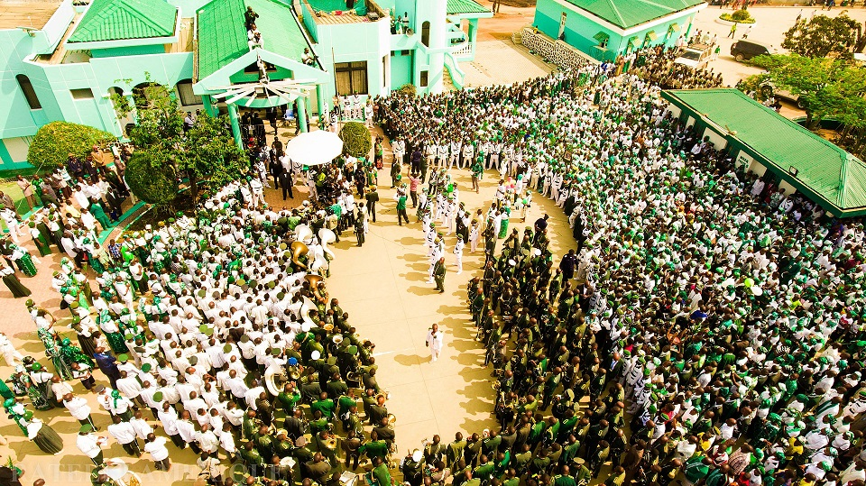
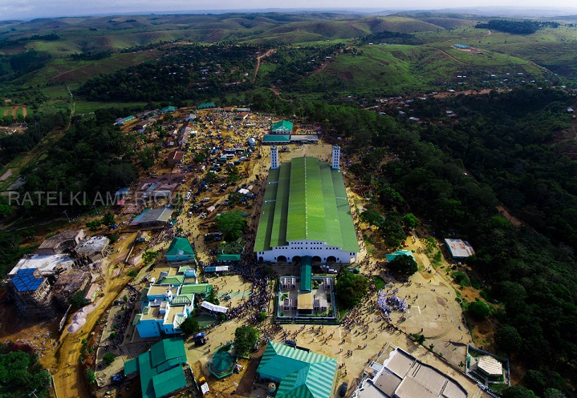

W XIX wieku Kongo było prywatną własnością króla Belgów. Biali kolonizatorzy zanieśli w głąb Afryki swoją administrację, swoje okrucieństwo, swoje prawa i swój wyzysk. A także swoją religię. Dla Kongijczyków wszystko co złe, miało twarz białego oprawcy, ale Bóg nie był zły. Czy w takim razie był biały?

W 1887r. w niewielkiej miejscowości Nkamba urodził się Simon Kimbangu. Wychował się w plemieniu Bakongo, w rodzinie baptystów, gdzie został kaznodzieją. Według późniejszych świadectw już wtedy uzdrawiał chorych i wskrzeszał zmarłych, co przysporzyło mu wielu uczniów, uważających go za proroka, ale też ściągnęło uwagę władz kolonialnych. W 1918r. przeżył nawiedzenie i opuścił swoją wspólnotę, zakładając niezależny Kościół. Głosił hasła antykolonialne, jego apele brzmiały: „należy słuchać Boga a nie władz”. Przede wszystkim jednak głosił, że Jezus był czarny, a biali ukradli Boga Afrykanom i za to spotka ich najsurowsza kara. Kimbangu został skazany przez Belgów na śmierć, postawiony przed sądem bez żadnego obrońcy, kara jednak została zamieniona na dożywocie. Prorok Szymon spędził w więzieniu 30 lat i zmarł w 1951r. w opinii męczennika.

Podczas uwięzienia Simon Kimganbu miał ukazywać się wielu wiernym, nie tylko podczas objawień i snów, ale jako cielesne manifestacje, mimo pobytu w więzieniu. Faktycznie jednak nad wiernymi pieczę trzymała Mivulu Marie, żona Simona. Było to szczególnie trudne zadanie, gdyż Belgowie w latach 1921-1959 deportowali z Kongo około 100 tys. kimbangistów. Po śmierci Mivulu w 1959r. głową wspólnoty został odwołany trzeci syn Kimgangu, Joseph Diangienda. Fortunnie zbiegło się to z utratą władzy Belgów na tych terenach, stąd Diagienda mógł rozwijać wspólnotę, którą oficjalnie włączył do Światowej Rady Kościołów w 1969r. jako „Kościół Jezusa Chrystusa na Ziemi za pośrednictwem specjalnego wysłannika Simona Kimbangu”. W wiosce, w której urodził się Kimbangu wybudowano świątynie, odtąd miejscowość ta jest znana jako Nkamba-Nowe Jeruzalem. Po Diangiendzie zwierzchnictwo przyjął ostatni żyjący syn Kimgangu, Diulangama Kuntima, który ogłosił ojca wcieleniem Ducha Świętego i przeniósł Boże Narodzenie na 25 maja, co przypada na dzień jego urodzin.

Oprócz zmienionej daty Bożego Narodzenia, kimbangiści niewiele różnią się od pozostałych chrześcijan. Uznają naukę trynitarną, uświęcenie przez łaskę i konieczność wiary i uczynków do zbawienia. Biblia jest jedynym źródłem wiary, a praktykowane są cztery sakramenty: chrzest, eucharystia, małżeństwo i kapłaństwo (również kobiet). Eucharystia pod postacią rozpuszczonego miody i pieczywa z afrykańskich bulw przyjmowana jest trzy razy do roku: w Boże Narodzenie, w dzień założenia Kościoła (6 kwietnia) i dzień śmierci Kimbangu (12 października).

Ponadto kimbangiści nie piją alkoholu, nie palą papierosów, nie jedzą małp i są monogamistami. Przed wejściem do świątyni, podobnie jak muzułmanie, ściągają buty, a kobiety zakładają nakrycia głowy. Obecnym zwierzchnikiem Kościołą jest wnuk Simona, Kimbangu Kiangani. Wedle własnych szacunków kimbangistów jest od 15 do 20 milionów na całym świecie, choć większość źródeł podaje 1,5-3 miliony. Tak czy inaczej jest to jeden z największych kościół Czarnej Afryki.
