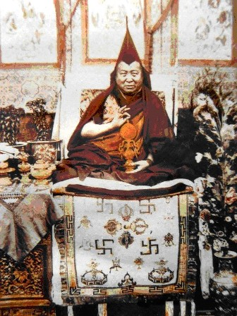

Uśmiechnięty Dalajlama, zen, medytacja - przeciętnemu mieszkańcowi Zachodu właśnie tak kojarzy się buddyzm, także w jego tybetańskiej odmianie. Tymczasem buddyzm tybetański jest pełen magii, uroków i demonów, a jego spory teologiczne są bardziej skomplikowane, niż to się wydaję. Jednym z tego przykładów jest kontrowersja wokół Dordże Szugdena.
  
Dordże Szugden był gniewnym duchem zamieszkującym przedbuddyjski Tybet. Pewnego razu został pokonany przez V Dalajlamę (żyjącego w XVIIw.), który odprawił stosowne rytuały tantryczne i zmusił demona do opieki nad wyznawcami buddyzmu, a konkretnie nad uczniami szkoły gelug, największej szkoły buddyzmu tybetańskiego. Od tej pory Dordże Szugden był pomniejszym strażnikiem gelugpy - do czasu pojawienia się lamy Pabongkhapy w latach 30. XXw.. Lama ten był zachwycony Szugdenem i zaczął mocno promować jego kult, wynosząc go do rangi potężnego strażnika gelugpy.
 

 
Zbiegło się to w czasie z powstaniem ruchu Rime. Pozostałe trzy wielkie szkoły buddyjskie (kagyupa, ningmapa i sakjapa) w obliczu rosnącej potęgi szkoły gelug postanowiły zjednoczyć siły. Prominentni lamowie zebrali przekazy swoich szkół i połączyli je razem z naukami, które już praktycznie ulegały zapomnieniu. W ten sposób powstał eklektyczny i ekumeniczny ruch Rime, stanowiący religijną przeciwwagę dla gelugpy. Jednak zapalczywy Pabongkhapa, przekonany o wyższości swoich nauk, rozpoczął prześladowanie i siłowe nawracania zwolenników Rime. Szczególnie mocno dostało się najstarszej szkole buddyjskiej w Tybecie - ningmapie. Wiele z jej klasztorów nawrócono siłą bądź zniszczono, razem z relikwiami po Guru Rinpocze - "drugim Buddzie", który zaniósł buddyzm do Tybetu. Pabongkhapa stwierdził w pewnym momencie, że pomaga mu Dordże Szugden, który będzie karał (nawet śmiercią) wszystkich, niepraktykujących czystych nauk gelugpy. To stanowisko oburzyło XIII Dalajlamę i paru opatów znaczących klasztorów, którzy zażądali zaprzestania takich praktyk. Pabongkhapa przeprosił i obiecał zaprzestać prześladowań i nie czcić już Szugdena.
 
Następne dekady przyniosły nowego (obecnego) Dalajlamę oraz aneksję Tybetu przez Chiny. Aby zjednoczyć znajdujących się w ciężkiej sytuacji rodaków, Dalajlama rozpoczął forsowanie ekumenicznej konsolidacji nauk różnych szkół. Sam jako zwierzchnik gelugpy (de facto, zwierzchnikiem de jure jest Ganden Tripa) zaczął pobierać nauki i inicjacje z innych szkół. Spotykało się to z rosnącym protestem, którego kulminacją było wydanie w 1975r. "Żółtej Książki", nawołującej do powrotu do czystych nauk gelugpy i piętnującej lamów miksujących przekazy różnych szkół. Oczywiście nad niepokornymi miało wisieć widmo kary wymierzonej przez Dordże Szugdena. Dalajlama zareagował bardzo ostro, potępił książkę i zakazał publicznej praktyki ku czci Szugdena. Czciciele Szugdena dostali zakaz obejmowania jakichkolwiek stanowisk związanych z tybetańskim rządem na uchodźtwie (wliczając urzędy, szkoły itp.). Wywołało to schizmę w 1991r., której efektem było założenie przez lamę Kelsanga Gyatso organizacji "New Kadampa Tradition" (NKT) (popularnej szczególnie w Wielkiej Brytanii) która potępia Dalajlamę i zarzuca mu dyskryminację religijną. Ponadto NKT podniosła Dorje Szugdena do rangi Buddy i domaga się uznania na równi z pięcioma starożytnymi szkołami buddyzmu tybetańskiego.
  

Rozłam miał bolesne i krwawe skutki wśród Tybetańczyków, wliczając morderstwo paru mnichów, za które do dziś nikt nie został ukarany. Również zamieszki zdarzały się dość często, a kilka klasztorów odłączyło się od głównego nurtu gelug, pogarszając sytuację w Tybiecie, który szczególnie potrzebował jedności. Okazję wykorzystał oczywiście komunistyczny rząd chiński - kult Szogdena jest popularny szczególnie we Wschodnim Tybecie, stąd Chińczycy masowo zaczęli fundować świątynie na jego cześć. Duże fundusze płynęły też do zachodnich organizacji sprzyjających NKT, a przeciwnych Dalajlamie, w celu oczernienia go. Do dziś w wielu miejscach, gdzie pojawia się ten duchowny organizowane są manifestacje i protesty przeciwko "łamaniu praw człowieka i wolności religijnej". Co ciekawe, po wycieku chińskich dokumentów rządowych, jedna z organizacji (International Shugden Community) zniknęła, ogłaszając, że "przestają bojkotować Dalajlamę i niech wszyscy żyją w szczęściu".

Kontrowersja wokół Dordże Szugdena jest tylko jednym ze sporów na łonie buddyzmu tybetańskiego. Dość wymienić spory dotyczące inkarnacji Karmapy, uznanie bon za szkołę buddyjską lub zarzuty podporządkowania sobie wszystkich szkół przez Dalajlamę. Takie konflikty były i są powszechne we wszystkich religiach, w tym w buddyzmie tybetańskim, który rozwiązywał je niejednokrotnie poprzez rzucanie czarów, spiski, zabójstwa, a czasami krwawe rozruchy. Ale to wszystko już się nie kojarzy z buddyzmem przeciętnemu mieszkańcowi Zachodu.
