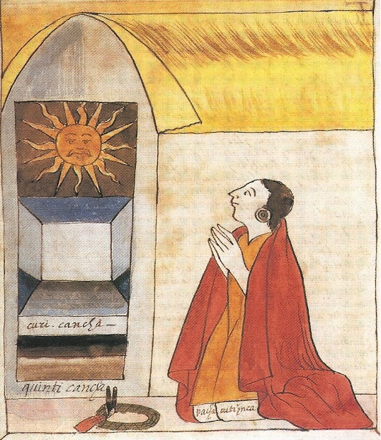
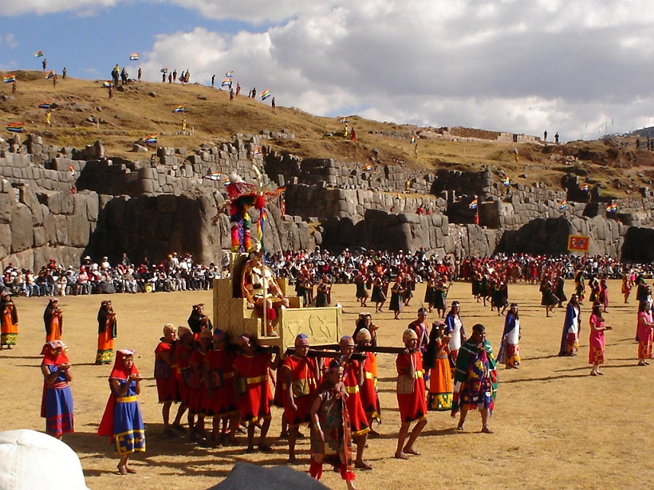

Gdy w roku 1532 garstka Hiszpanów podbiła imperium Inków, obejmowało ono obszar Andów: Ekwador, Peru, Boliwię, północno-zachodnią Argentynę oraz północne Chile, a na wszystkich tych terenach panował kult Wirakoczy (stwórcy), Inti (słońca) i Paczamamy (Matki Ziemi). Kres religii Inków przyniósł Pizarro i jego konkwistadorzy, razem z ogniem, śmiercią i chrześcijaństwem. Ale część inkaskich wierzeń przetrwała do dzisiaj, między innymi w osobliwym synkretycznym micie o Inkarrim.

Inkarri (prawdopodobnie z hisz. Inca rey – król Inków) to mityczny bóg lub heros, którego geneza ściśle wiąże się ze wspomnianymi konkwistadorami. Pizarro i Hiszpanie byli na ogół ciepło przyjmowani przez ludność tubylczą, głównie dlatego, że nikt nie rozumiał, w jakim języku mówią, a nie było wtedy jeszcze z ich strony większej agresji. Kolonizatorzy jednak postanowili porwać króla Inków Atahualpę, aby podporządkować sobie jego królestwo. Dominikanin Vicente de Valverde, który podróżował z konkwiskadorami, nauczywszy się języka keczua, wyłożył Atahualpie naukę chrześcijańską i oświadczył, że Pizarro przybył, aby wypełnić zadanie papieża dotyczące nawracania pogan. Oprócz tego Inkowie mają złożyć hołd królowi Hiszpanii i płacić daninę. Atahualpa odparł: ”Nie będę nikomu płacił daniny.(…) Nie wyrzeknę się swojej wiary, wasz Bóg został zabity przez ludzi, których stworzył. Mój bóg – w tym momencie wskazał na Słońce – żyje na niebie i spogląda na swoje dzieci”. Atahualpa oznajmił również, że jeśli zginie, odrodzi się i powróci jako Inkarri. Wyrwał zakonnikowi Biblię z rąk i rzucił ją na ziemie, a w tym momencie Pizarro dał znak i zastrzelono ostatniego niezależnego króla Inków.

Przesądni Hiszpanie rozczłonkowali ciało Atahualpy i zakopali w różnych miejscach – głowa ma znajdować się pod pałacem prezydenckim w Limie, ramiona w Cuzco, a nogi w Ayacucho. Rozpoczęto masową chrystianizację i tępienie pogańskich wierzeń, jednak niektóre z nich przetrwały pomieszane z elementami chrześcijańskimi. Jednym z takich reliktów jest tytułowy mit o Inkarri. Według mitu Wirakocza miał dwóch synów – starszego Inkarri (Inti) i młodszego Jezusa. Inkarri podbił rejon Andów i stał się samodzielnym królem Inków, Jezus natomiast władał w Hiszpanii. W pewnym momencie Jezus zapragnął odnieść zwycięstwo nad swoim starszym bratem, w tym celu zjednał sobie księżyc, który jest przeciwnikiem sprzymierzonego z Inkami Słońca. Księżyc wysłał do Inkarri magiczną kartkę papieru, która przestraszyła króla, gdyż nie potrafił on zrozumieć liter. Przestraszony bóg chciał uciec, ale zaczęły gonić do dzikie pumy wysłane przez Jezusa. Goniły go tak długo, aż Inkarri umarł z głodu. Przedtem jednak Inkarri podciął gardło swojej żonie, Matce Ziemi, aby jego brat nie mógł nią zawładnąć. Jezus poćwiartował ciało brata i zakopał w różnych częściach królestwa Inków, a sam kazał pobudować kościoły i sprowadził z Hiszpanii kapłanów. Gdy na rozkaz Jezusa rozpoczęto odprawianie mszy świętych, z nieba spadł ogień. Ludzie i zwierzęta umierali lub ratowali się ucieczką w góry i głębiny morza. Od tego momentu w całym kraju nie było opadów deszczu i ziemia nie rodziła plonów, a to co zostało, zrabowali biali najeźdźcy. Jezus rozpoczął swoje rządy w kraju Inków, lecz będzie to trwało do czasu, kiedy ciało zabitego Inkarri odrośnie i król powróci. Kraj odzyska płodność, a biali zostaną wypędzeni.

Mit ten zapoczątkował mesjanistyczny ruch w okresie kolonializmu i podsycał nadzieję, że rdzenna ludność odzyska swoją własnosć. Powrotu Inkarri dopatrywano się wielokrotnie, między innymi w osobie Hugo Blanco – przywódcy partyzantów robotniczego powstania chłopskiego w Cuzco w 1967 roku. Mit o Inkarri jest jednym z przykładów synkretyzmu, który pozwolił przetrwać rdzennym wierzeniom inkaskim, wciąż żywym szczególnie wśród wiejskiej ludności. Dla dzisiejszych potomków Inków chrześcijański Bóg Ojciec żyje w odległym niebie i ma niewielki wpływ na ludzi. Wizerunki Jezusa i świętych kojarzą się z Hiszpaniami, którzy zabierają kraj tubylcom. Składa się im ofiary nie z czci, a raczej ze strachu. Z większą radością niż Jezusowi oddaje się cześć Marce Ziemi, a w leżących na uboczy wioskach do dziś praktykowany jest kult słońca, któremu ofiaruje się lamy.
