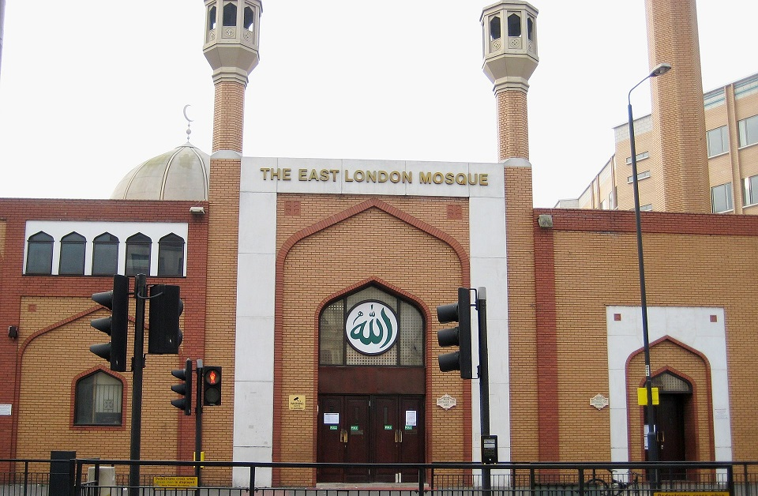
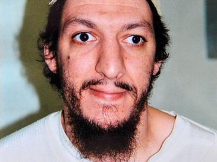
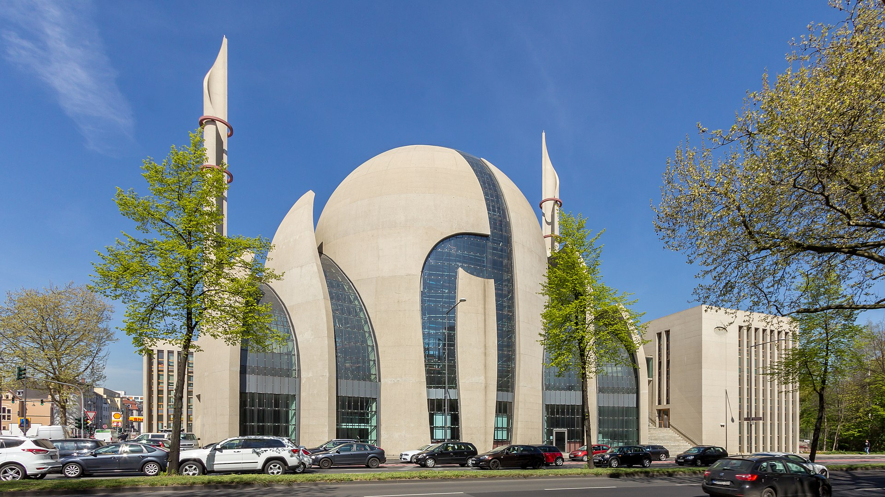
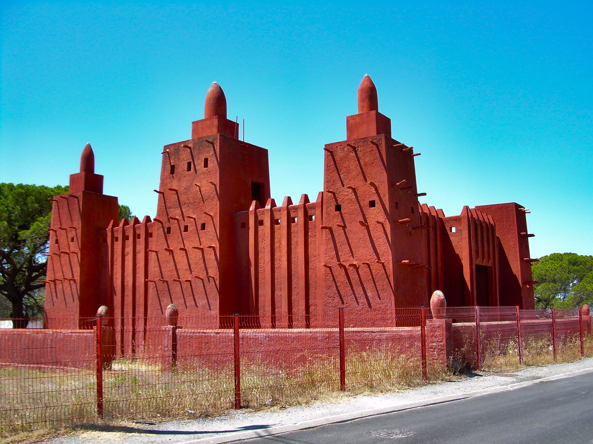
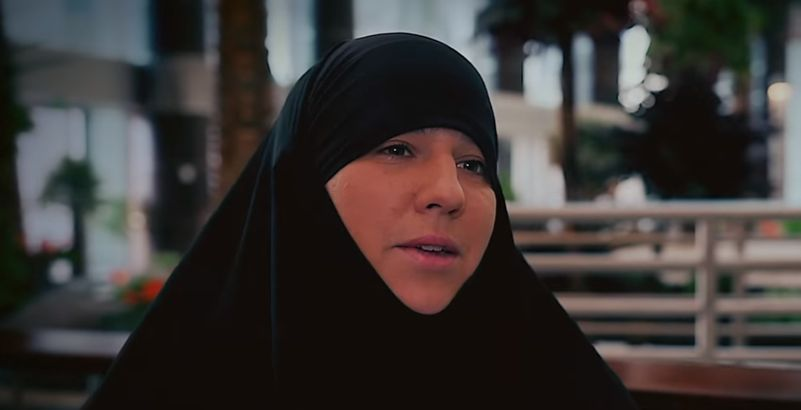

Wszyscy, którzy chociaż raz na jakiś czas przeglądają główną Wykopu (2/10, nie polecam) są świadomi tego, że w Zachodniej Europie z roku na rok przybywa wyznawców islamu. Jest to fakt, któremu raczej nikt nie zaprzecza. Różne są tylko oceny zjawiska - niektórzy cieszą się, że jest więcej różnorodności, inni widzą w tym przejaw upadku Europy, jeszcze inni pocieszają się, że muzułmanie prędzej czy później ulegną sekularyzacji/chrystianizacji (zależnie od ideologicznego skrzywienia). Z tym zjawiskiem wiąże się zazwyczaj migrację, zwiększoną jeszcze przez tak zwany kryzys uchodźczy.

Oczywiście powiązanie to jest jak najbardziej poprawne - miliony muzułmanów przybywają do krajów Okcydentu od co najmniej pół wieku. Ich liczby są na tyle wysokie, że w krajach takich jak Niemcy, Holandia, Francja czy Wielka Brytania można wskazać całe dzielnice, które już mają muzułmańską większość. Imigranci i ich dzieci to jednak nie jedyny powód, dla którego islam jest na demograficznej fali w Zachodniej Europie. Kolejnym tego powodem są konwersje rdzennych Europejczyków. I o tym właśnie spróbujemy sobie opowiedzieć dzisiaj.

Podejdziemy do tematu na tyle kompleksowo, na ile pozwala nam konwencja odcinka. Zaczniemy od Zjednoczonego Królestwa. Według danych z 2011 roku, 3% brytyjskich muzułmanów to biali Brytyjczycy. BBC podaje, że liczba brytyjskich konwertytów na islam przekroczyła już 100k. Według badaczy, większość z nich to białe kobiety. Pokrywa się to z obserwacjami jednego z londyńskich imamów - Adżmala Masroora - według którego ¾ brytyjskich konwertytów to kobiety. Na tej podstawie niektórzy twierdzą, że większość konwersji to tak naprawdę konsekwencja wyjścia za mąż za muzułmanina.

Jest to jednak temat, który ciężko zbadać i statystyka, według której przeciętny konwertyta na islam to 27letnia biała kobieta, nie oznacza zaraz, że każda z nich zrobiła to tylko i wyłącznie ze względu na swojego wybranka. BBC przytacza kilka historii kobiet, które nawróciły się w wyniku duchowych poszukiwań, a małżeństwo z muzułmaninem było konsekwencją konwersji, a nie jej przyczyną. Jedną z najgłośniejszych nawróconych ostatnich lat jest Lauren Booth - szwagierka Tonyego Blaira i dziennikarka.

Jakie czynniki mogą zatem stać za konwersjami, których liczba podwoiła się w ciągu ostatniej dekady? Zdaniem samych „nowych muzułmanów” zapytanych przez Swansea University, do islamu przyciąga ich głównie wspólnotowość, prostota i rygoryzm moralny. Kulturę brytyjską widzą jako upadłą, rozpasaną, przeżartą permisywizmem i konsumpcjonizmem. Szukają w swoim życiu autentycznej duchowości i więzi, których nie znajdują w swoich rdzennych wspólnotach. Odpowiedzi takich udzielały zarówno kobiety jak i mężczyźni.

Życie nowych muzułmanów i muzułmanek nie jest jednak usłane różami. Według historii opowiadanych dziennikarzom, w wielu przypadkach dochodzi do konfliktów rodzinnych. Rodzina i krewni często nie rozumieją decyzji o konwersji i traktują ją nieomal jak zdradę. Zła sława islamu, za którym ciągnie się odium terroryzmu i radykalizmu, nie pomaga.

Zdaniem badaczy obawy te są jednak nieuzasadnione. To znaczy faktycznie część neofitów się radykalizuje, czego przykładem mogą być ludzie tacy jak Nicky Reilly, Richard Reid i Germaine Lindsay. W dodatku istnieje także zjawisko konwersji na islam wśród więźniów - jest ono na tyle znaczące, że niektórzy badacze twierdzą, że motywem stojącym za nawróceniem są dodatkowe przywileje dla muzułmanów w systemie penitencjarnym.

Większość jednak nie widzi sprzeczności między nową religią, a życiem w Wielkiej Brytanii. To z kolei może stać za innym problemem, jaki często napotykają konwertyci (a przynajmniej tak donoszą). Jest nim wyobcowanie w lokalnych społecznościach muzułmańskich. „Starzy” muzułmanie często odnoszą się bardzo lekceważąco do „nowych” i nie uważają ich za pełnoprawnych współwyznawców. Czasem wręcz podejrzewają o sabotaż czy bycie piątą kolumną.

Nie był by to tak palący problem gdyby nie fakt, że znaczna część meczetów w Wielkiej Brytanii jest etniczna. To znaczy, że imigranci z, na przykład, Somalii zazwyczaj nie dzielą domów modlitwy/meczetów z, na przykład, Pakistańczykami. Podziały te często przechodzą na kolejne pokolenia. Biali Brytyjczycy wyznający islam mają tym większy kłopot, że (poza Londynem) są rozsiani po kraju i rzadko tworzą zwarte społeczności.

Z drugiej strony, zdaniem Gatestone Institute, część konwertytów podchodzi do islamu o wiele ostrzej niż „starzy” wyznawcy (co niekoniecznie oznacza, że przyciąga ich terroryzm). Może to być spowodowane faktem, że religie z biegiem czasu często obrastają w zapożyczenia z lokalnych kultur, które łagodzą nieraz bardzo wyśrubowane normy. Z tego powodu, muzułmańscy neofici budzą obawy nie tylko rodziny czy lokalnych społeczności, ale także służb.

Powyższe akapity odnoszą się w dużej mierze także do Niemiec i Francji. W Niemczech również mówi się o około 100k etnicznych Niemców, którzy przyjęli islam. Wielu z nich pochodzi z terenów byłego NRD, co, zdaniem profesor Esry Ozyurek, może być próbą ucieczki od wschodniej tożsamości. Kolejnym powodem może być fakt, że wschodnia część Niemców jest również o wiele bardziej zsekularyzowana niż Zachodnia - potrzeby duchowe nie znajdują ujścia w tradycyjnych wspólnotach, bo często ich po prostu nie ma.

Jeśli chodzi o Francję to liczbę rdzennych Francuzów, którzy porzucili swoje poprzednie wyznanie (lub w ogóle go nie mieli) i zdecydowali się na islam, także szacuje się na 100k. Dane szacunkowe Ministerstwa Spraw Wewnętrznych z 1999 roku mówią o 40k. Według kanału France 3 jest ich około 70k. NY Times zaś donosi, że w ciągu ostatnich 25 lat liczba konwertytów zwiększyła się dwukrotnie.

Niezależnie od tego, która liczba jest najbliższa prawdzie, ilość konwertytów jest na tyle znacząca, że mają oni już „swoje” meczety. Zdaniem Bernarda Godarda, pracującego w Ministerstwie Spraw Wewnętrznych, ilość konwersji wzrosła po 2000 roku. O ile wcześniej były one głównie spowodowane ślubami z muzułmanami/muzułmankami, tak teraz islam zyskał na popularności wśród młodych mężczyzn, których rodziny wywodzą się z byłych francuskich kolonii w Afryce.

NY Times podaje, za Samirem Amgharem, że wpływ islamu na codzienne życie mieszkańców Francji, zwłaszcza tych żyjących w banlieu (dzielnicach klasy niższej, zamieszkanych głównie przez imigrantów i ich potomków) wzrósł znacząco - niezależnie od tego czy są oni muzułmanami czy nie. Zainteresowanie islamem wynika tam nie tylko z przyczyn duchowych, ale nakłada się na podziały klasowe. Islam zapewnia silne poczucie wspólnoty, a konflikt między świecką Republiką, a ludźmi żyjącymi na jej marginesie łatwo zobaczyć w kategoriach konfliktu religijnego.

Wzrost liczby konwersji potwierdzają także muzułmańscy przywódcy religijni. Abderrahmane Ghoul z Marsylii podaje, że w 2012 sam podpisał około 130 dokumentów potwierdzających przyjęcie islamu. Imam Hassen Chalghoumi z Drancy koło Paryża uważa, że popularność islamu wynika z tego, że oferuje on alternatywę dla laickiej Republiki. Na islam przechodzą także celebryci, jak na przykład raperka Diam.

Na koniec ciekawostka dotycząca Hiszpanii. Wśród regionalistów z Andaluzji (to znaczy coś jak u nas RAŚ, ale bardziej) istnieje trend nazywany „islamizującym andaluzjanizmem” - historyczne Al-Andalus było krainą zamieszkaną przez muzułmańską większość. Zwolennicy tego nurtu uważają, że islam jest integralną częścią bycia Andaluzyjczykiem.
