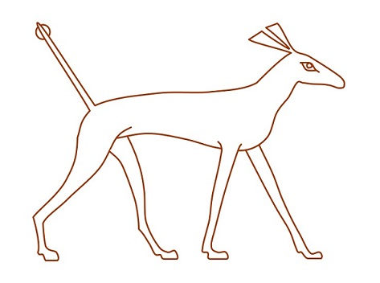

Mitologia egipska nie jest tak dobrze poznana jak chociażby grecka, o której wszyscy uczyli się w szkołach. Z tego powodu krąży wiele błędnych poglądów na temat bóstw staroegipskich. Jednym z nich jest postrzeganie Seta jako głównego antagonisty i boga wszelkiego zła. Jednak jeśli przyjrzeć się trochę bliżej staroegipskim mitom to, jak Seta postrzegali jego wyznawcy, wygląda zgoła inaczej. Najstarsze przedstawienie Seta pochodzi z okresu, zanim w Egipcie zaczęły rządzić dynastie faraonów (4000-3500 p.n.e.). Już wtedy Set był przedstawiany z głową zwierzęcia, które ciężko zidentyfikować –doszukiwano się podobieństwa do szakala, mrównika, świni rzecznej albo osła. Najprawdopodobniej było to zwierzę z gatunku psowatych, które dawno już wyginęło. Obecnie określa się to stworzenie jako „Zwierzę Seta”, współcześni mieszkańcy egipskich wiosek nazywają go Saalawa i utrzymują, że tego typu zwierzęta co jakiś czas atakują ich dobytek.

Set był bogiem opiekuńczym władców z II dynastii egipskiej (2900-2700 p.n.e.), należał do tzw. Wielkiej Dziewiątki Bogów razem z Re, Ozyrysem, Izydą czy swoją małżonką Neftydą. Miał on niezwykle odpowiedzialne zadanie – stał na czele słonecznej barki najważniejszego boga - Re, która codziennie przemierzała niebo od wschodu do zachodu. Podczas tej wędrówki na boga słońca czekał jego odwieczny wróg – wielki wąż Apopis (lub Apop). Był on strażnikiem praoceanu, ucieleśnieniem sił ciemności i chaosu. Codziennie podczas wschodu i zachodu Apop atakował słoneczną barkę Re, aby zakończyć jego panowanie nad światem. Jednak Set – potężny wojownik za każdym razem pokonywał wielkiego węża, którego krew rano i wieczorem rozlewała się po nieboskłonie. Jego kult był niezwykle silny szczególnie w Górnym Egipcie – pustynnej krainie narażonej na ataki barbarzyńców, gdzie wspomożenie boskiego wojownika było bardzo pożądane. Istniały prężne ośrodki kultu w Kom Ombo czy w oazie Fajum.

Pod koniec tak zwanego I Okresu Przejściowego (2200-2100p.n.e.), kiedy Egipt był znów podzielony na Górny i Dolny, powstał jeden z najsłynniejszych mitów egipskich – mit ozyriacki. Odzwierciedlał on rywalizację obu krain – jedna z nich znajdowała się pod opieką Seta, a druga pod opieką Horusa. Według mitu bóg Ozyrys rządził szczęśliwie całym Egiptem, były to złote lata prosperity i bogactwa. W pewnym momencie jego brat, zazdrosny Set chce zagarnąć tron dla siebie. Planuje więc wystawną ucztę na którą zaprasza swoich popleczników i samego Ozyrysa. W trakcie zabawy organizuje konkurs – kto zmieści się w przygotowanej, pięknie zdobionej skrzyni, ten otrzyma ją na własność. Wszyscy zaproszeni goście próbowali kolejno, ale udało się to tylko Ozyrysowi. Kiedy ten wszedł do niej, Set zatrzasnął wieko i wrzucił je do Nilu. Zrozpaczona żona Ozyrysa – Izyda, po długich poszukiwaniach znalazła skrzynię z martwym mężem i chciała go uroczyście pochować na bagnach. Przypadkiem jednak skrzynię odnalazł Set – porąbał więc ciało brata i rozrzucił czternaście kawałków po całym Egipcie. Izyda znów wyruszyła na poszukiwania i z pomocą boga Anubisa odnalazła wszystkie części, oprócz penisa, który został pożarty przez rybę. Izyda dorobiła członek swojemu mężowi i od razu poczęło się ich dziecko – Horus. Anubis zmumifikował Ozyrysa, który odtąd stał się bogiem umarłych.

Jednak to nie był koniec starań Seta o tron - Horus przejął władzę po ojcu i chciał go pomścić, wypowiedział więc wujowi wojnę, która trwała aż 80 lat. Podczas niej bogowie uciekli się po wszelakich sztuczek. Jednego razu walczyli zamienieni w hipopotamy, a Izyda chcąc pomóc Horusowi rzuciła włócznią w zwierzęta. Okazało się jednak, ze trafiła w swojego syna, który stracił oko. Innym razem bogowie mieli ścigać się w kamiennych łodziach wzdłuż Nilu. Horus jednak wykonał swoją łódź z drewna i sprawił, że wyglądała jak z kamienia. Oczywiście wygrał, gdyż łajba Seta poszła od razu na dno. W walce doszło nawet do tego, że Set upił Horusa i zgwałcił go, co miało symbolizować jego wyższość. Horus nie pozostał dłużny – z pomocą Izydy dodał do sałaty (ulubionego warzywa Seta) swoją spermę, dzięki czemu zapłodnił wuja. W końcu konflikt miał rozstrzygnąć trybunał bogów w składzie: Szu (bóg powietrza), Thot (bóg mądrości) i Re, który jako jedyny opowiedział się za Setem jako swoim obrońcą. Mimo, że sprawa kto kogo zapłodnił była bardzo ważna, gdyż uległość nie była cechą dobrego władcy, trybunał przyznał rację Horusowi. W ramach kompromisu Set dostał Górny a Horus Dolny Egipt pod władanie. Odtąd kraj był zjednoczony, a obaj bogowie wrócili do łask i wspólnie opiekowali się faraonami.

Set dalej był popularnym bóstwem, opiekował się XIX i XX dynastią. Z XIX dynastii wywodził się m.in. Ramzes II, wielki czciciel Seta, który stawiał mu potężne świątynie. Bóg ten był popularny także wśród obcych, wojowniczych pustynnych plemion, takich jak azjatyccy Hyksosi, którzy zawładnęli Egiptem w latach 1650-1550 p.n.e. Egipcjanie, którzy bali się agresorów zaczęli o wszystko obwiniać ich boga. Stopniowo Set stał się nie tylko bogiem wojny i pustyni, ale też chaosu i wszelkiego zła. A skoro chaos i zło to szybko utożsamiono boskiego wojownika z jego największym przeciwnikiem – wężem Apopem. W ten sposób jego kult został publicznie usunięty, zastąpiono jego wizerunki innymi bóstwami, a jego miejsce na słonecznej barce zajął Horus. Grecy, jak chociażby Plutarch, który odwiedzali Egipt w późniejszym okresie przyrównali Seta do Tyfona – olbrzyma z mitologii greckiej, który atakował bogów. Jednak nietknięty kult boga wojny utrzymywał się w niektórych miejscach jeszcze przez długi czas, prawdopodobnie do I w. p.n.e. Również dzisiaj istnieje Świątynia Seta – satanistyczna sekta, która czci starożytnego boga.