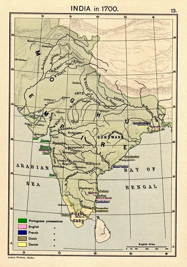
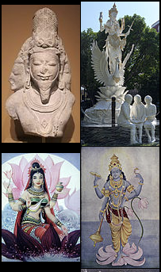
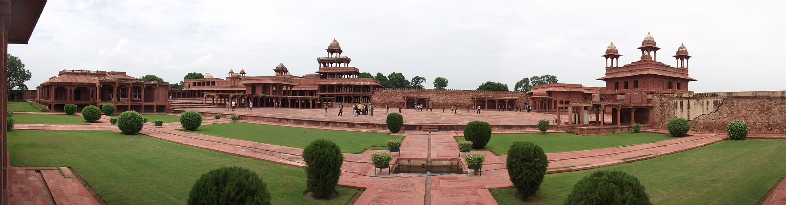

Historia Indii jest dosyć egzotyczną dziedziną wiedzy. A szkoda, bo można o niej powiedzieć w zasadzie wszystko poza tym, że jest nudna i uboga. Nasze szkolnictwo skupia się jednak głównie na historii cywilizacji zachodniej i jej poprzedniczkach. Wzmianki o Indiach są mocno fragmentaryczne i ciężkie do zrozumienia, bo wyjęte z kontekstu głównego nurtu. Z lekcji kojarzę tylko szczątkowe informacje o cywilizacji doliny Indusu, potem krótkie wspominki o arabskich i tureckich podbojach i kolonializm europejskich mocarstw. Ale od czego mamy internet?

W XVI wieku subkontynent był zdominowany przez tak zwane Państwo Wielkiego Mogoła, założone przez potomków wielkiego zdobywcy Timura, który kontrolował tereny od Chin po Konstantynopol. Babur, założyciel dynastii Wielkich Mogołów, nie chciał być gorszy niż sławny protoplasta. Dość powiedzieć, że państwo, któremu dał początek, było drugim największym imperium w historii Indii. Poddani Babura i jego następców tworzyli niesamowity tygiel kulturowy, jako że należeli do setek różnych grup etnicznych, religijnych, językowych i jakich tylko jeszcze.

Wielkich Mogołów, choć byli bitnymi zdobywcami, ciężko określić mianem prymitywnych prostaków. Akbar - bohater naszego odcinka, trzeci władca imperium, był prawdziwym człowiekiem renesansu. Zdolny generał, który rozszerzył granice państwa na południu. Znakomity administrator, twórca systemu, który umożliwił efektywne zarządzanie tak rozległymi terytoriami. Biegły dyplomata, potrafiący pacyfikować nastroje arystokracji i rozgrywać opozycję.

Był znany także jako patron kultury, stojący między innymi za stworzeniem biblioteki, zawierającej przeszło 24 tysiące wolumenów zapisanych sanskrytem, urdu, perskim, greką, arabskim a nawet łaciną. Biblioteka była nie tylko zbiorem ksiąg, ale także instytucją kulturalną i naukową, zatrudniająca i jednoczącą skrybów, uczonych, tłumaczy i artystów. Akbar zasłynął również jako edukator odpowiedzialny za stworzenie szkół, w których uczyło się wielu jego poddanych, bez względu na podziały etniczne i religijne.

.")

No właśnie. Te podziały mogły być palącym problemem państwa rządzonego przez Akbara. Wielcy Mogołowie i miażdżąca większość ich żołnierzy wywodziła się z wyznających islam turecko-mongolskich ludów Azji Środkowej. Z biegiem czasu kręgi rządzące uległy kulturowej iranizacji, ale islam pozostawał ważnym elementem ideologii dynastycznej i spoiwem jednoczącym władców z wojskiem i arystokracją terenów, które stanowiły rdzeń państwa.

Z drugiej strony miażdżąca większość poddanych Akbara wyznawała hinduizm. Warto tutaj podkreślić, że hinduizm nie jest religią (przynajmniej nie w takim tego słowa rozumieniu, które dominuje w zachodniej części Starego Świata), a całym zbiorem wierzeń i filozofii, nieraz bardzo, bardzo różnych od siebie. Do tego dodajmy jeszcze wspływy mazdaistycznych religii irańskich - przede wszystkim zoroastryzmu, które odcisnęły mocne piętno na terenach Azji Środkowej i zachodnich terytoriach państwa Akbara.

Nie trudno wyobrazić sobie, że zawiłości polityki religijnej imperium mogły przyprawić o ból głowy. Jej niepowodzenia łatwo mogły przekształcić się w krwawą wojnę domową lub regionalne bunty. Akbar był zatem bardzo tolerancyjny. Czasem postępował nawet wbrew temu co głosili niektórzy muzułmańscy przywódcy religijni. I tak na przykład w 1579 roku zniósł obowiązek płacenia dżizji - specjalnego podatku nakładanego na innowierców. W tym samym roku zezwolił też jezuitom, którzy do Indii ściągnęli wraz z Portugalczykami, na prowadzenie swobodnej działalności misjonarskiej.

Niekoniecznie jednak musiało za tym stać tylko wyrachowanie obliczone na ekonomiczne i polityczne korzyści. Według podań o jego życiu, będąc w średnim wieku przeżył mistyczne doświadczenie, które na zawsze zmieniło jego życie. Od zawsze był bardzo ciekawy świata i wspierał uczonych i kulturę, ale od tego momentu zaczął zagłębiać się w religijne dysputy. W 1575 roku zbudował tak zwany Ibadat Chana (dosłownie Dom Modlitwy). Było to miejsce regularnych debat filozofów, teologów, mistyków i nauczycieli religijnych. Akbar partycypował w spotkaniach.

To wszystko nie działo się w próżni - religie występujące na terenach zjednoczonych przez Mogołów, zaczęły stykać się ze sobą i mieszać. Na ich panowanie przypada rozkwit sufizmu - islamu (a raczej islamów, gdyż sufizm nie jest jednorodny) skupionego na mistyce, który garściami czerpał z lokalnych, niemuzułmańskich tradycji. Dzięki regionalnym akcentom, sufizm był bardzo popularny wśród mas i to właśnie w nim upatruje się źródła popularyzacji islamu w północnych Indiach.

Jak przed chwilą wspominaliśmy, Akbar był żywo zainteresowany religiami i sprawami związanymi z duchowością. W toku dyskusji, w których brał czynny udział i nauczania, które poznał, miał jakoby dojść do wniosku, że żadna z religii nie może zawierać całej prawdy. Z tego powodu zdecydował się na stworzenie własnej - zawierającej to co dobre i prawdziwe w pozostałych. Została ona nazwana Din-i Ilahi (dosłownie: Religia Boga), ale w czasach Akbara nazywano ją Tawhid-i-Ilahi (boski monoteizm)

Religia owa opierała się głownie na elementach islamu i hinduizmu, ale zawierała również zapożyczenia z chrześcijaństwa, dżinizmu, mazdaizmu i sikhizmu. Potępiała uleganie rządzom, rozpustę i przemoc, a promowała pobożność, abstynencję, samokontrolę i łagodność. Nie było w niej autorytatywnych pism, ścisłej hierarchii i kapłanów. Praktyka cnoty (nie tylko cielesnej, choć pochwalano celibat) miała doprowadzić do zjednoczenia ludzkiej duszy z Bogiem.

Propozycje władcy i wygłaszane przez niego poglądy oburzyły część muzułmańskich przywódców. Najprawdopodobniej to sprawiło, że Akbar zaczął nieprzychylnie się do nich odnosić i stał się niechętny praktykom i poglądom jakie promowali. Doprowadziło to do rebelii, na czele której stanął Dżahangir - syn i następca Akbara. Rozeszła się wprawdzie po kościach, ale wymusiła zmianę nastawienia cesarza.

 tłumaczą Akbarowi i reszcie zebranych czemu Rzym jest the best.")

Stworzona przez niego religia nigdy nie wyszła poza dwór, a i na nim nie zrobiła jakieś oszałamiającej kariery. Jej „wyznawcami” byli tylko dostojnicy z najbliższego otoczenia władcy i nigdy nie było ich więcej niż 19. Zdaniem wielu historyków nie była to klęska, a świadomy plan Akbara. W ich interpretacji wcale nie chciał on tworzyć religii unifikującej podzielone wyznaniowo imperium - a tak głosił tradycyjny pogląd stworzony przez badaczy starszej daty.

Prawdziwym celem Religii Boga miało być jakoby zaspokojenie duchowych potrzeb i ambicji władcy. Ich zdaniem Akbar chciał po prostu stworzyć kult dla garstki wtajemniczonych. Akbar jakoby widział siebie jako natchnionego proroka, mającego specjalny kontakt z Bogiem, a nie będącego tylko zwykłym, ziemskim wykonawcą jego woli. I taką też rolę chciał odgrywać. Zmarł w 1605 roku, a boski monoteizm zniknął ze źródeł niedługo potem.
Obrazek wg uznania, ja nie mam pomysłu
