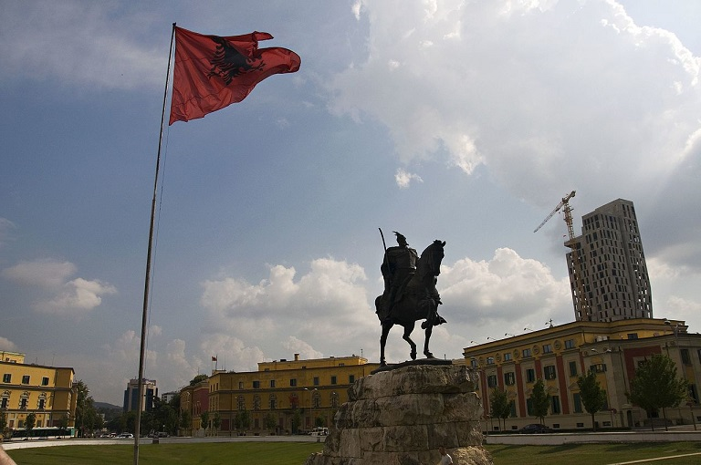
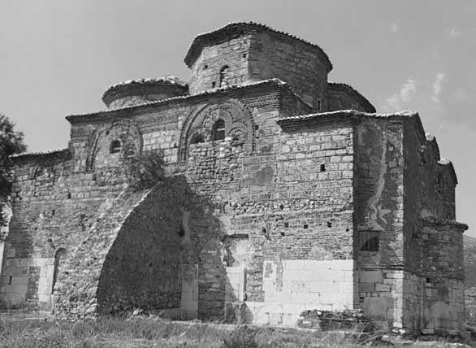
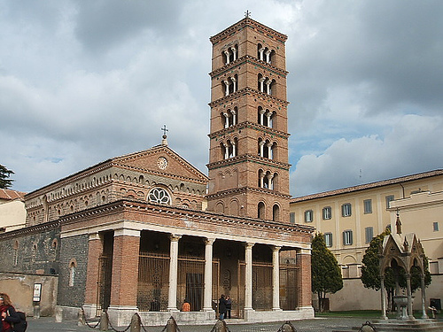

Albania mimo, że leży w Europie, jest prawdziwą terra incognita dla przeciętnego Polaka. No sami powiedzcie - ile znacie osób, które były w Albanii? Wśród moich znajomych więcej ludzi odwiedziło odległą Tajlandię, niż ten bałkański (k)raj. Dzięki działalności Popka wzrosła świadomość istnienia Albanii, zwłaszcza wśród młodzieży w wieku gimnazjalnym. Pewne informacje na temat Albanii i Albańczyków pojawiły się w mediach głównego nurty przy okazji konfliktu w Kosowie. Te jaskółki wiosny jednak nie czynią- zwłaszcza, że w przypadku wzmiankowanego konfliktu sympatia jest raczej po stronie serbskiej.

Nie samą Albanią będziemy się tutaj jednak zajmować, ale Albańczykami. A i to nie do końca bo interesuje nas tylko pewna grupa Albańczyków. Mianowicie: Arboresze. Potomkowie imigrantów i uciekinierów z Albanii, którzy z różnych powodów dawali nogę z kraju rządzonego przez Osmanów. Migrując przenieśli ze sobą kulturę niedotkniętą tak mocno wpływami muzułmańskimi i tureckimi. Z tego tytułu niektórzy twierdzą, że to Arboresze są „prawdziwymi Albańczykami”, bo, w przeciwieństwie do swoich rodaków, którzy pozostali na miejscu, zachowali kulturę przedosmańskiej Albanii.

Od mniej więcej XIV wieku zaczął się napór Turków na Bałkany. Ofiarami najazdów, podatków, dewszirme i innych takich, padali nie tylko Grecy, ale także ich albańscy i słowiańscy sąsiedzi. Dość powiedzieć, że wspomniane przed chwilą dewszirme to, tak zwany, „podatek krwi” - w praktyce jego „płacenie” polegało na tym, że Turcy odbierali swoim chrześcijańskim poddanym nieletnich chłopców i wychowywali ich na wzorowych, muzułmańskich żołnierzy-janczarów.

Prawosławna i katolicka ludność osmańskich Bałkanów nie miała lekko (co jednak automatycznie nie znaczy, że na tle epoki miała jakoś wyjątkowo źle). Wielu decydowało się na porzucenie rodzinnych stron i szukanie schronienia na ziemiach pozostających pod panowaniem chrześcijan. Dotyczy to zwłaszcza żołnierzy, którzy przy okazji konfliktów na linii państwa chrześcijańskie-Osmanowie, walczyli po stronie tych pierwszych. Indywidualne migracje trwały cały czas, ale między XIV a XVIII wiekiem można wyróżnić kilka fal - na przykład tę, która ruszyła po tym, jak zmarł Skanderbeg i albański opór wobec osmańskich najeźdźców znacznie przygasł.

Większość Albańczyków (Arboresze to spolszczenie albańskiego Arbëreshë- funkcjonującego w średniowieczu określenia Albańczyków) osiedlała się po drugiej stronie cieśniny Otranto, na południu Italii. Bitni górale byli cennym nabytkiem dla lokalnych władców, wiecznie uwikłanych w zbrojne konflikty. Z tego powodu nikt nie widział problemów w „albanizacji” Neapolu i Sycylii. W XV wieku Alfons V tłumił powstanie w Neapolu albańskimi rękami. Za te usługi najemnicy owi otrzymali 14 wsi w okolicach Catanzaro. Kilka lat później inni albańscy żołnierze pokonali francuską ekspedycję, za co otrzymali 15 wsi w okolicach Tarentu.

Kolejne stulecia przyniosły nowych migrantów i nowe osady na południu, nadawane żołnierzom za bitewne przewagi. Dzięki temu mieli „swoje” osady, co zmniejszało lokalne wpływy i zwiększało szansę na przetrwanie kultury imigrantów. Większość przybyszy była wyznawcami prawosławia, zatem ich wiara i ryt odróżniała ich od rzymsko-katolickich tubylców. Katoliccy Albańczycy asymilowali się o wiele szybciej. Prawosławni zaś, przyzwyczajeni do swoich obrzędów i kultury, nie bardzo chcieli od nich odchodzić. Jak nietrudno się domyśleć, wśród nich znajdowali się również duchowni, którzy starali się o zachowanie tradycji i wiary przywiezionych z ojczyzny.

Próby konserwacji zwyczajów i kultury nie dotyczyły tylko sfery duchowej. Według danych z 2007 roku prawie 100k mieszkańców południowej Italii posługuje się na co dzień arbaryjskimi dialektami języka albańskiego. Wywodzi się on od dialektu toskijskiego, na którym oparty jest współczesny albański. Co ciekawe, dialekty arbaryjskie, mimo że blisko spokrewnione, niekoniecznie są wzajemnie zrozumiałe. Język ten nie jest tylko lokalną gwarą. Jest również językiem literackim, w którym spisano wiele dzieł. Oprócz języka i zwyczajów, przetrwały także tradycyjne potrawy.

Żeby jednak nie było za pięknie - mijały kolejne stulecia i lokalna kultura coraz silniej wdzierała się do albańskich domostw. W kwestii religii natomiast, organizacyjna i polityczna dominacja kościoła rzymskokatolickiego były niepodważalne - jawne postawienie się/odrzucenie nakazów oznaczało pewną przegraną. W 1564 roku Pius IV wymógł na Albańczykach podporządkowanie się pod łacińskich duchownych. Bariery wciąż jednak istniały - przybysze i ich potomkowie posługiwali się odrębnym rytem, znanym we Włoszech jako bizantyjski. Wywoływało to kontrowersje, ale generalnie było tolerowane.

Aby pełniej zintegrować tych „Greków” (bo tak, z racji obrządku, nazywano Arboreszy), papież Grzegorz XIII utworzył w 1577 roku Kolegium Greckie. Jego misją było kształcenie duchowieństwa w duchu teologii łacińskiej - nie tylko dla Albańczyków, ale także innych kościołów unickich. W XVIII wieku pojawiły się kolejne seminaria i instytucje religijne, mające na celu umożliwienie Arboreszom zachowanie ich „dróg”, przy jednoczesnym pozostawaniu pod zwierzchnictwem Rzymu. Albańczycy przejęli także ostatni „bizantyjski” klasztor na południu Włoch, mieszczący się w Grottaferrata (utworzony jeszcze w czasach gdy była to prowincja cesarstwa ze stolicą w Konstantynopolu). Zaowocowało to później powstaniem bazyliańskiego zakonu włoskiego.

W XVIII wieku pojawiły się także pierwsze przymiarki do wydzielenia struktur kościelnych Arboreszy i innych „Bizantyjczyków” (w większości Greków bądź ich potomków) z kościoła łacińskiego. W 1716 roku otwarto dom Księży Oratorianów w obrządku bizantyjskim. W 1742 roku Benedykt XIV opublikował konstytucję apostolską, która była próbą nadania rytowi bizantyjskiemu oficjalnego statusu i zrównania go z łacińskim (co ostatecznie stało się dopiero w następnym stuleciu). W 1784 roku stworzono ordynariat dla sycylijskich Albańczyków. Data ta jest traktowana jako początek kościoła Italo-albańskiego. Nie jest to jednak do końca prawda.

W 1909 roku powstał ordynariat dla „Bizantyjczyków”, tym razem z Kalabrii. Dopiero w 1919 roku kościół katolicki ustanowił pierwszą eparchię dla wiernych używających rytu bizantyjskiego. Jej siedzibą jest Lungro w Kalabrii. Biskup nosi tytuł oznaczający dosłownie „biskupa italskich Albańczyków”. To wydarzenie oznacza w praktyce powstanie kościoła sui iuris. Terminem tym określa się kościoły innych rytów niż łaciński, ale wchodzących w skład kościoła rzymskiego i uznającego zwierzchność papieża. I tak narodził się kościół zwany dzisiaj kościołem katolickim obrządku bizantyjsko-włoskiego, kościołem italoalbańskim oraz kościołem italogreckim.

W 1937 roku postawiono następny krok: wspominany przed chwilą ordynariat sycylijski został podniesiony do rangi eparchii. Siedzibą biskupa jest Piana degli Albanesi. Miesiąc przed tym wydarzeniem bizantyjski klasztor w Grottaferrata uzyskał status opactwa terytorialnego, który wyłączał go spod zwierzchnictwa lokalnej hierarchii. Obydwie eparchie i klasztor podlegają od tamtej pory tylko i wyłącznie pod Rzym. W 1940 roku opactwo i eparchie zebrały się na synodzie. Tematem obrad było zachowanie rytu bizantyjskiego i nawiązanie stosunków z prawosławiem albańskim, które wysłało na synod swoich delegatów.

Kościół italoalbański istniej do dzisiaj i liczy sobie ponad 60k wiernych. Większość z nich zamieszkuje południe Włoch, gdzie mieści się miażdżąca większość italoalbańskich parafii. Największym wyzwaniem dla kościoła jak i samych Arboreszów okazały się być migracje południowców do USA. Italoalbańscy imigranci często stapiali się tam z resztą Sycylijczyków, Kalabryjczyków itp. zatracając tym samym swą odrębność. Było to w dużej mierze związane z tym, że nie zakładali tam oni własnych parafii i należeli do istniejących już włoskich. I tak jest po dziś dzień - mimo istnienia społeczności italoalbańskich w na przykład USA, należą one do włoskich parafii posługujących się rytem łacińskim.
