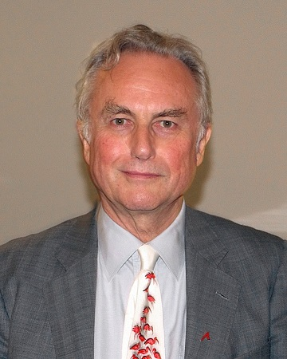
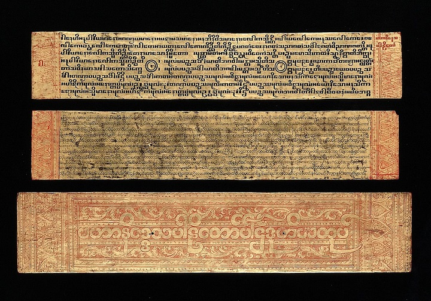

Przy okazji różnych dyskusji o religiach, wierze, niewierze, bogach, bóstwach i co tam jeszcze, często pojawia się pogląd, według którego ateizm, materializm czy racjonalizm są nowinką, postępem, kolejnym krokiem na drodze rozwoju ludzkości. No po prostu nową jakością. Narracja idzie mniej więcej tak: głupi (w wersji bardziej przychylnej - mniej wiedzący) starożytni nie wiedzieli tego, co wiemy my i musieli wymyślać sobie bogów, Boga, diabły, anioły, dewy, skrzaty, elfy i sto innych kategorii nadprzyrodzonych istot. Na szczęście rozwój nauk pozwala nam na stopniowe wycinanie tych zabobonów, a ateizm jest dziejową koniecznością - tak jak pan profesor Dawkins powiedział.

Abstrahując od całej dyskusji teizm-ateizm (oraz wszystkiego co między nimi) i prawdziwości stanowisk zajmowanych przez polemistów, chciałbym wam dzisiaj przedstawić Dawkinsów żyjących na subkontynecie indyjskim w VII wieku przed Chrystusem. Poglądy części z nich znalazły ujście w hinduistycznej tradycji znanej jako Ćarwaka lub Lokajata. Na wstępie musimy zaznaczyć, że wiele informacji o tym nurcie przepadło lub jest niejasnych gdyż nie dotrwał on do naszych czasów. Nie jesteśmy nawet pewni skąd taka nazwa - niektórzy twierdzą, że to „przyjemna mowa” lub „słodka mowa” (w sensie: zwodnicza). Inni twierdzą, że pochodzi od czasownika „jeść” gdyż zwolennicy tej szkoły mieli jakoby namawiać do hedonizmu i używania sobie.

Źródeł ateistycznej filozofii ćarwaki można doszukiwać się już w Rygwedzie - mianowicie w części hymnów, które spisano najpóźniej. Wiemy już, że prace pisane przez ludzi identyfikujących się z tym nurtem nie przetrwały w całości do naszych czasów, ale nie znaczy to, że w ogóle nie mamy skąd czerpać informacji. Ze wzmianek znamy tytuły (jak na przykład „Sutry Lokajaty”) i te poglądy, które wymienili autorzy dzieł polemicznych. Na nasze szczęście pomysły zwolenników ćarwaki były szeroko dyskutowane - natykamy się na nie na przykład w Arthaśastrze, pismach buddyjskich, dżinijskich, a nawet w eposach takich jak Ramajana czy Mahabharata. Jak jednak dobrze wie każdy internetowy dyskutant: często jest tak, że polemiści niekoniecznie wiernie prezentują punkt widzenia przeciwnika w debacie.

Niektórzy uważają, że ćarwaka rozwinęła się w opozycji do astiki, przez co bywa klasyfikowana jako nastika. Wbrew temu co twierdzi polska wikipedia astika i nastika to nie antyteza teizm-ateizm. Nie mamy tutaj miejsca żeby mocno wchodzić w temat, ale zestawienie to jest (albo raczej bywa) używane do klasyfikowania nurtów hinduistycznej filozofii. Astika jest (bywa) definiowana trojako: jako filozofie, które uznają autorytet Wed i/lub istnienie atmana i/lub istnienie Iśwary. Nastika zaś, to w dużym uproszczeniu, te filozofie, które wyrażają inne poglądy. Niektórzy badacze twierdzą, że ćarwaka wpłynęła na kształtowanie się myśli buddyjskiej, dżinistycznej i adźiwickiej (nawet nie wiem czy to ostatnie słowo istnieje).

Nie jest to jednak do końca jasne. Tak czy inaczej ćarwaka była tylko jedną ze szkół materializmu i ateizmu w starożytnych Indiach. Zdaniem badaczy, jedyną, która poskładała klocki w całość i zrobiła ze swoich poglądów koherentną filozofię. Za pierwszego historycznego przedstawiciela nurtu uważany jest współczesny Buddzie Adźita Keśakambali. Istnieją jednak teorie, że szkołę zapoczątkował filozof Ćarwaka - zwolennicy tej teorii wywodzą od niego nazwę. Ćarwaka uważana jest za jeden z przejawów śramany - tradycji równoległej do wierzeń wedyjskich, ale odrębnej. Jej zwolennicy znani byli przede wszystkim z ascetyzmu i sceptycyzmu co do popularnych przekonań.

Na podstawie wzmianek o ćarwace uważa się, że nurt ten opierał się na przekonaniu, że obserwacja jest głównym i najwłaściwszym sposobem zdobywania wiedzy. Wnioskowanie i interpretowanie niesie ze sobą tyle błędów poznawczych, że należy być bardzo ostrożnym. W skrócie - empiria rlz, ostrożnie z racjonalizmem. Według ćarwaki istnieją dwa typy obserwacji: zewnętrzna i wewnętrzna. Zewnętrzna jest efektem interakcji między światem a zmysłami. Wewnętrzna to umysł. Wiedza zdobywana przez obserwację zewnętrzną jest pewniejsza, natomiast wiarygodności tej drugiej jest wątpliwa. Nawet jeśli nasze wnioskowanie prowadzi do przewidywanego rezultatu to mógłby być to tylko przypadek. Ponadto nie da się w pełni poznać wszystkich okoliczności wpływających na dane zjawisko.

Postulowany przez ćarwakę sceptycyzm odbił się szerokim echem w ortodoksyjnych i nieortodoksyjnych szkołach myśli hinduskiej oraz tradycji buddyjskiej i dżinistycznej. Podejście ćarwaki było znacznie prostsze - skoro jedynym źródłem pewnej wiedzy jest obserwacja świata zewnętrznego, a cała reszta to tylko interpretacje, liczba możliwych założeń ulega znaczącemu zmniejszeniu. Dla porównania - myśliciele będący zwolennikami szkoły znanej jako Adwajtawedanta wymieniali aż sześć ścieżek prowadzących do poznania: obserwacja, wnioskowanie, porównanie, autorytet, założenie i „negatywna obserwacja” (umożliwiająca postrzeganie rzeczy nieistniejących... sam nie wiem jak to rozumieć).

W wyniku postawienia na obserwację ćarwakowie (nie czepiajcie się neologizmu, ile można pisać „zwolennicy”) odrzucali takie koncepty jak reinkarnacja, istnienie duszy w oderwaniu od ciała, rytuały religijne, istnienie innych światów (np. zaświatów), przeznaczenie i karmę. Ich zdaniem wszystkie cechy człowieka i jego sposób bycia wynikały z ciała a nie nadprzyrodzonych mocy. Nie podobały im się także próby wyjaśniania zjawisk poprzez odwołanie do sił nadprzyrodzonych - ich zdaniem taki a nie inny ich przebieg czy cechy, wynikały z natury. I tak na przykład ogień był gorący nie dlatego, że np. płonął w nim gniew jakiegoś boga, tylko, ot tak, po prostu.

W przeciwieństwie do przedstawicieli wielu innych nurtów śramany (a raczej większości) ćarwakowie nie widzieli sensu w ascezie i odmawianiu sobie czegokolwiek. Odrzucali podejście nie tylko weddyjskich wierzeń, ale także dżinijskie i buddyjskie. Nie widzieli cierpienia jako efektu zatopienia się w zmysłowych przyjemnościach. Cierpienie i przyjemność były w ich interpretacji nieodrodną i niezbywalną częścią życia, a cały cymes polegał na tym żeby tego pierwszego było jak najmniej, a tego drugiego jak najwięcej. Koncept karmy i reinkarnacji były ich zdaniem taką samą baśnią jak bogowie czy cuda.

Ich podejście można opisać… albo dobra, podobno poezja wyraża więcej niż milion słów, tak więc może oddajmy jej głos:

„Niebiańskie przyjemności zawierają się w jedzeniu pyszności, towarzystwie młodych kobiet, noszeniu dobrych ubrań, perfumach, girlandach [...] podczas gdy moksza to śmierć czyli koniec życia-oddechu [...] dlatego też, kto mądry nie powinien cierpieć dla mokszy.”.

Ta wiedza, którą zaprezentowaliśmy w powyższych akapitach jest raczej wysoce prawdopodobna. Na temat poglądów ćarwaków napisano jednak zdecydowanie więcej, ale niestety znacząca część tej pisaniny wygląda jak standardowe zarzuty pod adresem ideologicznych przeciwników - brak moralności, czynienie zła dla przyjemności, występki przeciwko innym ludziom, nielogiczność itd. etc. Brakuje w zasadzie tylko robienia macy z krwi chrześcijańskich dzieci. W sumie nie powinno to być dziwne bo przeciwników mieli wielu - lista obejmuje, ale nie kończy się na buddystach, dżinistach, adwajtawedantach i njajach.

Niektórzy z ich oponentów pisali o ich poglądach wprost jako o „zarazie”, którą „ciężko jest wyrugować”. Cóż, w przypadku ćarwaki te starania zakończyły się chyba sukcesem, ale współczesne, sięgające korzeniami zachodniej filozofii ateizm, racjonalizm i materializm mają się póki co dobrze i będą raczej cięższym orzechem do zgryzienia dla zastępów guru i mnichów.
