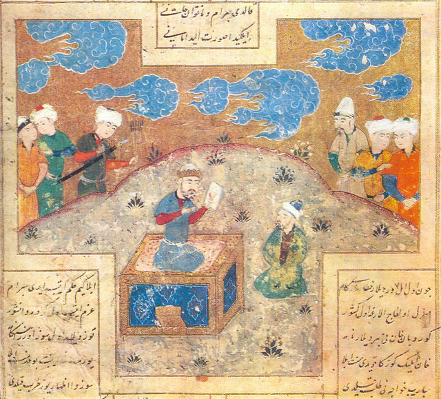
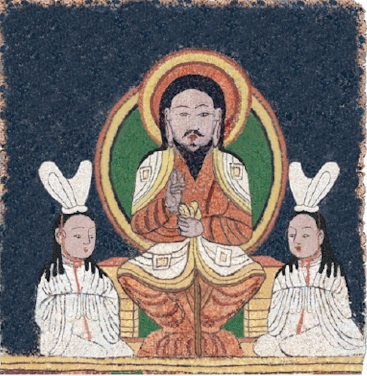
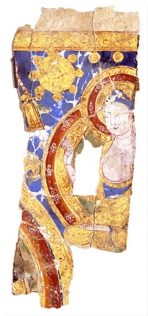
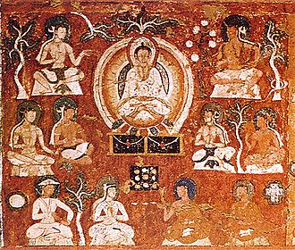
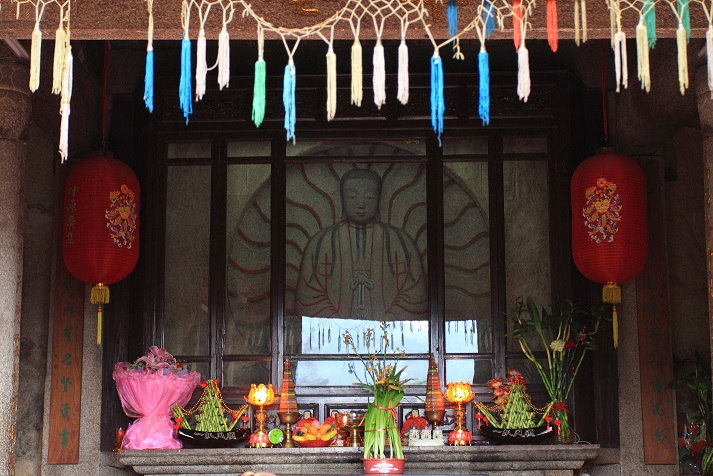

“To nie jest prawdziwy (tu wstaw nazwę dowolnej religii czy światopoglądu)” - to zdanie, które słyszy się wyjątkowo często w rozmowie z wyznawcami czy zwolennikami jakiejś religii bądź ideologii. Zazwyczaj pada ono jako odpowiedź na niewygodne zarzuty bądź wobec tych elementów/odłamów, z którymi rozmówca nie identyfikuje się albo podchodzi do nich z dużą dozą krytycyzmu. Nie, to nie będzie tekst krytykujący taką postawę. Zależy nam na tym żeby wiedzieć jak jest, a nie czy to słuszne. Swoją drogą, zmiany ideologii religijnej odbywają się zazwyczaj, jak wprowadzanie nowinek w starożytnym Rzymie - nikt nie przedstawia reformy jako czegoś nowego, a raczej jako “powrót do korzeni”.

“Prawdziwość” jest często używana w kontekście misjonarskim. Ludzie generalnie nieufnie podchodzą do czegoś nowego. Jest to zrozumiałe - bezpieczne drogi to te sprawdzone. W przypadku religii, często dochodzi do tego element tożsamościowy. Wiadomo, Polska katolicka, Sri Lanka buddyjska, Turcja muzułmańska itd. Przy założeniu, że chcesz kogoś zainteresować nową religią, podejście w stylu “hurr durr odrzuć te kłamstwa i przyjmij Prawdę” raczej się nie sprawdzi. Chyba, że masz za sobą “ramię zbrojne”. O ileż jednak lepiej jest przekonać potencjalnego konwertytę, zamiast zmuszać go do czegoś? Sprawić by uwierzył, że tak naprawdę nie każesz mu wyprzeć się “dziedzictwa”, tylko odkrywasz przed nim jego prawdziwe znaczenie, zagubione lub zafałszowane na przestrzeni lat. Zapewnić, że to, co głosisz, to tylko dopełnienie.

Podejście takie zostało wyprowadzone na szerokie wody przez pierwszą wielką religię misyjną czyli buddyzm. Dodawanie, adaptacja i reinterpretacja nie-buddyjskich elementów, zaszła w niektórych przypadkach tak daleko, że w zasadzie nie da się dojść do tego, co wzięło się z czego. Druga wielka religia misyjna, czyli chrześcijaństwo, miała bardzo zbliżone podejście. Wiele znaczących figur pierwszych wieków uważało, że chrześcijaństwo jest ostatecznym dopełnieniem objawienia pierwotnego, którego zniekształcone lub przestarzałe formy funkcjonowały jako filozofia, judaizm (tak, wiem) czy pogańskie wierzenia. Prawdziwymi artystami w tej dziedzinie okazali się jednak być manichejczycy. I ich perypetiami misjonarskimi zajmiemy się w tym odcinku.

Nasz gospodarz, luvencedus, popełnił odcinek o manicheizmie, nie będziemy więc się tutaj powtarzać, a skupimy się na dziejach misyjnych i przykładach akulturacji. Mani był prawdziwym geniuszem i bardzo szybko doszedł do tego, o czym pisaliśmy przed chwilą. Nie przedstawiał się zatem jako twórca nowej religii. Wprost przeciwnie - głosił, iż jest kontynuatorem dzieła Zoroastra, Buddy i Jezusa, ostatnim z linii proroków, sięgającej do pierwszego człowieka Adama. Swoją misję prezentował nie jako próbę wyparcia i zastąpienia “starego”, tylko odnowienie nauczania poprzedników i dopełnienie go. Było to o tyle prostsze, że żaden z wymienionej trójki nie pozostawił po sobie własnych pism, a ich nauczanie początkowo przekazywano ustnie. Nauczony błędami poprzedników, Mani sam spisał swoje nauki, a że był artystą (poza byciem prorokiem, filozofem i lekarzem), to jeszcze je zilustrował.

manichejczyk Zachodu- Augustyn z Hippony.")

Mieszanie różnych tradycji religijnych przychodziło mu tak łatwo, że współcześni uczeni nie są w stanie ocenić czy rdzeniem manicheizmu były wierzenia judeochrześcijańskie, mezopotamskie, czy irańskie. Mani lubował się także w ezoterycznej interpretacji doktryn i nauk, z których budował swe własne - twierdził, że oczyszcza je ze zniekształceń, jakimi narosły przez setki lat, będących efektem zewnętrznych wpływów i ignorancji kolejnych pokoleń adeptów. Od poprzedników brał również rozwiązania praktyczne. Zatem model wspólnoty manichejskiej był mocno oparty na modelu buddyjskiej sanghi. Ciężar utrzymania mnichów spadał na laikat (mnich, palijski “bhikku”, dosłownie oznacza osobę żyjącą z datków). Organizacja instytucjonalnego kościoła była zaś wiernym odbiciem organizacji pierwszych wspólnot chrześcijańskich - 12 apostołów, 72 biskupów, 360 prezbiterów itd.

Mani nie ograniczał się tylko do składania istniejących puzzli. Twórczo adaptował pojęcia i symbole znane potencjalnym konwertytom, aby przekazywać im swoje idee. Jego następcy poszli tym tropem i starali się być “wszystkim dla wszystkich”, jak to mawiał Święty Paweł. Przynosiło to pożądane skutki. Manichejscy wędrowni mnisi-misjonarze z powodzeniem szerzyli nauki swojego mistrza w Persji, Azji Środkowej, Mezopotamii i Cesarstwie Rzymskim. W pewnym momencie wspólnoty manichejskie żyły na terenach od Brytanii aż po Chiny. Akulturacja, adaptacja i operowanie na pojęciach znanych słuchaczom (z subtelnym liftingiem i ezoteryczną interpretacją) były manichejską specjalnością. Przynosiło to jednak także mniej pożądane skutki, a doświadczył ich sam Mani.

Nawrócenie dwóch książąt z rządzącej dynastii Sasanidów nie uszło uwadze tamtejszego kleru zoroastryjskiego. Stojący na jego czele Kartir może i przebolałby istnienie nowej religii, ale bardzo nie podobał mu się fakt prezentowania nauk Maniego jako “prawdziwej” wersji zoroastryzmu. Oznaczało to bowiem, że wersja jego magów prawdziwa nie jest. Dodatkowo, wydaje się, że Mani zabiegał o względy szacha Bahrama i przy jego pomocy chciał szerzyć swoją wiarę. Kartir miał jednak dokładnie taki sam pomysł i okazał się przy tym skuteczniejszy od rywala. Mani został aresztowany i po kilku miesiącach więzienia i tortur zmarł. Podobny los stał się udziałem manichejskich wspólnot na terenach Cesarstwa Rzymskiego. Jego władze były od początku podejrzliwe w stosunku do nowego superstitio, widząc w nim obcą religię. Ogłoszenie chrześcijaństwa religią państwową w IV wieku nie polepszyło tej sytuacji. Zwłaszcza, że niedawno ukształtowana ortodoksja również nie cieszyła się, gdy manichejscy mnisi odmieniali słowo Jezus na sto różnych sposobów.

I tak na przykład, w 291 roku Bahram II skazał na śmierć Sisina, jednego z dwunastu apostołów wraz z jego uczniami. W 296 roku Dioklecjan kazał spalić manichejskich mnichów razem i z ich pismami, a Teodozjusz w 382 roku wydał dekret wprowadzający karę śmierci za sam fakt bycia manichejskim duchownym. Nie zniszczyło to od razu wspólnot manichejskich w Persji i na Zachodzie, ale dość skutecznie ograniczyło możliwości misjonarskie. O ich żywotności świadczy choćby fakt, że nauczanie podobne do Maniego było widoczne w grupach takich jak paulicjanie, tondrakici, bogomiłowie czy katarzy (co ciekawe, okrutne stłamszenie tych ostatnich przez katolickie krucjaty jest często przedstawiane przez Świadków Jehowy jako koronny dowód na to, że KRK niszczył “prawdziwe” chrześcijaństwo, przykłady są nawet na Wykopie). Zwolennicy Maniego zaś, znaleźli schronienie w środkowej Azji, na pograniczu Wielkiego Stepu, Iranu, Indii i Chin.

Manicheizmem zaopiekowali się tutaj Sogdyjczycy. Można powiedzieć, że byli w tej kwestii specjalistami - to oni byli odpowiedzialni za transmisję buddyzmu (doprawionego wpływami mazdaistycznymi i stepowymi) do Chin, gdzie z kolei mocno zazębił się on z wierzeniami ludowymi i taoizmem. Sogdyjczycy byli wziętymi kupcami i pośredniczyli w handlu dalekosiężnym - z racji tego znali wiele języków i mieli szerokie kontakty. Co więcej, umiejętność pisania była wśród nich daleko bardziej powszechna niż wśród wielu innych ludów. Przetłumaczyli oni teksty manichejskie na sogdyjski, chiński oraz języki tureckie. W VI wieku miejscowa wspólnota manichejska była tak silna, że zerwała kontakty z archegosem (taki “papież” rezydujący w Seleucji). Pod koniec zaś VII wieku manichejski mnich Mihr-Ormazd uzyskał pozwolenie na działalność misjonarską w Chinach.

Oprócz tłumaczenia słów, Sogdyjczycy przełożyli również idee zawarte w nauczaniu Maniego na bardziej zrozumiałe dla miejscowych wiernych, kształtowanych głównie przez buddyzm i taoizm. Manichejska Sutra Dwóch Zasad i Dwóch Ofiar chwyciła tak mocno, że w pewnym momencie została włączona do kanonu pism taoistycznych. Sukcesy odnoszone przez misjonarzy manichejskich były tak duże, że wywołały poważne obawy wśród kleru buddyjskiego - zwłaszcza, że manichejczycy szybko zaczęli przedstawiać Maniego jako Buddę. I to nie jakiegoś tam buddę, ale samego Buddę Światła (Amitabę) oraz Przewodnika Karawan (tytuł zarezerwowany dla Awalokiteśwary). Ponadto posługiwali się rzekomym listem Maniego do jego ucznia, Sogdyjczyka Ammo, w którym zalecał on medytować i “kumulować” cnotę. Sogdyjskie hymny wręcz ociekają terminologią buddyjską - Mani pozwala wiernym uczestniczyć w paranirwanie, Mani wskazuje jak wyjść z samsary, jak dostać się do Niebiańskich Krain oraz jak osiągnąć oświecenie. Dodatkowo manichejskie teksty były często lekko tylko zmodyfikowanymi tekstami buddyjskimi. I tak na przykład w tekście manichejskim czytamy:

“Wszyscy członkowie Wielkiego Zgromadzenia, słysząc słowa Sutry zaakceptowali je pełni wiary i radości oraz przystąpili do wprowadzania ich w życie”

W Diamentowej Sutrze z kolei tekst idzie tak:

“wszyscy mnisi i mniszki, wierni mężczyźni i kobiety… usłyszawszy słowa Buddy uradowali się i przyjmując je z wiarą, zaczęli wprowadzać je w życie”

Reakcją kleru buddyjskiego na wpływy manichejskie, było robienie czarnego pijaru “heretykom”. W obieg puszczano historie o tym, jak manichejscy konwertyci odradzają się jako gady i płazy, jakie katusze przechodzą oraz jakim to zwyrodniałym praktykom się oddają. Próbowano także zwiększać świadomość wiernych, którzy średnio orientowali się w tym całym doktrynalnym misz-maszu. Dobrze obrazuje to jeden z tekstów z epoki:

“Mówiąc o przyjęciu Buddy, powinniśmy się zastanowić o jakim Buddzie mówimy; nie Manim, nie nestoriańskim czy zoroastryjskim, ale Buddzie Siakjamunim…”

To chyba jednak na niewiele się zdało i w VIII wieku cesarze, motywowani naciskami kleru buddyjskiego, wydali edykt zabraniający nawracania Chińczyków na manicheizm:

“Doktryna Maniego to przewrotne wierzenia, które oszukańczo przedstawia się jako buddyzm i zwodzi w ten sposób masy. Z tego tytułu zasługuje na to żeby być zabroniona. Jednakże, jej praktykowanie nie będzie karane, gdy ograniczy się do ludów, dla których jest to rdzenna wiara - to jest Zachodnich Barbarzyńców i innych przybyszów.”

.")

Upadek państwa szachów spowodowany najazdem Arabów sprawił, że manichejscy misjonarze ze Wschodu wrócili “do domu”. Nastąpiła reintrodukcja manicheizmu, która była możliwa głównie dzięki popularności, jaką zaczął się on cieszyć wśród perskich urzędników arabskiego imperium. Jej propagatorzy zaczęli z czasem twierdzić, że to “prawdziwy islam”, co rzecz jasna skończyło się tym, że zostali okrzyknięci zagrożeniem numer jeden, a fala prześladowań, zabójstw i aresztowań ruszyła na nowo. Jej wyznawcy chronili się oczywiście na znanym nam już pograniczu. Sytuacja ta trwała aż do połowy VIII wieku, gdy Ujgurzy pokonali swoich stepowych rywali i stworzyli chanat na wschodniej części Wielkiego Stepu. Ujgurscy władcy nawrócili się na religię Maniego i wymogli na Chińczykach ponowne otwarcie dostępu do “rynku religijnego”. Chronili ich także przed muzułmanami.

Powiedzieć, że manicheizm spenetrował wówczas Państwo Środka, to nic nie powiedzieć. Dzięki dobrym układom z Ujgurami, kupcy manichejscy cieszyli się specjalnymi przywilejami w handlu na Jedwabnym Szlaku. Manichejskie klasztory stały się magazynami na dobra kupieckie, udzielały także pożyczek i mówiąc krótko - trzymały walutę w obiegu. Kupcy innych wyznań często przechodzili na manicheizm tak, aby rozbudować sieć kontaktów i ułatwić sobie biznes. Wielu z tych konwertytów było rdzennymi Chińczykami. Wraz z ekspansją na etnicznie chińskie ziemie Cesarstwa, manicheizm zaczął także prezentować się jako taoizm. W napisanym w VIII wieku “Kompedium Nauk Maniego” Mani jest przedstawiony jako inkarnacja Lao Tzu. Mimo to wydaje się, że wspólnoty taoistyczne miały dobre stosunki z manichejskimi.

.")

Manicheizm zaczął docierać już nie tylko na północ i do środkowej części Chin, ale także na wschód. Szczególnie liczne i wpływowe wspólnoty żyły w Nankinie, Yangzhou, Jingzhou i Shaoxing. Cesarze z dynastii Tang nie mieli innego wyboru niż zezwalać na to. Chińska armia nie była w najlepszym stanie i rządzący ród bazował na ujgurskich sprzymierzeńcach, którzy z kolei albo sami byli wyznawcami manicheizmu, albo mieli bardzo bliskie kontakty z manichejskimi kupcami z Sogdiany. Sielanka trwała aż do okolic 840 roku. Ujgurzy przegrali walkę o dominację nad stepem z konfederacją plemienną Kirgizów. Sytuację skrzętnie wykorzystali Chińczycy, którzy w 843 roku nie dość, że rozbili pozostałe wojska Ujgurów, to jeszcze zgotowali im rzeź, w której zginęło 10k osób.

Zbiegło się to z falą ksenofobii, narastającą od jakiegoś już czasu. Cesarz Wuzong postanowił oczyścić kraj z obcych wpływów. Jego głównymi ofiarami byli wyznawcy buddyzmu (który wówczas nie był już raczej obcy Chinom), ale oberwało się także nestorianom, wyznawcom mazdaizmu i manichejczykom. Siły cesarskie niszczyły literaturę religjną, konfiskowały dobra materialne, dewastowały świątynie i zabijały kler. Manicheizm nie zniknął jednak z religijnego krajobrazu Chin, a zszedł do podziemia. Był już wówczas dobrze zadomowiony wśród etnicznych Chińczyków i to oni przejęli pałeczkę. Część z nich z czasem przeszła na inne religie, ale przeniosła manichejskie wpływy ze sobą. Prawdopodobnie pod silną inspiracją nauk Maniego był buddyzm Białej Chmury i buddyjskie kulty maitrejyczne.

Nie był to jednak koniec samego chińskiego manicheizmu. Wielu mnichów zbiegło razem ze swoimi świeckimi zwolennikami do prowincji Fujian. Od X wieku region ten stał się centrum działalności manichejskiej. Brak swobodnych kontaktów z irańskimi współwyznawcami sprawił, że religia Maniego została na dobre przełożona na kulturę chińską. Zlała się na dobre z taoizmem i chińskim buddyzmem w takim stopniu, że z czasem przestała być rozróżnialna. Wydaje się, że ostatnie grupy świadome swojej odrębności istniały do XVII wieku.

Dobrym przykładem na ich roztopienie się w świecie chińskiej religijności jest świątynia z Cao’an. Wybudowana została ona w okolicach połowy XII wieku i służyła lokalnej wspólnocie do przełomu XVI i XVII wieku. Odwiedzający ją w mniej więcej w tych czasach poeta Huang Fengxiang podawał, że jest opuszczona i zidentyfikował ją jako świątynię buddyjską. Budynki wybudowane przez manichejczyków zostały później faktycznie zaadoptowane przez miejscowych buddystów, którzy byli przekonani, że miejsce to było wcześniej buddyjskim miejscem kultu. Nie dokonywali więc zbyt wielu przeróbek co pozwoliło przetrwać kilku manichejskim artefaktom do naszych czasów.

Jednym z nich jest posąg Maniego jako Buddy Światła. Jest on bardzo podobny do buddyjskich posągów, ale posiada kilka wyróżniających go cech. I tak zamiast krótkich, kręconych włosów i braku zarostu posąg ma proste, długie włosy i brodę. Sądzi się, że posąg miał także wąsy i/lub baki, ale zostały one usunięte w XX wieku przez mnichów. Posąg zamiast spoglądać w dół patrzy wprost na wiernych. Mudra (sposób ułożenia rąk) również jest nietypowy - posąg ma bowiem obydwie ręce pod brzuchem z dłońmi zaplecionymi w koszyczek. Zamiast nianfo, przed świątynią znajduje się kamień, na którym napisano: “Czystość, Światło, Moc i Mądrość” - wyliczanka ta była często używana przez chińskich manichejczyków.

Pojęcia i styl lokalnego manicheizmu okazały się tak “chińskie”, że badacze zidentyfikowali je jako nie-buddyjskie dopiero w 1940 roku. Niektórzy badacze twierdzą nawet, że “podziemny” manicheizm przetrwał w Chinach do czasów współczesnych na podobnej zasadzie co japońscy Kakure-kirishitan. Powszechnie przyjmuje się, że poza Chinami manicheizm przestał istnieć do XIV wieku, a ostatnie chińskie grupy dotrwały do początków wieku XVII. Peter Bryder z Uniwersytetu Lund twierdzi jednak, że zna współczesnych manichejczyków oraz, że część chińskich świątyń na Tajwanie to ichnie miejsca kultu. Oprócz tego istnieją inicjatywy mające na celu wskrzeszenie religii Maniego i część z nich rzekomo nie ogranicza się do postowania w internecie i faktycznie działa “w terenie”.