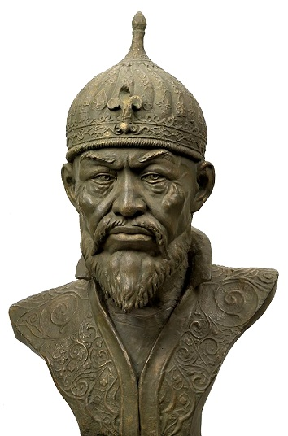
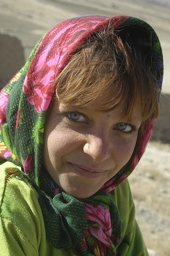
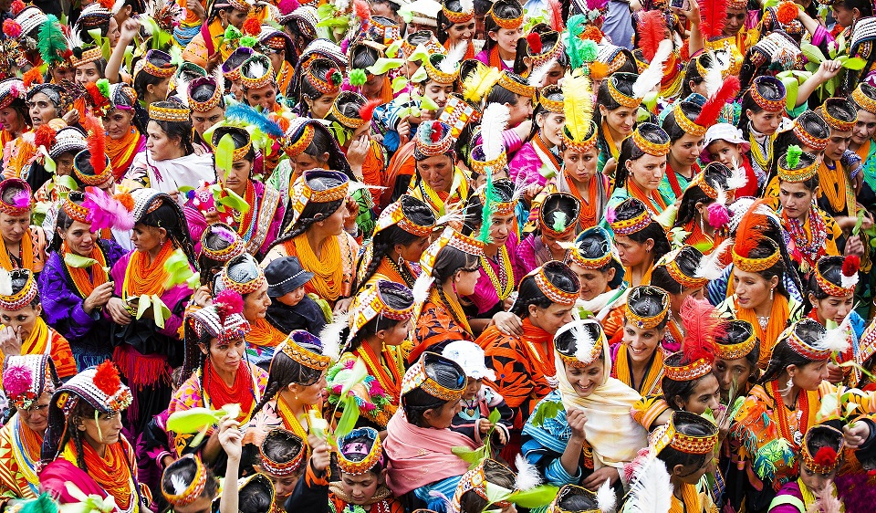
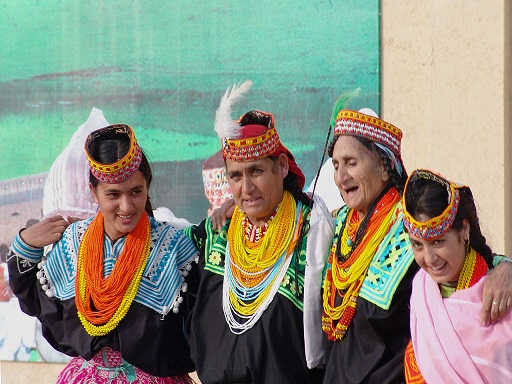

Jest rok 2018 od narodzin Chrystusa. Cały Pakistan został opanowany przez wyznawców religii Proroka… Cały? Nie! Jeden, jedyny Hindukusz, zamieszkany przez nieugiętych Kalaszy wciąż zachowuje swoją starożytną wiarę i odrębność od muzułmańskiej większości zamieszkującej resztę kraju, na czele z miastami takimi jak Karachi czy Islamabad. Ta parafraza wstępu do komiksowych historii o Asteriksie i Obeliksie jest w tym wypadku bardzo zasadna. W przeciwieństwie jednak do Galów, którzy koniec końców ulegli najeźdźcom znad Tybru, Kalasze przetrwali do dzisiaj, choć są cieniem tego, jak sprawy miały się w przeszłości.

Zaraz, zaraz, ale jacy Kalasze? Już spieszę z odpowiedziami.

Mianem tym określa się grupę zamieszkującą pakistańską część Hindukuszu. Region ten, to prawdziwy mikrokosmos. Dość powiedzieć, że po afgańskiej stronie granicy, na terenie zbliżonym powierzchnią do New Jersey, żyje około 20 grup etnicznych posługujących się zupełnie innymi językami. Niedostępne góry poprzetykane kotlinami są dla etnologów tym, czym bursztyny dla badaczy starożytnych owadów - najlepszym środkiem konserwującym. Odnotujmy tylko, że od “Indyjskiego Kaukazu” (jak nazywali ten region starożytni Grecy) odbiły się wojska Aleksandra Macedońskiego, Diadochów, muzułmańskich Arabów i Tamerlana. Lokalsi wielokrotnie odparli najazdy i zachowali swoją religię i kulturę. Z tego powodu islamscy sąsiedzi żyjący na nizinach nazywali miejscową ludność “Niewiernymi” (Kafir) a ich ziemie określali jako Kraj Niewiernych (Kafiristan).

Niedostępność regionu i opowieści o okrucieństwie jego mieszkańców skutecznie odstraszały. Wspominał o nich Marco Polo, pisząc “są bałwochwalcami i totalnymi dzikusami, żyjącymi z tego co upolują i noszącymi skóry zabitych bestii”. Ten niezbyt poprawny politycznie opis nie był jednak daleki od prawdy - Kafirzy faktycznie nie znali rolnictwa i odziewali się w skóry. Kolejny kontakt między człowiekiem Zachodu a Kafirami miał miejsce dopiero pod koniec XVIII wieku. Niejaki Alexander Gardner dwa razy odwiedził ich ziemię i pozostawił po sobie zapiski, które odziedziczył brytyjski poseł Burnes (też Aleksander), który jednak zginął w trakcie walk w Afganistanie. Zapiski Gardnera zaginęły razem ze śmiercią Burnesa, ten drugi jednak poczynił notatki, które przetrwały. Wspominają one o zwyczajach Kafirów, takich jak chowanie zmarłych w trumnach, pozostawianych następnie na otwartym powietrzu, sprzedawaniu córek za cenę zależną od ich rozmiarów czy ssaniu sobie sutków przez mężczyzn na zgodę, jako symbol zakończenia konfliktu.

Brytyjczycy, poszerzający wpływy w Azji, zainteresowali się wówczas Krainą Niewiernych, zwłaszcza, że ich główny konkurent, Rosja, podporządkowywała sobie właśnie sąsiednią Azję Środkową. W wyniku tego wysłali porucznika McNeil’a do Kafiristanu z misją rozpoznania terenu. Misja nie przyniosła wiele pożytku, aczkolwiek McNeil odnotował na przykład, że Kafirzy uważają zabijanie muzułmanów za chwalebny czyn i składają ofiary swoim bogom. Prawdziwym odkrywcą Kafirów dla ludzi Zachodu był jednak George Robertson. Początkowo wydawali mu się totalnymi dzikusami niezdolnymi do uczuć wyższych, ale z czasem dał sobie sprawę, że agresja i niechęć przy pierwszych spotkaniach wynikała z chęci ochrony wspólnoty. Gdy już trochę ich poznał okazywali się być jak najbardziej ludzcy, aczkolwiek wciąż czujni i gotowi do walki. Zauważył istnienie podziału na wiele plemion posługujących się odrębnymi językami i mających inne zwyczaje i wierzenia. Odnotował też, że część Kafirów żyje pod panowaniem muzułmańskich władców - na przykład grupa znana jako Kalasze.

Robertson szukał wojowników, toteż olał Kalaszy i osiedlił się wśród plemienia znanego jako Kam. Miejscowi mężczyźni byli nabuzowani testosteronem do tego stopnia, że nie potrafił on wytłumaczyć im co to znaczy być grubym. Żyli z wojny i najazdów na muzułmańskich sąsiadów. Gdy akurat nie wyprawiali się na wroga, toczyli krwawe spory między sobą. Najważniejszą rzeczą był honor, rozumiany jako gotowość do zabijania i zostania zabitym. Co ciekawe, Kam darzyli Brytyjczyków sympatią i opowiadali np. historię o Giszu, bogu wojny, który miał się osiedlić w Londynie. Robertson wspominał również o tańcach na pogrzebach i potwierdzał zwyczaj pozostawiania trumien na otwartym powietrzu. Konkluzja jego raportu była jednak taka, że nie ma sensu tykać Kafirów. Pozbawieni w ten sposób brytyjskiej protekcji stali się łupem dla afgańskiego szacha, który w 1895 rok ogłosił świętą wojnę przeciwko niewiernym. Korzystając z brytyjskiej broni palnej, zajął afgańską część Kafiristanu i postawił miejscowych przed prostym wyborem - przejście na islam lub śmierć. Według opowieści miejscowych, kamienie, na których dokonywano egzekucji tych, którzy wybrali bramkę numer 2, są do dzisiaj pokryte krwią.

Aby uczcić wielkie zwycięstwo islamu, afgański Kafiristan przemianowano na Nuristan - kraj światła. Wojowniczy lokalsi zyskali sławę nieustępliwych wojowników islamu. I tak na przykład Nuristan, jako pierwszy region ogłosił świętą wojnę przeciwko komunistom. Współcześnie jest on wylęgarnią talibów, punktem kontaktowym między afgańskimi i pakistańskimi dżihadystami oraz centrum oporu przeciwko świeckim władzom. Koniec afgańskich Kafirów nie był jednak końcem Niewiernych w ogóle. Pogardzani przez Robertsona pakistańscy Kalasze (opisywał ich, jako lud niewolników i sług) przetrwali, choć jest ich już tylko około 4 tysięcy. Nie są jednak zupełnie anonimowi. Zainteresowanie wzbudza nie tylko ich religijna odrębność, ale także bardzo europejski wygląd. Kalasze mają bowiem jasną skórę, proste włosy (zdarzają się blondyni i rudzi) oraz jasne oczy. Gdy w 1839 roku brytyjski wysłannik Macnaghten miał spotkać Kalaszów, usłyszał od Pasztunów: “nadchodzą Twoi krewniacy”.

Podobieństwa nie kończą się na wyglądzie. W przeciwieństwie do sąsiadów Kalasze witają się uściskiem dłoni i siadają na krzesłach, a nie dywanach. Kobiety noszą kolorową odzież i nie zasłaniają twarzy. Kolejną kwestią jest język. Dialekty Niewiernych (byłych i obecnych) są częścią indoeuropejskiej rodziny językowej. Brytyjczycy zaczęli spekulować, że Kafirzy to potomkowie żołnierzy Aleksandra Wielkiego. To bardzo spodobało się samym zainteresowanym. W pewnym momencie Grecy uznali ich za jedno z zagubionych plemion Hellady i zaczęli wspierać finansowo. Co ciekawe za ciosem poszli Macedończycy, rywalizujący z Grekami o to, do kogo “bardziej” należy dziedzictwo Aleksandra i kto jest jego prawowitym spadkobiercą. Za pieniądze z bałkańskich datków udało się na przykład zbudować szkołę i muzeum. Jakkolwiek w tych opowieściach może tkwić ziarnko prawdy (wszak na terenach współczesnego Afganistanu i Pakistanu faktycznie istniały helleńskie królestwa, a grecka kultura cieszyła się prestiżem jeszcze długo po nich), to wydaje się, że faktycznym źródłem tych podobieństw jest fakt, że grupy Indoeuropejczyków opuszczając matecznik (za jaki uznaje się stepy nadkaspijskie) rozproszyły się na wszystkie strony świata.

Wiemy o osadnictwie w Europie, na Bliskim Wschodzie, Azji Środkowej, Persji i północy Indii. Z wykopalisk w Zachodnich Chinach dowiadujemy się z kolei o osadnictwie Indoeuropejczyków na obszarach współcześnie będących częścią pustyni Taklamakan. Znalezione tam szkielety mają rude włosy i datuje się je na około 2 tysiące lat przed Chrystusem. Dużo późniejsze dzieła sztuki zdradzają obecność jasnoskórych postaci z jasnymi oczyma i bujnym zarostem. W świetle tych odkryć wydaje się, że jakaś grupa Indoeuropejczyków osiedliła się w okresie wielkich migracji na terenach Hindukuszu i z racji izolacji nie wymieszała się tak mocno z sąsiadami, jak to miało miejsce w przypadku reszty ich krewniaków w Iranie, Tocharystanie czy Indiach. Górskie szczyty i mała atrakcyjność terenów, na których żyli Kafirowie sprawiła, że Kalasze zachowali swoje starożytne wierzenia. Europejscy goście początkowo wrzucili je do worka z napisem “animizm”, ale współcześni badacze są zdania, że powinno się tutaj mówić raczej o archaicznej formie czegoś co dzisiaj określa się mianem hinduizmu. A raczej indoeuropejskiego substratu tego zbioru wierzeń i filozofii.

Wielu badaczy, w tym Witzel, uważa, że wierzenia Kalaszów, to pi razy drzwi religia Ariów sprzed transformacji jakie zaszły, gdy zmieszała się ona z wierzeniami rdzennych mieszkańców subkontynentu (w przypadku Ariów Indyjskich) i płaskowyżu (w przypadku Ariów Irańskich). Poglądy te zdaje się potwierdzać intuicja muzułmańskich sąsiadów, którzy matecznik Kafirów ochrzcili mianem Hindukuszu, co jest tłumaczone na “zabójcę Hindusów” (aczkolwiek tutaj wskazuje się, że nazwa taka może równie dobrze wywodzić się z faktu, że w region ten uciekało wielu niewolników z subkontynentu i następnie ginęło z uwagi na trudne warunki). Kalasze wierzą w wielu bogów, duchy i nadprzyrodzone istoty. W przeszłości, gdy plemion praktykujących tradycyjną religie było więcej, wielu bogów było lokalnymi bóstwami, czczonymi tylko w określonym miejscu. Zazwyczaj jednak wyróżniają stworzyciela - najwyższego Boga (coś co my nazwalibyśmy henoteizmem). Występuje on pod różnymi nazwami: Imra, Mara, Dezau, Dezauhe czy Khodai. Bóg otoczony jest wieloma bogami, półbogami, manifestacjami i awatarami. Badacza uważają, że panteon Kalaszy to jeden z ostatnich żywych przejawów starożytnych wierzeń indoeuropejskich, które w innych regionach świata zostały wchłonięte przez różne odłamy chrześcijaństwa, islamu, buddyzmu czy wierzeń chińskich, bądź zmieszały się znacząco z wierzeniami podbitych ludów (religie mazdaistyczne i hinduizm).

Wśród ważniejszych bogów panteonu wymienia się Warendra - boga niebios i piorunów. Powszechnie identyfikuje się go z hinduskim Indrą. Jego awatarem/emanacją jest Balumain, który nauczył Kalaszy jak świętować Chaumos (zimowe święta). Balumain ma jakoby pochodzić ze starożytnej ojczyzny wszystkich Kafirów. Kolejnym ważnym bogiem jest Munjem - król Środkowej Ziemi. Poważnym graczem jest także Mahandeo - bóg obfitości i przedstawiciel stworzonego świata w kontaktach z Bogiem (przez duże “B”). Główną boginią jest Jestak, pani domowego ogniska i opiekunka małżeństw. Oprócz bóstw, szczególną czcią otacza się wróżki, które mogą podzielić się z ludźmi nadprzyrodzonymi mocami. Wróżki żyją w najwyższych partiach gór i każdy, kto chce być kapłanem, musi spędzić jakiś czas wśród nich, aby nasiąknąć ich magią. Szwarccharakterem zaś, jest demoniczny Jestan, który pojawia się na ziemi pod postacią bestii podobnej do psa. Walczy on z bogami, którzy od czasu do czasu cisną w niego jakąś kometą.

To wszystko co napisaliśmy w poprzednim akapicie to bardziej próba niż akuratny opis. Nie jest to zorganizowana i zinstytucjonalizowana religia - wierzenia są bardzo płynne i nie ma koherentnego wykładnika, który stawiałby granice między “herezją” a “ortodoksją”. Religia Kalaszy, to raczej rytuały, festiwale oraz luźne zbiory wierzeń, czarów i nadprzyrodzonych opowieści. Instytucja kapłanów przestała istnieć w pierwszej połowie XX wieku. Dzisiaj prowadzącymi ceremonie i obrzędy są szamani lub starsi danej wspólnoty. Bogowie mają swoje kapliczki, przy których składa się im ofiary z kóz, koni, krów i owiec. Ważną rolę odgrywa rytualna czystość, którą regulują szczegółowe przepisy. I tak na przykład, kobiety w trakcie menstruacji bądź blisko rozwiązania uważane są za nieczyste. Przed ważnymi rytuałami nie wolno również dotykać psujących się rzeczy, przebywać z umierającymi i wchodzić w kontakt z muzułmanami i przybyszami z zewnątrz. Wszystkie te rzeczy są w zasadzie nieuniknione, toteż właściwy rytuał poprzedzają obrzędy oczyszczające. Wierzenia Kalaszy w tym temacie są bardzo podobne do tych opisanych w Wedach i Aweście. W tym kontekście ciekawe jest na przykład wiązanie kruków ze zmarłymi przodkami i karmienie ich tylko za pomocą lewej ręki (kruków, nie przodków).

Najhuczniej obchodzonymi świętami są Chilam Joshi (w połowie maja), Uchau (jesień) i Chaumos (zima). To ostatnie święto jest powszechnie uważane za najważniejsze. Trwa ono aż dwa tygodnie, mniej więcej od 7 do 22 grudnia. W jego trakcie celebruje się koniec prac rolnych i zbiorów. Odbywają się tańce, imprezy muzyczne i masowe ofiarowania zwierząt. Wierzy się, że Balumain opuszcza wówczas krainę bogów i dołącza do szeregowych wyznawców. Z racji obecności boga w obchodach święta udziału nie mogą wziąć ludzie, którzy nie odprawili stosownych rytuałów oczyszczenia. W trakcie święta składa się także ofiary przodkom. Służy temu specjalny rytuał, w którym dorośli mężczyźni oddają hołd młodym chłopcom (będących wcieleniami przodków), a ci formują “węża” i przemierzają wioskę. Część mężczyzn śpiewa nabożne pieśni, a druga część obsceniczne i wulgarne. W tym samym czasie kobiety przebierają się za mężczyzn, a mężczyźni za kobiety (Balumain jest jednocześnie uważany za kobietę i mężczyznę). Rytuałów i zwyczajów jest mnóstwo i nie bardzo mamy tu miejsce żeby je wymieniać. Warto jednak wspomnieć, że w trakcie Chaumos odbywa się turniej gry znanej Chikik Gal, w którym udział biorą reprezentacje poszczególnych wiosek. Gra polega na rzucaniu i zrzucaniu piłki na/z ośnieżonych stoków.

Jak już wspomniałem, Kalaszy współcześnie jest już tylko cztery tysiące. Przez lata byli oni dyskryminowani i na różne sposoby “zachęcani” do przejścia na islam. Zdarzały się nawet zbrojne ataki i zabójstwa (które jednak, warto zaznaczyć, spotykały się z potępieniem pakistańskich rządzących i oficjalnych muzułmańskich organizacji religijnych). Wielu Kalaszy, ze strachu lub chcąc poprawić swój byt, przechodziła na islam. Przy starych wierzeniach została garstka ludzi zamieszkujących najbardziej niedostępne regiony. Polepszająca się infrastruktura otwiera na świat nawet te miejsca. Islam jest generalnie na najlepszej drodze do wyparcia tradycyjnych wierzeń. Pakistan był od początku pomyślany jako muzułmańskie państwo i kolejne rządy promują tę religię, jako element scalający bardzo zróżnicowaną mieszankę etniczną. Organizacje muzułmańskie zapewniają także edukację, wsparcie finansowe i opiekę zdrowotną. To czego ani Tamerlan, ani kolejni muzułmańscy władcy nie osiągnęli siłą, stanie się niedługo rzeczywistością dzięki szkołom, stołówkom i bieżącej wodzie. Szanse na to, że pakistański Asteriks przetrwa próbę czasu są raczej nikłe.
