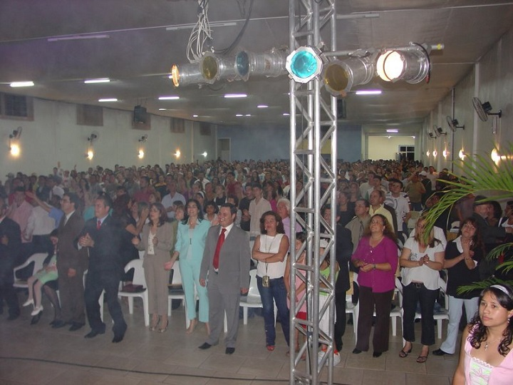

Każdy, kto jakoś tam śledzi dyskusje religijne i okołoreligijne na vikop.ru zauważył pewnie, że jedną z ulubionych czynności internetowych apologetów katolicyzmu jest, w reakcji na argumenty o sekularyzacji krajów szeroko rozumianego Zachodu, rzucanie statystykami pokazującymi dynamiczny rozwój chrześcijaństwa w krajach tzw. Globalnego Południa (Ameryka Łacińska, Afryka i południowa Azja). Często łączy się to z narracją “śmierci Zachodu” co to “wyparł się swojej wiary” więc teraz czeka go powolne zdychanie pod islamskim/lewackim butem (zależy od skrzywienia ideologicznego). O ile ze “śmiercią Zachodu” ciężko dyskutować (bo to w zasadzie wróżbiarstwo), o tyle rzeczonym statystykom i ich implikacjom warto się przyjrzeć, ponieważ pokazują rzeczy bardzo ciekawe i niekoniecznie wygodne dla wizji promowanej przez osoby, które nimi szafują na lewo i prawo. Nie będę tutaj jeszcze zadawał pytań o to czy statystyki religijne faktycznie coś znaczą - to zrobię w innym odcinku. Wyszło mi sporo tekstu dlatego zdecydowałem się podzielić go na dwie części. Pierwsza dotyczy rzeczonego wzrostu liczby chrześcijan, a druga reakcji i (być może) daleko idących konsekwencji dla tej religii.

Kluczem do zrozumienia tego tekstu jest słówko “pentekostalizm”. Historycznie było to protestanckie wyznanie należące do nurtu ewangelikalnego, którego początki datuje się na 1901 rok i umiejscawia w USA. Pentekostalizm od początku stawiał na ekstatyczne doznania - modlitwa językami, chrzest w Duchu Świętym, spoczynek w Duchu i inne takie. Nawoływał do moralnego rygoryzmu i ascetyzmu. Bardzo ważna była również wierność Biblii (oczywiście w odpowiedniej interpretacji) i przeciwstawienie się zepsuciu świata. To był tzw. pentekostalizm pierwszej fali. Druga zaczęła się w latach 50. XX wieku i wiązała się z przenikaniem form pentekostalnej religijności do innych kościołów chrześcijańskich, w tym do katolickiego, gdzie pojawiła się Odnowa Charyzmatyczna. Trzecia fala, zwana neopentekostalizmem, narodziła się w latach 80. XX wieku i polegała na pojawieniu się organizacji podenominacyjnych na dużą skalę. Odrzucają one różnice międzywyznaniowe, ponieważ ich zdaniem chodzi o przeżywanie działania Ducha Świętego. W wersji pentekostalnej oznacza spektakularne znaki, cuda, uzdrowienia, egzorcyzmy, uwolnienie od nękań diabelskich, omdlenia, ataki histerycznego śmiechu i konwulsje. Ogólnie - ma być ekstatycznie, żywo, boży Duch wypełnia wiernych i robi niesamowite szoł.

Pentekostalizm szybko zyskał na popularności w samych USA, gdzie rozwijał się nie tylko w formie odrębnych kościołów, ale także (a raczej głównie) w ramach już istniejących. Tutaj pojawia nam się pewien problem definicyjny - ciężko bowiem wskazać ostre granice między pentekostalizmem a innymi przejawami nurtu ewangelikalnego (historyczny pentekostalizm był subem ewangelikalizmu). Stąd często używa się tych pojęć zamiennie, gdyż mocno się one przenikają. Ja również będa tak robił i mam nadzieję, że nikt się nie przyczepi. Oczywiście różne grupy mają różne stopnie nasilenia praktyk pentekostalnych, ale da się wskazać pewien rdzeń, który bardzo pobieżnie opisaliśmy powyżej. Pentekostalizm/ewangelikalizm odcisnął się na starszych wyznaniach, jak kościół anglikański, luterański czy katolicki. W przeciągu stu lat nurt ten napędzany “Duchem Świętym” stał się największym odłamem chrześcijaństwa w USA. Z badań PEW wynika, że w 2014 roku 25,4% Amerykanów deklarowało się jako ewangelikalni chrześcijanie, podczas gdy katolików i tradycyjnych protestantów jest odpowiednio 20,8% i 14,7% (spadek z 23,9% i 18,1% w 2007 roku). Ewangelizacyjny zapał nie zatrzymał się jednak na El Paso. Misjonarze zanieśli nowe formy religijności i swoje kościoły także do Ameryki Łacińskiej i odnieśli tam (a raczej wciąż odnoszą) oszałamiający sukces.

Miażdżąca większość protestantów w Ameryce Łacińskiej to ewangelicy. W wielu krajach nie stosuje się nawet nazwy “protestantes” tylko “evangelicos” z racji tego, że tradycyjnych protestanckich denominacji w zasadzie tam nie ma, albo są silnie poddane wpływom ewangelikalnym. Region jest powszechnie uważany za bastion katolicyzmu - zamieszkuje go około 425 milionów katolików co stanowi 40% światowej populacji wyznawców tego kościoła. To się jednak zmienia, co znakomicie ilustruje demografia największego katolickiego kraju świata - Brazylii. Według PEW w 1970 roku 92% Brazylijczyków było katolikami, a 5% protestantami. W 2010 procent katolików spadł do 65%, a protestantów zwiększył się do 22%. Według badań Instituto Datafohla, w latach 2014-2016 liczba katolików spadła o kolejne dwa miliony. Z danych historycznych wynika, że do lat 60. XX wieku ponad 90% mieszkańców Ameryki Łacińskiej było katolikami. Dzisiaj według badań PEW jest to 69% i cały czas spada. Dodajmy, że zmiany te zachodzą bardzo szybko. 84% obecnych mieszkańców Ameryki Łacińskiej zostało wychowanych w katolicyzmie (ostało się wspomniane 69% - spadek o 15 punktów procentowych w jednej generacji). W przypadku protestantów 9% zostało wychowanych w protestanckiej rodzinie, a protestantyzm wyznaje obecnie 19% mieszkańców regionu. Z kronikarskiego obowiązku odnotujmy, że wzrosła również liczba osób niereligijnych - z 4 do 8%.

Największy udział katolickich apostatów jest w Kolumbii - 74% obecnych protestantów wychowało się w katolicyzmie. Dalej mamy Paragwaj (68%), Peru (66%), Ekwador (62%), Boliwię (60%), Wenezuelę (56%), Argentynę (55%), Brazylię (54%), Nikaraguę (50%), Dominikanę (48%), Meksyk (44%), Kostarykę (40%), Salwador i Portoryko (38%), Urugwaj (37%), Chile (30%), Honduras (26%), Gwatemalę (23%), a stawkę zamyka Panama (15%). Warto dodać tutaj dwie rzeczy. Niski procent nie oznacza, że protestantów jest mało - często jest to objaw tego, że jest ich dużo i teraz tendencja porzucania katolicyzmu na rzecz protestantyzmu wyhamowuje. W Panamie 25% społeczeństwa to protestanci. W Gwatemali 44%, a w Hondurasie 39%. Ponadto trend ten jest widoczny także wśród Latynosów w USA (47% protestantów w tej grupie wychowano w katolicyzmie). Wśród latynoskich Amerykanów udział katolików sukcesywnie spada - według Gallupa między 2008 a 2014 rokiem nastąpił spadek z 58% na 54%. W tym samym czasie protestanccy latynosi w USA zanotowali drobny wzrost z 27% na 28%.

Czemu latynoscy katolicy przechodzą na protestantyzm w tak dużych ilościach? Pytani o to przez badaczy PEW udzielali różnych odpowiedzi (można było wskazać na więcej niż jedną przyczynę). Najwięcej, bo aż 81% wskazuje na to, że szukali sposobu aby zbliżyć się do Boga. 69% podaje także, że bardziej podobają im się nabożeństwa w nowym kościele. 60% pragnęło większego skupienia na moralności. 59% mówi, że ich protestancka wspólnota bardziej pomaga swoim członkom. 20% podaje, że pomogło im to rozwiązać osobiste problemy, 14%, że zrobili to z przyczyn finansowych a 9% z uwagi na ślub z osobą niebędącą katolikiem. Zdaniem socjologów potężna popularność ewangelikalizmu/ pentekostalizmu jest efektem wiary w powszechność boskich interwencji w życie wierzących - od załatwienia pracy i podwyżki, przez wypędzenie demonów i uzdrowienia ze śmiertelnej choroby (a nawet wskrzeszenia) do bezpośredniego “dotknięcia Boga” (osiągnięcia stanu ekstazy objawiającego się tzw. mówieniem językami, prorokowania, histerycznego śmiechu etc.). Jest to o wiele bardziej sugestywne i lepiej odpowiada potrzebom mas - zwłaszcza w krajach trzeciego świata, gdzie wiecznie brakuje pieniędzy, wskaźnik przestępczości jest wysoki, a państwo i zapewniane przez nie usługi (będące standardem w rozwiniętych krajach) są na śmiesznym lub żadnym poziomie.

Pentekostalizm/ ewangelikalizm święci triumfy nie tylko wśród Latynosów. Wzrost udziału chrześcijaństwa w krajach Azji i Afryki to również w dużej mierze jego sprawka. Według PEW w Afryce Subsaharyjskiej (tzw. Czarna Afryka) w roku 2005 żyło około 410 mln chrześcijan. 17% z nich to katolicy (wzrost z 13% w 1970) 29% to “inni” (wzrost z 15% w 1970 roku). Liczbę zwolenników denominacji pentekostalnych szacuje się na około 110 milionów. W przypadku Azji liczba ta jest jeszcze wyższa - denominacje pentekostalne mają oko 140 milionów zwolenników. Ich największymi skupiskami są Indie, Filipiny i Indonezja, czyli kraje mające historycznie ukonstytuowane wspólnoty chrześcijańskie. Tutaj również grupy ewangelikalne bazują w dużej mierze na przyciąganiu ludzi będących już chrześcijanami (przynajmniej nominalnie). Jeśli chodzi o Chiny, które wykopowi apologeci szczególnie sobie upodobali, to tam sprawy mają się nieco inaczej. Przede wszystkim brak dobrych statystyk, bo państwo to jest bardzo restrykcyjne w stosunku do związków religijnych i wiele działa nielegalnie lub na wpół legalnie. Nieoficjalne dane są bardzo różne od siebie. Grupy misjonarskie podają czasem nawet liczbę 100 milionów, ale instytuty badawcze cieszące się większą renomą mówią o około 50 milionach, przy czym miażdżąca większość to protestanci. Według badań, liczba katolików waha się od 3 do 14 milionów, ale najczęściej podawane są liczby w okolicach 9-10 milionów.

W drugiej części poruszymy inny, ale nie mniej (a może nawet bardziej) ciekawy temat - reakcję tradycyjnych protestantów i kościoła katolickiego na eksplozję ewangelikalnego protestantyzmu/postprotestantyzmu.
