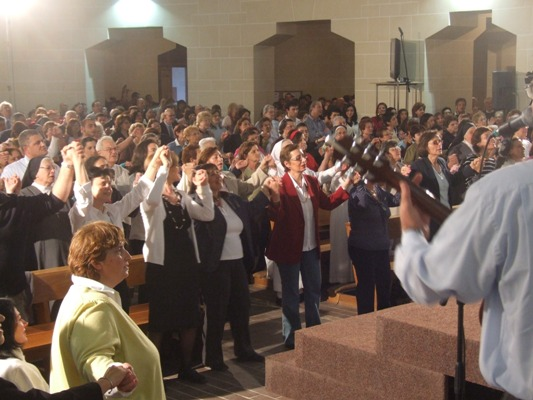

Nurt ewangelikalny/pentekostalny, w przeciwieństwie do wielu swoich poprzedników, nie ogranicza się do “zabierania” wiernych innym chrześcijańskim wyznaniom/religiom czy nawracania nieprzekonanych. Jego potężna popularność zrobiła z niego prawdziwego game changera w chrześcijańskiej religijności. Według badań PEW, liczba ewangelikalnych/pentekostalnych chrześcijan wynosi już około 600 milionów. Ksiądz Kobyliński podaje, że do 2030 roku ma ich być już miliard. Zdaniem biskupa Andrzeja Czai, jeśli liczyć faktycznie aktywnych wyznawców, a nie tylko tych formalnie zadeklarowanych, to ewangelikalizm jest już teraz największą denominacją chrześcijańską (katolików jest oficjalnie około dwa razy więcej, ale dla wielu z nich bycie katolikiem kończy się na zadeklarowaniu katolicyzmu w spisie/badaniu). Warto dodać, że podana przed chwilą liczba uwzględnia tylko osoby należących formalnie do wyznań uważanych za pentekostalne/ewangelikalne. Tymczasem mamy około 200 milionów ludzi, którzy choć konfesyjnie nie są ewangelikalni to... jednak są. Wspominałem już o pentekostalizmie drugiej fali, który przeniknął z w/w cechami religijności do innych kościołów chrześcijańskich. I efektami tego zajmiemy się w tej części.

Wielu liderów tradycyjnych wyznań (katolickich i protestanckich) wręcz zachęcało do adaptacji pentekostalizmu. Złośliwi powiedzą, że stało się tak, gdyż przestraszyli się masowego odpływu wiernych i widzieli w “nowej” formie religijności szansę na aktywizację swoich wspólnot. Hierarchowie i liderzy robią jednak dobrą minę i twierdzą, że w ich teologii da się znaleźć dobre uzasadnienia dla przynajmniej niektórych praktyk ewangelikalnych/pentekostalnych. Jak widzicie z poprzedniej części, gra jest warta świeczki, bo mówiąc językiem marketingu - jest to top trend. Zwłaszcza w krajach trzeciego świata, czyli w zasadzie jedynych miejscach, gdzie udział chrześcijan w populacji zwiększa się. Pastorzy i liderzy grup pentekostalnych/neo dostrzegli w tym dużą szansę dla promocji swoich praktyk i wielu z nich działa w ramach starszych wyznań - mimo tego, że początkowo ruch ten był bardzo antykatolicki. Inwazja pentekostalnych tendencji na inne wyznania zaczęła się w USA w latach 50. XX wieku od kościołów episkopalnych (anglikanie w USA) i prezbiteriańskich. W latach 60. dotarły one także do kościoła katolickiego. Ruchy charyzmatyczne oficjalnie trzymają się zasad i tradycji swoich macierzystych wyznań, ale w praktykach nie różnią się jednak za wiele (albo i wcale) od swoich kuzynów, którzy działają w denominacjach oficjalnie pentekostalnych. Wywołuje to liczne kontrowersje i polemiki.

W Ameryce Łacińskiej, która jako pierwsza doświadczyła na masową skalę wspomnianego w poprzedniej części boomu, liczbę “charyzmatyków” (czyli osób zaangażowanych w grupy/ruchy kopiujące/czerpiące z pentekostalizmu) PEW szacuje na 80 milionów. Są to w miażdżącej większości katolicy. Ruch Katolików Charyzmatycznych jest, zdaniem wielu badaczy, jedynym nurtem katolicyzmu wciąż zdolnym do mobilizowania milionowych rzesz wyznawców, wśród różnych grup katolickich w Ameryce Łacińskiej. Co więcej, ruch ten ma zapał misyjny i podejmuje rękawicę rzuconą przez protestantów. Czym się charakteryzuje? Ano, jest w zasadzie kalką ewangelikalizmu/pentekostalizmu - nieprzypadkowo pierwsi katoliccy charyzmatycy w USA i Ameryce Łacińskiej nazywali się Pentekostalnymi Katolikami (Pentecostal Catholic). Głosi on konieczność odnowienia wiary poprzez działanie Ducha Świętego, który jakoby pobudza wiernych do przeżywania ekstaz, prorokowania, uzdrawiania etc. Podstawą jest tak zwany chrzest w Duchu Świętym, w którym wierzący otrzymuje dary Ducha, takie jak mówienie językami czy uzdrawianie.

Od protestanckich kuzynów różni ich mniejszy nacisk na literalne interpretacje Biblii, aczkolwiek takie tendencje również występują. Od mainstreamu katolickiego różni ich z kolei potężny nacisk na powszechność cudów i ekstatyczne doświadczenia. Pytanie czy w ogóle można mówić o mainstreamie w kontekście Ameryki Łacińskiej. Badania socjologiczne pokazują, że ponad połowa wiernych w Brazylii i Gwatemali to właśnie katolicy charyzmatyczni (w obydwu krajach jest to prawie 60%). W Ameryce Łacińskiej żyje ogółem 74 miliony charyzmatyków katolickich, co oznacza, że prawie co piąty katolik jest tam charyzmatykiem. Jeśli odliczyć “kulturowych katolików” proporcje te jeszcze się zwiększą. Może okazać się, że “mainstream” i charyzmatycy zamienią się u Latynosów miejscami. Zwłaszcza, że ci drudzy przyciągają najbardziej aktywnych wyznawców - 80% charyzmatyków katolickich przed zostaniem nimi działało aktywnie w kościele. Watykan szacuje, że około 120 milionów katolików na świecie to właśnie charyzmatycy. Nie jest to jednak zjawisko zredukowane do kościoła katolickiego. W Afryce, oprócz 110 milionów wiernych, którzy należą do pentekostalnych/ewangelikalnych denominacji, jest jeszcze 40 milionów charyzmatyków z innych wyznań. W Azji oprócz 140 milionów “oficjalnych” jest jeszcze 25 milionów charyzmatyków.

Czy ruchy charyzmatyczne w ramach innych denominacji, to ich pentekostalizacja, czy na odwrót? Oczywiście wiele zależy od denominacji i miejsca, ale w przypadku latynoskiego kościoła katolickiego, Luis Lugo, dyrektor PEW Forum nie ma wątpliwości co do tego, że “pentekostalizm nie jest już czymś, co leży poza kościołem rzymskokatolickim. Jest mocno wbudowany w różne formy tendencji i ruchów charyzmatycznych”. W bardzo podobnym tonie wypowiada się katolicki specjalista od religijności latynoamerykańskiej- Andrew Chesnut. Budzi to kontrowersje wśród wielu tradycyjnie zorientowanych teologów i grup katolickich. To właśnie wpływom pentekostalizmu, kładącego nacisk na ciągłe działanie demonów chcących zguby wiernych, przypisuje się coś takiego jak “Egzorcyzmy Narodowe”- pierwsze w katolickiej historii odbyły się w 2015 roku w Meksyku (polskie odbyły się w roku 2016). Jak zauważa bp Czaja, nigdy przedtem w prawie 2k letniej historii KK nie egzorcyzmowano całego kraju czy danego narodu. Obawy budzi również powiązana z pentekostalizmem/ewangelikalizmem Ewangelia Dobrobytu głosząca, że Bóg zapewnia swoim umiłowanym wyznawcom sukces materialny i szczęście w życiu doczesnym, co stoi w jawnej sprzeczności z wcześniejszymi naukami katolickimi i wieloma protestanckimi.

Generalnie problematyczne dla krytycznie nastawionych katolików (i tradycyjnych protestantów) jest mocno akcentowane zorientowanie na rozwiązywanie przez religię problemów doczesnych. Tłumaczy to sukces jaki nurt ten odnosi w krajach Trzeciego Świata, gdzie ludzie często rozpaczliwie poszukują nadziei na poprawę swojego położenia i nie interesują ich bardziej abstrakcyjne elementy religii - bóstwo ma załatwić pracę lub podwyżkę, uchronić przed szwadronami śmierci czy łowcami kości słoniowej, uzdrowić z choroby (bo najbliższy szpital to 100 km drogi przez dżunglę), a tym lepiej sytuowanym dostarczyć ekstatycznego przeżycia, którego tradycyjni protestanci czy katolicy nie są w stanie zaoferować. Zarówno badacze jak i krytycy uważają, że trzecioświatowy pentekostalizm zawiera w sobie wiele schrystianizowanych wierzeń ludowych, często przedchrześcijańskich. Religijność taka jest nastawiona na osobiste doświadczenia i namacalne korzyści. Polski religioznawca, Andrzej Migda twierdzi, że pentekostalizm w krajach Globalnego Południa ma wiele podobieństw do starszego lokalnego szamanizmu - kwestionuje naukowe podejście do świata, przedstawia wizję, w której jest on pełen duchów i mocy, które mogą być szkodliwe jeśli nie odprawi się stosownych rytuałów. Zaskarbienie sobie przychylności bóstwa jest z kolei kluczowe aby mieć powodzenie nie tylko w życiu pozagrobowym, ale i doczesnym.

Jeśli chodzi o katolicyzm to kontrowersje budzi również tak zwana spowiedź furtkowa i związane z nią pojęcie grzechu pokoleniowego. Są one promowane przez niektóre ruchy charyzmatyczne w ramach katolicyzmu. Spowiedź taka polega na “zamykaniu furtek”, przez które grzechy danej jednostki bądź jej przodków (tzw. grzechy pokoleniowe, które również nie bardzo pasują do tradycyjnego nauczania katolickiego) otworzyły demonom drogę do władzy nad człowiekiem. Sprzeciw budzi też dodawanie do rytu sakramentu spowiedzi modlitwy o uwolnienie, przybierającej czasem formę egzorcyzmu. Zdaniem krytyków podważa to ważność rozgrzeszenia, a ponadto narusza zasadę sakramentów jako dobra kościoła, którego nikt nie może samowolnie zmieniać. Szukanie “furtek” może prowadzić do powtarzania tej samej spowiedzi wielokrotnie, co jest również sprzeczne z katolickim poglądem, że grzechy niewyznane na skutek zapomnienia są również odpuszczone. Ogólnie możliwość demonicznej kontroli i wpływu na życie ludzkie jest często rozdmuchiwana do niebotycznych rozmiarów. Ostrzeżenia przed czytaniem tej czy innej książki, bo otwiera ona drogę szatanowi do atakowania wiernegono i są, zdaniem krytyków, importem z ewangelikalizmu. Przykładów tego, co krytycy uważają za “przemycanie” myśli pentekostalnej do innych wyznań jest bardzo dużo, a my nie mamy tu miejsca aby się wszystkimi zająć.

Tak czy inaczej, zarówno pentekostalizm jak i inspirowane nim charyzmatyczne ruchy rozwijają się bardzo szybko. Entuzjaści twierdzą nawet, że do 2050 roku ewangelikalnych/pentekostalnych chrześcijan będzie tyle, co obecnie muzułmanów. Już dzisiaj odgrywają oni dużą rolę w polityce krajów Ameryki Łacińskiej i niektórych afrykańskich. Jenkins, badający od wielu lat zmiany demograficzne w chrześcijaństwie, uważa za bardzo prawdopodobne, że pentekostalizacja i “trzecioświatyzacja” chrześcijaństwa sprawi, że religia ta (a przynajmniej jej znaczna część) zostanie przemodelowana tak, aby zgadzała się z poglądami i oczekiwaniami ludzi, którzy ją wyznają (wg. prognoz do 2050 roku 80% chrześcijan na świecie będzie żyło w krajach Globalnego Południa). Być może, że przekonanie o tym, że chrześcijaństwo będzie morfować w coś bardziej zbliżonego do filozofii (jak np. duża część buddyzmu na Zachodzie) niż tego, co klasycznie rozumiemy jako religia, nie sprawdzi się. Zamiast tego możemy mieć coraz powszechniejszą wiarę w cuda, złe duchy, grzechy przodków, uzdrowienia, boskie interwencje i literalne czytanie Biblii a coraz mniej teologii a’la scholastycyzm i intelektualnego wysublimowania.

PS. Wiele wskazuja na to, że ci, który z taką radością rzucają argumentami o rozwoju chrześcijaństwa w Azji, Afryce i Ameryce Łacińskiej, zachwalają właśnie marginalizację tego nurtu swojej religii, który tak ukochali. Cóż, Bóg ma dziwne poczucie humoru.
