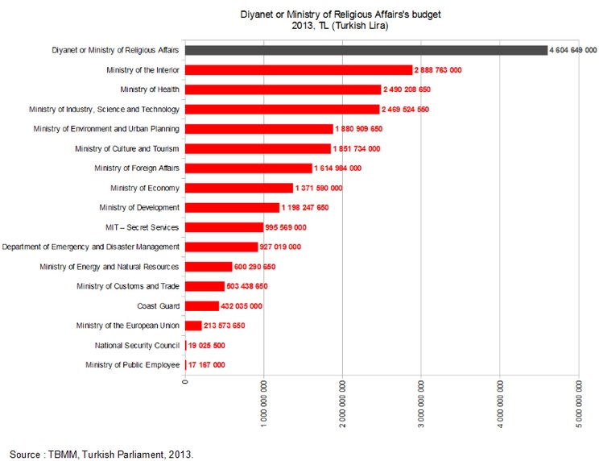
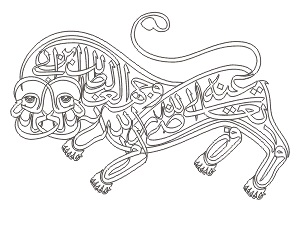
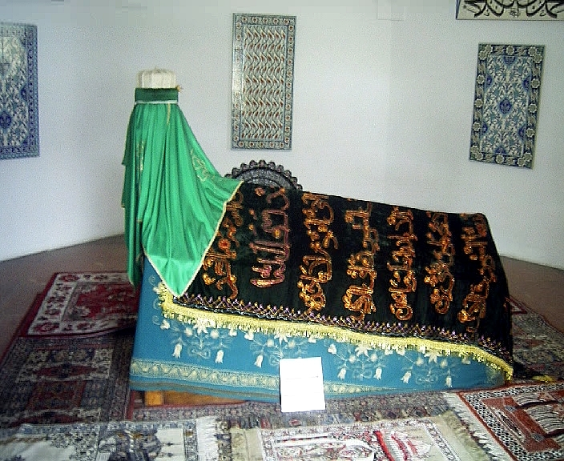

Przeciętny Polak posiada śladową wiedzę o islamie. W sumie islam nie jest jakimś wyjątkiem, bo przeciętny człowiek generalnie wie bardzo mało na tematy związane z religią (nawet, teoretycznie, własną). Nie chodzi tu o wywyższanie się a raczej o fakt (autor też jest przeciętny, ot coś tam słyszał). Przed amerykańską “War on Terror” islam kojarzył się głównie jako religia Turków- sprzedawców skór, kebabów oraz podrabianych fajek i dżinsów. Po pamiętnym 11 września, wojnie afgańskiej, działalności ISIS i medialnych doniesieniach o poczynaniach muzułmańskich imigrantów (bądź ich potomków) w krajach Europy Zachodniej, islam kojarzy się przeciętnemu obywatelowi kraju nad Wisłą raczej negatywnie. Myślę, że stwierdzenie to nie jest jakoś bardzo odważne. Wystarczy mieć odrobinę pecha i wejść w jakieś znalezisko “Inżynierowie coś tam” na głównej stronie serwisu Wypok peeel żeby przekonać się o jego prawdziwości.

Trochę bardziej kumaci wiedzą o sunnizmie, szyizmie, sufizmie czy nawet harydżyzmie. Osób wiedzących o ezoterycznych odłamach jest jeszcze mniej. Kwestia ezoterycznych wyznań jest w ogóle mocno dyskusyjna- wielu muzułmańskich uczonych i sędziów odmawia klasyfikowania ich jako islamskie. Ich podejście bywa bowiem bardzo różne od “mainstreamu” i często- gęsto nosi znamiona wielu wpływów z innych tradycji religijnych. Być może brak świadomości istnienia tych grup wynika również z faktu, że generalnie nie mają one zbyt wielu “followersów” w świecie islamu. Przynajmniej oficjalnie, co może być pokłosiem wyżej wspomnianych wątpliwości co do ich “islamskości”. Pół biedy jeśli ktoś nie jest muzułmaninem w muzułmańskim społeczeństwie. W starych dobrych czasach płacił specjalny podatek i miał spokój. No chyba, że miał pecha nie być członkiem jednego z “Ludów Księgi”- wtedy mógł się nawrócić lub zginąć (choć oczywiście w praktyce różnie bywało). O wiele gorzej gdy ktoś nie jest muzułmaninem a muzułmanina bezczelnie udaje i wykoślawia nauki Mahometa, a co za tym idzie- bluźni boskiemu objawieniu, które Prorok otrzymał.

Turcja nie jest wyjątkiem pod względem podejścia do grup co do których istnieje obawa, że jednak nie są “halal”- aczkolwiek używa dosyć ciekawej taktyki, którą już opisuję. Oficjalnie świecka republika uznaje kilka zorganizowanych religii. Turecki podatnik finansuje tak zwany Diyanet, który jest czymś na kształt ministerstwa do spraw religii. Jego budżet jest jednym z najwyższych spośród wszystkich ministerstw, co widać na załączonym obrazku. Diyanet utrzymuje i buduje meczety, opłaca nauczanie religii, funduje studia teologiczne i wypłaca pensje imamom, którzy są w zasadzie państwowymi urzędnikami. Dinayet wydaje jednak swoje (niemałe) środki tylko i wyłącznie na meczety i instytucje sunnickie a ściślej hanafickie i szafickie (dwie z czterech głównych, sunnickich szkół prawa islamskiego). W świetle oficjalnych danych w sumie nie jest to nic zdrożnego- około 98% mieszkańców to muzułmanie. Udział chrześcijan czy żydów (nie wspominając już o innych) pląta się na pograniczu błędu statystycznego. Problem polega jednak na tym, że państwo tureckie na poziomie federalnym uznaje tylko jedną grupę muzułmanów… sunnitów (obydwie szkoły prawa).

Dane nieoficjalne jakkolwiek zazwyczaj potwierdzają, że ponad 90% mieszkańców Turcji wyznaje islam, to przedstawiają “troszkę” inny obraz religijnej rzeczywistości. Okazuje się bowiem, że od 10 do 25% Turków to Alewici. Mimo tego, że co 10 (lub nawet co 4) Turek to Alewita, grupa ta nie jest nawet oficjalnie uznawana na poziomie federalnym. Nie otrzymuje również żadnych dofinansowań z Diyanetu. Co więcej- władze jak i wielu sunnitów patrzy na nią z podejrzliwością. Alewici są oskarżani (jakże by inaczej) o niemoralność, działalność na szkodę państwa, herezję, pogańskie praktyki a nawet o “politeizm” co stawia ich poza nawiasem o nazwie “Islam”. Fakt, że wielu Alewitów to Kurdowie (której to grupy Republika również stara się nie zauważać) na pewno nie pomaga. Pogardliwym określeniem na Alewitów jest Kyzyłbasz- “czerwony łeb”. Tak zwani 3 x K są z kolei największymi wrogami ojczyzny (Kurd, kyzyłbasz, komunista).

Alewickie wierzenia i praktyki są rzeczywiście odmienne od tych charakterystycznych dla sunnickiej większości. Religioznawcy opisują je jako synkretyczne, heterodoksyjne i ezoteryczne. Ich korzenie sięgają początków islamu jako religii. Określenie “Alewita” pojawia się po raz pierwszy jako zamiennik dla słowa szyita i generalnie oznacza zwolennika Alego. Po śmierci proroka Mahometa doszło do sporów co do tego kto ma przewodzić nowopowstałej ummie (ogół muzułmanów). Część uważała, że powinien to być Ali ze względu na rodzinne związki oraz bliskość z Prorokiem. Spór nie zakończył się po śmierci Alego, który zostawił po sobie potomków- szyici przez długi czas optowali za oddaniem im władzy. Bardzo szybko do politycznego sporu doszedł religijny, bo szyici uznali, że Mahomet przekazał część nauczania tylko Alemu, a ponadto Ali również miał specjalną relację z Bogiem. Sunnickie rozumienie przekazu Proroka byłoby w tym świetle, niepełne. Szyici jednak również nie są zgodni co wchodziło w skład nauk, którymi Mahomet miał rzekomo podzielić się tylko z Alim, a które ten przekazał swoim następcom.

Z tego powodu szyici również podzieleni są na kilka wyznań mających inne przekonania. I teraz nadchodzi moment w którym zdawało się, że wszystko jasne, a okazuje się być na odwrót. Zdaniem wielu badaczy jak i samych zainteresowanych- Alewici nie są szyitami. To znaczy można u nich zobaczyć wiele wpływów szyickich, zwłaszcza imamickich, ale mają także odrębne wierzenia i rytuały, przywodzą na myśl wierzenia wschodniochrześcijańskie, gnostyckie, neoplatońskie i plemienne religie tureckie. Jakby tego było mało to istnieją różne grupy alewickie, które różnią się podejściem do alewickich tradycji i nauczania. Niektóre z nich są bardzo mało sformalizowane i ich przypadku w ogóle ciężko ustalić wierzenia i doktrynę. Inne wspólnoty są bardzo świeckie i powszechny jest w nich brak wiary w nadprzyrodzone, podejście do religii jako metafory i czegoś co kulturowo spaja wspólnotę. Alewici padają przez to często ofiarami oskarżeń o ateizm, co raczej nie nabija im punktów wśród sunnickich sąsiadów. Z tego tytułu rzeczy które będziemy zaraz opisywać niekoniecznie odnoszą się do wszystkich Alewitów i niekoniecznie są tak samo rozumiane.

Główną rolę w wierzeniach alewickich odgrywa Ali. Jest on tutaj nie tylko (i aż) imamem ale czymś w rodzaju wcielenia Boga na ziemi. Mahomet, Ali i Bóg tworzą coś w rodzaju Trójcy, ale nie do końca- Prorok i Imam nie są bowiem tym samym co Bóg. W myśl tradycji alewickiej są oni wcieleniem boskiego światła. Nie jest to zwykłe światło, a próba jego opisania przywodzi na myśl prawosławne rozróżnienie na Boga jako Naturę i Energię- Niestworzone Światło. O ile boska natura pozostaje na dobre poza zasięgiem człowieka, to energia wprost przeciwnie. Człowiek ma z nią współpracować w celu ostatecznego zjednoczenia się z Bogiem. Piszę “z nią” jakby to był inny byt, ale prawosławni uważają, że Bóg jest w pełni obecny w swoich energiach i że jest to po prostu Bóg w działaniu. Alewici uważają zaś, że Światło o którym tu mowa jest stworzone, a zatem nie jest ono dokładnie tożsame z niestworzonym Bogiem. Niektórzy jednak twierdzą, że Alewici często zapominają o subtelnych różnicach między Bogiem a Alim i Mahometem i traktują całą trójkę jednakowo.

Stąd zapewne biorą się oskarżenia o politeizm rzucane często przez sunnitów. Alewici zaprzeczają im twierdząc, że nie rozumieją oni mistycznych nauk jakie przypisują Alemu. Alewici wierzą także, że nieśmiertelna dusza jest swoistą “boską cząstką” i rozumieją to w sposób podobny do prawosławnej i orientalnej nauki o tym, że ludzka dusza jest nosicielem obrazu Boga, który mimo upadku natury człowieka da się, przy odpowiedniej praktyce i współdziałaniu z Bogiem, przywrócić do stanu pierwotnego. W ich naukach pojawia się, przywodzące na myśl gnostycyzm, określenie “Doskonały Człowiek”. Czasem występuje ono jako tytuł Alego lub któregoś z alewickich świętych (których jest niemało), ale ogólnie oznacza ono pierwotną naturę człowieka, nieskażoną odcięciem od boskiego źródła. Tę “kurtynę” zasłaniającą ludzkości prawdę nazywają Zaheri a “prawdziwą rzeczywistość” Bateni. Oskarżenia o pogaństwo i politeizm wynikają ich zdaniem z tego, że sunnici nie są w stanie przedrzeć się przez Zaheri i wejrzeć w Bateni. To z kolei jest nieodzowne aby zrealizować potencjał ludzkiej natury- ludzie, którym udało się to zrobić nazywani są “eren” lub “munevver”. Wybaczcie kolejne odniesienia do wschodniego chrześcijaństwa, ale widać tu wiele zbieżności z prawosławnym prelestem.

W zestawieniu wierzeń alewickich i mainstreamowego islamu ciekawe jest również to, że w tym pierwszym nie występuje motyw Boga jako surowego sędziego, który karze za grzechy. Nie ma także piekła i nieba rozumianych jako krainy niekończących się kar lub nagród. Z drugiej jednak strony istnieją wierzenia na temat złych i dobrych aniołów oraz duchów. Powszechna jest również wiara w nieśmiertelność duszy. Kolejną różnicą w stosunku do większych wyznań islamskich jest podejście do tekstów religijnych. Islam jest bowiem religią która w największym stopniu opiera się na “Świętych Księgach”. Muzułmanie poważają Koran, Biblię, Torę i Psalmy. Większość muzułmanów uznaje ważność wszystkich czterech, ale twierdzą, że ostatnie trzy zostały na pewnym etapie zafałszowane i tylko Koran jest czystym objawieniem. Alewici prezentują raczej chrześcijańskie podejście do tekstów religijnych (wyłączając protestantów i restoracjonistów)- czyli uważają je tylko za część objawienia i jeden z elementów religii a nie jej absolutną i niezbywalną wykładnię.

Alewici są często zdania, że ludzkie interpretacje i pomyłki również wypaczyły treść objawienia zawartego w Koranie. Ponadto wierzą, że zawiera on wiele ukrytych przesłań, których nie da się odczytać jeśli nie zna się tajemnych nauk Mahometa i Alego. Dodatkowo Alewici nie ograniczają się tylko do tych czterech i sięgają również do innych pism. Podobnie jak szyiccy imamici (a w przeciwieństwie do na przykład Zajdytów czy Ismailitów), Alewici uznają Dwunastu Imamów. Dodatkowo uważają, że są oni manifestacjami różnych aspektów wszechświata i kolejnymi wcieleniami Alego. Dwunaste, ostatnie wcielenie przypadnie na czasy mesjańskie, gdy na ziemię powróci Jezus Chrystus i stanie do walki z Antychrystem. To znaczy nie jest tak, że Mahdi (rzeczony dwunasty imam, kolejne wcielenie Alego) dopiero się narodzi- już jest wśród ludzi, ale na razie pozostaje w ukryciu w oczekiwaniu na przybycie Chrystusa i uwolnienie się Antychrysta.

Jakby tego wszystkiego było mało, Alewici odrzucają wymóg modlitwy pięć razy dziennie oraz nie wykonują prostracji- pokłony oddają tylko w obecności swoich religijnych przywódców. Nie praktykują również obowiązkowych datków na cele charytatywne, Ramadanu i obowiązku pielgrzymki do Mekki. Nie znaczy to, że nie modlą się, nie poszczą i nie pielgrzymują. Po prostu są zdania, że czynienie obowiązku z religijnych praktyk prowadzi do legalizmu przez co ludzie zapominają po co podejmują dane działanie. Najbardziej kontrowersyjny jest jednak fakt nie uczęszczania na modły w meczetach. Zamiast tego Alewici mają swój własny rytuał który nazywa się Cem. Odbywa się on w miejscach znanych jako Cemevi- czyli dosłownie domach zgromadzeń. Sam Cem oznacza ni mniej ni więcej tylko zgromadzenie. W trakcie ceremonii gra się na instrumencie zwanym baglama, czemu towarzyszy śpiewanie Nefesów, pieśni zawierających nauczanie i instrukcje postępowania. Oprócz tego część wiernych tańczy tak zwany Samah- taniec podobny do wirowania w wykonaniu derwiszów. Ma on bogatą symbolikę i jest wykonywany zarówno przez kobiety i mężczyzn.

Generalnie społeczność alewicka jest współcześnie dosyć mocno zsekularyzowana- jak już wspominaliśmy wielu z nich traktuje religię albo jej część jako metafory i coś na kształt filozofii życiowej, a nie zbioru dosłownie rozumianych prawd objawionych. Jest to zresztą cecha charakterystyczna wielu ezoterycznych grup islamskich, która wzbudza zainteresowanie ze strony społeczeństw Zachodu, szukających drogi do czegoś co popularnie określa się mianem “duchowości bez religii”. Wielu konwertytów na islam w krajach takich jak Niemcy, Francja czy USA to ludzie będący członkami ezoterycznych grup. Stąd później zdziwko na wykopie gdy jakieś feministki czy inni działacze transgenderowi deklarują się jako muzułmanie. Z drugiej jednak strony wpędza to Alewitów i im podobne grupy w problemy w ojczystych krajach. W Turcji rządzący konsekwentnie odmawiają uznania Cemevi jako miejsc kultu, a pieniądze alewickich podatników są wydawane na sunnickie meczety i inicjatywy. Zdaniem Alewitów są oni dyskryminowani także w administracji i społeczeństwie. Potwierdza to raport Europejskiego Trybunału Praw Człowieka, który stwierdza “są oni traktowani inaczej niż reszta bez żadnego racjonalnego wytłumaczenia”. Póki co udawanie, że Alewitów nie ma działa całkiem dobrze.

