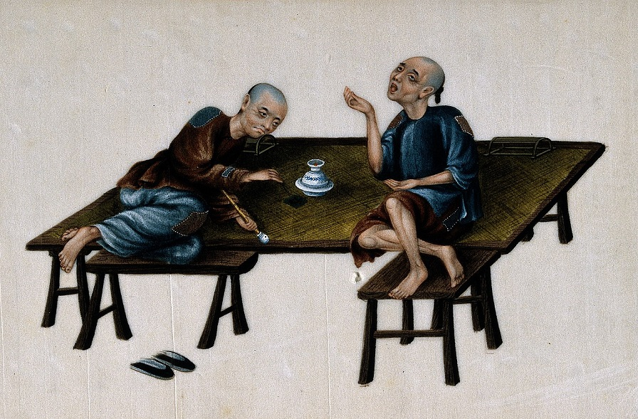
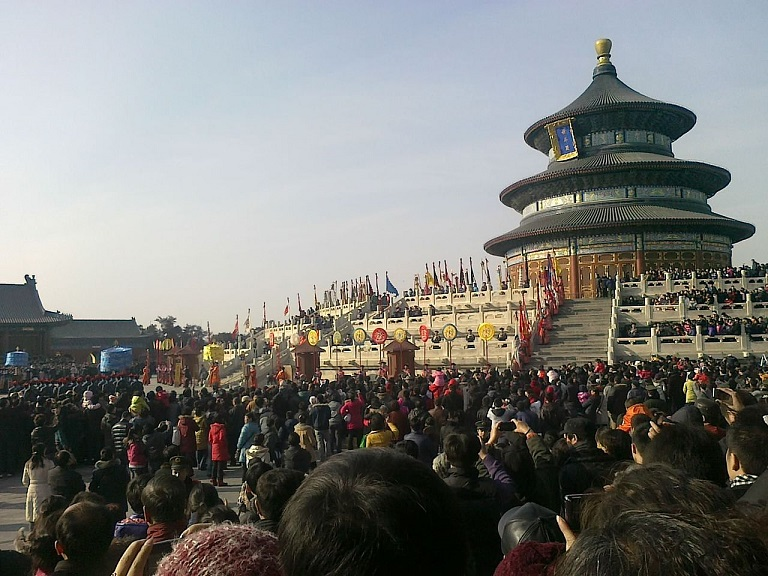
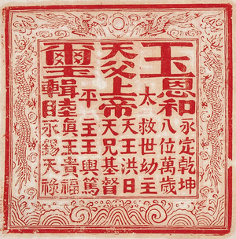
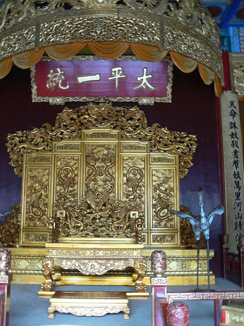

Życie w XIX wiecznych Chinach to nie był bukiecik fiołków. Chińska potęga zaczynała się kruszyć. Krajem wstrząsały wojny domowe i powstania. Na przykład w 1804 roku zakończyło się powstanie Białego Lotosu, które pochłonęło ponad 100k ofiar. W 1806 roku rządzącej dynastii udało się pokonać powstańców Miao. Spokój nie trwał długo, bo już w 1813 roku wybuchła tak rebelia Ośmiu Trygramów. Na domiar złego rosły siły zamorskich imperiów, które coraz mocniej naciskały na Państwo Środka domagając się pełnego otwarcia na wymianę handlową. Chiny miały w zasadzie autarkiczną gospodarkę, ale Zachód ostrzył sobie zęby na tamtejsze wyroby. Handel polegał głównie na tym, że Europejczycy wymieniali srebro na chińskie produkty. Rządy europejskie były zaniepokojone niekorzystnym bilansem handlowym. Szacuje się, że od połowy XVII do XIX wieku Europejczycy “stracili” w ten sposób około 30 milionów kilogramów srebra. Był to coraz większy problem, bo europejska gospodarka w XIX wieku potrzebowała dużych ilości kruszców. Rządy europejskie żądały otwarcia Chin i kupowania produktów europejskich. Chińczycy jednak puszczali europejskie obiekcje mimo uszu.

Był jednak pewien produkt, który interesował chińskich klientów- opium. Zwyczaj jego palenia szybko rozpowszechnił się w całym kraju i wśród wszystkich warstw społecznych. Skutki spożycia odbijały się niekorzystnie na całym społeczeństwie. W 1780 roku rząd cesarski wydał pierwszy edykt przeciwko opium, a w 1796 roku zabronił go. Europejczycy nic sobie jednak z tego nie robili. Na początku XIX wieku dołączyli do nich Amerykanie, szmuglując potężne ilości narkotyków. Handel opium stał się jednym z najbardziej lukratywnych interesów w Chinach. W latach 30. XIX wieku, około 30% mężczyzn w Chinach było uzależnionych (tak przynajmniej mówią szacunki). Rząd cesarski, próbując walczyć z destrukcyjnymi skutkami narkotyków, doprowadził do tak zwanej wojny opiumowej, którą sromotnie przegrał. Za porażką poszły potężne ustępstwa na rzecz Zachodnich mocarstw. W chińskiej historiografii XIX wiek określa się mianem “Stulecia Upokorzeń”. Klęska nie poprawiła notowań rządzących wśród ludu. Nie poprawiał jej również fakt, że rządzący byli Mandżurami, którzy nie byli etnicznymi Chińczykami. Problemy ze stabilnością tylko się pogłębiły- w kraju szalały różne zbrojne bandy, prowincje rządziły się często same. Zamęt w życiu społecznym przekładał się na religię. Nadzieje na upadek starego porządku i narodziny nowej, czystej duchowo epoki były bardzo żywe. Oprócz dotychczasowych wierzeń, poddani Zachodnich mocarstw zaczęli na masową skalę prowadzić w Chinach misje chrześcijańskie. Działali zarówno katolicy jak i protestanci.

Prezbiterianin, Robert Morisson, nawrócił kilku Chińczyków w Makao, Pazhou i Kantonie. Chińscy konwertyci zaczęli przekładać chrześcijańskie pisma na języki i symbole zrozumiałe i popularne wśród rodaków. Jeden z konwertytów, Liang Fa, napisał “Dobre Słowa dla Napomnienia Czasów”. W książce zawarł pouczenia dotyczące tego jak powinno wyglądać życie wiernego. Traktat ten wpadł w ręce niejakiego Hong Xiuquana w 1836 roku. Stało się to na krótko przed tym jak Hong oblał drugie podejście do egzaminu na cesarskiego urzędnika (zdanie go w zasadzie gwarantowało dostatni i stabilny żywot). Hong pod wpływem pism i misjonarzy zaczął interesować się chrześcijaństwem. W międzyczasie podszedł do kolejnego egzaminu, ale i tym razem nie podołał. Załamał się wówczas nerwowo. W trakcie rekonwalescencji Hong doświadczył majaków, które uznał za wizje. W ich trakcie przenosił się do miejsca które nazywał Niebiańskim Królestwem. Żyła tam jego Niebiańska Rodzina. W jej skład wchodził Niebiański Ojciec, Matka, Starszy Brat, Szwagierka, Żona oraz Dzieci. Niebiański Ojciec (którego wyróżniał fakt posiadania złotej brody) wyjawił Hongowi, że jest kimś więcej niż zwykłym śmiertelnikiem i utyskiwał na fakt, że ludzie czczą demony zamiast jego samego. Powierzył mu jednocześnie misję zabicia demonów. Hong miał także wizję tego jak Niebiański Ojciec ukarał Konfucjusza za złe nauki. Według relacji krewnych, w wyniku wizji Hong stał się bardziej spokojny, przyjazny i otwarty.

Zarzucił na pewien czas uczenie się do egzaminów i zajął się nauczaniem w szkołach. W 1843 roku podjął kolejną próbę zdania egzaminu, ale i tym razem oblał. W międzyczasie czytał kolejne pisma chrześcijańskie. Pod wpływem ich lektury powiązał swoje wizje z nową religią. Jego zdaniem Niebiański Ojciec był po prostu Bogiem Ojcem a Starszy Brat to oczywiście Jezus Chrystus. Hong uznał siebie za kolejnego Syna Bożego, a otrzymaną w wizjach misję pokonania demonów zinterpretował jako konieczność zdławienia “pogańskich” religii, które ogłupiły i sprowadziły Chińczyków na złą drogę. Ochoczo zabrał się do tej misji, zaczynając od niszczenia obiektów kultu. W krótkim czasie zdobył pierwszych uczniów, głównie z grona rodziny i przyjaciół. Jego wersja chrześcijaństwa była mocno powiązana z ludowymi wierzeniami, konfucjanizmem i taoizmem przeciwko którym oficjalnie występowała. Schizofrenia? Nie. Hong utożsamił bowiem chrześcijańskiego Boga z Shangdi, Najwyższym Bogiem w chińskich religiach. We wczesnych wierzeniach Shangdi był nie tylko głową panteonów, ale po prostu Absolutem, źródłem świata i istnienia. Bezpośredni kult Boga był domeną rodów cesarskich (w przeciwieństwie do zwykłych ludzi, dla których idea Absolutu była zbyt abstrakcyjna), którym miał dawać mandat Niebios na rządzenie.

Zdaniem Honga, pełne objawienie Shangdi przetrwało w chrześcijaństwie i to tę religię uważał za prawdziwą. Według niego chińskie religie była niegdyś chrześcijaństwem, ale obrosły zapożyczeniami z pogaństwa i “zdegenerowały się”. Chodziło więc o to żeby oczyścić je z tychże zniekształceń. Jednym z nich miała być cześć oddawana wyobrażeniom. Stąd Hong i jego zwolennicy niszczyli religijne dzieła sztuki uważając je za idole i bałwany. Ten ikonoklazm wywołał oburzenie lokalnych społeczności i Hong wraz ze zwolennikami zostali wygnani ze swoich domów. Chrześcijanie Honga rozproszyli się i aktywnie głosili nową wiarę, wędrując po miastach i prowincjach. Hong zaczął również pisać pierwsze teksty teologiczne. W 1847 roku Hong zaczął studiować u baptysty, Issachara Robertsa. Pod wpływem Amerykanina chciał zostać baptystą, ale Roberts odmówił. Prawdopodobnie z uwagi na to, że Hong domagał się od niego pieniędzy. Hong opuścił Robertsa i udał się do swego kuzyna i współwyznawcy, Fenga Yunshana. Feng nie próżnował i w międzyczasie założył Towarzystwo Kultu Boga. Liczba zwolenników Towarzystwa stopniowo rosła i nie przeszkodził jej fakt aresztowania obydwu liderów w 1848 roku. Ich uczniowie spisali się na medal i gdy kuzyni wyszli na wolność w 1849 roku czekało na nich wielu wiernych.

Aktywność Towarzystwa była bardzo podobna do baptystów, zapewne inspiracja z nauk Robertsa. Energiczny styl kazań i spotkań religijnych przyciągał nowych wiernych. I to tak skutecznie, że Towarzystwo zaczęło wygrywać z zachodnimi misjonarzami. W reakcji, misjonarze ci robili czarny pijar Hongowi. Nie chcąc bazować na tekstach Europejczyków, Towarzystwo zaczęło same tłumaczyć Biblię i tworzyć literaturę religijną. Kładziono duży nacisk na przestrzeganie zakazów i nakazów biblijnych. Hong chciał zrekonstruować pierwotną religię, którą Chińczycy mieli jakoby zatracić. Nie było zatem mowy o “metaforach”- Słowa Bożego należało przestrzegać bezwarunkowo (oczywiście pewne niewygodne fragmenty, np. te o spożywaniu wina, były usuwane z tłumaczeń albo tłumaczone tak, że zmieniał się odbiór tekstu). Przestrzeganie prawa miało zapewniać bożą przychylność i odrodzić Chiny i ich społeczeństwo. Towarzystwo łączyło projekt religijny ze społecznym. Jego celem było stworzenie utopijnego społeczeństwa, żyjącego w czymś na kształt chrześcijańskiej komuny, której członkowie byli równi, przebywali ze sobą i wspólnie ponosili ciężary życia, ale też wspólnie partycypowali w sukcesach.

Towarzystwo działało w regionach przyległych do Guangxi, które nękane były przez watażków, bandytów i piratów. Wspólnota zapewniająca wsparcie i ochronę była w cenie. Towarzystwo szybko rosło w siłę. W pewnym momencie bandyci i watażkowie dostrzegli w nim przeciwwagę dla władz państwowych i zaczęli dołączać do Honga. To oczywiście nie podobało się rzeczonym władzom. Hong po chrześcijańsku przebaczał rabusiom czy maruderom i akceptował ich w swojej grupie. W 1850 roku Towarzystwo miało (według górnych szacunków) nawet około 30k zwolenników. Władze przerażone ich wpływami zdecydowały się na rozbicie grupy i w 1851 roku zaatakowały ją otwarcie. Rządowi przeliczyli się jednak i zostali rozbici. 11 stycznia 1851 roku Hong ogłosił powstanie Niebiańskiego Królestwa Wielkiego Pokoju, co było jawnym wypowiedzeniem posłuszeństwa rządzącej dynastii. Od nazwy Wielki Pokój ruch ten określa się mianem Tajpingów.

Presja ze strony sił rządowych była tak znaczna, że Hong zdecydował się na “przeniesienie” swojego Niebiańskiego Królestwa. Migracja rozpoczęła się we wrześniu 1851 roku. Po ciężkich walkach, masakrach i oblężeniach Tajpingowie zajęli Nanjing, które Hong ogłosił Niebiańską Stolicą. Generalnie Tajpingowie uważali Mandżurów za sługi demonów, toteż w trakcie walk rozprawiali się z nimi drastycznie- mordując nawet tych, którzy skapitulowali. W przypadku Nanjing mężczyzn zabito klasycznie, ale kobiety spalono żywcem. Zdobycie miasta zostało okupione masakrą około 40k Mandżurów. Stało się ono bazą wypadową skąd ruszały wyprawy Tajpingów na północ i zachód. Liczne sukcesy sprawiły, że terytorium Niebiańskiego Królestwa urosło. Hong stał się teokratycznym władcą i nosił tytuł Niebiańskiego Króla. Jego zausznicy nosili tytuły królów stron świata i rządzili regionami wokół Nanjing. Rządy Niebiańskiego Króla charakteryzowane są jako połączenie totalitaryzmu, teokracji i militaryzmu.

Społeczeństwo zostało oparte na zasadach chrześcijańskich (w interpretacji Tajpingów naturalnie). I tak cesarskie egzaminy na urzędników polegały teraz na testach wiedzy biblijnej. Własność prywatna dotycząca ziemi rolnej została zniesiona- ziemia należała do państwa, które rozdzielało ją pomiędzy ludzi (oczywiście sprawiedliwie). Zniesiono podziały klasowe i płciowe. Kobiety po raz pierwszy w historii Chin zostały dopuszczone do stanowisk administracyjnych, zabronione wielu zwyczajów religijnych i kulturowych. Wprowadzono też rygorystyczną separację między płciami. Do 1855 roku nawet zamężne pary nie miały prawa mieszkać razem i uprawiać seksu. Niszczono również zabytki i pisma innych religii. Wiele buddyjskich bibliotek świątynnych w delcie Jangcy zostały zdewastowanych. Tajpingowie zabraniali też hazardu, alkoholu, narkotyków, poligamii, niewolnictwa i prostytucji. Za wszystkie te “przewiny” karą była śmierć. Przepisy nie dotyczyły Niebiańskiego Króla. Miał harem i wygodnie żył sobie w pałacu, co jakiś czas wydając edykty i pouczenia. Hong utrzymywał, że jego głos jest głosem Boga i wymagał bezwzględnego posłuszeństwa. Jego pomysły raziły część jego dowódców, co doprowadziło do krwawego rozprawienie się z nimi. Mnogość spisków sprawiła jednak, że Hong dał nogę z Nanjing, powierzając zjednoczone armie Tajpingów Shi Dakkai.

Dakkai i jego ludzie próbowali nawiązać sojusznicze relacje z Europejczykami oraz zwiększyć popularność Tajpingów wśród ludu, ale ponieśli klęskę na obydwu frontach. Europejczycy bali się radykalizmu Tajpingów, a większość ludności nie miała zamiaru odchodzić od swoich religii i zwyczajów na rzecz nowego kultu. Oddziały możnowładców, którym zagrażał egalitaryzm wyznawców Honga, organizowały się samorzutnie i prowadziły walkę za niewydolne siły rządowe. Jedną z takich grup była Armia Xiang, która mocno dawała się Tajpingom we znaki. W 1860 roku Tajpingowie rozbili wprawdzie główne siły prorządowe i wdarli się do bogatych regionów Jiangsu i Zhejiang, ale ten sukces był początkiem ich końca. Zagrożone możnowładztwo i europejskie potęgi wsparły siły cesarskie. W 1863 roku Shi Dakkai poddał się i został zamordowany przez Mandżurów. Rok później, jego los podzielił Hong, oblężony przez Xiang w Nanjingu. Jego syn i następca, Hong Tianguifu został zabity krótko po upadku stolicy Niebiańskiego Królestwa. Inne grupy Tajpingów broniły się jeszcze do początków 1871 roku.

Rebelia Tajpingów była prawdziwą wojną totalną w której masowo i przymusowo rekrutowano chłopstwo. Obydwie strony często niszczyły zasoby, co oczywiście prowadziło do klęsk głodu. Masakrowano także cywilów chcąc odstraszyć ich od pomagania przeciwnikowi lub ukarać za kolaborację. Według źródeł, w samej prowincji Guangdong, siły rządowe zamordowały około miliona ludzi po upadku rebelii. Pod nóż szły całe grupy etniczne, które miały pecha sprzymierzyć się z przegrywającą aktualnie stroną. Hakka, z której pochodził Hong i jego najzagorzalsi wyznawcy, ucierpieli najbardziej. W trakcie kilku fal czystek etnicznych zdarzało się, że mordowano 30k Hakka dziennie. Całkowitą liczbę ofiar cywilnych i wojskowych szacuje się na od 20 do 30 milionów.

Rebelia na dobre zmieniła obraz Chin- władza Mandżurów pokazała swoją słabość, a chińskie grupy etniczne zaczęły na nowo dominować administrację i politykę. Wiele prowincji stało się de facto niezależne, a podporą tej niezależności były nowopowstałe, silne, prywatne armie, słuchające tylko rozkazów swojego patrona i nie przejmujące się cesarzem. Militaryzacja i metody walki Tajpingów zostały przejęte i zaadoptowane przez większość stronnictw politycznych w Chinach. Także przez rodzące się ugrupowanie nacjonalistyczne i komunistyczne. Co ciekawe- weterani z powstania Tajpingów wstępowali zarówno do Towarzystwa Odrodzenia Chin Sun Yat-sena (nacjonaliści) i do organizacji socjalistycznych. Na koniec- Tajpingowie nie zrobili zbyt dobrego pijaru chrześcijaństwu wśród społeczeństwa chińskiego. Po dziś dzień przywołuje się okrucieństwa Honga i jego zwolenników jako dowody na to, że chrześcijaństwo jest wrogie Chinom. Z drugiej jednak strony- do powstania czasami w pozytywny sposób odwoływała się propaganda komunistyczna, opisując Tajpingów jako protokomunistów.
