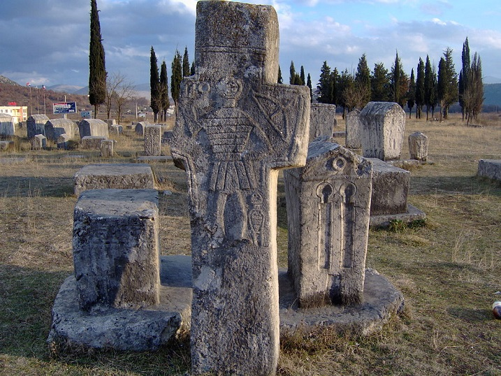
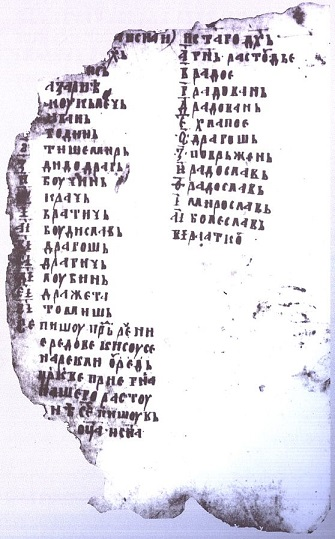
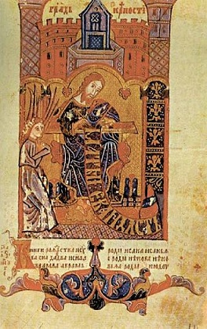
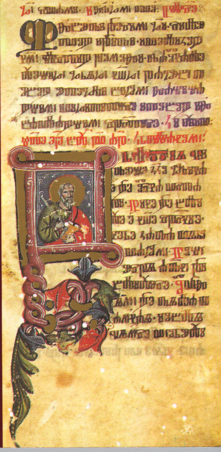
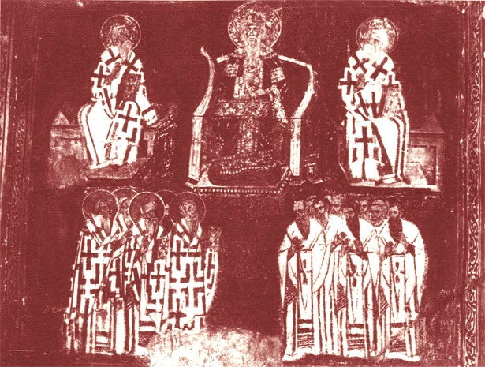

Jednym z najbardziej tajemniczych zjawisk w europejskiej historii chrześcijaństwa jest tak zwany kościół bośniacki. Jest to efekt tego, że losom średniowiecznej Bośni nikt nie poświęcał wiele uwagi. Nie jest pewne czym był i czego nauczał rzeczony kościół. Autorem współczesnego zamieszania wokół niego był Chorwat Racki. Wziął on za dobrą monetę oskarżenia katolickich pisarzy historycznych i sklasyfikował wyznanie jako lokalną wariację chrześcijańskiego dualizmu (w dużym skrócie- zło jest niemal tak potężne jak dobro a materialny świat to dzieło szatana i więzienie dla niematerialnych dusz z którego muszą się uwolnić) oraz powiązał je z bogomiłami (dualistyczna herezja z Bułgarii). Pogląd ten zdobył duże uznanie wśród historyków- w wielu pracach w których jest wzmiankowany (pod nazwą “patareni”) określa się go mianem manichejskiego lub bogomilskiego. Co ciekawe teorie Rackiego zostały entuzjastycznie przyjęte przez bośniackich muzułmanów, którzy tłumaczyli w ten sposób konwersję Bośni na islam- że niby nigdy byli katolikami ani prawosławnymi, a ich odmienność od sąsiadów jest starsza niż osmańskie podboje.

Problem w tym, że teorie te nie znalazły potwierdzenia w nowszej krytyce źródłowej i archeologii. Na przykład charakterystyczne dla Bośni stecaki (kamienie nagrobne) utożsamiane z kościołem bośniackim zawierają krzyże, który to symbol wyznania dualistyczne uważały za szatański. Poza tym stecaki zawierają motywy katolickie i prawosławne (a dualiści uważali ich za odstępców). Wszystkie źródła sugerujące dualizm pochodzą zaś od ludzi, którzy nigdy nie byli w Bośni. Ponadto wiemy, że mieli dobre powody by kłamać. Źródła z samej Bośni nie wspominają nic o dualistycznych praktykach czy wierzeniach. Termin “patareni”, jakim określali Bośniaków katolicy, był historyczną nazwą XI wiecznych grup heretyckich z Mediolanu. Jedyną wskazówką rzucającą cień podejrzenia o dualizm są doniesienia o tym, że możnowładcy bośniaccy przyjmowali zbiegów religijnych z Dalmacji. To jednak w żaden sposób nie przesądza o wpływie tych ludzi na wierzenia swoich gospodarzy. Mamy nawet dobre powody żeby uważać, że mieli oni odrębną organizację “kościelną”.

Korzenie kościoła o którym (jako o odrębnej instytucji) pierwsze wzmianki pojawiają się w XIV wieku, sięgają XII wieku. Bośnia był pograniczem między łacińską a bizantyjską Europą. Ciężko tu jednak mówić o “miejscu spotkań”, bo główne szlaki handlowe i komunikacyjne biegły gdzie indziej. Górski teren sprzyjał zachowaniu niezależności i odrębności- zarówno od świata zewnętrznego jak i w ramach podregionów zwanych żupami, którymi rządzili żupanowie. Nad nimi znajdowali się banowie. Najznaczniejszy ban rządził środkową częścią regionu. Ludność była zróżnicowana kulturowo i religijnie- na południu i wschodzie przeważali prawosławni a na północy i zachodzie katolicy. Katolicyzm ten był jednak często odmienny od łacińskiego standardu made by Rzym. Bośniacki kler nie znał łaciny i używał cerkiewnosłowiańskiego. Do tego biskupa Bośni wybierali lokalsi ze swojego grona. Konsekracja odbywała się wprawdzie w Dubrowniku, ale tamtejszy arcybiskup nie miał nic do gadania w kwestii wyboru. Izolacja Bośni sprawiła też, że znacznie dłużej przetrwały tam słowiańskie zwyczaje i wierzenia (w mniej lub bardziej ochrzczonej formie).

Próbę latynizacji Bośni podjęli Węgrzy, którzy podporządkowywali sobie ziemie chorwackie i zaczęli dominować w regionie. W 1192 roku papież uległ ich namowom i oddał Bośnię arcybiskupstwu w Splicie. Bośniacy olali tę decyzję i swojego biskupa nadal wysyłali na konsekrację do Dubrownika. Była to część konfliktu między biskupami Splitu, Dubrownika i Baru. List Wukana z 1199 roku, władcy Zety, będący pokłosiem tego konfliktu, jest jedną z pierwszych wzmianek o rzekomej herezji w Bośni. Oskarża on bana Kulina o odrzucenie katolicyzmu. Rok później w podobne tony uderzył arcybiskup Splitu. Wzbudziło to zainteresowanie papieża. Dokumenty synodu w Barze, który miał rozwiązać konflikty wśród katolików w regionie są bardzo ciekawe. Nakazują one duchowieństwu np. przestrzegać celibatu, golić brody oraz nie udzielać rozwodów. Świadczy to tym, że słowiańscy duchowni z tych stron trwali przy swoich zwyczajach i normach, którym bliżej było do prawosławia. Synod niewiele dał, bo tarcia między biskupami trwały cały XIII wiek. Nie dotknął też za bardzo sprawy bośniackiej a zarzuty o herezję cały czas docierały do papieża.

W odpowiedzi Kulin napisał do Rzymu, że rzeczywiście przyjął uchodźców gdyż myślał, że są oni chrześcijanami. Wysłał kilku z nich aby papież mógł sam sprawdzić ortodoksyjność ich nauczania. Niestety odpowiedź Rzymu nie zachowała się. Listy Kulina i synod w Barze pokazują, że historycznie wielu ludzi nie wiedziało do końca czym jest “ich” religia: katolickie duchowieństwo zachodnich Bałkanów było de facto prawosławne; Kulin przyjął heretyckich uchodźców; duchowni bośniaccy nie potrafili sprawdzić koszerności przybyszy, bo katolickie prace teologiczne były pisane po łacinie (której nie znali). Oskarżenia o herezję zaczęły się piętrzyć. Papież wezwał w końcu do krucjaty. Aby temu zapobiec, Kulin zwołał w 1203 roku synod do Bolino Polje. Bośniacy potępili błędy i potwierdzili łączność z Rzymem. Te “błędy” ciężko określić mianem herezji. Dotyczyły bowiem lokalnych praktyk które rozwinęły się pod wpływem tradycji wschodnich. Synod rzuca nieco światła na kościół katolicki w Bośni. Był on prowadzony przez grupy monastyczne związane z możnowładcami. Grupy te nie bardzo praktykowały odprawianie katolickich nabożeństw i nie miały sakramentów.

To tylko dodaje cegiełkę do obrazu opisanego w powyższym akapicie. Bośniacki kościół nie tylko nie znał teologii katolickiej, ale nawet katolickich praktyk a jego członkowie nie przystępowali regularnie do sakramentów. Tworzące go wspólnoty funkcjonował według własnych zasad opartych, najprawdopodobniej, na standardowej dla Wschodu regule świętego Bazylego. Postanowienia synodu miały to jednak zmienić. Wyparcie się błędów i walki z heretykami na Zachodzie sprawiły, że papież odpuścił. Jednak w 1221 i 1222 roku pojawiły się ponowne oskarżenia o niezdefiniowaną herezję. Prawdopodobnie były one spowodowane ambicjami Węgrów. Papież wezwał do krucjaty, ale podjęto inne aktywności mające na celu uporządkowanie sytuacji. List papieski z 1232 roku opisuje biskupa Bośni jako broniącego heretyków analfabetę, który objął urząd dzięki przekupstwu i nie miał pojęcia o sakramentach i liturgii. Legat usunął go ze stanowiska, a na jego miejsce powołał niemieckiego duchownego. Rok później ban Ninosław wyrzekł się jakiejś nieopisanej herezji.

Nic to nie dało, bo w 1234 roku papież wezwał do ataku na Bośnię. Chciał on zapewne realnej katolicyzacji, podczas gdy Węgrzy chcieli zmienić nominalną zwierzchność w prawdziwą. Kampania zajęła kilka lat, ale mimo pewnych sukcesów (choćby zdobycie Sarajewa, gdzie Węgrzy wybudowali katedrę) Ninosław zachował część swoich terytoriów. Wojskom towarzyszyli dominikanie, których celem było “naprawianie błędów”. Nie obyło się bez palenia na stosie, ale nawet źródła dominikańskie nie opisują herezji wśród Bośniaków. Impreza nie trwała jednak długo gdyż w 1241 roku Węgrzy wycofali się z powodu najazdu Mongołów. Pomogło to Bośniakom odzyskać utracone ziemie. Ninosław napisał do papieża list przekonując, że jest katolikiem a kontakty z heretykami wynikały z zagrożenia krucjatami. Papież wstrzymał więc Węgrów, którzy w 1248 roku chcieli znowu najechać Bośnię i wysłał duchownych, którzy mieli zbadać sytuację. Nie wiemy jaki był bezpośredni efekt ekspedycji, ale w wyniku późniejszych nacisków Węgrów papież oddał im zwierzchność nad organizacją kościelną w Bośni.

Było ono jednak czysto teoretyczne a Bośniacy rządzili sami zarówno swoim terytorium jak i kościołem. Cała rzecz działa się na początku XIV wieku czyli wtedy gdy pojawiają się pierwsze wzmianki o kościele Bośniackim jako odrębnej organizacji. Źródła papieskie i węgierskie określają go mianem manichejskiego przyrównując do bogomiłów i katarów. Starsze prace brały ich słowa za dobrą monetę. Współcześni historycy stawiają jednak tezę, że przyczyną wyodrębnienia się kościoła bośniackiego nie była herezja tylko fakt ścisłej współpracy papiestwa z Węgrami i chęć latynizacji lokalnych praktyk. Agresja, prześladowania i polityczne motywy krucjaty miały sprawić, że wierni i mnisi doszli do wniosku, że nie chcą mieć nic wspólnego z papiestwem. Innymi słowy- bośniacki kościół z XIV wieku był kontynuacją wspólnot monastycznych, których przedstawiciele wzięli udział w synodzie w Bolino Polje i które to wspólnoty dotychczas uważały się za katolickie. Przy czym nie oznacza to, że nie było tam heretyków. Źródła raczej nie kłamią mówiąc o przyjmowaniu “manichejskich” zbiegów z Dalmacji. Nie mamy jednak dowodu na to, że ich nauki zostały przyjęte przez Bośniaków. Są za to poszlaki mówiące, że wspólnoty heretyckie funkcjonowały tam odrębnie od kościoła bośniackiego.

Wszystkie źródła z samej Bośni i Dubrownika (który miał kontakty z kościołem Bośni) wskazują, że mnisi nie różnili się w swojej wierze od katolicyzmu czy cerkwi. Słynny rękopis zawierający “rytuał katarski”, po wnikliwszej analizie okazał się dziełem prawosławnym, stworzonym w Ochrydzie. “Katarski” zwyczaj łamania i błogosławienia chleba (znany z Francji) był powszechny wśród prawosławnych mnichów. Ponadto Bośniacy używali Księgi Psalmów podczas gdy grupy dualistyczne odrzucały zazwyczaj cały Stary Testament. Różniło ich także to, że sporadycznie odprawiali liturgię i pili wino. Mnisi z możnych rodzin, w przeciwieństwie do katarskich kaznodziejów, nie zrzekali się majątku. Bośniacki dostojnik kościelny, Radin, w ostatniej woli określił swój dobytek jako 5k dukatów, liczne konie i luksusowe przedmioty. Wszystkie teksty religijne kościoła bośniackiego są ortodoksyjne a niektóre mają wręcz oznaczone czytania tak jak w cerkwi. Uznawali także kult świętych, Trójcę i kult wizerunków. Zarzutom o herezję przeczy również fakt tego, że wielu wiernych kościoła było traktowanych z szacunkiem przez katolickich i prawosławnych sąsiadów. Na przykład wspomniany Radin, możny Vukcic (Alfons z Neapolu przyjął go do zakonu rycerskiego Dziewicy) czy możny Hrvoje (ojciec chrzestny córki króla Węgier, Zygmunta).

Brak dowodów na herezję (albo raczej- dowody na ortodoksyjność) zdaje się potwierdzać tezę, że przyczyny schizmy były polityczne i organizacyjne. Bośniacy chcieli zachować swoje zwyczaje, które były unikalnym rozwinięciem wschodniej tradycji chrześcijańskiej. Możliwe, że chcieli również zachować monastyczną organizację- nigdy nie powołali regularnych instytucji i duchowieństwa. Kościół był więc de facto luźną federacją grup mniszych. Na jego czele stał djed (dziadek). Mnisi żyli w hizach (budynki klasztorne, dosłownie: dom), głównie na prowincji. Oprócz djeda byli także gostowie, strojnicy (gospodarze) i staracy (starcy). Przełożeni wspólnoty to właśnie strojnicy a jej doświadczeni członkowie staracowie. Gost był tytułem honorowym. Wszyscy określali się zaś mianem krstjani (chrześcijanin). Djed administrował w porozumieniu z radą dwunastu gospodarzy (strojnici). Hizy znajdowały się tylko w centralnej Bośni i były używane nie tylko do celów religijnych, ale także jako np. miejsca na nocleg dla podróżujących.

Teorie mówiące o kościele bośniackim jako o państwowym nie mają żadnego potwierdzenia. Wyłamanie się mnichów spod władzy papieża nie było końcem katolicyzmu w Bośni. Od 1342 roku działała bez przeszkód (i większych sukcesów) misja franciszkańska. Kościoły istniały obok siebie. Do tego Bośniacy nie prowadzili misji. Papież, zatroskany losem odstępców, wzywał co jakiś czas do krucjaty w celu ich nawrócenia lub eksterminacji. XIV wiek to okres ekspansji terytorialnej Bośni pod rządami Kotromaniciów. Nominalnie byli katolikami, ale, z drobnymi wyjątkami, nie mieszali się w życie religijne i z szacunkiem odnosili się do kościoła bośniackiego. Wpływy djedów na politykę są widoczne tylko w pierwszej dekadzie XV wieku- z tego powodu przypuszcza się, że ówczesny władca, Stefan Ostoja, należał do kościoła. Zdarzały się związki między możnymi rodami a mnichami, ale tylko w kilku przypadkach były one znaczące. Mnisi rzadko świadczyli inne usługi niż religijne.

Wydaje się, że za fenomenem bośniackiego kościoła stał fakt poszatkowania Bośni na odrębne regiony. Żaden z nich nie potrafił zdominować reszty i narzucić im religii. Jest zresztą możliwe, że nawet nie chciał jej narzucać- możni zmieniali bowiem wyznania z łatwością, zależnie od potrzeb. Stąd teoria, że instytucjonalna religia nie odgrywała większej roli w Bośni. Swoje robił także brak wiedzy na temat doktryny. Ze źródeł wiemy, że wielu katolików kultywowało zwyczaje z tradycji Wschodniej (od schizmy- prawosławne). Katolicy i Bośniacy (a nawet żydzi) często pielgrzymowali do prawosławnych klasztorów w Mileszewie gdzie znajdowały się (uznawane za czyniące cuda) relikwie świętego Sawy. Ważnym czynnikiem była także izolacja od sąsiadów, która sprawiała, że regularnego kleru w Bośni było bardzo mało.To wszystko sprawiało też, że Bośnia była tak naprawdę bardzo powierzchownie schrystianizowana, co tłumaczy łatwość z jaką jej mieszkańcy przeszli na islam w czasach Osmanów. Wydaje się, że duża część współczesnych Bośniaków (muzułmanów w Bośni) to właśnie potomkowie nawróconych na islam zwolenników kościoła bośniackiego.
