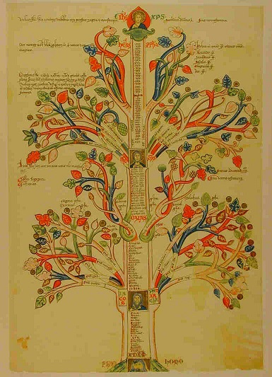
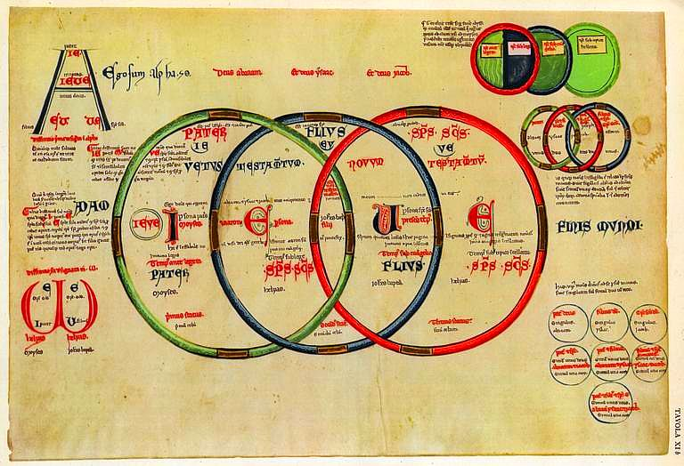

Okres między XI i XIII wiekiem był w Europie Zachodniej czasem zmian w wielu dziedzinach życia- także religijnego. Nowym zjawiskiem było większe zainteresowanie religią wśród laikatu. Dotyczyło ono zarówno bardziej teoretycznych rozważań nad doktryną jak i praktycznych doświadczeń religijnych. Jednym z poszukujących był Joachim z Fiore. Południe Italii, gdzie się wychował, było prawdziwym tyglem wiar i etnosów- obok siebie żyli katoliccy Longobardowie i Normanowie, żydzi, prawosławni Grecy, muzułmańscy Arabowie oraz różne grupy heterodoksyjne. Joachim od samego początku był zatem świadom istnienia różnych wierzeń i tradycji. Jako syn możnego łatwo znalazł zajęcie na dworze, gdzie miał także styczność z najświatlejszymi i najlepiej wykształconymi ludźmi w państwie. Wiemy również, że odwiedził jeszcze bardziej multikulturowy Konstantynopol. W trakcie pobytu na Wschodzie przeżył kryzys duchowy i udał się na pielgrzymkę do Palestyny. Wędrował po pustyniach i miejsca kultu aż doświadczył niewytłumaczalnego przeżycia, które uznał za spotkanie z Bogiem i które na zawsze odmieniło jego życie. Pod wpływem zetknięcia ze znanym/nieznanym nawrócił się i po powrocie w rodzinne strony porzucił karierę na dworze, poświęcając się życiu jako pustelnik- asceta.

Po kilku latach Joachim dołączył do benedyktynów gdzie, mimo drobnych zawirowań, szybko zrobił karierę (o ile można tak w ogóle powiedzieć w tym kontekście). Już w 1176 roku został przeorem klasztoru. Przez cały ten czas oddawał się nie tylko modlitwie, postom i kontemplacji, ale także studiom biblijnym. Nie interesowało go jednak tylko interpretowanie poszczególnych części świętych tekstów. Szukał powiązań między nimi wierząc, że Biblia zawiera wiele ezoterycznej wiedzy na temat przeszłości, teraźniejszości i przyszłości. Oprócz analizy suchego tekstu, Joachim zdawał się też na swoje wizje i religijne uniesienia. Po jednym z nich stwierdził, że w pełni zrozumiał Apokalipsę i relację między Starym a Nowym Testamentem. Po uzyskaniu zgody od papieża Lucjusza III, przystąpił do spisywania rzekomego objawienia. Zawierało ono nie tylko uwagi na temat powiązań między księgami Biblii i ich interpretacje, ale także cały system dotyczący tego jak należy rozumieć historię świata i zbawienia. Pełno w nich było odniesień do liczby trzy, którą Joachim uważał za szczególną. Dzieła wywarły olbrzymi wpływ na średniowieczną, łacińską Europę i jej religijność. Robert Lernen napisał kiedyś:

"Jakkolwiek niewielu śmiertelnikom jest dane wymyśleć chociaż jedną nową, znaczącą ideę- Joachim z Fiore wymyślił trzy." 

Pierwszą był pomysł aby Stary Testament potraktować jako swego rodzaju kryptogram- to znaczy tekst pełen ukrytych znaczeń i zależności, które można jednak właściwie odszyfrować. Jeśli zrobi się to dobrze to, zdaniem Joachima, zyskujemy w ten sposób klucz do przewidzenia przyszłych zdarzeń z historii świata. Wydarzenia ze Starego Testamentu miały bowiem być zapowiedzią tych z Nowego i dokładnie im odpowiadać (choć być mniej wyraźne jako, że był to czas gdy ludzkość nie znała pełnego objawienia). Joachim stworzył całą mapę aby zobrazować relację między historiami. Przedstawił testamenty jako symetryczne rozgałęzienia (jedno dla Starego i jedno dla Nowego) drzewa, których liście, pnie i gałęzie były opisane powiązanymi ze sobą (zdaniem Joachima) wydarzeniami biblijnymi. Były one skorelowane ze sobą nie tylko na podstawie znaczenia, ale także nakładających się na siebie generacji postaci biblijnych.

Drugą była interpretacja Apokalipsy, której kompletne znaczenie miał jakoby posiąść dzięki objawieniu. Większości teologów katolickich przed Joachimem traktowała Apokalipsę jako zbiór odrębnych wizji dotyczących wydarzeń w różnych okresach. Joachim uważał ją zaś za jedną, spójną narrację. Rewolucyjne było również przekonanie dotyczące aktualnego stanu historii. Według wcześniejszych interpretacji, okres tysiącletniego królestwa z rozdziału 20, odnosił się do czasów panowania kościoła w Rzymie i średniowiecznej Europie. Joachim temu zaprzeczał- uważał, że to tysiąclecie znajduje się jeszcze przyszłości. Jakkolwiek może to nie brzmieć jak bardzo śmiała teza, to w ówczesnej rzeczywistości jak najbardziej taka była. Można ją było bowiem zrozumieć jako przyznanie, że kościół rzymski z papieżem i biskupami na czele nie jest ostatecznym wcieleniem kościoła Chrystusowego. I tak też się stało, co wobec dużej popularności pism Joachima przysporzyło instytucjonalnemu kościołowi potężny ból głowy.

Trzecią i prawdopodobnie najbardziej wpływową ideą Joachima była mapa historii zbawienia. Dzielił on historię na ,jakże by inaczej, trzy okresy i przyporządkował im osoby Trójcy. Na okres Ojca przypadał Stary Testament, w którym wierni należeli do synagogi. Trwał on 42 pokolenia i zakończył się wraz z przyjściem Chrystusa. To z kolei było początkiem okresu Syna. Obowiązuje w nim Ewangelia, a naród wybrany gromadzi się w Kościele. Okres ten zbliża się jednak do końca, a po nim nastąpi okres Ducha. Okres Ojca był bardzo restrykcyjni i był czasem “niewoli” gdyż ludzie kierowali się tylko potrzebami ciała- trzeba było więc trzymać ich bardzo krótko. Okres Syna jest miksem wolności i niewoli, a ludzie rozwinęli się na tyle, że kierują się potrzebami ciała i ducha- można im zatem nieco poluzować. Zapowiedziany okres Ducha miał zaś być czasem pełnej wolności, wyparciem potrzeb ciała przez duchowe i obowiązywania Wiecznej Ewangelii. Kościół instytucjonalny miał zniknąć, wraz z obrzędami, klerem i zakazami oraz nakazami. W nowej epoce sam Duch Święty miał prowadzić wiernych żyjących we wspólnotach monastycznych i miał ich nieustannie uświęcać swoją łaską.

Z obliczeń Joachima wynikało, że okres Syna miał się skończyć w XIII wieku. Jego prace, pełne uczonych cytatów, obliczeń, odniesień do Biblii i nauk wszelakich oraz śmiałych wizji rozpalały wyobraźnię ludzi epoki, przepełnionych religijnością i oczekiwaniem wielkiej zmiany. Niektóre idee Joachima zostały oficjalnie potępione przez Rzym (np. nauczanie o Trójcy). Generalnie jednak był on uważany za jak najbardziej koszernego zawodnika a to tylko zwiększało jego zasięg i olbrzymią popularność. Szczególnie znany i poważany był wśród franciszkanów. Było to spowodowane tym, że zapowiadał on pojawienie się nowego zakonu u progu okresu Ducha. Zakon ten, kierując się wysokimi standardami moralnymi, miał pełnić rolę swoistego nauczyciela ludzkości i wprowadzić ją w nową epokę duchowości. Żyjący w ubóstwie, ascetyczni, pomagający innym oraz nauczający Ewangelii franciszkanie bardzo chcieli widzieć się w tej roli.

Proroctwa Joachima miały odegrać bardzo dużą rolę w historii jednego z największych kryzysów w historii zakonu i przyczyniły się do jego konfliktu z hierarchią. Ale o tym kiedy indziej.
