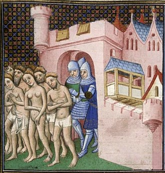
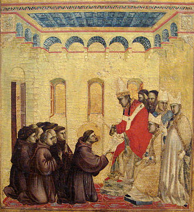
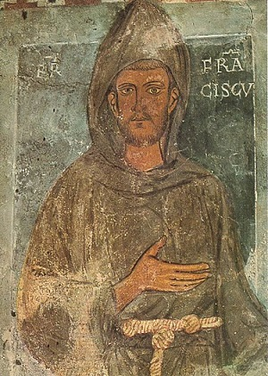
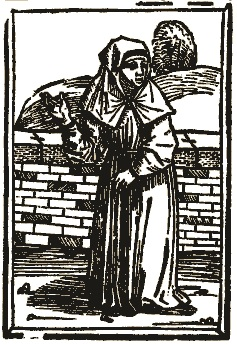

Przemiany społeczne w okresie pełnego średniowiecza (XI - XIII wiek) dotknęły także życia religijnego. Jednym z przejawów był wzrost zainteresowania religią ze strony laikatu. W efekcie wzrosła religijna świadomość i zaangażowanie wiernych, ale z drugiej strony część ludzi, poznając katolickie nauczanie, uświadamiała sobie, że się z nim nie zgadza. Herezje szerzyły się jak pożar w suchym lesie. Ponadto wielu katolików uważało, że istnieje różnica między kościelną teorią a praktyką. Rozczarowani starali się sytuację poprawić na własną rękę. To często kończyło się procesami, przymusową reedukacją a czasem nawet śmiercią. Ówczesny kościół uważał, że zbawienie jest możliwe tylko w jego ramach. Każdy kto wyznawał inne poglądy był z automatu poza kościołem, co miało jakoby uniemożliwiać zbawienie. W tym świetle próby nauczania podjęte przez osoby “niewykwalifikowane” i “nieuprawnione” były ryzykowne i mogło prowadzić nawet do wiecznego potępienia.

Nieżyczliwi mogą uważać, że kościół obawiał się tak naprawdę utraty wpływów*. Jeszcze mniej życzliwi mogą przy tym dodać, że reformatorzy kładli duży nacisk na skromność i ubóstwo co niekoniecznie podobało się hierarchii (która była w zasadzie feudałami). Prześladowania niewiele jednak dawały i kościół zmienił swoją politykę. Gdy w 1209 roku przed Innocentym III stanął Franciszek z Asyżu, nie popełniono błędów przeszłości. Dzięki swojej autentyczności, wynikającej z rygoryzmu moralnego i oddania sprawie, franciszkanie i klaryski (żeński odpowiednik) zdobyli sobie wielką popularność. Pod wpływem przykładnego życia zakonników (połączonego czasem z debatami teologicznymi) nawet heretycy nawracali się na katolicyzm. W połączeniu z krucjatami i działalnością inkwizycji dawało to świetne efekty w odzyskiwaniu utraconych owiec.

Szybko pojawiły się jednak nowe problemy- moralny rygoryzm i idealizm wielu zakonników niekoniecznie szły w parze z hierarchią. Zakon zaczął się instytucjonalizować. Jedni twierdzili, że oddala go to od ideału ubóstwa i służby bliźnim. Inni twierdzili, że zmiany nie tylko nie przeszkadzają, ale wręcz pomagają. Konflikt sięgał już czasów Franciszka. Założona przez niego wspólnota ubogich szybko stała się popularna i zaczął do niej płynąć szeroki strumień datków i nowych adeptów. W 1219 roku bracia z Bolonii otrzymali w prezencie nieruchomość. Gdy Franciszek dowiedział się o tym nakazał jej zwrot. Interweniował kardynał Hugolino. Przekonał Franciszka, że dom należy do niego, a bracia posiadają tylko prawo użytkowania. Ten kruczek pozwoliły uspokoić sytuację. Obawiając się nadużyć i wykoślawienia ideałów ewangelicznego ubóstwa, Franciszek sporządził w 1221 roku nową regułę. Zezwalał w niej braciom na nieposłuszeństwo wobec przełożonych którzy łamali zasady wspólnoty.

Reguła ta nie została zaakceptowana przez papieża. Zatwierdził on wersję z 1223 roku, która kładła mniejszy nacisk na nieposłuszeństwo. Bojąc się kompromisów, Franciszek spisał testament, który nakazywał zachować i czytać razem z regułą. Wzywał w nim do oddania ewangelicznym ideałom ubóstwa, służby i dobroci. Znając umiejętności teologów do odwracania kota ogonem, zabronił reinterpretacji. Na niewiele się to zdało- zasady łamano często i gęsto. Wraz z gwałtownie rosnącymi szeregami, donacjami i wpływami, testament Franciszka zaczął ciążyć wyżej postawionym. Zwrócili się więc oni do kardynała Hugolino, wówczas już Grzegorza IX, z pytaniem czy wola Franciszka jest dla nich wiążąca. W bulli “Quo elongati” z 1230 roku papież zezwolił na reinterpretację zasad. Zastosowano tutaj ten sam mechanizm co przy domu w Bolonii- teoretycznym właścicielem bibliotek, klasztorów, kościołów, magazynów, sadów, pól etc. byli hierarchowie- franciszkanie mogli “tylko” używać tych zasobów.

Z jednej strony umożliwiło to jeszcze większy rozrost zakonu i jego roli, ale z drugiej wymuszało konformizm w stosunku do hierarchii i zostawiało pole do nadużyć. Zdaniem grupy określanej później jako fraticelli, było to jawne sprzeniewierzenie się ideałom Franciszka. Druga strona, konwentualiści, uważali, że zmiany te są po prostu dostosowaniem się do warunków, konieczne aby móc realizować misję zakonu. Na przykład: aby nieść ewangelię wykształconym, potrzebni są oczytani bracia, edukacja i biblioteki. Działalność dobroczynna wymaga pieniędzy- można więc inwestować datki w działalność gospodarczą i dzielić zysk z biednymi. Dbanie o wiernych wymaga stałej obecność franciszkanów, czyli muszą mieć nieruchomości etc. Widać tu, że konflikt ten niekoniecznie wpisuje się w podział “idealiści” vs “skorumpowani”. Problem polegał jednak na tym, że granica między dostosowaniem zasad do realiów a działaniem dla osobistych korzyści była bardzo cienka.

Większe tarcia pojawiły się w latach 40. XIII wieku gdy generałem zakonu był Krescencjusz z Jesi. Część braci oskarżyła go i jego stronników przed papieżem o większe zainteresowanie sprawami materialnymi niż duchowymi. Źródła samego zakonu wspominają, że właśnie w tych czasach pojawiła się:

"Grupa braci którzy (...) gardzą instytucjami i uważają się za lepszych od innych, chcą żyć po swojemu i wszystko przypisują duchowi, nosząc płaszcze tak krótkie, że sięgają ich pośladków" 

Problemy piętrzyły się- w trakcie dorocznego spotkania franciszkanów w 1257 roku, generał zakonu Jan narzekał na to, że zakonnicy mają za nic zasady i poddał się do dymisji. Jeden z jego następców, Bonawentura skazał go na więzienie za sianie fermentu. Kryzys jednak nie mijał i sam Bonawentura podjął próby zaostrzenia rygoru. Na niewiele się to zdało. W latach 70. i 80. XIII wieku wybuchł kolejny spór- o “usus pauper”. Konflikt jest ciekawy nie tylko w kontekście franciszkanów, ale katolickiego legalizmu w ogóle. Otóż- franciszkanie składali ślub ubóstwa, którego złamanie było grzechem śmiertelnym (popełnienie go było bardzo ryzykowne w kontekście zbawienia). Mogli jednak korzystać z dóbr niezbędnych do funkcjonowania. Problem polegał na tym, że ciężko jest zdefiniować które użytkowanie jest “niezbędne”, a które “zbędne”. Może się to wydawać pierdołą, ale w katolickim średniowieczu pierdołą nie było. Użytkowanie “zbędne” równało się bowiem złamaniu ślubu ubóstwa- czyli było grzechem śmiertelnym i mogło prowadzić do wiecznego potępienia. Polemiki wokół tematu toczyły się przez wiele dekad.

W tym sporze były dwa główne obozy- konwentualiści i fraticelli. Ci pierwsi byli bardziej umiarkowani a drudzy rygorystyczni. Strony oskarżały się nawzajem o zdradę franciszkowych ideałów i najgorsze zbrodnie. W wyniku eskalacji spór przestał być sprawą zakonu i poprzez ludzi z zewnątrz (także wysokich szarż) wpisał się w inne konflikty epoki. Po pewnym czasie stał się wręcz konfliktem eklezjologicznym. Fraticelli i ich zwolennicy, spychani do narożnika przez konwentualistów, oparli się na szalenie popularnych wizjach Joachima z Fiore(patrz poprzedni odcinek i zidentyfikowali swoje stronnictwo z zakonem, który według przepowiedni miał wprowadzić ludzkość w nową epokę duchowości. Joachimowa epoka Ducha Świętego miała się bowiem charakteryzować końcem zinstytucjonalizowanej religii. Zastąpić ją miały paramonastyczne grupy ‘świętych”, skromnych, prostych i oddanych Bogu i ludziom, prowadzonych bezpośrednio przez Ducha Świętego. Fraticelii i ich sympatycy uznali, że przełom dokonuje się właśnie teraz a konflikt jest tego pokłosiem.

Najpopularniejszą syntezę tych poglądów stworzył franciszkanin Piotr Olivi, którego prace potwierdzały, że koniec czasów ma miejsce właśnie teraz. Krytykował on hierarchów, którzy jego zdaniem odeszli od pierwotnego modelu propagowanego przez Chrystusa i apostołów. Dla Piotra zapowiedzią odnowy chrześcijaństwa było pojawienie się Franciszka z Asyżu, którego utożsamiał z apokaliptycznym aniołem Szóstej Pieczęci. Olivi rozpropagował wizję w której fraticelli byli motorem napędowym zmian, mającym wprowadzić ludzkość w nową erę. Jego pisma i nauczanie pozyskały wielu zwolenników dla sprawy radykalnych (a może konsekwentnych?) franciszkanów. Konflikt przybierał na sile, ale Olivi zmarł we względnym spokoju w 1298 roku. Dla wielu wiernych był świętym, a jego pracami inspirowali się jeszcze długo nie tylko “heretycy” (fraticelli, begardzi, beginki, bractwa Wolnego Ducha, Bracia Apostolscy etc.) ale także jak najbardziej koszerni katolicy.

W 1299 roku konwentualiści przeszli do kontrataku- zgromadzenie zakonu potępiło prace Oliviego oraz nakazało ich zniszczenie. Zaczęli również przedstawiać fraticelli jako zagrożenie dla ładu społecznego i jedności kościoła. Doszło do śledztw i polemicznych dyskusji w których obydwie strony miotały na siebie oskarżenia o herezję. Bulla papieża Klemensa V była próbą zakończenia konfliktu- przyznawała, że w zakonie dochodzi do nadużyć i nakazywała większą surowość obyczajów. Problem polegał na tym, że pozostawiała te zmiany w gestii przełożonych (którzy w większości byli konwentualistami) i nakazywał braciom aby byli posłuszni. W efekcie nic się nie zmieniło. Fraticelli, mając w pamięci zalecenia Franciszka co do nieposłuszeństwa, zaczęli otwarcie się buntować. Konwentualiści na niektóre z tych buntów odpowiadali siłą. Klemens ponownie próbował mediować, ale wielu hierarchów miało dość radykałów. Chaos pogłębił się jeszcze w 1314 roku, kiedy to w krótkim odstępie czasu zmarł zarówno generał zakonu jak i papież. Doszło nawet do zbrojnych walk o klasztory pomiędzy zwaśnionymi stronnictwami.

Nowy papież, Jan XXII, wybrany został w 1316 roku i od samego początku żywo interesował się konfliktem. W 1317 roku 61 fraticelli stanęło przed sądem papieskim w Awinionie za wygnanie przełożonych z klasztorów. Jan XXII zażądał bezwzględnego posłuszeństwa**. Większość, zmiękczona przez inkwizycję uległa, ale czterech odmówiło. Zostali oni spaleni na stosie 7 maja 1318 roku. Szybko zaczęto także prześladować (a czasem nawet zabijać) ich świeckich zwolenników. Papież wydał także bullę, którą najlepiej podsumować cytatem z niej:

"Ubóstwo jest dobre, ale czystość jeszcze lepsza. Najlepsze jest zaś posłuszeństwo jeśli zachowa się je nienaruszone." 

Bulla była triumfem konwentualistów, ale trwał on bardzo krótko. Zachęcony podszeptami dominikanów i zmęczony zamieszaniem wokół kwestii ubóstwa, Jan XXII poszedł jeszcze dalej. Zmusił franciszkanów do przejęcia na własność wszystkich dóbr których używali. Ponadto stwierdził, że nauczanie, że Jezus i apostołowie byli ubodzy i nie posiadali dóbr materialnych jest heretyckie. Fraticelli (wzmocnieni przez wielu rozczarowanych obrotem spraw konwentualistów) stali się teraz zwierzyną łowną dla inkwizytorów. Ci którzy nie chcieli wyrzec się “błędów i herezji” (które to błędy jeszcze niedawno błędami nie były, a wręcz niektóre bulle papieskie nawoływały do ich przestrzegania) trafiali na stos. Polowanie na fraticelli i ich świeckich zwolenników było częścią większej akcji wymierzonej w świeckie i duchowne grupy odwołujące się do ideału ewangelicznego ubóstwa. Kościelny eksperyment z ubóstwem, mistycyzmem i większą rolą laikatu zaczynał wymykać się spod kontroli i hierarchia zaczęła zmieniać kurs.
