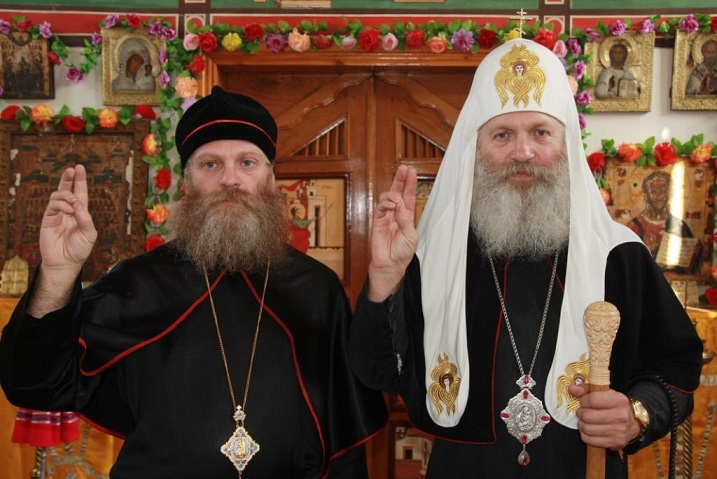
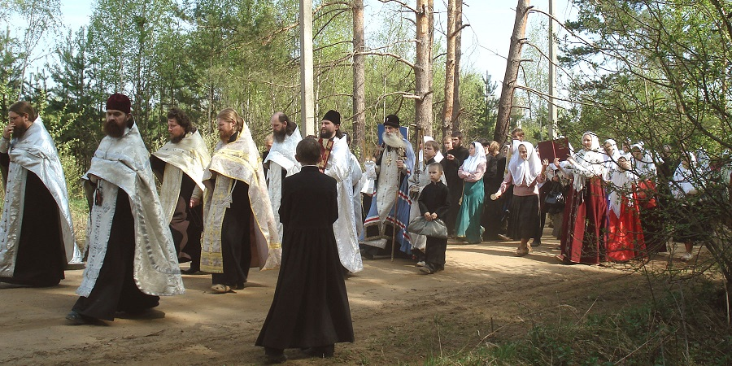

Współcześnie, wśród internetowych “specjalistów”, dominuje pogląd mówiący o tym, że religia była tylko/ przede wszystkim narzędziem kryptoateistycznych elit do kontroli mas. Nie jest to chyba prawda w przypadku Aleksego Romanowa. Car panujący od 1645 roku, wsławił się dwoma rzeczami- odebraniem Polsce wielu ziem ruskich i żarliwą pobożnością. Uważał on, że jest odpowiedzialny za zbawienie swoich poddanych. Na przykład w 1651 roku wymusił delegalizację odprawiania skróconych liturgii*. Car promował ponadto reformy cerkiewne i chciał zwiększyć rygoru moralny wśród kleru i wiernych. Jego sojusznikiem był patriarcha Nikon, który prowadził zakrojone na szeroką skalę reformy mające wzmocnić cerkiew jako instytucję. Posunięcia Krzewicieli Pobożności (tak nazywano cara i jego obóz) wywoływały często opór ze strony zarówno laikatu jak i duchowieństwa. Napięcie rosło, ale otwarty konflikt wybuchł z całą mocą gdy wprowadzono reformy liturgiczne.

Krzewiciele uznali, że należy odtworzyć powiązania z innymi cerkwiami. W trakcie spotkań z Grekami Rusini doszli do wniosku, że ich nabożeństwa i praktyki różnią się. Uznali, że skoro przyjęli prawosławie z Bizancjum, to różnice te są pokłosiem lokalnych innowacji i należy się ich pozbyć. Problem polegał na tym, że dla wielu Rusinów to właśnie ich wersja była “pierwotna” a różnice tłumaczyli osmańskimi i katolickimi wpływami u Greków. Fakt, że wielu greckich duchownych kształciło się u katolików (w tym jeden z reformistów, Arseniusz) sprawiał, że reformę postrzegano jako papieski spisek. Przekonanie te wzmacniały dwa fakty. Pierwszym były liczne próby narzucenia unii przez katolików (często siłą). Drugim był fakt, iż greccy biskupi na soborze we Florencji uznali papieskie roszczenia (nie weszły one w życie wobec oporu wiernych).

Zdaniem Rusinów Grecy stracili przez to prawo przewodzenia- to Moskwa była teraz Rzymem, stolicą jedynego prawdziwie chrześcijańskiego imperium. Nikon miał inne zdanie. Rozpoczął wprowadzanie zmian mających upodobnić ruskie zwyczaje i praktyki do “oryginalnych”. Najbardziej kontrowersyjny był zakaz czynienia znaku krzyża za pomocą dwóch palców i obowiązek dodania trzeciego. Synod nakazał rewizję wszystkich ksiąg liturgicznych i zmiany na grecką modłę. Zmieniono ilość prostracji i pokłonów, transkrypcję słowa Jezus (Isus na Iisus), częstotliwość modlitw oraz wprowadzono drobne korekty do translacji credo. Zmiany generalnie dotyczyły najczęściej powtarzanych w nabożeństwach słów, gestów i symboli. Dodatkowo, Nikon wprowadzał swoje reformy “na chama”. W pewnym momencie przestał słuchać się nawet cara i patriarchy ekumenicznego, którzy widząc opór przed zmianami proponowali żeby obok zrewidowanego rytu funkcjonował tradycyjny.

W 1656 roku Nikon posunął się do ogłoszenia starego symbolu krzyża heretyckim. Niejako oznaczało to, że ludzie sprzed reformy byli heretykami. Niepokornych zsyłano do klasztorów i więzień. Polemiki mówiące o tym że zmian nie wprowadzano na podstawie starożytnych tekstów liturgicznych tylko ich ówczesnych, greckich wersji (potwierdzają to współcześni badacze) tłumiono. Zdaniem krytyków Nikon hellenizował ruskie prawosławie. Został on wprawdzie zdjęty z urzędu przez synod w 1666 roku, ale ten sam synod potępił zwolenników starego rytu jako heretyków. Protestujący kler został ukarany (niektórych pozbawiono języków) przez cara i uwięziony. W 1676 roku padł opierający się reformie klasztor Sołowiecki (bronił się od 1668 roku) a jego załoga zmasakrowana. W 1681 roku spalono na stosie kilku przeciwników reformy. Przekaz był jasny- cerkiew i carat nie cofną się przed niczym żebym zrobić kuku tym, których nazywali raskolnikami (schizmatykami). Bardziej neutralnymi określeniami byli starowiercy i staroobrzędowcy.

Myślę, że wielu czytających ma teraz w głowie niezły mętlik na zasadzie “Co?! Zabijać z powodu jednego palca więcej/ mniej?!”. W prawosławnej tradycji, która powstała przecież gdy 90% ludzi była analfabetami, liturgia i rytuały były bardzo ważne. Były to bowiem w zasadzie jedyne transmitery treści teologicznych. Żaden gest, żadna czynność i żadne słowa (oraz ich częstotliwość i kolejność) nie są przypadkowe. Jakiekolwiek zmiany rytu były odbierane jako próba zmiany samej wiary. Chodziło także o sposób reformowania, potępienie starych obyczajów jako heretyckich oraz dążenia Nikona do centralizacji cerkwi i kontroli nad życiem parafialnym. Silny był zwłaszcza opór niższego kleru, który uważał, że zdecentralizowanie i elementy lokalne są cechą prawosławia, a centralizacja i uniformizacja to “papistowskie herezje”. Wielu starowierców było zresztą gotowych do zaakceptowania reformy pod warunkiem możliwości używania także starego rytu i luźniejszej struktury cerkwi.

O tym nie było jednak mowy. Schizma stała się faktem. Grup starowierczych było dużo i nie tworzyły one homogenicznego ruchu. Często różniły się w wielu sprawach, a wspólne było to, że obstawały przy starym rycie. Szybko zaczęło dochodzić do rozłamów. Jedną z największych kontrowersji była kwestia duchowieństwa. Wobec braku biskupów z ważną sukcesją apostolską (oficjalna cerkiew popadła przecież w herezję, więc jej linia przestała być koszerna) nie było nikogo kto mógłby wyświęcać nowych duchownych. Część starowierców stwierdziła, że “zasady uber alles” i, nie mogąc wyświęcać księży, obchodzili się bez nich. Te grupy nazwano bezpopowcami. Inni, popowcy, zaczęli tworzyć własne hierarchie przyjmując skruszone duchowieństwo nowego rytu lub akceptując święcenia od innych cerkwi. Punktów niezgody było jednak więcej co w połączeniu z rozległością terytorialną i faktem migracji doprowadziło do powstania kilku organizacji religijnych starowierców.

Generalnie popowcy byli bardziej umiarkowani. Starali się kontynuować życie cerkiewne sprzed reformy, odprawiali liturgie, uznawali sakramenty i posiadali księży. W wyniku wyodrębnienie się kilku linii hierarchicznych, powstały różne organizacje kościelne popowców. Do naszych czasów przetrwały dwie największe. Pierwsza to hierarchia białokrynicka, ustanowiona przez greckiego biskupa, konwertytę na stary ryt, Ambrożego. Druga to hierarchia nowozybkowska (obecnie Rosyjska Cerkiew Staroprawosławna). Bezpopowców generalnie uważa się za bardziej radykalnych. Wielu uznało reformy Nikona i idące za nimi prześladowania za początek panowania Antychrysta. Głosili konieczność ścisłej ascezy i bezwzględnej obrony wiary przed szatańskimi zakusami. Skoro cerkiew zdradziła, to stała się “babilońską nierządnicą” i próby układania się z nią są zdradą. Bezpopowcy odrzucali nie tylko księży, ale (wiele grup) także liturgię i sakramenty. Z racji radykalizmu i idących za nim ostrzejszych prześladowań, wielu bezpopowców musiało uciekać.

No właśnie, migracje. Prześladowania “raskolników” zelżały wprawdzie za Piotra Wielkiego, ale później było jeszcze kilka prób siłowego “przekonania schizmatyków do pojednania”. Starowiercy uciekali więc z regionów w których władze były sprawne w bardziej bezludne lub pograniczne obszary. I tak różne grupy osiedliły się nad Bałtykiem, na Uralu, w Rumunii, północy Rosji i na Syberii. Mieli tam generalnie spokój jako, że władze, zajęte kwestiami obronności i handlu, przymykały oko na ich niekoszerność. Starowiercy byli generalnie bardzo przedsiębiorczymi i wspólnotowymi ludźmi, toteż często doceniano ich jako osadników w dzikich i niebezpiecznych regionach. Wiele grup było także bardzo żywa intelektualnie i publikowała polemiczne i misjonarskie teksty, mające na celu wykazać czemu ich sprzeciw wobec polityki caratu i synodu był zasadny. Paradoksalnie- pojawienie się staroobrzędowców przyczyniło się do ożywienia umysłowego życia religijnego w Rosji, bo cerkiew też starała się odpierać krytykę i przekonywać starowierców do powrotu pod jej skrzydła.

.")

Pierwsze grupy starowierców zaczęły wracać do komunii z oficjalną cerkwią pod koniec XVIII wieku. Inicjatorem był arcybiskup Nicefor, który w 1781 roku przyjął wspólnotę popowców z okolic Melitopola do cerkwi. Zezwolił im na samodzielne wybieranie duchownych i używanie starych rytów i ksiąg liturgicznych. Pociągnęli oni za sobą kolejne grupy. Wielu liderów staroobrzędowców, widząc, że takie porozumienia działają i nie kończą się nawracaniem, zaczęło samodzielnie zwracać się do władz z prośbą o legalizację. Na początku synod ani carat nie chciały się wprawdzie zgodzić na powstanie hierarchii starowierczej i akceptowali pojedyncze wspólnoty jako parafie ze specjalnym rytem. Zjawisko to dało początek tak zwanym Edinoverie (Jednowiercy, czyli wierzący w to samo). Car Paweł I nakazał wyświęcanie księży specjalnie dla starego rytu i respektowanie zwyczajów jednowierców. Tak też się stało, choć niektórzy duchowni byli przeciw. Do wybuchu rewolucji komunistycznej istniało około 300 parafii jednowierczych.

Powstanie ZSRR sprawił, że wielu staroobrzędowców uciekło do Chin. Pozostali tam do lat 50. Wówczas zaczęły się wielkie projekty kolektywizacji rolnictwa, której oczywiście byli przeciwni. Dzięki wstawiennictwu ONZ i Czerwonego Krzyża, chińskie władze zgodziły się na migrację. Starowiercze grupy zostały osiedlone na Alasce i w Ameryce Łacińskiej- głównie Boliwi, Urugwaju i Brazylii. Ich osady wyglądają często jak żywcem przeniesione z XVII czy XVIII wiecznej Rosji i mocno wyróżniają się na tle latynoskiego otoczenia. Starowiercy generalnie starają się nie asymilować, aby nie zatracić “prawdziwej wiary”. Jako, że są to grupy z dużym przyrostem naturalnym i bardzo tradycyjne to wzbudziły one duże zainteresowanie władz rosyjskich. Obecnie ekipa Putina stara się ściągać wygnańców do ojczyzny, oferując im ziemię i pomoc w osiedleniu się. Wiele grup zdecydowało się na powrót, ale wiele nie chce mieć nic wspólnego z “Antychrystem” i żyje sobie w swoich enklawach, kontynuując tradycje ruskiego prawosławia.
