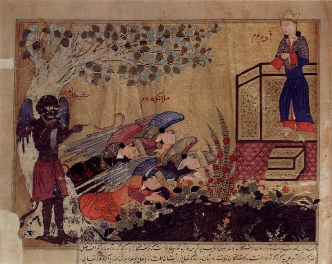
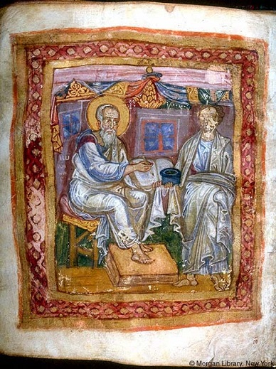
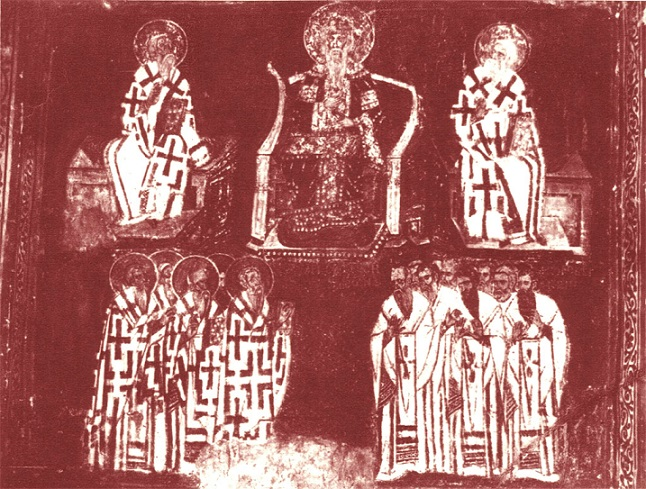

Zapewne każdy w miarę myślący człowiek zadawał sobie kiedyś pytanie- dlaczego na świecie dzieje się tyle zła? Pytanie to jest jeszcze bardziej zasadne w kontekście chrześcijaństwa. Religia ta postuluje bowiem istnienie nieskończenie dobrego (a przy tym wszechmocnego) Boga. Skoro Wszechmogący jest Dobrem Wcielonym, a wszystko co istnieje jest jego dziełem, to skąd zło? Po co nieskończenie dobry Bóg miałby stwarzać zło? I jak to w ogóle możliwe, że je stworzył skoro jest dobry? W teologii chrześcijańskiej istnieje cała gałąź próbująca jakoś pogodzić postulat wszechmogącego, dobrego Boga z istnieniem zła i cierpienia (zowie się to to teodycea). Próby rozwiązania puzzla są różne. I tak na przykład niektórzy teolodzy twierdzą, że zło nie jest wcale dziełem Boga. Jest ono konsekwencją odrzucenia bożej łaski przez człowieka. Czyli zło to tak naprawdę nieobecność bożej łaski spowodowana odmową człowieka. Bóg kierowany szacunkiem do człowieka i jego woli honoruje zaś te decyzje i nie narzuca się- nawet jeśli w konsekwencji prowadzi to do czegoś strasznego (tak, ta cringe’owa anegdotka o studencie i profesorze ma swoje korzenie właśnie tutaj).

Oczywiście prób wyjaśnienia przyczyny istnienia i powszechności zła jest dużo, ale bardzo często odwołują się właśnie do wolnej woli człowieka i postulatu, że Bóg tę wolę poważa. Wiele z tych wytłumaczeń (zwłaszcza starszych datą) dodawało do równania Szatana, zbuntowanego anioła. Szatan miał jakoby zbuntować się przeciwko Bogu z zazdrości o miłość jaką Najwyższy obdarzył człowieka. Kierowany zawiścią stara się ze wszystkich sił odciągnąć ludzi od Boga. Problem w tym, że szatan w tradycyjnej chrześcijańskiej teologii jest trochę jak wróg w autorytaryzmach- jednocześnie słaby i silny. Słaby- bo w porównaniu do Boga jest zwykłym neptkiem, ale silny- bo jednak jakoś zwodzi ludzi na manowce. Zdaniem wielu ludzi ten obraz jest jednak zbyt sprzeczny z wszechobecnością i potęgą zła jaką obserwują. Ludzie ci dochodzili do wniosku, że Szatan (czy szerzej- siły zła) wcale nie jest tak bezradny wobec Boga jak twierdzą ortodoksyjne doktryny. Ba! Niektórzy wręcz twierdzili, że jest równorzędnym graczem. Poglądy takie określa się mianem dualistycznych. Są starsze od chrześcijaństwa i dość silnie manifestowały się w wierzeniach irańskich, skąd przenikały do religii semickich i greckich. Dualizm mocno zinfiltrował także wczesne grupy chrześcijańskie i inne rozwijające się wówczas systemy wierzeń.

Marcjonizm, jedna z najstarszych herezji, jest chyba najlepiej znaną starożytną formą dualizmu chrześcijańskiego. Jej twórca, Marcjon miał zupełnie inną interpretację chrześcijaństwa od tej którą ostatecznie przepchnięto jako ortodoksyjną na soborach ekumenicznych. Uważał on, że bóstwo opisywane w pismach żydowskich jest okrutne, niezrównoważone i zazdrosne. Nie potrafił przekonać się do wierzenia, że pełne miłości do człowieka bóstwo, o którym mówił Chrystus i apostołowie, to ten sam byt co JHWH. Marcjon doszedł zatem do wniosku, że jest dwóch bogów- jeden jest wcielonym złem a drugi wcielonym dobrem. Bóg Chrystusa był wprawdzie Najwyższym Bogiem, ale jego przeciwnik, JHWH, był również boskim bytem. Stąd nie sposób lekceważyć sił i możliwości zła. Marcjon nie był odosobniony w swoich poglądach a powagi dodawał mu fakt, że był jednym z pierwszych którzy próbowali skompilować kanon chrześcijańskich tekstów. Dodatkowo wspólnoty Marcjona całkowicie odrzucały żydowskie obyczaje i prawa (w końcu były one wymysłem psychopaty JHWH) co znacznie ułatwiało ewentualną konwersję poganom, którzy interesowali się osobą i nauczaniem Chrystusa, ale nie pasował im żydowski kontekst kulturowy (w II wieku w wielu wspólnotach funkcjonowały jeszcze zwyczaje żydowskie. Ba! Istniały całe grupy tzw. judeochrześcijan).

Te czynniki i powszechność dysonansu między żydowską Biblią a nauczaniem Jezusa i Apostołów sprawiły, że poglądy Marcjona były bardzo popularne. I to pomimo potępienia ze strony wielu liderów wspólnot chrześcijańskich i, później, prześladowań. Marcjonici zdołali przetrwać bardzo długo i dotrzeć ze swoim nauczaniem w dalekie regiony starożytnego świata. I to mimo tego, że ich religia była bardzo restrykcyjna i wymagająca w stosunku do wiernych. Marcjon rozumował, że skoro zły JHWH stworzył materialny świat to znaczy, że coś musi być z tym światem nie tak. Stąd daleko posunięty ascetyzm i postulat celibatu nawet między małżonkami (w tym akurat nie był odosobniony, poglądy takie miały nawet niektóre grupy, które później uznano za ortodoksyjne). O sile i zasięgu oddziaływania Marcjona świadczy fakt, że jeszcze w IV wieku Cyryl, biskup Jerozolimy, zabraniał podróżującym wiernym modlić się z grupami chrześcijan których nie znają. Mogli to bowiem być marcjonici, których liczne wspólnoty zamieszkiwały wiele osad w Syropalestynie. Tomasz z Margii opisywał dzieje pewnego biskupa z Dailamu, żyjącego w VIII wieku, który nawracał „Marcjonitów, pogan i Manichejczyków”. Ibn al-Nadim, muzułmański uczony z X wieku, pisał natomiast o wspólnotach marcjonitów z Chorasanu, którzy „odprawiali swoje obrządki całkowicie jawnie, podobnie zresztą jak manichejczycy”.

Podobne tendencje przejawiały także niektóre chrześcijańskie grupy tak zwanych gnostyków. Część z nich była wręcz radykalnie dualistyczna i garściami czerpała z motywów irańskich kultów. Do tego stopnia, że niektóre z tych grup twierdziły wprost, że materia jest złem, więzieniem idealnej, niematerialnej duszy i zadaniem człowieka jest nic innego jak wyzwolenie się z okowów materialnego świata i pomaganie innym w tym samym celu. Cała epoka późnej starożytności i wczesnego średniowiecza była naznaczona dualizmem. Obok dualistów odwołujących się do chrześcijaństwa istniały też całe religie oparte na tej idei. Najpopularniejsza z nich, manicheizm, była przez długi czas poważnym rywalem dla chrześcijaństwa a popularność jaką zyskała sobie na ziemiach cesarstwa była tak wielka, że trzeba było naprawdę krwawych prześladowań aby ją “wyplenić”. Na przykład w 382 roku cesarz Teodozjusz wydał edykt w którym z automatu skazywał na śmierć wszystkich, którzy byli manichejskimi mnichami. Kara śmierci groziła za samo posiadanie manichejskich tekstów. O problemie jakim był manicheizm dla kościoła świadczy fakt, że termin ten stał się wręcz synonimem słowa herezja i był na przestrzeni wieków używany na określenie nawet tych grup, które z naukami Maniego nie miały nic wspólnego. O żywotności i możliwościach adaptacji manicheizmu świadczy choćby to, że przetrwał on do mniej więcej XIV wieku w… Chinach (więcej tutaj).

Mimo tępienia myśli dualistycznej przez partię, która ostatecznie wygrała teologiczne spory i z pomocą władz rzymskich narzuciła “ortodoksyjną” interpretację chrześcijaństwa jako oficjalną, idee nie zniknęły. O dualizm oskarżano na przykład tak zwanych messalian, czyli członków wspólnot syriackich funkcjonujących na pograniczu persko- rzymskim w IV i V wieku. Łatkę dualistów przypięto także paulicjanom, którzy narodzili się jako ruch polityczno- religijny w VII wieku. Były to głownie ormiańskie wspólnoty, które odrzucały autorytet zarówno ortodoksyjnej jak i miafizyckiej organizacji kościelnej. Korzystając z politycznego osłabienia cesarstwa Rzymskiego, stworzyli własne państewko we wschodniej Azji Mniejszej, ale zasięg występowania ich wspólnot wykraczał daleko poza te tereny. Ostatecznie zostali jednak pokonani przez Rzymian i cesarze zaczęli przesiedlać ich jako osadników wojskowych do zachodniej części swojego imperium. Część paulicjan została osiedlona w Tracji gdzie ich poglądy spotkały się z zainteresowaniem sąsiedniej, słowiańskojęzycznej ludności. Idee paulicjan miały dać jakoby impuls do powstania grup znanych jako bogomiłowie. Grupy te również były oskarżane o dualizm. Ci z kolei mieli zanieść swoje wierzenia Serbom, dając początek Babunom. Stamtąd zaś misjonarze mieli udać się do Bośni i Dalmacji. Ta ostatnia była natomiast przyczółkiem do ekspansji na łacińską część chrześcijańskiego świata.

Czemu ciągle piszę o “oskarżeniach”, ‘łatkach” i “przypisywaniu” zamiast otwartym tekstem walnąć, że grupy te były jawnie dualistyczne? W przypadku paulicjan i messalian po prostu brakuje nam źródeł. To znaczy nie mamy praktycznie żadnych zabytków ich piśmiennictwa. Pod paulicjan często podpina się wprawdzie “Klucz do prawdy”, ale tekst ten powstał w ramach grupy znanej jako tondrakici. Część uczonych uważa, że grupa ta była pokrewna paulicjanom, ale nikt tak naprawdę tego nie wie. Nawet jeśli jakieś związki faktycznie występowały, to nadal nie wiadomo w jakim stopniu (i czy w ogóle) grupy te były zgodne ze sobą. Czytając zaś ortodoksyjnych autorów nie sposób nie dojść do wniosku, że bardziej zależy im na oczernieniu niż rzetelnym opisie teologii konkurencji. Taki na przykład Psellos oskarżał messalian o organizowanie kazirodczych i homoseksualnych orgii i dodawał, że poczęte w ten sposób potomstwo było następnie ofiarowane Szatanowi i zjadane w ramach rytualnego kanibalizmu. Tak odjechane oskarżenia stawiają pod znakiem zapytania wiarygodność opisów i są raczej czymś na kształt figury retorycznej, a nie rzeczywistą relacją. Dodatkowo warto pamiętać, że oskarżenia o arianizm, manicheizm (czyli dualizm) były często rytualnymi obelgami i mogły nie mieć nic wspólnego ze stanem faktycznym.

Ponadto grupy o których tu mowa w większości przypadków nie tworzyły scentralizowanych, zhierarchizowanych i zdoktrynalizowanych instytucji. Były raczej czymś na kształt luźnej federacji zaprzyjaźnionych wspólnot z różnych regionów, które miały pewne podobieństwa w nauczaniu, ale także różnice (i te mogły być bardzo daleko idące). Postrzeganie ich przez pryzmat współczesnego kościoła katolickiego z jego papiestwem, soborami i kongregacjami do spraw nauczania tego i owego jest po prostu błędne. Jeśli już można je do czegoś porównać to raczej do zborów zielonoświątkowych, które nie tworzą scentralizowanych struktur- mają swoich “starszych” czy “pastorów” i utrzymują kontakty z innymi w ramach różnych stowarzyszeń i federacji. Poglądy i interpretacje (zwłaszcza w przypadku szczegółów) mogą się jednak znacznie różnić. Stąd jakaś grupa messalian faktycznie mogła mieć dualistyczne poglądy albo doń zbliżone, a inna już nie. Ponadto poglądy tych grup mogły się zmieniać i ewoluować wraz z upływem czasu, dojrzewaniem idei teologicznych, wymianą pokoleń wśród “starszych”, działalnością charyzmatycznej jednostki czy wpływem innych wspólnot. Żeby było jeszcze weselej- doktryna nie była “wyryta w kamieniu” (bo na przykład uchwalił ją nieomylny sobór i potwierdził książę apostołów) zatem pole do interpretacji i zmian było duże.

Jedyną grupą z wyżej wymienionych co do której mamy raczej pewność w kontekście oskarżeń o dualizm są bogomiłowie. W dużym uproszczeniu (bo były różne warianty) ich kosmologia twierdziła, że Najwyższy Bóg miał dwóch synów- starszego Satanaila i młodszego Michała. Satanail zbuntował się przeciwko Bogu i wbrew ojcu stworzył materialny świat i człowieka, ale nie potrafił go ożywić i obdarzyć osobowością. Zwrócił się wówczas o pomoc do Ojca, a ten, z tylko sobie znanych przyczyn, ożywił Adama, pierwszego człowieka. Satanail zamienił go i jego potomstwo w niewolników i traktował ich okrutnie (niespodzianka!!!). Ojciec wysłał wówczas Michała z misją uwolnienia ludzkości i uświadomienia jej czym jest świat w którym żyją i jakie jest ich prawdziwe pochodzenie i przeznaczenie. Michał wcielił się w niejakiego Jezusa z Nazaretu w czasie chrztu w Jordanie i objawił ludziom, że mają niematerialną duszę, którą mogą uwolnić z materialnej pułapki jeśli odrzucą doczesne przyjemności i zło będące konsekwencją pożądania ich. Michał znacznie osłabił Satanaila, ale ten dzięki intrygom i machinacjom doprowadził do ukrzyżowania brata. Aby zapobiec rozprzestrzenianiu się prawdy głoszonej przez Jezusa, Satanail założył ortodoksyjny kościół. Jako władca materialnego świata załatwił mu sojusze z królami i sprawił, że z czasem stał się on potężniejszy od kościoła założonego przez Chrystusa.

W XII wieku mamy pierwsze wzmianki źródłowe o chrześcijańskich wspólnotach dualistycznych w Europie Zachodniej. Do końca nie wiadomo czy grupy te powstały w wyniku misjonarskiej działalności z Bałkanów czy też rozwinęły się samodzielnie. Możliwe zresztą, że było tak i tak- to znaczy niektóre grupy zostały założone przez misjonarzy, a niektóre powstały samoczynnie. Te które powstały samoczynnie mogły potem inspirować się wschodnimi a te wywodzące się z działalności misjonarskiej przejmować idee od tych “autochtonicznych”. Współcześnie uważa się, że słynna wędrówka dualizmu (wraz z legendarną mapką z Wikipedii) od Azji Mniejszej do Langwedocji jest zbyt dużym uproszczeniem zróżnicowanej historii jednej z najbarwniejszych herezji łacińskiej Europy. Ciężko jednak zaprzeczyć, że kontakty miały miejsce. Źródła opisują na przykład wizytę lidera bogomiłów, Nicetasa. Odwiedził on wspólnoty dualistów, których kościół ochrzcił mianem katarów, a którzy sami siebie nazywali po prostu Dobrymi Ludźmi lub Dobrymi Chrześcijanami. Historycy wskazują jednak, że Nicetas i jego ludzie nie byli misjonarzami ani nawet nie tworzyli jednej organizacji kościelnej z Zachodem. Potwierdził to sam Nicetas w trakcie tak zwanego synodu z Saint-Felix, stwierdzając, że dualistyczne wspólnoty nie mogą wchodzić sobie w paradę i być rządzone jedna przez drugą.

Katarzy i im podobne grupy były solą w oku papiestwa i kościoła katolickiego. W momencie największego rozkwitu działały nieomal całkowicie jawnie na terenach północnych Włoch i południowej Francji, nierzadko utrzymując dobre stosunki z miejscowymi feudałami. Dualistyczne grupy działały także na terenie półwyspu Iberyjskiego, Niemiec, Czech i Węgier. Kościół miał prawdziwy problemy żeby wyplenić konkurencje. Udało się to dopiero dzięki skoordynowanym wysiłkom zbrojnych wypraw, akcji misjonarskich i działalności inkwizycji- a i tak zajęło to prawie dwa stulecia i zostało okupione zdewastowaniem i zubożeniem południowej Francji. Katarom i bogomiłom na pewno poświęcimy jeszcze po odcinku, po to zbyt ciekawe sprawy żeby ich nie opisać.
