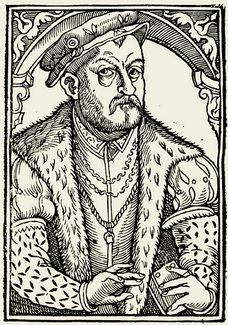
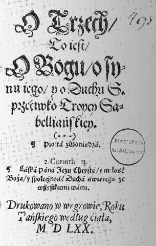
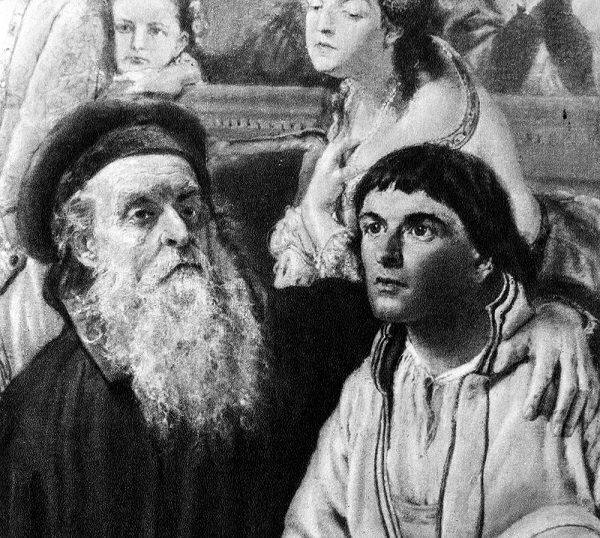
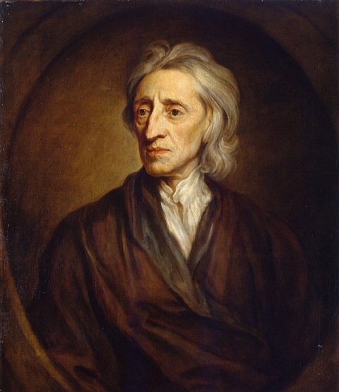

W kwestiach religijnych Polska jest powszechnie kojarzona jako katolicki kraj. Wielu tradycyjnych katolików wzdycha do niej jako ideału- państwa w którym kościół nie jest historyczną ciekawostką, ale instytucją mającą wpływ na rząd i społeczeństwo. Sam kościół bardzo chętnie odwołuje się do odwiecznego jakoby związku z państwem oraz ludem (czasem przesadza, przykładem kompromitujący tekst arcybiskupa Jędraszewskiego). Jednak każdy kto ma choćby cień pojęcia o historii wie, że przez znaczną część dziejów byliśmy krajem wielu religii, wyznań i kultur. Niektórzy do dziś wzdychają za Rzeczpospolitą Obojga Narodów albo wręcz roją o jej odbudowie. Ziemie będące pod panowaniem Jagiellonów zamieszkiwały wówczas różne grupy bałtyjskie, zachodnio i wschodniosłowiańskie, przybysze z Niemiec, Niderlandów, Turcy, Tatarzy, Żydzi, Ormianie a nawet Szkoci. Jeśli zaś chodzi o religię, to na ziemiach RON egzystowały różne wspólnoty muzułmańskie, żydowskie i chrześcijańskie. Obok tradycyjnych wyznań chrześcijańskich (katolicyzm, prawosławie, miafizytyzm) w XVI wieku zaczęły pojawiać się nowe, protestanckie wspólnoty.

Był to efekt działalności ludzi, którzy uznali, że należy zreformować kościół- ich zdaniem papiestwo odeszło bardzo daleko od nauczania Jezusa i Apostołów. Reformatorzy różnili się od siebie, ale łączyło ich to, że odrzucali dyktat kościoła w kwestii tego w co i jak należy wierzyć. Zgadzali się też, że podstawą religii powinna być Biblia a nie zwyczaje i późniejsze teksty, które postrzegali jako czysto ludzkie. Szybko okazało się jednak, że kościół zreformować się nie da. Zaczęły więc pojawiać się nowe wspólnoty. W Polsce drugiej połowy XVI wieku miała miejsce duża liczba konwersji na kalwinizm i luteranizm wśród szlachty i mieszczaństwa. Sprawiły one, że ruch reformacyjny choć nie był masowy (nie dotknął prawie w ogóle chłopstwa), miał duże wpływy i cieszył się szacunkiem i poparciem ze strony szlacheckich elit politycznych i intelektualnych. Wielu przywódców popularnego wśród szlachty ruchy egzekucyjnego było protestantami.

W przeciwieństwie do Europy Zachodniej Polska nie doświadczyła wojen religijnych. Kościół starał się wprawdzie ograniczyć ruchy reformacyjne, ale przez długi czas nie przynosiło to pożądanego skutku. Poza motywami religijnymi chodziło także o przywileje i wpływy. Kościół nie płacił większości podatków, posiadał sporo ziemi oraz prawo do sądzenia tych których uznał za heretyków. Reformatorzy szlacheccy skutecznie podważali ten stan rzeczy. Na przykład na sejmie z 1550 roku odebrano kościołowi prawo do karania “odstępców” (kościół dalej mógł ogłosić kogoś heretykiem, ale nie mógł skazywać). Mimo silnego oporu ze strony biskupów szlachta przegłosowała także postanowienia konfederacji warszawskiej z 1573 roku. Głosiła ona wolność wyznania i zasadę tolerancji religijnej. Co więcej- każdy kandydat na władcę musiał przysięgać, że będzie przestrzegał tych postanowień. Pozwoliło to na rozkwit protestanckiego życia religijnego i intelektualnego. Sprawiło także, że Polska stała się swoistą bezpieczną przystanią dla nawet najbardziej egzotycznych dysydentów religijnych.

Kimś takim byli właśnie tak zwani arianie. Ich pojawienie się w Polsce jest łączone z działalnością krakowskich teologów, włoskich misjonarzy i idei społecznych propagowanych przez anabaptystów i braci czeskich. Grupa krakusów gościła w 1551 roku Leona Sozzini, którego teologiczne tezy mocno godziły w dogmat Trójcy Świętej. Poglądy te zdobyły sobie pewną popularność i spowodowały powstanie wspólnot odrzucających katolickie rozumienie Trójcy. Za ich twórcę tradycyjnie uznaje się Piotra z Goniądza. Mimo niskiego pochodzenia (był chłopem) ukończył prestiżowe studia w Padwie (na które, o ironio, wysłał go biskup Holszański). W trakcie pobytu za granicą Piotr spotkał się z pismami Michała Serwetusa i rozpoczął romans z antytrinitarną teologią. Po powrocie do Polski w 1555 roku przyłączył się do kalwinów. Zaledwie rok później, na synodzie w Seceminie, odrzucił równość Jezusa i Boga Ojca, za co został ostro skrytykowany. Jego zwolennicy (wśród nich była tak wpływowa figura jak hetman Jan Kiszka) nie zostawili go. Dzięki ich wsparciu, Piotr założył własną wspólnotę kalwińską i antytrynitarną. Wsparcie możnych szybko się jednak skończyło.

Była to konsekwencja nie tyle poglądów religijnych, ale raczej programu społecznego. Grzechem Piotra było przekonanie, że system feudalny jest niesprawiedliwy i sprzeczny z zasadami biblijnymi. Głosił równość wszystkich ludzi, wzywał do zniesienia pańszczyzny i pacyfizmu. Spowodowało to odpływ bardziej zachowawczych kalwinów. Piotr nic sobie z tego nie robił i propagował swoje poglądy. Wtórowali mu zagraniczni kaznodzieje działający w Polsce, tacy jak Giorgio Blandrata, Francesco Stancaro, Gregorius Pauli, Faust Socyn czy Pierre Statorius (autor pierwszej pracy o gramatyce języka polskiego). Próby mediacji między kalwinami podjęto na synodach w Pińczowie (1561), Krakowie (1562) i Piotrkowie (1564), ale zakończyły się one tylko sformalizowaniem rozłamu. Antytrynitarze zostali wyrzuceni poza nawias kalwinizmu i zaczęli działać na własne konto. To właśnie kalwini ochrzcili ich mianem arian, oskarżając ich tym samym o jedną z najmocniej zwalczanych przez wczesny kościół herezji. Sami zainteresowani określali się jednak jako unitarianie, chrześcijanie oraz bracia i wskazywali, że nie są zwolennikami Ariusza.

Wspólnoty te nie były liczne i szalenie popularne, ale dzięki obecności licznych intelektualistów- wpływowe. Przekładało się to na bogatą działalność pisarską i polemiczną. W tym właśnie celu, w 1574 roku, bracia założyli drukarnię. A mieli kogo drukować- w ich szeregach działały takie sławy jak Andrzej Frycz Modrzewski (uczony i pisarz), Mikołaj Sienicki (inicjator konfederacji warszawskiej), Grzegorz Paweł (teolog i prekursor utopijnego socjalizmu), Marcin Czechowic (autor jednego z pierwszych tłumaczeń Biblii na polski), Jan Niemojewski (apologeta i teolog), Stanisław Lubieniecki (historyk i astronom, jego imię nosi jeden z kraterów księżycowych), Erazm Otwinowski (poeta i teolog), Szymon Budny (tłumacz biblijny i apologeta) czy Andrzej Wiszowaty (autor Religio rationalis, w której podjął próbę pogodzenia sprzeczności między religią a rozumem). Szacuje się, że bracia napisali około 500 politycznych, społecznych, teologicznych i historycznych traktatów. Głównymi ośrodkami były Pińczów i Raków. Obydwie wspólnoty dysponowały własnymi uczelniami, które oferowały nie tylko stricte religijną edukację. Ta druga była tak poważana, że zaczęto ją określać mianem Sarmackich Aten (nawiązanie do idei sarmatyzmu i Akademii Ateńskiej). W okresie największego rozkwitu miała około tysiąca studentów różnych wyznań.

Liczniejsze grupy działały także w Krakowie, Lublinie, Nowym Sączu, Lubartowie, Lusławicach, Kisielinie, Śmiglu, Węgrowie, Iwie i Łosku. Powstawały wokół bogatych i wpływowych ludzi, którzy mogli zapewnić ochronę. Początkowo grupy antytrynitarne były tylko luźno ze sobą związane, ale zaczęło się to zmieniać wraz z kolejnymi synodami na których ustalano wspólne stanowiska. Jednym z najważniejszych głosów na rzecz uniformizacji był wspomniany już Faust Socyn. Przybył on do Polski w 1580 roku i zyskał sobie liczne grono zwolenników w trakcie synodów z 1584 i 1588 roku. Zaczął opracowywać katechizm mający być wykładnią doktryny. Nie dokończył go jednak i wydano go już po jego śmierci, w 1605 roku. Spotkał się on z dużym zainteresowaniem innych grup protestanckich i kręgów intelektualnych w ogóle- został przetłumaczony na kilka języków. Wiemy, że bracia polscy mieli duży wpływ na kształtowanie się protestantyzmu na Węgrzech i w Rumunii. Ich dzieła czytano także w Niderlandach, Francji, Italii, Niemczech i Szwajcarii. Z powodu sławy Socyna bracia byli znani na Zachodzie jako socynianie.

Ich doktryna uznawała istnienia bożego objawienia. Jego źródłem była Biblia, jako pismo natchnione przez Boga. Przypisywali wielką rolę rozumowi, ale przyznawali, że nie jest on w stanie sam doprowadzić człowiek do zbawienia. Głosili konieczność studiowania Biblii i takiego jej interpretowania aby nie kłóciło się ono z wiedzą o świecie. Twierdzili, że Jezus był po prostu człowiekiem, który dzięki bożej łasce i męczeństwu został wywyższony- stąd zasadne jest oddawanie mu czci. Sprzeciwiali się jednak uznawaniu Chrystusa za logos, przyczynę i twórcę świata. Odrzucali również interpretację męczeństwa Chrystusa jako ofiarę za grzechy ludzi. Rozumowali, że Bóg jest dobry i miłosierny, więc mógł wymagać męki krzyża dla odkupienia grzechów. Istnienie piekła, również kłóciło się ich zdaniem z miłosiernym Bogiem (ponadto uważali, że Biblia nie wspomina o piekle i jest ono zapożyczeniem z innych religii). Nauczali, że Duch Święty nie jest zaś bytem samym w sobie, ale po prostu łaską, którą Bóg obdarza wiernych. Zdecydowanie odrzucali papiestwo, kult świętych, kult relikwii i “świętych przedmiotów”, zaangażowanie kościoła w politykę państw feudalnych, kościelne gromadzenie bogactw, chrzest niemowląt i przypisywanie nadrzędnego znaczenia rytuałom.

Ze sporów między zwolennikami izolacji i aktywizmu społecznego zwycięsko wyszła ta druga grupa. Bracia wyprzedzili swoją epokę jeśli chodzi o poglądy polityczne i społeczne. Głosili równość ludzi wobec prawa i sprzeciwiali się okrutnemu traktowaniu chłopów. Podkreślali znaczenie edukacji dla postępu społecznego i kierowania się racjonalizmem. Nawoływali do absolutnej tolerancji religijnej i rozdziału państwa od kościoła. Mało tego! Niektórzy autorzy uważali nawet kobiety za zupełnie równie mężczyznom i generalnie cieszyły się one wieloma swobodami o których katoliczki czy inne protestantki mogły zapomnieć. Zdarzało się nawet, że to kobiety nauczały (do dzisiaj szokuje to niektórych katolików, dopiero co w XVI wieku). Byli również pacyfistami. Że co, że brzmi znajomo i nazywa się liberalizm? No tak, w XXI wieku może i brzmi znajomo, ale w XVI i XVII wieku, czasach feudalizmu, społeczeństwa stanowego, myślenia magicznego, dominacji mężczyzn i szalejących wojen religijnych była to prawdziwa rewolucja. Idee socynów wywarły wpływ na ojców liberalizmu i oświecenia. Czytali ich John Stuart Mill, John Locke i Isaac Newton.

Dzięki zmianom na arenie międzynarodowej oraz wysiłkom dostojników kościelnych sytuacja wyznaniowa zaczęła się w Polsce zmieniać na niekorzystną dla protestantów. Kościół od samego początku poważnie potraktował zagrożenie reformacyjne. Orędownikiem rekatolicyzacji był kardynał Stanisław Hozjusz. Gorąco sprzeciwiał się postanowieniom konfederacji warszawskiej i popierał jezuitów, którzy zaczęli napływać do Polski. Szybko otrzymali szkoły, kościoły, szpitale i pieniądze. Przypisuje się im największą rolę w zwycięstwie kontrreformacji. Dzięki rozlicznym szkołom wywarli duży wpływ na kształcenie elit, które potem decydowały o losach państwach. Nie trzeba chyba mówić, że nie uczono tam poszanowania dla wolności wyznania. Dodatkowo w 1603 roku ukazał się w Polsce pierwszy indeks ksiąg zakazanych. Ostateczny cios nadszedł jednak po potopie szwedzkim. Fakt, że władca szwedzki był protestantem i specjalnymi względami darzył swoich współwyznawców był darem losu dla kontrreformatorów. W ich propagandzie protestancka szlachta stała się teraz podwójnymi zdrajcami- kościoła i Polski.

Bracia polscy nie dość, że byli protestantami to jeszcze mieli równościowe i antyfeudalne pomysły. Szlacheccy członkowie grupy potrafili uwalniać chłopów i oddawać im część swoich włości. W 1658 roku bracia zostali zdelegalizowani a jej męscy członkowie mogli migrować, przyjąć katolicyzm albo umrzeć. Większość wybrała migrację i udali się do Prus, Niderlandów i Transylwanii. Po krótkim czasie dołączyły do nich także kobiety. Diaspora pozostała wierna tradycjom intelektualnym i w 1668 roku wydała wielką kompilację rozlicznych prac socynian. Została ona szybko wrzucona na indeks ksiąg zakazanych. Katoliccy teologowie uważali ją za jedno z “największych zagrożeń dla chrześcijaństwa”. Wrogość otoczenia i odmienność światopoglądowa sprawiły, że bracia mieli duże problemy z prozelityzmem. Ich liczba zaczęła się szybko kurczyć. Ostatnia kongregacja została zamknięta w 1803 roku.
