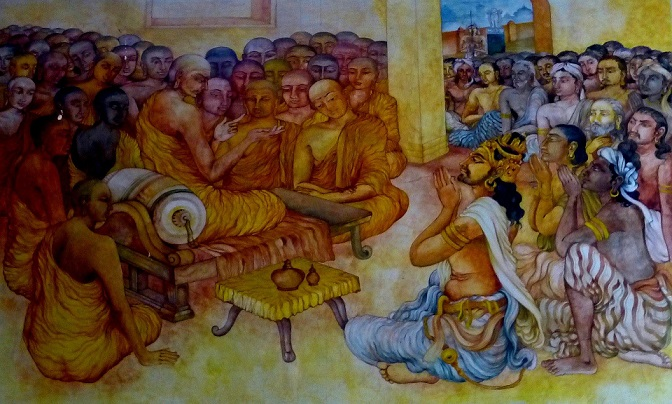
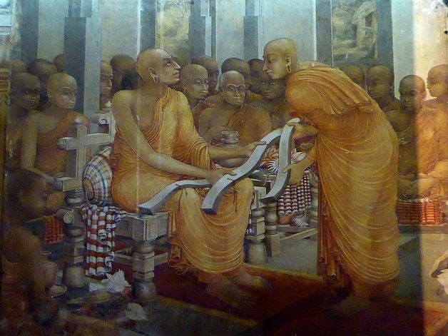
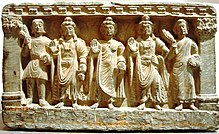
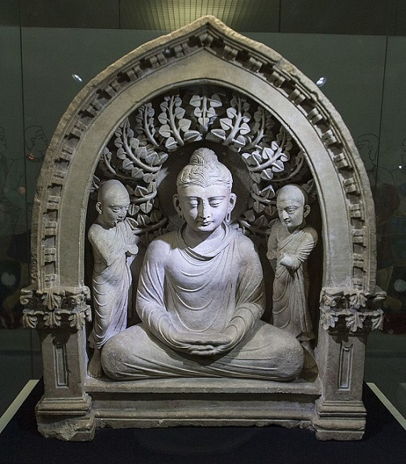
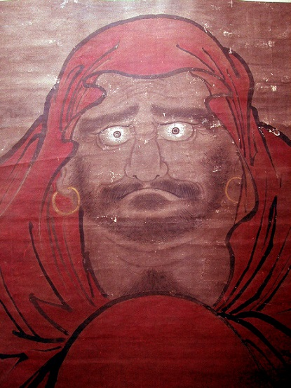
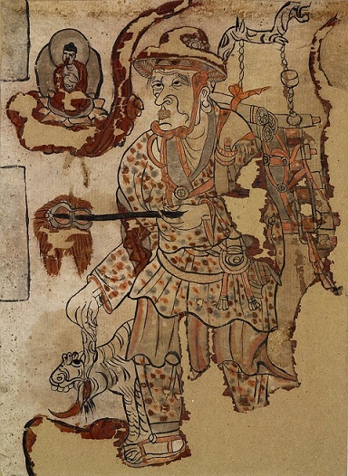

Jedną z wielu rzeczy którą wsławili się talibowie (obok pokonania ZSRR, brania amerykańskich pieniędzy i goszczenia bin Ladena) było zniszczenie liczących sobie niemal 1,5k lat posągów Buddy w afgańskim Bamian. Stało się to w 2001 roku czyli wtedy, kiedy autor tego wpisu miał wątpliwą przyjemność uczęszczać do podstawówki. Jako ciekawy świata dzieciak kojarzyłem Afganistan z islamem więc zdziwiłem się bardzo słysząc o wielgachnych posągach Buddy właśnie w tej lokalizacji. Przecież buddyzm to religia rodem z Indii i charakterystyczna raczej dla Dalekiego Wschodu, prawda? Nie znałem wówczas jeszcze angielskiego na poziomie umożliwiającym swobodne czytanie toteż odpowiedź na pytanie: “ale skąd one się tam w ogóle wzięły?” znalazłem dopiero parę ładnych lat później.

Buddyzm rzeczywiście narodził się w północno- wschodnich Indiach, między VII a V wiekiem p.n.e. Nie ograniczał się jednak do swego matecznika. W przeciwieństwie do większości ówczesnych systemów religijno- filozoficznych nauczanie Siakjamuniego (Buddy) rościło sobie prawa do bycia uniwersalnym. Początkowa działalność misjonarska nie była oszałamiająca, ale zmieniło się to za sprawą cesarza Aśoki. Według podań władca, zżerany przez wyrzuty sumienia z powodu licznych wojen, zapragnął czynić więcej dobra niż zła. Za dobre uznał między innymi idee buddyjskich wspólnot i dlatego zaczął je wspierać. Od czasów Siakjamuniego doszło do podziałów na kilka grup i ruchów, które różniły się zdaniem na temat tego co jest właściwymi praktykami i poglądami. Podziałom próbowano zapobiec zwołując dwa synody (a według legendy, Aśoka zwołał trzeci). To wszystko jednak nie zdało się na wiele- istnienie różnych szkół i tradycji było faktem. Przyczyn tego stanu rzeczy było wiele.

Uważa się, że jedną z kości niezgody był status arhatów- mnichów, którzy osiągnęli już oświecenie. Część uważała, że należy ich traktować jak nieomal nadprzyrodzone istoty. Inni twierdzili, że nadal posiadają oni ludzkie słabości. Tematem sporu była też kwestia tego co jest niezbędne dla osiągnięcia oświecenia- niektórzy uważali, że tylko wąska grupa ludzi może je osiągnąć. Kontrowersyjną kwestią były również elementy ludowe- powszechny stawał się na przykład kult rzekomych relikwii Buddy i popularnych mnichów. Problemem było także podejście do vinayi- zbioru zasad sanghi (wspólnoty monastycznej). Część uważała, że wiążące są tylko te zasady, które pochodzą od samego Buddy. Inni twierdzili, że należy być posłusznym także późniejszym. Istniało również wiele różnych komentarzy do nauk Buddy oraz ich kompilacji. Każda grupa twierdziła, że jej kanon jest lepszy i pełniejszy od innych. Według tradycji istniało wówczas 18 szkół z których tylko Theravada (“Droga Starszych”) przetrwała do dzisiaj.

Za propagowaniem buddyzmu stali zarówno mnisi jak i świeccy zwolennicy, zazwyczaj kupcy. Liczne i często bogate oraz wpływowe wspólnoty buddyjskie zaczęły powstawać na terenie współczesnego Pakistanu, Afganistanu i Azji Środkowej. Najpopularniejsze były tam szkoły znane jako Dharmaguptaka, Sarvastivada i Mahasamghika. To właśnie ta ostatnia stała najprawdopodobniej za posągami Buddy w Bamian. Według legendy pierwszymi buddystami na tych terenach byli bracia Tapassu i Bhallika. Pochodzili jakoby z Baktrii (północny Afganistan) i osobiście poznali Buddę i jego przekaz w Indiach, po czym wrócili do domu i nauczali. Bardziej historyczne informacje o misjach buddyjskich na tym terenie pochodzą z czasów wspomnianego już Aśoki. W ciągu kilku wieków Baktria stała się silnym ośrodkiem propagowania buddyzmu. Odwiedzający ją w VII wieku chiński pielgrzym, Xuanzang, wspominał o 100 buddyjskich klasztorach i trzech tysiącach mnichów. Miejscowy buddyzm mieszał się z lokalnymi wierzeniami- indyjskimi, irańskimi, stepowymi i… greckimi.

Historia oślepienia Kunali, syna Aśoki, jest łudząco podobna do greckiej tragedii o Hipolicie i Fedrze. Indo-grecki król Meneander I był bardzo życzliwie nastawiony do buddyzmu czego świadectwem jest zapis jego rozmów z mnichem Nagaseną, stworzony na podobieństwo platońskich dialogów. Motyw Herkulesa z maczugą stał się inspiracją dla przedstawiania strażnika Buddy, Vajrapani. Motyw Zeusa zamieniający się w orła aby porwać Ganimedesa został wykorzystany do ilustracji opowieści o bodhisattvie, który zakochał się w zamężnej kobiecie i przemienił się w ptaka Garudę aby móc się z nią spotykać. Co ciekawe- motyw ten przeniknął także w głąb Indii, a nawet do Chin. Buddyjska opowieść o oblężonym bodhisattvie, który nie daje się nabrać na wielkiego drewnianego słonia jest oparta na przekazach o koniu trojańskim. Wiele inskrypcji po grecku z tamtych terenów jest albo jawnie buddyjska albo ma buddyjską wymowę. Wysoka forma greki i odwołania do mitologii świadczą o tym, że ich autorzy byli Grekami albo przynajmniej ludnością zhellenizowaną.

U początku II wieku p.n.e Grecy utracili kontrolę nad Baktrią na rzecz irańskich Saków. Nowi władcy nie ingerowali jednak w życie poddanych. Wiemy ponadto, że i oni mieli coś wspólnego z buddyzmem- wiele inskrypcji wskazuje, że religia ta rozwijała się bez problemów. Po około stu latach Saków zastąpili Kuszanie, indoeuropejscy koczownicy znani ze źródeł chińskich jako Yuezhi. Oprócz Baktrii podbili oni także znaczną część północno- zachodnich Indii. Łatwo ulegli lokalnym wpływom- do tego stopnia, że greka była u nich językiem administracji i polityki. Vima, władca Kuszanów, był żywo zainteresowany indyjskimi wierzeniami i osobiście czcił Sziwę. Jego wnuk, Kaniszka, znany w literaturze buddyjskiej jako “Drugi Aśoka”, miał ogromne zasługi dla rozwoju buddyzmu. Budował klasztory, wspierał je finansowo, dbał o kształcenie mnichów, zapewniał ochronę i popierał działalność intelektualną. Buddyjska tradycja utrzymuje, że to on zwołał synod w Kaszmirze na którym zapadła decyzja o przetłumaczeniu lokalnych buddyjskich dzieł na sanskryt.

Wielu badaczy uważa, że grecko- irańskie wpływy za rządów Kuszanów miały decydujący wpływ na kształt Mahajany, której silnym ośrodkiem (a bardzo możliwe, że nawet matecznikiem) była Gandahara. Uważa się, że Mahajana nie była szkołą buddyjską, a raczej panbuddyjskim ruchem. Cechą charakterystyczną była akceptacja nowych pism, praktyk i zwyczajów. Łączyło się to z przekonaniem o nadludzkim charakterze Buddy oraz szczególnym skupieniem na współczuciu i pomocy wszystkim czującym istotom znajdującym się w gorszym położeniu. Mahajana głosiła także, że każda istota posiada naturę buddy i może dążyć do jej pełnego urzeczywistnienia. Ci, którzy podjęli się tego zadania, zwani byli bodhisattvami. Przysięgali, że będą odradzać się nawet wtedy, kiedy już nie będą musieli aby oświecać innych. Pojawiły się też wierzenia o możliwości przekazania cnoty przez bodhisattvów, którzy mieli jej więcej niż potrzebowali. Zwolennicy tych poglądów patrzyli na inne interpretacje buddyzmu z wyższością, określając je jako “Hinajana” (czyli “Mniejszy Wóz” w przeciwieństwie do Mahajany, czyli “Większego Wozu”).

Chińskie źródła z III wieku n.e przedstawiają państwo Kuszanów jako silny ośrodek buddyzmu. Podania jak to o mnichu Sutralance z Puskarawati (współcześnie Charsadda), który udał się do Szasz (Taszkient) aby przyozdobić tamtejszą świątynię, pokazują, że kuszańscy buddyści byli zaangażowani w działalność misyjną w Azji Środkowej. Z chińskich źródeł wiemy jednak, że nauki Siakjamuniego nie zdobyły sobie tam silnej pozycji- wspominany już Xuanzang pisał o nielicznych grupach w Samarkandzie, a pewien koreański podróżnik wspominał o zaledwie jednym mnichu żyjącym w klasztorze. Buddyjskie wspólnoty istniały także w Mervie i innych regionach współczesnego Turkmenistanu. Relatywnie mała popularność buddyzmu w regionie jest paradoksem- to właśnie środkowoazjatyccy misjonarze (głównie Sogdyjczycy) zanieśli buddyzm do Chin i dalej na Wschód. Swoistym przystankiem na drodze do Chin była kotlina Kaszgarska.

Buddyzm dotarł tutaj najprawdopodobniej w pierwszym wieku n.e, ale według tradycji miało to miejsce już w czasach Aśoki. Miejscowi władcy wspierali rozwój wspólnot buddyjskich. Buddyjskie freski odnajdywane w kotlinie są łudząco podobne do gandaharskich, co zaświadcza o wpływach kuszańskiego buddyzmu. Ciekawostką jest fakt, że większość namalowanych postaci ma jasny odcień skóry, jasne oczy i włosy. Jest to pokłosie tego, że w omawianym okresie region ten był zamieszkany głównie przez indoeuropejskie ludy irańskie i tocharskie. W pobliskim Miranie odnaleziono malunki buddyjskiego artysty znanego jako Tita. Dało to asumpt do teorii o rzymskim buddyście Tytusie odwiedzającym kolejne wspólnoty położone na Jedwabnym Szlaku. Ciekawostką jest również fakt, że o ile większość kaszgarskich buddystów stała się w okolicach V wieku zwolennikami Mahajany, to Kucha jeszcze w VII wieku była zdominowana przez Sarvastivadan.

Równolegle z rozwojem buddyzmu w Kaszgarze, misjonarze zaczęli docierać do Chin, które w pierwszym wieku n.e znacznie rozszerzyły swoje granice na zachód. Pierwsze źródłowe wzmianki o buddystach na ziemiach chińskich dotyczą gubernatora prowincji Chu, który łączył buddyzm z taoizmem. Księga Późniejszych Hanów podaje:

"Kiedy gubernator wysłał jedwabne dary jako znak poddaństwa do Minga, cesarza Han, ten odpowiedział mu następująco: “Król Chu recytuje subtelne słowa Huang-lao [odłam taoizmu] i z szacunkiem odprawia ofiary przeznaczone Buddzie. Niech zatem dobra będą mu oddane aby wspomóc upasana (świeccy wyznawcy) i śramana (mnichów)." 

Fragment ten jest ciekawy z dwóch powodów. Po pierwsze pokazuje cechę charakterystyczną chińskiego buddyzmu u samych jego początków- skłonność do mieszania się i zapożyczania wierzeń i praktyk z lokalnych religii i filozofii. Po drugie wskazuje, że cesarz chiński był dobrze zaznajomiony z buddyzmem- znał nawet indyjskie określenia na wiernych i mnichów. Buddyjskie legendy mówią, że rzeczony cesarz Ming stał za sprowadzeniem misjonarzy do Chin- miał jakoby mieć sen o złotym człowieku i utożsamić go z Buddą.

Pierwszy znany z imienia i wymieniony przez źródła misjonarz to Shigao. Był on Partem, który w 148 roku przybył do chińskiej stolicy, Luoyang. Prawdopodobnie to on stał za przetłumaczeniem pierwszych buddyjskich tekstów. Podejrzewa się, że to on zaczął uczyć Chińczyków metod i praktyk dhjany (medytacji). Jako osoba pochodząca z Iranu znał się dość dobrze na astrologii, co było chyba najbardziej pożądaną przez Chińczyków umiejętnością (przypisywali oni duży wpływ ciał niebieskich na życie ludzkie). Kolejnym znanym ze źródeł misjonarzem był An Xuan, który również pochodził z Partii. Dołączył w 181 roku do Szigao i wsparł go w tłumaczeniach. Był on prawdopodobnie pierwszym zwolennikiem Mahajany w Chinach. Kolejny był Kuszanin, Lokaksema, który wraz ze swoimi uczniami tłumaczył kolejne teksty. Co ciekawe, aż dwóch z trójki jego podopiecznych należało do grup taoistycznych, co zaświadcza o szybkiej akulturacji buddyzmu w Chinach. Jedenaście najstarszych zabytków piśmienniczych Mahajany, które zachowały się do naszych czasów to właśnie chińskie tłumaczenia Lokaksemy i jego studentów.

Kolejni buddyjscy misjonarze pochodzili głównie z Sogdiany i Kaszgaru. Najsłynniejszym z nich jest Kumarajiva z Kuchy. Choć wywodził się z regionu opanowanego przez Sarvastivadan, był proponentem Mahajany. Przypisuje mu się ponad 300 przetłumaczonych na chiński dzieł. Niektórzy historycy odrzucają wprawdzie teorię o środkowoazjatyckiej drodze transmisji buddyzmu do Chin i twierdzą, że odpowiedzialni za nią byli mnisi z Indii. Mnogość środkowoazjatyckich zabytków buddyjskich i analiza językowa chińskich tłumaczeń tekstów przeczą jednak tym teoriom. Oczywiście nie oznacza to, że nie było bezpośrednich dróg transmisji buddyzmu z Indii do Chin- jak najbardziej mogły one istnieć i odgrywać pewną rolę, ale ciężko zaprzeczyć ogromnemu wkładowi partyjskich, sogdiańskich i kaszgarskich misjonarzy i uczonych. Nawiązanie bezpośrednich kontaktów z indyjskim buddyzmem jest datowane na nieco późniejsze czasy.

Prawdopodobnie z Azji Środkowej pochodził Bodhidharma, jedna z ważniejszych postaci nie tylko chińskiego buddyzmu, ale buddyzmu w ogóle. Istnieją podania wiążące jego osobę z południowymi Indiami, ale jest raczej pewne, że do Chin przybył przez Zachodnie Regiony (czyli Azję Centralną). Opisy przedstawiające go jako niebieskookiego barbarzyńcę zdają się sprzyjać teorii o irańskim pochodzeniu. Działał w V lub VI wieku a jego nowatorstwo (albo, w innej wersji- powrót do korzeni) polegało na tym, że uważał on wszystkie buddyjskie rytuały, ofiary, modlitwy, legendy i podania za w gruncie rzeczy bezwartościowe. To znaczy- nie potępiał ich i nie żądał odcięcia się, ale uważał, że istotą buddyzmu jest praktyka medytacji i rozważania nad paradoksami (zwanymi gong’an). Te rzeczy jako jedyne prowadzą do Oświecenia, co jest inherentnym celem buddyzmu. Szkoła Chan, której dał początek rozprzestrzeniła się w Korei jako Seon i w Japonii jako Zen. Z Bodhidarmą wiąże się bardzo dużo legend- przypisuje mu się na przykład założenie klasztory Szaolin i wpływ na kung fu.

Wraz z rozwojem buddyzmu w Chinach część jego zwolenników uznała, że proces mieszania się oryginalnych koncepcji z natywnymi zaszedł za daleko. Na przykład termin dharma (w dużym skrócie- nauczanie Buddy), bodhi (oświecenie) i yoga były tłumaczone na chiński jako tao (“droga”, ale w znaczeniu porządku wszechświata, najwyższego wzorca), który to termin był silnie nasiąknięty wierzeniami taoistycznymi. Arhat był tłumaczony jako “zhenren” (Prawdziwy Człowiek) co w religii ludowej oznaczało osobę, która osiągnęła nieśmiertelność. Przykładów uproszczeń i reinterpretacji buddyzmu było bardzo dużo. Dlatego też wiele osób decydowało się na wyprawę do Indii w celu poznania pełniejszej i pierwotniejszej wersji nauk Siakjamuniego. Nie był to jedyny motyw podróży- wielu chciało po prostu zobaczyć na własne oczy miejsca które odwiedził Budda i jego pierwsi uczniowie.

Kres rozwojowi a nawet istnieniu buddyzmu w Azji Środkowej przyniosły podboje islamskie. Muzułmańscy władcy byli skłonni tolerować innowierców, którzy należeli do grupy tak zwanych “Ludów Księgi”- za takowych uważali chrześcijan, żydów i sabejczyków. Niektórzy dodawali jeszcze zoroastrian. Buddyści jednak nie znajdują się w tej kategorii. Na domiar złego można ich oskarżyć o prawie wszystkie największe “grzechy” z islamskiego punktu widzenia. Przede wszystkim buddyści czcili wielu bogów a przy tym odrzucali koncept osobowego Absolutu. Ich świątynie i miejsca kultu były pełne posągów i innych wyobrażeń ludzi oraz zwierząt- przedmioty te były często obiektami kultu. Dla muzułmanów było to jawne bałwochwalstwo, jeden z najcięższych grzechów. Oprócz tego było jeszcze wiele innych czynników (na przykład rywalizacja kupców na Jedwabnym Szlaku)- ostatecznie islam wyparł buddyzm z Azji Środkowej, Pakistanu i Afganistanu niemal całkowicie. Według danych statystycznych mniej niż 1 procent mieszkańców regionu określa się dzisiaj mianem buddystów.
