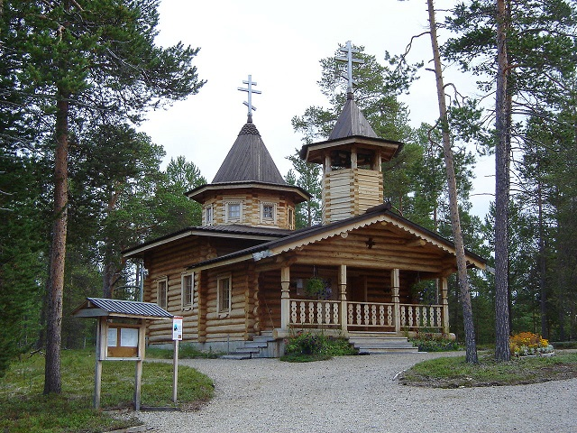
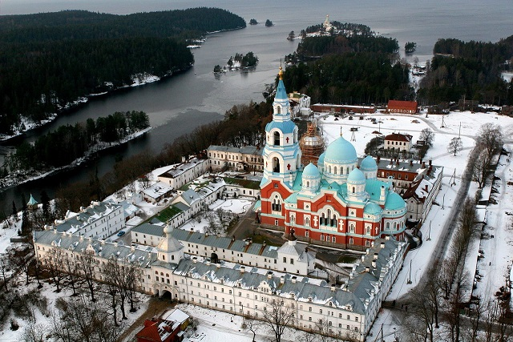
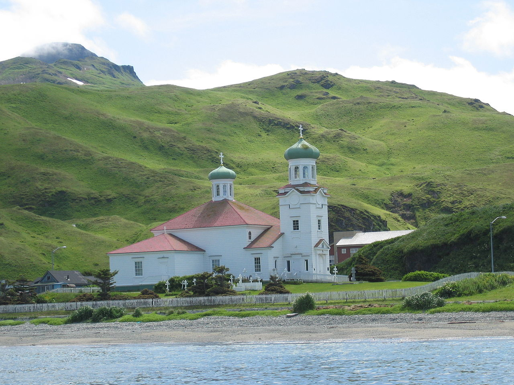
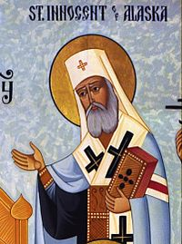
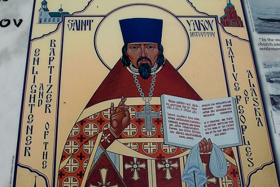
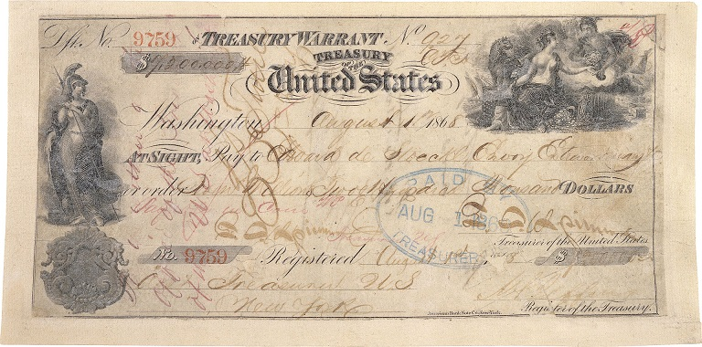

Misje chrystianizacyjne prowadzone w europejskich koloniach są tematem kontrowersyjnym. Z jednej strony kościoły lubią mówić jak to niosły Słowo Boże i jak przybliżały ludzi do Jezusa (cokolwiek to znaczy). Z drugiej historycy jak i sami zainteresowani (albo raczej- to co z nich zostało) zwracają uwagę na często nie do końca humanitarne metody jak i fakt, że ewangelizacja była produktem kolonialnego systemu, który nie zapisał zbyt pięknych kart w dziejach rdzennych społeczności. W niektórych przypadkach zakończył te dzieje na dobre. Oczywiście sprawa nie jest jednowymiarowa- wielu misjonarzy dostrzegało niesprawiedliwości kolonializmu a w religii widziało program nie tylko duchowy, ale i społeczny, którego realizacja położyła by kres uciskowi. Były także misje, które działały na terenach nie objętych bezpośrednią władzą mocarstw kolonialnych albo wręcz od nich niezależnych. Jedną z ciekawszych (i mniej znanych) misji chrześcijańskich w Nowym Świecie była działalność prawosławna na Alasce.

 dowód na to, że chrześcijaństwo może szkodzić zdrowiu.")

Rosyjskie parcie na Wschód sięga XVI wieku. Przez kolejne stulecia podróżnicy, myśliwi i kupcy eksplorowali Syberię docierając aż nad Pacyfik. W 1741 roku Vitus Bering i Aleksander Chirikow dotarli, przez wyspy Aleuckie, do Alaski. Ekspedycja zakończyła się wprawdzie śmiercią wielu jej członków (w tym Beringa), ale odkryła wiele wysp i rosyjską drogę do Ameryki Północnej. Za odkrywcami ruszyli tak zwani promyszleniki- myśliwi i kupcy szukający możliwości zarobku. Rdzenna ludność Alaski początkowo znalazła się w konflikcie z żadnymi zysku przybyszami. Sytuacja była jednak dynamiczna- wśród promyszlenników byli prawie sami mężczyźni- jedynymi kandydatkami na żony były więc lokalne kobiety. Integracja obydwu społeczności była tak szybka i silna, że James Cook, który odwiedził Aleuty pod koniec XVIII wieku nie potrafił odróżnić jednych od drugich. Rosjanie nie tylko wżenili się w lokalne społeczności, ale także nauczyli ich języków i przejęli wiele lokalnych zwyczajów a jednocześnie przynieśli lokalsom własne.

Jednym z rosyjskich wkładów w wymianę kulturową było prawosławie. Wśród osadników i podróżników nie było jeszcze regularnego kleru, ale ludzie sami chrzcili swoje dzieci i krewnych oraz uczyli ich jakichś podstaw swojej religii (na tyle ile ją znali). Dni swobody i wolnej, nomen omen, amerykanki były jednak policzone. Interes w eksploatacji Nowego Świata zwietrzyli zamożni kupcy i w 1784 roku niejaki Szelikow utworzył na wyspie Kodiak pierwszą regularną rosyjską kolonię. Kilka lat później Szelikow udał się do Petersburga chcąc uzyskać państwowy monopol na handel futrem. Caryca Katarzyna odmówiła, ale przedsięwzięciem zainteresował się miejscowy metropolita, Gabriel. Nie interesowały go futra a raczej “duchowe potrzeby” Rosjan i ich rodzin żyjących w Nowym Świecie. Gabriel zebrał kilku duchownych ze słynnego klasztoru Wałaam. Klasztor położony był w Karelii i miał doświadczenie w pracy misjonarskiej z ugrofińską ludnością. Do dzisiaj wielu fińskich i rosyjskich Saami (Lapończyków) określa się mianem prawosławnych.

W 1793 roku 8 duchownych z Wałaam wyruszyło do Nowego Świata pod przewodnictwem archimandryty Jozafa. Po dotarciu na wyspę Kodiak mnisi wzięli się energicznie do pracy. Wbrew zapewnieniom Szelikowa nie istniał jeszcze żaden kościół ani nie było obiecanych zapasów. Rdzenni mieszkańcy byli raczej przychylnie nastawieni do mnichów. Po mniej niż roku spędzonym na wyspie Jozaf napisał do swojego duchowego ojca w Wałaam:

"Ochrzciłem, chwalmy Boga, więcej niż 7000 miejscowych i połączyłem w małżeństwie więcej niż 2000. Zbudowaliśmy już kościół i jeżeli czas pozwoli, zbudujemy następny oraz dwa przenośne. Przydałby się jeszcze i piąty. Żyjemy dobrze, oni kochają nas a my kochamy ich." 

Mnisi szybko dostrzegli jednak, że kupiecka spółka traktuje lokalsów jak niewolników. Pomyszlennicy działali w małych grupach i musieli raczej dogadywać się z rdzennymi mieszkańcami- kupcy mieli zaś do dyspozycji zbrojne oddziały. Mnisi donieśli o tym co się dzieje Szelikowowi, ale ten olał sprawę. Rosyjskie działania zaczęły wywoływać wrogość wśród części lokalsów o czym boleśnie przekonał się mnich Juwenaliusz, zabity w trakcie wizyty na kontynencie. W 1799 roku Jozaf został nawet biskupem Kodiak, ale zginął w wyniku katastrofy morskiej, gdy wracał z nominacji. Na czele misji stanął wówczas Herman, który otwarcie sprzeciwił się polityce Baranowa, nadzorcy spółki. Został za to uwięziony i zabroniono mu kontaktów z tubylcami. W odpowiedzi na sprzeczne sygnały synod cerkwi wysłał do Kodiak mnicha Gideona aby skontrolował sytuację. Konkluzja jego raportu brzmiała następująco:

"razy jakie otrzymali mnisi od pracowników kompanii są efektem dominującego tam poglądu, który mówi, że “Bóg jest w Niebiosach a car daleko więc tylko Baranow jest tym, którego należy się bać”." 

Raport Gideona nie odbił się jednak szerokim echem. Konflikt znalazł rozwiązanie dopiero gdy Baranow odszedł ze stanowiska i zastąpił go Szymon Janowski. Nowy nadzorca był pod dużym wrażeniem charyzmatycznego Hermana- wkręcił się tak bardzo, że po śmierci żony sam zdecydował się na zostanie monastykiem. Herman ostatecznie zdecydował się na opuszczenie wyspy Kodiak i osiedlił się na sąsiedniej Wyspie Świerkowej. Swoją pustelnię ochrzcił mianem Nowego Wałaam i była ona nie tylko ośrodkiem religijnym, ale także czymś na kształt centrum lokalnej społeczności. Prowadził tam szkołę, sierociniec oraz hospicjum- jego postawa i poświęcenie rdzennej ludności sprawiły, że już za życia był uważany przez miejscowych za świętego. Na formalną kanonizację trzeba było jednak poczekać aż do 1970 roku.

Polityka kompanii uległa zmianie a nałożyło się to na zmiany w samej rosyjskiej cerkwi, która zrozumiała, że Rosja jest wielonarodowym imperium i zaczęła prowadzić misje wśród innych nacji bez dorzucania rosyjskiej kultury. Na Alasce znalazło to swoje odbicie między innymi w osobie księdza Jana Weniaminowa. Po przybyciu na miejsce szybko nauczył się on lokalnych języków a nawet stworzył dla nich alfabet i słowniki. Z pomocą lokalnych konwertytów przetłumaczył Ewangelię według Świętego Marka i część Boskiej Liturgii oraz stworzył katechizm w lokalnym języku. Weniaminow był wziętym stolarzem i kowalem- tę wiedzę również przekazywał miejscowym. Z ich pomocą zbudował w Unalasce kościół Wniebowstąpienia. Założył także sierociniec i szkołę w których uczył dzieci pisania zarówno w ich natywnym języku jak i po rosyjsku. W wolnych chwilach podróżował po wyspach Aleuckich i nauczał oraz chrzcił miejscowych. Jakby tego było mało to w trakcie swoich podróży spisywał informacje na temat geologii, klimatu, ludności, zwyczajów, roślin i zwierząt. Wydał nawet kilka prac naukowych za co został włączony w poczet Carskiej Akademii Nauk.

Na zaproszenie władz kolonialnych osiedlił się następnie w Sitce, stolicy rosyjskiej Ameryki. Rdzenni mieszkańcy tych okolic zwani Tlingit znajdowali się w konflikcie z rosyjskimi osadnikami. Weniaminow przekonał ich jednak do siebie pomagając w trakcie epidemii ospy. Z pomocą konwertytów przetłumaczył liturgię na język Tlingit. Jego parafii podlegała także wspólnota żyjąca w Fort Ross (miejscowość w Kalifornii), najdalej wysunięta na południe posiadłość rosyjska w Ameryce. W trakcie jednej z wizyt spotkał się z hiszpańskimi misjonarzami działającymi w Kalifornii. W 1839 wrócił na chwilę do europejskiej części Rosji gdzie opublikował wyniki swoich badań i próbował wymóc zgodę na utworzenie osobnej diecezji dla Alaski (podlegała ona pod biskupstwo w Irkucku na Syberii). W trakcie pobytu w Europie dowiedział się o śmierci żony i zdecydował się na zostanie mnichem przyjmując imię Innocentego. W 1840 roku cerkiew powierzyła mu biskupstwo Kamczatki, Kuryli i wysp Aleuckich.

Dzięki ożywionej działalności Innocentego liczba wiernych urosła tak, że konieczne stało się stworzenie seminarium aby móc kształcić własne duchowieństwo. Było to o tyle ważne, że Weniaminow był zdania, iż kler musi wywodzić się także z rdzennej ludności. Doceniając jego zasługi, synod cerkwi mianował go arcybiskupem i oddał jego jurysdykcji część wschodniej Syberii. Innocenty powrócił do Azji gdzie nauczył się jeszcze kilku lokalnych języków i kontynuował działalność misjonarską. Przez częste podróże kajakiem w lodowatej wodzie zaczął mieć problemy z nogami, ale nie przeszkodziło to synodowi rosyjskiemu powołać go na metropolitę Moskwy (najwyższy możliwy urząd w ówczesnym rosyjskim prawosławiu). Jako metropolita nie zapomniał o Dalekim Wschodzie i Ameryce- założył Prawosławne Towarzystwo Misyjne, które wspierało życie religijne wśród nierosyjskiej ludności imperium.

Dalsza działalność misyjna i formacyjna w Ameryce była dziełem potomków konwertytów albo ludności kreolskiej (dzieci ze związków mieszanych). Doskonałym przykładem jest postać Jakuba Niecwietowa, którego matka była rdzenną Amerykanką. Przez 18 lat prowadził on misje wśród rdzennej ludności doliny rzeki Jukon. Kultywował podejście Weniaminowa i tłumaczył teksty religijne i liturgiczne na lokalne języki oraz starał się adaptować jak najwięcej lokalnych zwyczajów do praktyki prawosławnej. Można śmiało powiedzieć, że był to standard dla działalności misjonarskiej cerkwi na Alasce. W momencie śmierci Niecwietowa w 1865 roku cerkiew mogła się poszczycić około 12 000 wiernych wśród rdzennych Amerykanów, 9 kościołami, 35 kaplicami, 17 szkołami i 4 sierocińcami. Ogólna liczba prawosławnych była większa gdyż wliczali się do niej także etniczni Rosjanie i ludność mieszana, identyfikująca się jednak bardziej z rosyjskimi korzeniami.

W 1867 Rosja sprzedała swoje amerykańskie posiadłości Stanom Zjednoczonym. Cerkiew nie tylko nie oponowała, ale wręcz uważała to za szansę na zwiększenie prawosławnej obecności w Ameryce. Weniaminow chciał na przykład przenieść stolicę biskupstwa z Sitki do San Francisco i pozyskać nauczycieli angielskiego dla swoich wiernych, mając świadomość, że prędzej czy później język ten wyprze rosyjski. O ile umowa sprzedaży gwarantowała prawną ochronę wolności wyznania i majątku cerkiewnego to tego samego nie można powiedzieć o kulturze i dobrach rdzennej ludności. Dla wielu białych Amerykanów “Indianie” byli niższą rasą, którą należy “ucywilizować” i “nawrócić”, przy okazji odbierając im najbardziej atrakcyjne ziemie i niszcząc ich zwyczaje i języki. Amerykański rząd jak i organizacje zaczęły podejmować próby agresywnej “amerykanizacji” rdzennej ludności.

Udział w tym procederze wzięły niektóre protestanckie kościoły, przede wszystkim prezbiterianie. Zakładane przez nich szkoły i instytucje kulturalne oraz społeczne były “English only”. Jeden z misjonarzy, Hall Young postawił sprawę bardzo jasno pisząc:

"Jedną silna pozycją jaką pierwszy zająłem była decyzja o nie tłumaczeniu niczego na rdzenne dialekty [tak naprawdę języki]. Zrobienie z miejscowych anglojęzycznego ludu jest o wiele prostsze niż schrystianizowanie i ucywilizowanie ich języków. Powinniśmy pozwolić zginąć tym starym językom razem z ich przesądami i grzechami- im szybciej tym lepiej- i zastąpić je chrześcijańską cywilizacją, zachęcając miejscowych do posługiwania się angielskim i tylko angielskim."

Część z tych osób uważała prawosławie za “zabobon” i “pogaństwo” (pokłosie włączenia przedchrześcijańskich zwyczajów do nowej religii) przedstawiali je jako rosyjską wiarę, którą miejscowi powinni porzucić gdyż są teraz amerykańskimi obywatelami. Prawosławne duchowieństwo i liderzy rdzennych wspólnot protestowali przeciwko agresywnemu prozelityzmowi i zwalczaniu rdzennej kultury. Niczego to jednak nie zmieniało- prawosławnych i liderów “Indian” przedstawiano jako ludzi, którzy chcą powstrzymać pochód “tego protestanckiego kraju i jego znakomitych szkół”. Lider prezbiteriańskiej misji odgrażał się wręcz, że “w ciągu 25 lat nie będzie żadnych prawosławnych na Alasce”. Prognozy te się jednak nie sprawdziły i do dzisiejszego dnia stan ten ma największy udział prawosławnych w populacji (5%) i są to w dużej mierze rdzenni Amerykanie.
