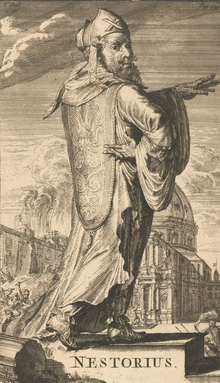
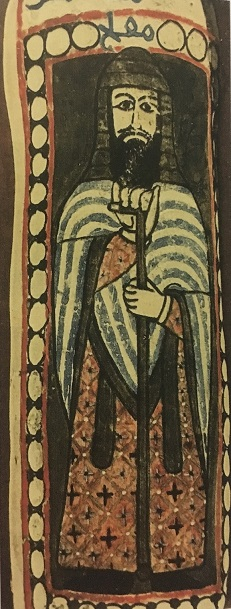
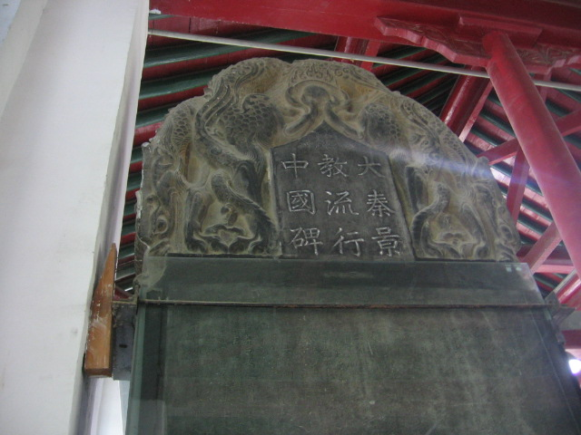
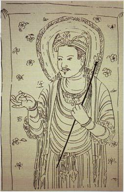

W ostatnim odcinku poruszyłem temat misji i chciałbym przy nim pozostać. Większość znaczących misji w dziejach chrześcijaństwa wyglądała tak, że strona nawracająca miała znaczną przewagę nad nawracanymi. Tak było w przypadku rzymskim a potem europejskim, gdzie to władcy narzucali poddanym wyznanie (choćby u nas) i tak było w przypadkach kolonialnych. Administracja danego imperium albo popierała misje albo wręcz narzucała chrzest. Wiązało się to przede wszystkim z faktem, że kościoły uwielbiały sojusze z tronem. Tron zaś cenił sobie ołtarz z którego co chwila pouczano maluczkich o boskim pochodzeniu władzy. Jest to częsty zarzut krytyków na argument za prawdziwością tej religii (znaczy- że jej rozpowszechnienie nie wynikało za bardzo z jakiejś “prawdziwości”, a raczej z politycznych i społecznych uwarunkowań).

Ciekawym i dość unikalnym zjawiskiem jest tak zwany Kościół Wschodu- określany także jako wschodniosyriacki, asyryjski lub nestoriański. To ostatnie określenie jest niepoprawne, ale najbardziej rozpowszechnione i dlatego też będę go używał. W przeciwieństwie do reszty “historycznych” kościołów (rzymski, prawosławne i miafizyckie) nigdy nie udało mu się zawrzeć efektywnego sojuszu z tronem. Nestorianie byli zazwyczaj mniejszością na terenach na których działali. Nie był to bynajmniej efekt ewangelizacyjnego lenistwa. Wprost przeciwnie- zapał był tak wielki, że przez długi czas kościół ten był najbardziej rozległy geograficznie. I to właśnie rozproszenie było jedną z przyczyn faktu bycia mniejszością (obok niemożności siłowego narzucenia religii przy poparciu władzy). Matecznikiem kościoła była perska Mezopotamia, zwana przez irańskich zdobywców jako Asuristan (kraj Asyryjczyków).

.")

Korzenie kościoła sięgają najwcześniejszych syriackojęzycznych wspólnot chrześcijańskich. Pierwsze powstały w cesarstwie rzymskim, ale z racji ożywionych kontaktów z krewniakami z partyjskiej strony granicy, nowa religia rozpowszechniała się także tam. Partowie byli władcami Iranu do III wieku, kiedy to zostali obaleni przez Sasanidów. Nowa dynastia nie przeszkodziła w rozwoju chrześcijaństwa. Ze źródeł wiemy, że już w czasach partyjskich w Persji funkcjonowało dwadzieścia biskupstw i sięgały one Baktrii (współczesny Afganistan). Sasanidzkie najazdy na Rzymian i idące za nimi przesiedlenia zwiększały liczbę chrześcijan. W wyniku osiedlania greckojęzycznych jeńców z wybrzeży syryjskich (Antiochia i okolice) wśród mezopotamskich chrześcijan wyodrębniły się dwie organizacje kościelne- jedna helleńska, druga semicka. Czemu semicka a nie perska? Ano dlatego, że Mezopotamia, choć rządzona przez Persów to była w większości zamieszkana przez ludy semickojęzyczne.

Po jakimś czasie różnice uległy zatarciu, ale były inne problemy. W IV wieku Rzym stał się chrześcijańskim państwem. Nieustannie skonfliktowani z nim Sasanidzi zaczęli patrzeć na swoich chrześcijańskich poddanych jak na potencjalną V kolumnę. Ponadto Sasanidzi zacieśnili związki z zoroastryjskimi magami i w uznali ich religię za państwową. Zdarzały się prześladowania innowierców, także chrześcijan. Były to jednak raczej okresowe kampanie, przerywane latami spokoju. To wyjaśnia inne zjawisko będące skutkiem “nawrócenia” Rzymu. Władza cesarska zaczęła mieszać się w kontrowersje teologiczne. Za poglądy niezgodne z aktualnie obowiązującymi groziła nawet śmierć. Członkowie frakcji które przegrały salwowali się często ucieczką do Iranu. Perskie władze wręcz cieszyły się z takiego obrotu spraw- ewentualne spory mogły bowiem rozbijać miejscowe wspólnoty chrześcijańskie.

Oszczędzę wam szczegółów dotyczących przebiegu sporów. Wspomnę tylko, że historia o rzekomym przyjęciu nauki Nestoriusza jest nieprawdziwa. Owszem, część jego poglądów była popierana a on sam był generalnie darzony szacunkiem*, ale teologia kościoła Wschodu nie jest nestoriańska. Sami patriarchowie Seleucji- Ktezyfonu (najważniejszy biskup perskich chrześcijan) uważali się za część powszechnego kościoła. Owszem w V wieku pojawił się teologiczny rozjazd z diofizytami (późniejsi katolicy i prawosławni) i miafizytami (tzw. orientalna ortodoksja), ale nie był on jednak tak wielki jak chcieliby niektórzy autorzy “ortodoksyjni”. W międzyczasie, mimo prześladowań, chrześcijaństwo nie tylko przetrwało w Mezopotamii, ale na dobre rozwinęło się także na terenach rdzennie perskich (np. Chuzestan i Sziraz) i kontynuowało ekspansję na Azję Środkową (np. Merw w dzisiejszym Turkmenistanie), Daleki Wschód oraz półwysep Arabski. W VI wieku funkcjonowały nestoriańskie biskupstwa w jemeńskiej Sanie i na Sokotrze. Doszło nawet do chrztów cały arabskich klanów i federacji.

W VI wieku polityka Sasanidów zaczęła się zmieniać. Skoro prześladowania nie hamują wzrostu liczby wyznawców, a ci wyznawcy służą w armii czy w administracji i biorą udział w życiu gospodarczym, to lepiej się dogadać. Oczywiście kościół nie mógł liczyć na takie przywileje jak magowie, ale miał pozytywne relacje z władzą. Zdarzało się nawet, że biskupi i patriarchowie byli doradcami, dyplomatami i członkami dworu. Chosrow II miał nawet chrześcijańską żonę Szirin i był w bardzo przyjaznych stosunkach z patriarchą Sabriszo. Za pontyfikatu Sabriszo doszło do ożywienia ruchu monastycznego w którego skład wchodziły nie tylko osiadłe wspólnoty, ale także wędrowni misjonarze-mnisi. Zaowocowało to aktywnością ewangelizacyjną. Za pontyfikatu Iszujaba II chrześcijaństwo nie tylko na dobre zadomowiło się na ziemiach etniczne irańskich (dowodem utworzenie metropolii w Hulwanie), ale także na terenach afgańskich (nowa metropolia w Heracie) i w Azji Środkowej (metropolia w Samarkandzie).

Jeśli chodzi o ten ostatni region to, jak już wspomniałem, pierwsze wzmianki o lokalnych, licznych wspólnotach chrześcijańskich pochodzą z IV wieku. Głównym ośrodkiem był Merw, którego wpływy nie kończyły się wcale na osiadłych społecznościach regionu- misjonarze nestoriańscy starali się także trafić do koczowniczych sąsiadów żyjących na Wielkim Stepie. Źródła wzmiankują o tureckich królach, którzy przyjmowali chrzest ze swoimi ludami. Nie potrafimy jednak do końca zidentyfikować plemion i ich władców, ale konwersje te są raczej pewne- już w VI wieku zaskoczeni Rzymianie donoszą o chrześcijanach wśród swoich tureckich najemników. Wielu mieszkańców sąsiadującej z Merwem Sogdiany było nestorianami. Sogdyjczycy zajmowali bardzo ważne miejsce w handlu na wschodnim odcinku Jedwabnego Szlaku- pośredniczyli w wymianie między Chinami a Iranem. Prawdopodobnie to właśnie z Sogdiany chrześcijaństwo trafiło do Chin.

Wiemy, że wschodniosyryjscy mnisi wykradli w 552 roku jedwabniki i przewieźli je do Bizancjum. Zorganizowana i uchwytna źródłowo misja zaczęła się jednak w 635 roku wraz z przybyciem Alopena (prawdopodobnie Sogdyjczyka, gdyż źródła zaświadczają o jego znajomości chińskich języków). Przywiózł on ze sobą podarki dla cesarza prosząc władcę o możliwość otwartej działalności. Cesarz zgodę wydał, określając wiarę Alopena jako “Religię Światła”. Nestorianie uzyskali nawet prawo do posiadania klasztoru przy cesarskim dworze. Co ciekawe, dla Chińczyków była to “perska wiara”. W 642 roku misjonarze przetłumaczyli na język chiński najważniejsze dzieła a za rządów cesarza Kao-tsunga (650-83) wydano zezwolenie na budowę kościołów w stolicach chińskich prowincji. Za rządów cesarzowej Wu doszło do pierwszych prześladowań- był to prawdopodobnie efekt tego, że żwawy rozwój chrześcijaństwa był traktowany jako zagrożenie przez kler buddyjski. Potem jednak sytuacja unormowała się.

Tak zwana Stella z Xian (wzniesiona w 781 roku, odnaleziona w 1625 roku) dokumentuje rozwój chrześcijaństwa w Chinach. Była ona dedykowana misjonarzowi Issie z Balchu, który po przybyciu do Chin zasłynął jako sinolog. Stella wspomina nie tylko o Alopenie, ale także niejakim Chi-liehu, który działał w Kantonie. W VIII wieku powstają pierwsze chińskie dzieła chrześcijańskie- Świetliste Nauczanie, Tajemniczy Pokój i Sutra Radości. Duży wkład w tłumaczenie chrześcijańskich dzieł z syriackiego na lokalne języki miał indyjski uczony Pradschna oraz chrześcijański mnich Kingtsing (Adam). Szacuje się, że do X wieku w języku chińskim istniało około 500 dzieł chrześcijańskich (w tym cały Nowy Testament). Większość z nich nie przetrwała do naszych czasów i znamy je tylko ze wzmianek w innych źródłach. Najbogatszą kolekcją są tak zwane Sutry Jezusa, których terminologia obficie czerpie z buddyzmu i taoizmu, co zaświadcza, że miejscowe chrześcijaństwo nie miało problemów z akulturacją.

Zainteresowanie chrześcijan lokalnymi religiami nie było jednostronne. Wielu buddyjskich uczonych interesowało się przybyszami. Zaświadcza o tym fakt, że wśród odnajdywanych dzieł buddyjskich zdarzają się teksty chrześcijańskie lub nawiązania do jego wierzeń. Na przykład jedna z buddyjskich ksiąg z Dunhuang nosi tytuł “Jezus Mesjasz”. Wśród dzieł z Dunhuang znajdują się także dwa teksty przypisywane przywoływanemu już Issie z Balchu. Uczeni nie byli jedyną z wyższych grup społeczeństwa, która interesowała się chrześcijaństwem. Taki na przykład generał i cesarski minister Kuo Tzu łożył ze swojego prywatnego majątku na kościoły i synody duchowieństwa. Arabscy podróżnicy docierający do Chin w VIII i IX wieku zaświadczają o licznych i wpływowych wspólnotach nestoriańskich (co ciekawe- donoszą także, że ci ludzie oburzają się gdy zostaną tak nazwani i sami siebie określają mianem “ibadi”). Abu Said donosi nawet o relacji podróżnika, który rozmawiał z samym cesarzem Itsungiem- według niego sam cesarz prezentował mu manuskrypty z Jezusem na ilustracjach.

Równolegle chrześcijaństwo szerzyło się także wśród Turków poddanych chińskim wpływom i wśród Tangutów (tybetański lud żyjący w Syczuanie). W VIII wieku jeden z tureckich władców Kaszgaru nawrócił się nawet na chrześcijaństwo. Był to jednak ewenement, bo większość możnowładców, nawet jeśli odnosiło się pozytywnie do “religii światła” to zostawało przy lokalnych wierzeniach. Ten brak oparcia na politycznej sile okazał się być problematyczny. W 845 roku cesarz Wu-tsung rozpoczął prześladowania chrześcijan. Zburzono wiele kościołów i klasztorów, bogatsi wyznawcy utracili pozycje i majątki. Mnichów i mniszki pojmano i zsekularyzowano. Patriarcha Teodozjusz I wspomina, że duchowieństwo z Chin nie uczestniczyło w zwołanych przez niego synodach. Od X wieku doniesienia o nestorianach w Chinach stały się coraz rzadsze. Przyjmuje się, że miejscowy kościół albo znikł całkowicie albo został totalnie zmarginalizowany. Na odrodzenie musiał poczekać do czasów imperium mongolskiego. No, ale to już inna (choć nie mniej ciekawa) historia.
