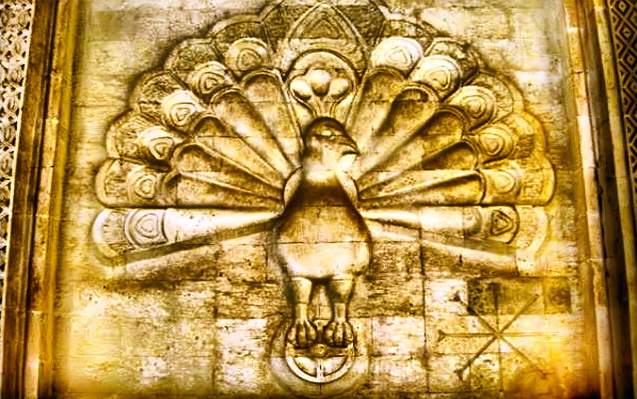

Krzywdzące i stereotypowe sformułowanie zawarte w tytule odcinka, było używane wobec jazydów – społeczności zamieszkującej Kurdystan - od dawna: przez muzułmanów w średniowieczu, europejskich badaczy kultur w XIX w., Saddama Husajna, a obecnie przez islamistów. Zwykle nie kończyło się na przemocy słownej, gdyż jazydzi ją jedną z najbardziej prześladowanych społeczności na przestrzeni dziejów, co ostatnio jest nagłaśniane przez media przy okazji agresji Państwa Islamskiego. Sytuacji nie poprawia izolacja Jazydów - nawet chrześcijańscy czy muzułmańscy Kurdowie wiedzą mało o swoich sąsiadach.

Historycznych początków swojego ludu Jazydzi upatrują w VII w. p.n.e. z początkiem historii kurdyjskiej, nazwa ludu miała się wywodzić od perskiego „ized” czyli anioł. Do niedawna uznaniem cieszyła się teoria, jakoby jazdyzym miał być ruchem oporu kalifa Yazida żyjącego w VIII w. n.e. przeciwko dynastii Abbasydów, która dopiero co przyjęła islam. Teorie te są na razie spekulacjami, jedynym pewnikiem jest postać szajcha Adiego (1075-1160r.) – proroka jazydyzmu. który podróżował po Bliskim Wschodzie słuchając teologów muzułmańskich, chrześcijańskich i żydowskich. Podobno zapuścił się również w okolice Indusu, zanim osiadł w dolinie Lalisz w chrześcijańskim klasztorze. Tam poświęcił swe życie umartwieniom i modlitwie. Jego grób jest najważniejszym miejscem pielgrzymek i modłów dla jazydów. Za życia został uznany za świętego, a po śmierci na wcielenie najwyższego anioła, zwanego Melek Taus co znaczy „Anioł Paw”, które niewypowiadane nigdy imię brzmi Shaytan.

Religia Jazydów opiera się na idei podobną do oświeceniowego deizmu – istnieje jeden najwyższy bóg nie zajmujący się zbytnio losami świata – Jazdan, który stworzył 7 wielkich aniołów, Ziemię oraz człowieka. Nakazał aniołom oddać pokłon człowiekowi, posłusznie więc wypełnili oni polecenie boga – wszyscy oprócz Meleka Tausa. Ten zbuntował się, gdyż uważał, że cześć należy się tylko Jazdanowi. Niezależnie od tego czy miał rację, został wtrącony do piekła i stał się upadłym aniołem. W otchłani Melek Taus żałował za swoje czyny i płakał rzewnymi łzami przez 7000 lat, napełniając 7 wielkich dzbanów, których użył potem do ugaszenia ognia piekielnego. Jazdan w dowód wdzięczności przywrócił Meleka Tausa do chwały, dał mu najwyższą godność i nakazał sprawować władzę nad Ziemią. Z tego powodu jazydzi czczą Meleka Tausa, a nie Jazdana, a szajch Adi jest najważniejszym człowiekiem, któremu przynależy wszelka cześć.

Wierzenia jazydzkie były przekazywane przede wszystkim ustnie. Istnieją co prawda dwie święte księgi – „Księga Objawienia” Szajcha Adiego i „Czarna Księga” wczesnomuzułmańskiego teologa Hasana al-Basriego (642-728r.), jednak nie są one znane przez większość wiernych. Nie istnieje spójna i jasna doktryna, religia ta jest mieszanką zapożyczonych z sąsiadujących religii elementów. I tak: istnieje Jazdan i Melek Taus (odniesienie do zaratustrzańskiego boga Ahura-Mazdy), stworzyciele świata i człowieka, który potem popełnia grzech i zostaje wypędzony z Raju, a na ziemię przychodzi wielka powódź (judaizm). Czczone jest Słońce, Księżyc, Ziemia i gwiazdy jako osobne aspekty bóstwa (starożytne religie mezopotamskie). Obowiązkiem każdego jazyda jest modlitwa trzy razy dziennie oraz pielgrzymka do grobu szajcha Adiego w Lalisz przynajmniej raz w życiu (islam). Nabożeństwa bardzo przypominają mszę, wierni czynią znak krzyża i udzielają chrztu, gdyż uznają, że woda jest święta (chrześcijaństwo). Nie ma piekła, a po śmierci ludzie przechodzą przez kolejne wcielenia, zawsze o jeden stopień wyżej w hierarchii (buddyzm). Społeczeństwo jazydzkie jest podzielone na kasty (hinduizm), istnieje zakaz mieszania małżeństw pomiędzy kastami, a każda rodzina jest odpowiedzialna za inny aspekt życia, zgodnie z przynależnością kastową. Obowiązują liczne tabu, m.in. zakaz jedzenia sałaty (ponieważ jej nazwa brzmi podobnie do imienia jednego z aniołów) ryb, gazeli, dyni, czy kurczaka, który za bardzo przypomina pawia. Zabronione jest też ubieranie się na niebiesko – jest to kolor zarezerwowany dla Meleka Tausa.

Obecnie wielu jazydów uciekło z Kurdystanu, a sytuacja wcale się nie poprawia. Duże diaspory znajdowały się w Syrii (skąd również jazydzi emigrowali), Gruzji, Armenii oraz w Niemczech. Turcja jest nieprzyjaznym krajem dla niewiernych, za jakich uważani są jazydzi – mimo rzekomej neutralności religijnej państwa, jazydzkie dzieci w Turcji są zmuszane do odmawiania muzułmańskich modlitw, a dorośli muszą co rusz łamać swoje zasady, aby nikt ich nie rozpoznał. Ostatnio sytuacja polepszyła się, jazydzi mogą m.in. prowadzić własne lekcje w szkołach w języku ojczystym. W Niemczech diaspory stają się coraz bardziej liberalne, jazydzi integrują się ze środowiskiem, a zakazy wychodzenia poza kastę nie są tak mocno przestrzegane (jeszcze niedawno zdarzały się w Niemczech zabójstwa wewnątrz wspólnot np. za zdradę). Te wszystkie czynniki sprawiają, że jazydyzm może całkowicie zaniknąć, zanim zdążymy go dokładnie poznać.