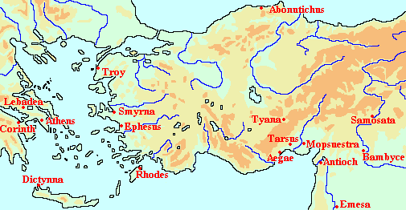
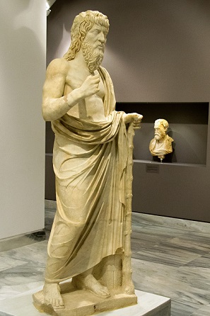
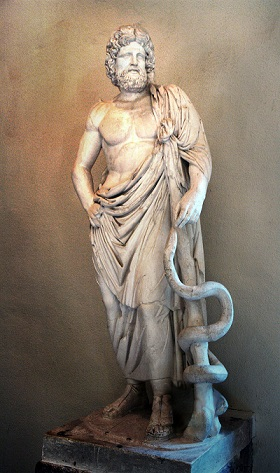
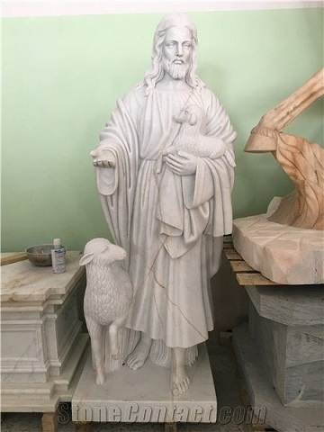

Dzisiaj opowiem wam o niesamowitej osobistości żyjącej w I wieku n.e. Już przed narodzinami jego matce objawiła się niebiańska istota i zapowiedziała, że dziecko które powije dokona rzeczy wielkich. Same narodziny były cudem a szybko dorastający młodzieniec zwracał uwagę swoją bystrością. W wieku zbliżonym do dorosłości opuścił rodzinny dom i poświęcił się wędrownemu nauczaniu. Szybko zdobył sobie popularność. Przemawiając do tłumów, wzywał ludzi do skupienia się nie na gromadzeniu doczesnych bogactw, ale na sprawach duchowych i moralnym życiu. Nie był jednak zwykłym mędrcem- nie ograniczał się do pouczeń, ale czynił także rozliczne cuda- uzdrawiał chorych, uwalniał nękanych przez złośliwe duchy a nawet wskrzeszał martwych. Obserwujący go ludzie szybko doszli do wniosku, że jest on kimś więcej niż człowiekiem. Niestety- nie wszystkim podobało się jego nauczanie i popularność. Przeciwnikom udało się go w końcu zaskarżyć przed rzymskimi władzami…

Stop! Zapewne myślisz sobie coś w stylu “Dobra Andrzej, nie po to marnuje czas na czytanie Twoich wypocin żeby po raz tysięczny słuchać o Jezusie.” Rzecz w tym że ten wstępniak dotyczy niejakiego Apolloniusza z Tyany. Najważniejszym i najbardziej obszernym źródłem dotyczącym jego życia jest Żywot Apolloniusza, autorstwa Flawiusza Filostrata. Historycy mają z nim jednak duży problem gdyż jest naładowany nadnaturalnymi wątkami, powstał przeszło sto lat po opisywanych wydarzeniach a jego autor był mocno na bakier z filozofią. Istnieje przez to spore ryzyko, że niewiele rozumiał z faktycznego nauczania swojego “mistrza”. Nie jest to bynajmniej opinia współczesnych hiperkrytyków* tylko uwagi choćby autorów bizantyjskich. Mit, legenda i wiara będą się zatem mieszać z mrówczą pracą historyków próbujących jakoś oddzielić ziarno od plew.

Zacznijmy od narodzin. Wiemy, że nasz bohater urodził się w zamożnej greckiej rodzinie, żyjącej w kappadockiej Tyanie. Według wierzeń jego narodziny zwiastował bóg Proteusz, który na pytanie matki “kim zatem będzie moje dziecko?” odpowiedział “mną”. Apolloniusz miał zatem być wcielonym bogiem. Jego narodziny były nie mniej cudowne- matka poszła z przyjaciółkami na pole, gdzie ucięła sobie drzemkę w trawie. Obudził ją dźwięk wydawany przez fruwające nad nią łabędzie i wówczas porodziła syna. Towarzyszył temu wielki piorun z niebios, który nie uderzył jednak ziemi. Zatrzymał się nad nią i powrócił skąd przyszedł. Dla wielu starożytnych piorun był znakiem od samego Zeusa, że oto narodził się jego syn. Wracając do bardziej przyziemnych rzeczy- jako członek zamożnego rodu Apolloniusz odebrał klasyczne wykształcenie, które obejmowało między innymi retorykę, filozofię, matematykę i historię. Jako nastolatek miał się zainteresować Pitagorasem i jego naukami. W świecie starożytnym Pitagoras był znany bardziej jako guru niż filozof czy matematyk (w dzisiejszym tych słów znaczeniu).

Przypisywano mu wiele ezoterycznych doktryn nadających matematyce i filozofii duchowy wymiar. Pitagoreizmy były różne, ale jedną z cech wspólnych były na przykład wegetarianizm oraz wiara w reinkarnację. Pitagorejczycy mieli swoje wspólnoty, gdzie praktykowano tajemnicze obrzędy oraz przekazywano sekretną wiedzę, niedostępną dla “maluczkich”. Młody Apolloniusz wkręcił się tak mocno, że został pustelnikiem. Nie golił się, nie jadł mięsa, spał na ziemi i ubierał się tylko w lniane tkaniny. Wyrzekł się rodzinnego majątku, zostawiając sobie tylko niezbędne do egzystencji minimum. Po oddaniu dobytku starszemu bratu Apolloniusz miał jakoby rozpocząć pięcioletni okres izolacji. Ten autentyzm i poświęcenie sprawiły, że zaczął być popularny wśród ludzi szukających przeżyć duchowych. W trakcie odosobnienia Apolloniusz uzyskał rzekomo zdolność do czytania w myślach i posługiwania się każdym ludzkim językiem.

W przeciwieństwie do klasycznych pitagorejczyków, młody Apolloniusz stwierdził, że powinien przekazywać wiedzę, którą zyskał poprzez swoją praktykę i kontemplację. Ponadto był żywo zainteresowany wymianą poglądów i spostrzeżeń z innymi. Został więc wędrownym mędrcem i podróżował po Wschodzie. Wersja minimum mówi o tym, że odwiedzał miasta leżące na wybrzeżach Azji Mniejszej, Syrii i kontynentalnej Grecji. Istnieją jednak tradycje mówiące, że zwiedził on szmat Azji. Przypisuje się mu odwiedzenie Egiptu, Mezopotamii a nawet dotarcie aż do Indii. Przekaz ten był nawet często uznawany za prawdziwy i nie budzący większych kontrowersji zwłaszcza, że odnaleziono indyjskie źródła traktujące o Apolloniuszu. Dzisiaj jest on jednak powszechnie odrzucany- wykazano, że rzekome źródła są tak naprawdę XIX- wiecznymi falsyfikatami.

W swoim nauczaniu Apolloniusz zwracał uwagę na fakt, iż wielu ludzi zbyt mocno koncentruje się na dobrach materialnych i zapomina o tym co jest faktycznym celem człowieka- moralne i dobre życie. Nawoływał do “nawrócenia” i odrzucenia niektórych praktyk religijnych. Krytykował na przykład ofiary ze zwierząt jakie starożytni składali bogom. Ponadto miał uważać, że wszystkie obrzędy, modlitwy, ofiary czy inne tam cuda na kiju są tak naprawdę bezwartościowe. Nauczał, że Najwyższa Siła rządząca i stanowiąca wszechświat ma te rzeczy za nic i nie potrzebuje ich. Apolloniusz twierdził, że Najwyższy Byt nie ingeruje w sprawy ludzkie i jest bardziej bezosobową ideą i siłą. Jedyną drogą do jego poznania są zatem nie modlitwy, ale nous (tak grecy nazywali racjonalny aspekt duszy ludzkiej- umysł). Postulował wiarę w reinkarnację, która miała wznosić dusze na coraz to wyższe stadium rozwoju. “Awans” duszy był zależny od poprzedniego wcielenia- jeśli dusza żyła moralnie, to wcielała się w wyższą formę życia, a jeśli niegodnie, to była degradowana.

Tradycje ludowe (a za nimi Żywot) chciały jednak widzieć w Apolloniuszu przede wszystkim cudotwórcę i nadprzyrodzoną istotę. Flawiusz podaje na przykład, że znał on języki ptaków i potrafił się z nimi komunikować. Apolloniusz miał także posiadać zdolność obserwacji wielu odległych od siebie miejsc równocześnie. Flawiusz opisuje, że w trakcie jednej z przemów przed ludem w Efezie, wielki filozof nagle zamilkł po czym zaczął krzyczeć “zabij tyrana!”. Następnie obwieścił słuchającym, że właśnie był świadkiem zabójstwa cesarza Domicjana. Przytacza też proroctwo Apolloniusza, ostrzegającego Efezjan przed nadciągającą epidemią i późniejsze egzorcyzmy, których finałem było wygnanie demona zarazy. Apolloniusz był ceniony za uzdrowienia. Jego rodzinna Tyana stała się czymś w rodzaju małoazjatyckiego Lourdes- ciągnęły tam sznury pielgrzymów z nadzieją na wybawienie od choroby. Maksym z Tyru pisał, że Apolloniusz był w młodości adeptem w świątyni Asklepiosa. Mamy kilka historii o uzdrowieniach z Tarsu, Lebadeai czy Koryntu (gdzie Apolloniusz dojechał także wampira).

Do naszych czasów zachowała się pokaźna kolekcja listów Apolloniusza. Istnieją poważne wątpliwości co do tego, kto jest ich rzeczywistym autorem. Wiarygodności nie dodaje fakt, że kompozycja wielu z nich jest podejrzanie podobna do tej z Żywotów. Historycy przyjmują jednak, że część listów została napisana przez naszego bohatera albo chociaż sfabrykowano ją na podstawie rzeczywistych nauk. Listy prezentują Apolloniusza jako neopitagorejskiego filozofa i czempiona greckiej kultury, który czasem negatywnie odnosi się do Rzymian. Wątek ten nie występuje w Żywotach, co dodaje nieco wiarygodności listom. Uwiarygadnia je także zapis polemik ze stoickimi filozofem- Muzoniuszem Rufusem. Wskazują one na to, że spór wygrał ten drugi (czego fani Apolloniusza raczej by nie przyznali gdyby od początku do końca fabrykowali źródła). Generalnie listy są mniej naszpikowane magią i czarami, ale… paradoksalnie sam Apolloniusz określa się w nich mianem czarownika.

Niektórzy badacze uważają go wprost za postać mityczną, ale generalnie przyjmuje się, że Apolloniusz faktycznie istniał i był religijnym myślicielem, który chciał zreformować religię swojego otoczenia. Fakt, że “cud ściele się gęsto” w relacjach o nim jest tłumaczony tym, że umysłowość starożytnych domagała się czarów i wrzucała je do opowieści o ludziach wybijających się zdecydowanie na ponadprzeciętność. Apolloniusz jest często porównywany do innego religijnego nauczyciela z I wieku- Jezusa z Nazaretu. Ich historie mają wiele podobieństw- cudowne narodziny, nadprzyrodzone pochodzenie, cuda, skierowanie uwagi na moralność i duchowość zamiast skupienia na rzeczach materialnych, fakt posiadania uczniów etc. Porównania te nie są nowe- pogańscy krytycy chrześcijaństwa często przeciwstawiali postaci Jezusa postać Apolloniusza, twierdząc, że przewyższał on mądrością, moralnością i mocą Nazarejczyka. Chrześcijanie zresztą nie zaprzeczali znakom i naukom Tyańczyka- po prostu uważali, że był opętany przez potężne demony, stąd miał moc czynienia cudów.

Podobne do starożytnych polemistów poglądy (z pominięciem metafizyki) przypisuje się niektórym oświeceniowym myślicielom. Motyw ten jest zresztą do dzisiaj obecny w literaturze neopogańskiej a czasem nawet świeckiej (gdzie oczywiście pomija się element nadnaturalny). Warto dodać, że zwolennicy teorii “mitycznego Jezusa” (niezależnie od tego czy uważają, że Jezus został totalnie wymyślony czy istniał jakiś rzeczywisty pierwowzór, który później modyfikowano tak żeby pasował do proroctw i celów późniejszych wspólnot) powołują się na postać Apolloniusza, jako przykład tego jak mitologizowano nauczycieli moralnych i duchowych w czasach starożytności. Uważają, że taki sam proces zaszedł w przypadku Chrystusa.

Należy jednak zaznaczyć, że między Jezusem a Apolloniuszem istnieją pewne znaczące różnice. Przede wszystkim Jezus głosił osobowego Boga, podczas gdy Apolloniusz skłaniał się bardziej ku panteizmowi. Ponadto Jezus przepowiadał rychłą apokalipsę i z powodu wiary w bliski koniec świata był o wiele bardziej wymagający w stosunku do swoich wyznawców. Apolloniusz zaś nie był apokaliptycznym prorokiem i nie odnosił się do końca mającego rzekomo być “tuż za rogiem”. Kolejną różnicą będzie fakt, że dla historii Jezusa kluczowa jest jego męczeńska śmierć na krzyżu (w ujęciu historycznym będąca efektem konfliktu z elitą kapłańską współpracującą z Rzymem). Apolloniusz zaś zamęczony nie został. Miał wprawdzie konfrontacje twarzą w twarz z Domicjanem, cesarzem rzymskim, ale dzięki nadprzyrodzonym mocom wyszedł z niej cało.
