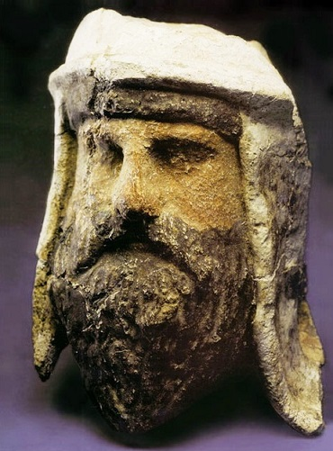
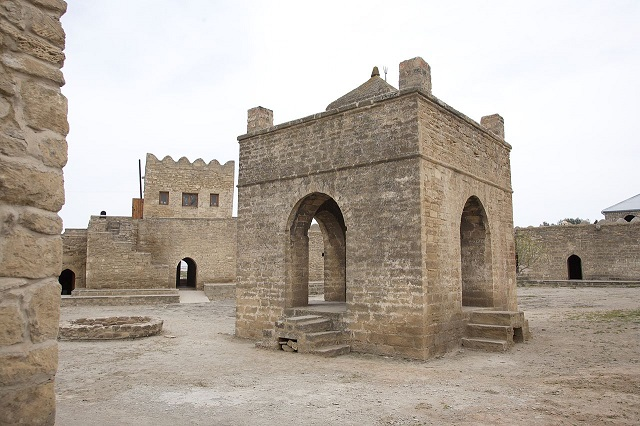
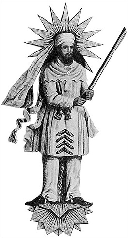
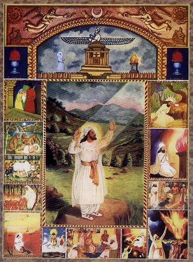
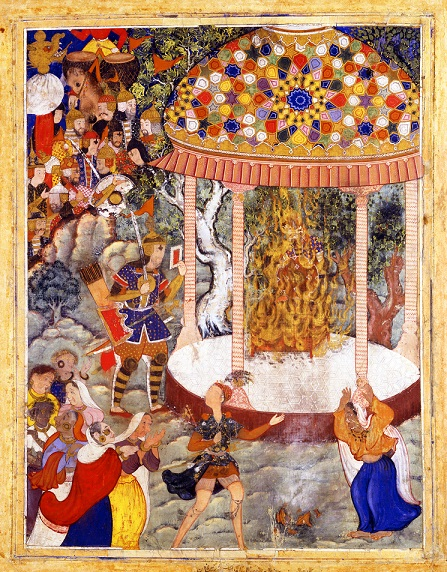

Dzisiaj zajmiemy się jedną z najstarszych, wciąż praktykowanych, religii świata. Współcześnie jest to ona marginalna demograficznie (szacunki mówią o 100k- 150k), ale historycznie sprawy miały się inaczej. Przez setki lat nauczania, praktyki i wierzenia tej religii działały nie tylko na bezpośrednich wyznawców, ale także kształtowały wyobrażenia sąsiadów. Mowa tutaj o zoroastryzmie, który odcisnął się na takich systemach wierzeń jak judaizm, gnostycyzm, wierzenia helleńskie, semicki politeizm, buddyzm, chrześcijaństwo, bahaizm i islam. I to pomimo faktu, że religia ta nigdy nie była misyjna w swoim głównym nurcie. Wszelkie zapożyczenia i inspiracje zoroastryzmem wynikają raczej z geniuszu jego idei i konceptów, ich zgodności z pragnieniami ludzi wyznających i tworzących religie. Świadectwem tego jest fakt, że jej misjonarskie mutacje rozwijały się prężnie i swego czaru rywalizowały z chrześcijaństwem na Zachodzie (mitraizm i manicheizm) i buddyzmem na Wschodzie (manicheizm).

Nikt tak naprawdę nie wie kiedy zaczął się zoroastryzm. Jego korzenie sięgają starożytnych wierzeń Ariów. Tym terminem określa się grupy indoeuropejskich plemion, które w III tysiącleciu p.n.e zamieszkiwały okolice Azji Środkowej. W pierwszej połowie II tysiąclecia jedna z grup Ariów, zwana Indo-Ariami, opuściła matecznik i osiedliła się w północnych Indiach. Druga grupa, znana jako Irańczycy, zajęła Azję Środkową i płaskowyż Irański. Centralnym elementem religii Ariów był kult bóstw i spożywanie psychoaktywnego napoju znanego jako haoma. Na szczycie irańskiego panteonu stał Ahura Mazda. Nie tyle stworzył on materialny świat, co pozwalał mu istnieć i był siłą porządkującą go. Był on niejako emanacją i personifikacją “aszy”- swoistego prawa wszechświata, prawdy, porządku, dobra i pierwotnej zasady. Oblubienicą Ahura Mazdy była bogini Spanta Armaiti (personifikacja Ziemi), ale miał on wiele żon. Ważnymi bóstwami byli też Rasnu (sędzia), Mitra (wiele różnych funkcji, np. przysięgi), Bahram (bóg wojny) czy Anahidi (bogini zwycięstwa).

Formalnym kultem zajmowali się kapłani- mężczyźni po uprzednim przeszkoleniu. Przypuszcza się, że z czasem kapłaństwo stało się dziedziczne. Kapłani byli odpowiedzialni za czynności kultowe takie jak ofiary i podtrzymywanie świętego ognia. Rytuały były określane jako yasna i składały się z ofiarowania pożywienia i spożycia odurzającej haomy. Yasny pierwotnie były czymś na kształt wystawnych uczt na które ludzie zapraszali bóstwa jako gości honorowych. Oprócz ofiar recytowano także religijne hymny (staroirańskie mantrin) i śpiewano pieśni. Wierzenia dotyczące duszy i życia pozagrobowego były zróżnicowane. Generalnie wierzono, że po tym jak vyana (oddech życia) opuszczała ciało, urvan (osobista dusza) udawał się do zaświatów. Ci, którzy wiedli sprawiedliwe życie mogli liczyć na niebiańskie krainy. Niegrzeczni trafiali w pustkę po której błąkali się całą wieczność.

To właśnie w pi razy drzwi takiej tradycji przyszło działać Zoroastrowi. Z racji braku źródeł nie do końca wiadomo kiedy i gdzie żył. Na podstawie analizy porównawczej Gat, (zbiór hymnów w języku staroawestyjskim, przypisywany Zoroastrowi) i Rigvedy (zbiór hymnów w sanskrycie) podaje się okres między 1500 a 1000 rokiem p.n.e. Większość uczonych datuje go na 1000 rok p.n.e. Rzeczone Gaty wymieniają Airanem Waedżo jako krainę Zoroastra. Problem w tym, że nie bardzo wiadomo gdzie miałaby się ona znajdować. Brak nazw typowych dla zachodnich Irańczyków wskazuje na Wschód świata irańskiego, ale szczegółów brak. Ze źródeł wyłania się obraz Zoroastra jako kapłana i religijnego poety wywodzącego się ze szlachetnego rodu Spitamidów (spitama znaczy “biały” lub “jasny”). W wieku około 30 lat miał on doświadczyć wizji, która zaowocowała jego działalnością. Wizja miała być jakoby osobistym spotkaniem Zoroastra z Ahura Mazdą.

Jego nauczenie nosiło znamiona krzyżówki monoteizmu z henoteizmem. Ahura Mazda był już nie tylko najważniejszym bogiem, ale także źródłem wielu innych bóstw (które Zoroaster ochrzcił mianem Amesza Spenta). Rzeczeni Amesza Spenta mieli być zaledwie hipostazami (hipostaza to byt, który wyłania się z Najwyższego Bytu). Nie znaczy, że Zoroaster potępiał wszystkie inne kulty albo ich zabraniał- po prostu wychodził z założenia, że równie dobrze można zwracać się bezpośrednio do Boga. Cześć oddawana innym bogom jest, tak czy inaczej czcią oddawaną Ahura Mazdzie czyli aszy. Obok Amesza Spenta istniały także bóstwa znane jako ahury. Te również były powiązane z Ahura Mazdą (ale w jakiś inny, bliżej niesprecyzowany sposób) i godne czci. Najstarsze części Awesty (zbioru zoroastryjskich hymnów i pism teologicznych) nie wymieniają ahur z imienia. Późniejsze identyfikują Mitrę i Apam Napat jako bóstwa z tej kategorii.

Już przed Zoroastrem irańscy bogowie dzielili się na wspomniane ahury i dewy. Zoroaster uznał dewy za niegodne czci. Jedną z przyczyn tego poglądu mógł być fakt, że składane im ofiary były krwawe, a ich kapłani stosowali przemoc wobec ofiarnych zwierząt. Z czasem dewy przestają być uznawane za bogów, a stają się kimś w rodzaju demonów- złych nadprzyrodzonych istot. Najstarsze części Awesty nie wymieniają dew z imienia. Przypuszcza się, że proces ich porzucenia i “demonizacji” był bardzo długi. Ten dualistyczny podział na zło i dobro był cechą charakterystyczną zoroastryzmu. W jego teologii rozróżniano dwa sprzeczne ze sobą pierwiastki- Prawdę i Fałsz. Podział ten nie był odwieczny- Fałsz był bowiem nie czymś przyrodzonym, ale konsekwencją możliwości wyboru jaki miały żywe istoty.

Źródłem zła było coś co Zoroaster określał mianem “angra mainyu”- czyli “gniewny/ niszczący duch/umysł”. W oryginale nie był to zatem byt, ale raczej stan ducha/ umysłu. Jego korzenie tkwiły zaś w złych myślach. Z czasem angra mainyu doczekał się personifikacji w postaci Arymana- arcyprzeciwnika aszy. Podstawowym preceptem zoroastryzmu była maksyma “dobre myśli, dobre słowa, dobre czyny”. Jeśli człowiek ma dobre myśli to z nich rodzą się dobre słowa, a dobre słowa wcielone w życie owocują dobrymi czynami. Żyjący w ten sposób ludzie synchronizują się z aszą (a więc Ahura Mazdą). W przeciwnym razie wpadają w sidła “druj” (czyli fałszu). Ci którzy najbardziej zbliżają się do ideału (a każdy ma taki potencjał) mogą stać się saoszjantami (dosłownie- ci którzy przynoszą korzyści) i poprawiać egzystencję innych ludzi i kondycję świata.

Poglądy Zoroastra rozprzestrzeniały się bardzo powoli. Nie była to nowa religia sensu stricte, ale raczej reinterpretacja starszych wierzeń i praktyk- nie zerwanie, a ewolucja. Prześledzenie procesu rozpowszechniania się i recepcji nauk Zoroastra jest bardzo ciężkie. Jego zwolennicy nie stworzyli jakiejś scentralizowanej instytucji. Wyglądało to raczej tak, że jakaś część tradycyjnych kapłanów i wiernych znalazła się pod jego wpływami i przemycała jego rozumienie do starszych form religijności- ciężko jednak dokładnie określić ile było “zoroastryzmu w zoroastryzmie”. Widać także przeobrażenia i zmiany w wierzeniach (z których wiele zachodziło równoległe a nie liniowo) zachodzące w czasie. Nie wiadomo też ile szeregowi wierni rozumieli (i na ile znali) z Zoroastra a na ile po prostu kontynuowali starożytny kult swoich poprzedników.

Początkowo procesy te zachodziły tylko we wschodniej części irańskiego świata, ale zjednoczenie go przez Achemenidów prawdopodobnie umożliwiło ekspansję na Zachód. Uczeni nie są pewni kiedy zoroastryzm stał się dominującym nurtem religii irańskiej. Przypuszcza się, że pierwsi Achemenidzi wyznawali raczej mazdaizm (ogólna nazwa religii irańskich). Pewne przesłanki pokazują wpływy zoroastryjskie w tym okresie, ale taki na przykład Cyrus, w swojej słynnej inskrypcji, powoływał się na semickich bogów. Wiemy o niszczeniu miejsc kultu dew za Achemenidów i reformie kalendarza za Aratkserksesa II (zmieniono nazwy miesięcy na zoroastryjskie bóstwa), ale z drugiej strony wiemy też o bardzo daleko idącej tolerancji dla innych wierzeń.

Wskazuje to, że zoroastryzm miał wówczas bardzo luźną strukturę. Stare wierzenia i tradycje mieszały się z nowymi interpretacjami a do tego doszło mnóstwo apokryficznych i nowych praktyk będących efektem naturalnej ewolucji religii. Pojawiają się kulty bóstw, których w ogóle nie ma w Gatach, historie o Zoroastrze stają się pełne magii a głównym zmartwieniem staje się poprawne przeprowadzanie czynności kultowych i budowa świątyń ognia. Nauczanie o Prawdzie i Fałszu zostaje przedstawione jako kosmiczna bitwa między siłami dobra i zła w której każdy bierze udział. Zło zostaje spersonifikowane w osobie Arymana, Azi Dżahaka (smoka, węża) i dewów. Istoty te zamieszkują podziemne krainy, gdzie knują przeciwko dobru i ludziom. Pojawia się także w pełni rozwinięta eschatologia (czyli nauczanie o czasach ostatecznych).

Saoszjant to już nie każdy wierny żyjący w zgodzie z aszą, tylko konkretny mesjasz, który przyjdzie na końcu czasów aby ostatecznie pokonać zło. Łączy się to z wierzeniem w Fraszokereti (dosłownie “czynienie wspaniałym, doskonałym”) czyli odnowieniem świata. Początkiem tego okresu będzie pojawienie się na ziemi Saoszjanta, który poprowadzi ahury do walki z dewami. Saoszjant wskrzesi także wszystkich zmarłych ludzi, przywracając im ciała. Wówczas nastąpi Sąd Ostateczny- ahury Airjaman i Atar spuszczą na Ziemię rzekę płynnego metalu w której ocaleją tylko sprawiedliwi. Rzeka ta spłynie następnie do podziemnego świata i unicestwi pozostałe dewy i Arymana. Następnie Ahura Mazda i Amesza Spenta uwarzą specjalną, “białą” haomę, której wypicie zapewni sprawiedliwym nieśmiertelność. Następnie wszyscy będą sławić aszę przez całą wieczność.

Niewiele wiadomo o dziejach zoroastryzmu za panowania Seleucydów i Partów. Pisarze z czasów Sasanidów określali ten okres jako wieki ciemne, których początkiem było zniszczenie Awesty przez Aleksandra Wielkiego (faktycznie, w czasie podbojów Macedończyka zniszczono jakąś część tekstów religijnych). Miało to spowodować konfuzję i niezrozumienie tego czym jest Dobra Wiara. Na szczęście pojawienie się Sasanidów na tronie uratowało sytuację i Persja odzyskała swoją prawdziwą wiarę. Widać tutaj jak na dłoni propagandę sasanidzką, która próbowała zunifikować historycznie zróżnicowane wierzenia zoroastryjskie w jedną, koherentną religię i wykorzystać ją do swoich celów. Wielu magów (jak określano kapłanów) nie tylko się przed tym nie broniło, ale wręcz popierało te dążenia, chcąc zapewne narzucić swoje interpretacje tradycji zoroastryjskiej jako obowiązujące.

Sojusz ten opłacił się zoroastryjskiemu klerowi (a przynajmniej jego rządzącej części), który w czasach sasanidzkich w zasadzie zyskał monopol na interpretacje irańskiej religii. Państwo sponsorowało świątynie, kształcenie kapłanów i broniło przed konkurencją ze strony “herezji” (czyli tymi zoroastyjczykami, którzy mieli inne poglądy od zwycięskiej partii) i innymi religiami (na przykład chrześcijaństwo). W zamian za to kościół zoroastryjski popierał coraz większe podziały społeczne i ucisk warstw niższych- z tego powodu wśród chłopstwa i rzemieślników popularny stał się zoroastryzm w wersji Mazdaka, odwołujący się do haseł sprawiedliwości i równości społecznej. Wśród osób o bardziej ezoterycznym oglądzie religii szerzył się natomiast manicheizm, który również czerpał garściami z nauk Zoroastra. Twórca religii, Mani, był przez pewien czas bardzo blisko z elitą rządzącą, ale ostatecznie został zmarginalizowany i uwięziony.

Kres dominacji zoroastryjskiej położyły arabskie najazdy. Nastawienie nowych panów do starej religii było różne, ale radykalny monoteizm islamu zaowocował zerwaniem z politeistycznymi i henoteistycznymi tradycjami. Również dewy i Aryman zostały sprowadzone do roli demonów. Z biegiem czasu (pod przymusem bądź dobrowolnie) większość Irańczyków porzuciła ją na rzecz islamu. Mimo, że zoroastrian jest obecnie bardzo niewielu w Iranie, to religia ta cieszy się dużym szacunkiem ze strony świeckich elit (jako prawdziwa religia Irańczyków i przeciwwaga dla sklerykalizowanego do granic możliwości szyickiego islamu). Zoroastryzm, choć praktykowany przez maleńką grupkę jest ważnym składnikiem tożsamości irańskiej. Niewielkie społeczności przetrwały także w Indiach, gdzie perscy kupcy osiedlali się jeszcze w czasach Achemenidów. Indyjskich zoroastrian określa się mianem Parsów i grupa ta wydała na świat jednego z najsłynniejszych muzyków w historii- Freddiego Mercurego, który tak naprawdę nazywał się Farrokh Bulsara.
