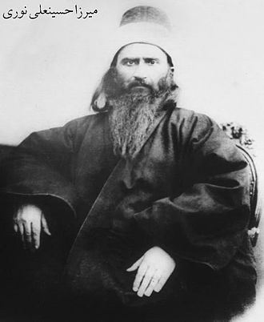
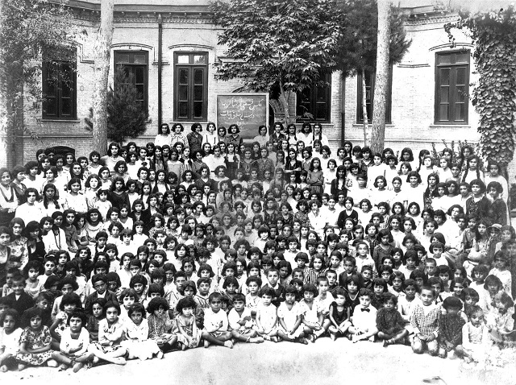
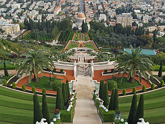
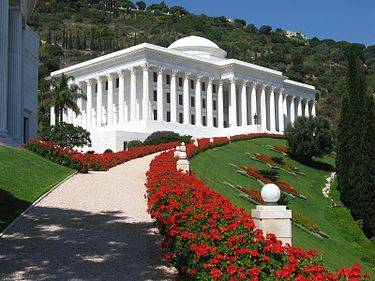

Argument ten idzie on mniej więcej tak, że abrahamiczny Bóg raczej nie istnieje gdyż ludzkość ma wiele różnych, sprzecznych idei religijnych. Gdyby istniała nieskończenie dobra, wszechmocna, osobowa siła wyższa, która od naszych poglądów na jej istnienie/charakterystykę uzależniała by swoją relację z nami, to nie pozwoliłaby na tak olbrzymie zróżnicowanie. Konkluzja jest taka, że religie abrahamiczne (czy, czasami, religie w ogóle) są wymyślone, a różnice wynikają z kontekstu kulturowego i historycznego. Z tym poglądem na pewno nie zgodziliby się bahaici. Ich zdaniem wielość religii i interpretacji jest jak najbardziej naturalna i zrozumiała gdyż Bóg objawiał się różnym ludziom, pod różnymi postaciami i z przekazem dostosowanym do poziomu rozwoju ludzkości w danej epoce/ kulturze.

Bahaizm narodził się w Iranie i wywodzi się z szajchizmu i babizmu. Ten pierwszy skupiał się na charakterystycznym dla szyizmu przekonaniu o istnieniu ukrytego, 12 imama (Mahdiego, następcy Mahometa). Jego ujawnienie się miało oznaczać czasy ostateczne i nową erę w dziejach ludzkości. Nadzieje były tak silne, że gdy w latach 40. XIX wieku Sayid Mirza Ali Mahomet ogłosił się “Babem” (dosłownie bramą), zwiastunem Mahdiego, wielu szajchitów przyłączyło się do niego. Doszło wówczas do rozłamu w irańskim szyizmie. Część ludzi uznała, że czas się wypełnił, a część, że Bab jest oszustem. Doszło do masakry babistów (zwolenników Baba), egzekucji ich przywódcy i aresztowań liderów. Jeden z nich, Mirza Hussein Ali Nuri, został po pewnym czasie uwolniony i zezwolono mu na wyjazd do Iraku. Bab już nie żył, ale babiści wierzyli w prawdziwość jego posłannictwa, a zapału dodawały im słowa mistrza, że po nim przyjdzie kolejny wielki nauczyciel.

W 1863 roku Ali Nuri ogłosił się właśnie tym prorokiem i przyjął miano Baha’u’llaha (Chwała Boża). Doprowadziło to do rozłamu wśród babistów- większość z nich uznała nowego mistrza. Problem polegał na tym, że nie miał on wjazdu do Iranu gdzie żyła większość z jego wyznawców. Na lidera religijnego z obawą patrzyły również osmańskie władze- dość powiedzieć, że Aqdas (“Najświętsza Księga”) została przezeń spisana w areszcie domowym. Mimo przeciwności Ali Nuri umiejętnie poskładał organizację. Stworzył tak zwane Domy Sprawiedliwości, które administrowały lokalnymi wspólnotami. Bardziej złożone problemy rozwiązywał sam- czy to za pomocą listów czy specjalnych wysłanników. Od lat 80. XIX wieku wspólnota w Iranie okrzepła do tego stopnie, że wytworzyła ona nawet własne szkolnictwo (tak aby uczyć się mogły także kobiety). Nacisk na edukację jest zresztą do dzisiaj jedną z ważniejszych zasad tej religii.

Dzięki wykształceniu oraz skupieniu na pracy i życiu wspólnotowym bahaici zaczęli szybko piąć się w górę drabiny społecznej. Konwertytami byli nie tylko szyici, ale także irańscy zoroastrianie a nawet żydzi. Od lat 60. XIX wieku zaczyna się ekspansja misyjna na Bliskim Wschodzie, Kaukazie, Azji Środkowej, Indiach i Birmie. Po śmierci Baha’u’llaha w 1892 roku liderem wspólnoty został jego syn- Abbas Effendi. Bahaizm zaczął się wówczas rozprzestrzeniać na półwyspie Arabskim, w północnej Afryce, Europie, Amerykach, Australii i na Dalekim Wschodzie. Szczególnie aktywne misjonarsko były Indie i Stany Zjednoczone. Mniej wesoły był fakt, że w Iranie bahaici spotykali się z prześladowaniami. Nie chcąc dawać argumentów przeciwnikom, liderzy religii zdecydowali się na neutralność polityczną- co jednak na niewiele się zdało.

Abbas zmodyfikował organizację- za jego rządów rada Domów Sprawiedliwości zaczęła być wybierana w głosowaniach. Powołał także wybieralne Krajowe i Powszechny Dom Sprawiedliwości. Jego następcą został Szogi Effendi. Za jego “kadencji” intensyfikacji uległa działalność misjonarska i znaczny wzrost liczby wyznawców. Aktywnie podróżował po świecie, odwiedzając Wielką Brytanię, Niemcy, Indie, Egipt, Irak i Stany Zjednoczone. Dzięki nowym, bardziej sekularnym władzom uspokoiła się sytuacja w samym Iranie. Bahaici zaczęli działać całkowicie jawnie, organizować zjazdy i konwencje. Otwierali szkoły dla kobiet a nawet zabierali głos w debacie publicznej opowiadając się za zwiększeniem praw “słabszej płci”. Wybudowali także świątynię w okolicach Teheranu. Ich dobra samoorganizacja stała się jednak z biegiem czasu problemem dla coraz bardziej obawiających się jakiejkolwiek opozycji rządzących.

Z tego powodu rząd represjonował bahaitów. Informacja o wyborze kobiet do krajowego Domu Sprawiedliwości wywołała skandal wśród szyitów- znów doszło do przemocy i wandalizmu. Powstanie Islamskiej Republiki Iranu w 1979 roku oczywiście nie poprawiło notowań mniejszości. Oskarżano ich o kolaborację ze wszystkimi możliwymi wrogami, odbierano dzieci, zamykano szkoły i zgromadzenia, rekwirowano majątki, a kobiety, na mocy specjalnego kruczka prawnego* oskarżano o prostytucję. Mimo ciężkiej sytuacji w Iranie, światowy bahaizm rozkwitał- w latach 50. doszło do masowych konwersji w Boliwii, Ugandzie i Indiach. Szogi zmarł w 1957 roku a po jego śmierci Powszechny Dom Sprawiedliwości ukonstytuował się jako instytucja zwierzchnia. Jego siedzibą stała się Hajfa (obecnie Izrael), gdzie spoczęły także ciała przywódców.

W bahaizmie nie istnieje w kler. Na poziomie lokalnym osoby odpowiedzialne za nauczanie i administracje są wybierane przez wiernych. Co 19 dni organizowane jest święto ziafat dla całej społeczności. W trakcie ludzie czytają i omawiają teksty religijne (zarówno bahaickie jak i należące do innych religii). Następnie omawia się bieżące sprawy- działalność religijną, oświatową i charytatywną. Na koniec- poczęstunek i ploteczki. Raz do roku lokalne grupy wybierają swoich przedstawicieli na konwencje regionalne. Te są wstępem do konwencji narodowej, na której delegaci regionalni wybierają dziewięć osób do Krajowego Domu Sprawiedliwości. Rada ta zarządza wspólnotami w danym kraju. Członkowie Rad ze wszystkich krajów co pięć lat wybierają dziewięciu przedstawicieli wspomnianego już Powszechnego Domu Sprawiedliwości. Decyzje na wszystkich poziomach podejmowane są w drodze głosowania.

Bahaickie pojmowanie rzeczywistości zakłada istnienie wielu poziomów rzeczywistości. Najwyższym z nich jest Bóg, który jest absolutnie niemożliwy do ogarnięcia. Na drugim poziomie istnieje boska esencja, której mogą doświadczyć najbardziej zaawansowani duchowo wierni. Chcąc wejść na ten level, wierni powinni podążać za manifestacjami Boga- moralnym życiem, modlitwami, medytacjami, postami etc. Przewodnikami są tak zwani posłańcy. Do tej grupy zaliczają się osoby takie jak Abraham, Zoroaster, Kryszna, Budda, Jezus, Mahomet i wielu innych proroków, filozofów i nauczycieli duchowych. Co ciekawe- bahaizm uznaje także wierzenia i praktyki religii animistycznych i pogańskich jako umożliwiające rozwój duchowy. W bahaickich wierzeniach czynnikiem porządkującym wszechświat jest uniwersalny intelekt- pierwotna emanacja Boga. Umożliwia ona istnienie stworzenia, kieruje wszystkimi procesami i wskazuje ludziom właściwą ścieżkę.

Uniwersalny intelekt “oświeca” posłańców i pozwala im na stworzenie takiego systemu religijno- filozoficznego, który będzie dostosowany do warunków w których żyją ich odbiorcy. W przeciwieństwie do innych religii abrahamicznych, bahaici wierzą, że objawienie jest progresywne- to znaczy obecna forma nie jest ostateczna i kolejni posłańcy będą ją jeszcze wielokrotnie ulepszać. Co ciekawe- bahaici nie uważają ślepej wiary za coś pożądanego. Są zdania, że każdy powinien sam badać otaczającą go rzeczywistość i szukać prawdy. Bahaici nie mają najmniejszych problemów z akulturacją i pełnymi garściami czerpią z innych wierzeń. Przy tym, dla nich, nie są one “inne”- religia jest jedna, a jej celem jest ulepszanie człowieka. Jeśli go nie spełnia to lepszy jest nawet brak religii. Człowiek natomiast powinien pracować nad swoimi przywarami. Aby je przezwyciężyć, zdaniem bahaitów, potrzebuje trzech nauk- dbania o siebie, społeczeństwo i otoczenie oraz doskonalenia duchowego.

Idea jedności religii jest w bahaizmie powiązana z ideą jedności ludzkości. Nacjonalizmy i szowinizmy są stanowczo odrzucane. Istnienie narodów czy właściwych im kultur nie jest krytykowane, ale dla bahaizmu są to czysto zewnętrzne różnice, nie zmieniające tego, że wszyscy ludzie powinni być równi i zjednoczeni (dotyczy to także płci). Celem bahaizmu jest stworzenie uniwersalnego społeczeństwa- stąd promuje się wybranie i powszechne nauczanie jednego języka. Bahaici promują także międzynarodową współpracę przy podejmowaniu decyzji. Opowiadają się za pacyfizmem wskazując, że na zbrojenie marnotrawione są olbrzymie fundusze. Środkiem do zjednoczenia ludzkości, zdaniem bahaitów, jest właściwa edukacja i propagowanie idei humanistycznych, pacyfistycznych i komunitarnych. Opowiadają się także za zabezpieczeniami socjalnymi dla najuboższych.

Bahaizm stawia bardzo duży nacisk na działalność społeczną- bahaici powinni uczyć się i pracować tak aby korzyść odnosiło całe społeczeństwo. Zawodowe żebractwo i życie pustelnicze jest zakazane. Jak już wspominałem- bardzo duży nacisk położony jest na edukację i równość płci. Nie ma żadnych ograniczeń co do interakcji z wyznawcami innych religii oraz bezwyznaniowcami (także w przypadku małżeństwa). Nie istnieją zakazy dietetyczne, muzyczne czy literackie (można czytać Harrego Pottera). Mniej wesoło jest w kwestii używek- bahaitom nie wolno palić opium i uprawiać hazardu. Wolno głosować, ale nie należeć do partii politycznych. Oczywiście potępia się przemoc, kradzieże oraz zdrady. W kwestiach religijnych, bahaici powinni codziennie się modlić i medytować. Ciąży na nich także obowiązek datków charytatywnych i pielgrzymek. Te ostatnie (z uwagi na napiętą sytuację na Bliskim Wschodzie) są jednak obecnie zawieszone.

Dane dotyczące liczebności bahaickich wspólnot są bardzo zróżnicowane i niepewne. Duży wpływ na to ma fakt wrogości otoczenia w krajach muzułmańskich. Sami bahaici mówią o około 5 milionach. W 2010 roku World Christian Encyclopedia podawała liczbę 7,3 miliona w 218 krajach świata. Źródło to zwraca uwagę, że bahaizm jest jedyną religią, która przez ostatnie sto lat rosła rosła szybciej niż ogólna populacja, w każdym kraju należącym do ONZ. Britannica podaje zaś, że bahaizm jest drugą (po chrześcijaństwie) najbardziej rozpowszechnioną religią świata a zorganizowane grupy działają w 221 krajach i terytoriach autonomicznych. Bahaici są największą mniejszością religijną w Iranie, Panamie, Belize, Południowej Karolinie, Boliwi, Zambii i Papui Nowej Gwinei. Liczne grupy żyją także w Czadzie i Kenii. Bahaici są także obecni w Polsce, gdzie ich wspólnota liczy około 300 osób.
