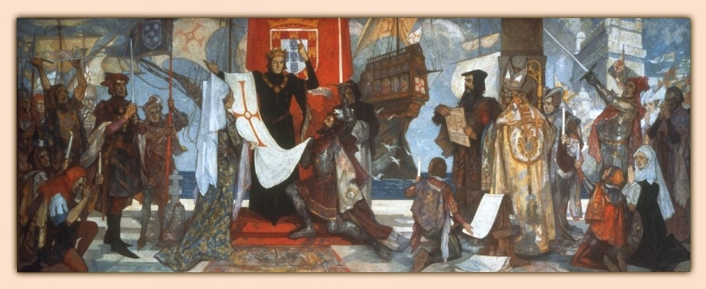
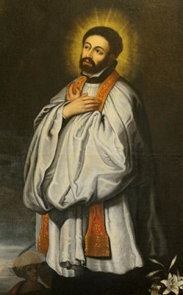
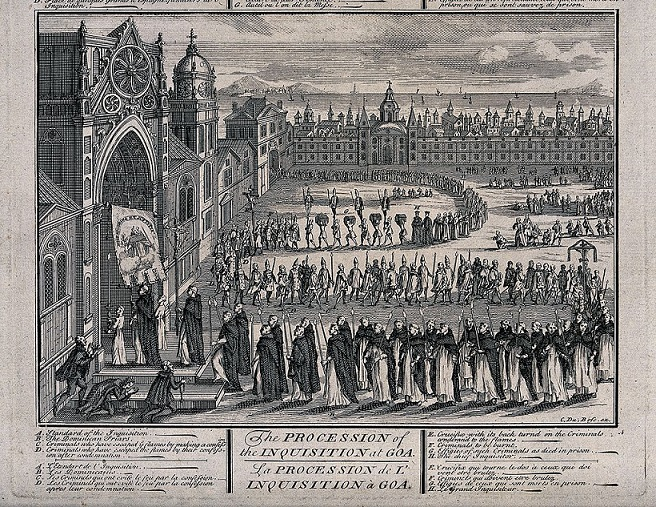
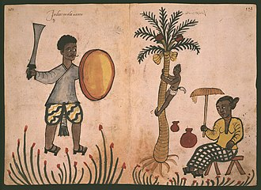
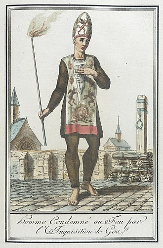

Inkwizycja, nie wiedzieć czemu, zazwyczaj kojarzy się ludziom wyłącznie z Europą a jej ofiary identyfikowane są jako heretycy. Być może wynika to z tego, że “koszula bliższa ciału” i propagowaniem (a często przerysowywaniem) jej zbrodniczej historii zajmowali się głównie protestanccy autorzy. Ludzie ci, piszący od mniej więcej XVI wieku, skupiali się na współwyznawcach i ludziach, których uważali za prekursorów protestantyzmu. Niechrześcijańskie ofiary często ich po prostu nie obchodziły- w tamtych czasach chrześcijanie od prawa do lewa uważali, że inne religie to zło wcielone a ich wyznawcy zostaną na wieczność ukarani przez miłosiernego Boga. Z tego tytułu historia inkwizycji z Goa jest prawie całkowicie nieznana. Ale od czego mamy #daszwiare ?

7 lipca 1497 roku, dwa tygodnie po wymuszonej konwersji portugalskich żydów na katolicyzm, Vasco da Gama wypłynął z Lizbony z zamiarem opłynięcia Przylądka Dobrej Nadziei i dotarcia do Indii. W 1498 roku flota dotarła do Goa, miasta na zachodnim wybrzeżu subkontynentu. Bogactwa jakie ze sobą przywieźli doprowadziły do podboju Goa i okolic oraz ustanowienia tam regularnej kolonii portugalskiej. Dążenia te popierało papiestwo. Już w 1454 roku papież Mikołaj V opublikował bullę Romanus Pontifex w której przyznawał portugalskiemu władcy wszystkie afrykańskie ziemie na południe od przylądka Bojador w Maroku (papież jako namiestnik Chrystusa ma prawo dzielić ziemie pogan między katolickich władców). Bulla zachęcała też do podboju ziem muzułmańskich i pogańskich a na zachętę, zezwalała na grabieże i zamienianie innowierców w niewolników*.

Goa szybko stała się nie tylko gospodarczym, militarnym i politycznym centrum portugalskich kolonii w Azji, ale także misyjnym. Pojawił się jednak pewien problem- część Portugalczyków, zamiast radować się okazją do niesienia Dobrej Nowiny podbitym ludom upatrywała w Goa szansę na odcięcie się od zbawczej wiary. Mowa tutaj o tak zwanych Nowych Chrześcijanach- żydach i muzułmanach (oraz ich potomkach), których portugalskie władze przymusowo nawróciły na katolicyzm a którzy potajemnie praktykowali starą religię. W kontynentalnej Portugalii pilnowała ich inkwizycja i najmniejsze podejrzenie o trzymanie się starej religii kończyło się dochodzeniem, które mogło doprowadzić nawet do kary śmierci. W Goa tymczasem inkwizycji nie było.

Stąd też przedsiębiorczy Nowi Chrześcijanie wykorzystali okazję aby dać dyla do Indii**. Duszpasterze ze zgrozą zauważyli, że wielu Nowych Chrześcijan dorabia się potężnych majątków na handlu z Azją oraz wykorzystuje nieobecność Świętego Oficjum (inna nazwa inkwizycji) i nie tylko przestaje praktykować katolicką wiarę, ale wręcz otwarcie wraca do religii przodków. Było to tym łatwiejsze, że w Indiach istniały sięgające korzeniami starożytności wspólnoty żydów. Rząd zauważył problem i w 1532 roku uchwalono prawo, które zabraniało Nowym Chrześcijanom migracji z Portugalii pod groźbą kary śmierci. Nie zatrzymało to jednak migracji oraz nie zlikwidowało wspólnot które już mieszkały w koloniach.

Duchowni i administracja kolonialna radziły sobie póki co na własną rękę. W 1543 roku miał miejsce proces niejakiego Jeronimo Diasa. Był on lekarzem, potomkiem przymusowo nawróconych żydów. W trakcie rozmowy ze znajomymi wygłosił opinie sprzeczne z, jak donosi źródło, “naszą świętą wiarą”. Został aresztowany a na przesłuchaniu potwierdził twierdzenia “starego przymierza” (judaistyczne). Za ten występek, rada dostojników kościelnych i państwowych skazała go na śmierć przez spalenie na stosie. Nie można im jednak odmówić miłosierdzia- wyrok głosił bowiem, że “w wypadku gdybyś szukał przebaczenia i odpokutował i przyznał się do błędu i wyraził pragnienie odejścia jako Chrześcijanin, zostaniesz uduszony przed spaleniem, tak abyś nie cierpiał w płomieniach”.

Nowi Chrześcijanie nie byli jedynym problemem. Indyjskie kolonie zamieszkiwały liczne grupy hindusów, muzułmanów i żydów. Wielu portugalskich osadników było ciekawych lokalnych wierzeń i zwyczajów, zwłaszcza rozlicznych grup hinduistycznych. Za namową kleru król Jan III wydał w 1546 roku zakaz praktykowania wszelkich form “tubylczej idolatrii” (czyli hinduizmu) we wszystkich portugalskich posiadłościach w Indiach. Nakazał także zniszczenie miejsc kultu, wygnanie kapłanów, karanie bałwochwalców i zabronił obchodzenia lokalnych świąt. Święty Franciszek Ksawery uważał, że to nie wystarczy. W 1546 roku napisał list do króla w którym stwierdził wprost:

"Drugą koniecznością dla chrześcijan jest to aby Wasza Wysokość utworzyła Świętą Inkwizycję gdyż jest wielu którzy żyją według żydowskiego prawa lub mahometańskiej sekty bez strachu przed Bogiem i bez wstydu przed światem. I jako, że są oni rozsiani po całej twierdzy potrzebujemy Świętej Inkwizycji i wielu kaznodziejów. Wasza Wysokość powinna zapewnić te niezbędne rzeczy waszym lojalnym i posłusznym poddanym w Indiach." 

Dwór długo opierał się podobnym żądaniom, ale w końcu uległ. Bezpośrednią przyczyną było śledztwo dotyczące Leonory Caldeiry. Pochodziła ona z rodziny przymusowo nawróconych żydów. Mieszkając w Kochinie weszła w kontakt z lokalną społecznością żydowską. Rzekomi świadkowie donieśli, że ona i miejscowi żydzi mają specjalny rytuał w trakcie którego krzyżują uprzednio przygotowane lalki przedstawiające Hamana. Po zdjęciu z krzyża lalki te są palone. Świadkowie zeznali, że lalki te są tak naprawdę przedstawieniem Jezusa a Haman oznacza diabeł po hebrajsku. Leonora i 19 innych Nowych Chrześcijan zostało przetransportowanych do Lizbony i tam postawiono ich przed trybunałem inkwizycyjnym. Rezultaty nie trudno przewidzieć- wszyscy zostali zabici.

Sprawa Leonory odbiła się szerokim echem i na Nowych Chrześcijan w portugalskich Indiach padł blady strach. Zebrali oni 570k reali i przekazali je papieżowi Pawłowi IV prosząc go o amnestię. Papież przyjął pieniądze, ale odmówił prośbie twierdząc, że decyzja należy do korony portugalskiej. Ta zaś ugięła się w końcu pod presją kleru i w 1560 roku zgodziła się na utworzenie Inkwizycji w swoich indyjskich posiadłościach. Według dekretu fundującego głównym celem inkwizycji miało być pilnowanie Nowych Chrześcijan i konwertytów z hinduizmu. Pod lupą znaleźć mogli się wszyscy mieszkańcy jako, że hinduizm był oficjalnie zakazany w portugalskich Indiach (chociaż nie przeprowadzono przymusowej chrystianizacji na masową skalę).

Z czasem problem indyjskich konwertytów stał się bardzo poważny. Wielu miejscowych nawracało się na chrześcijaństwo z czysto ekonomicznych powodów- ułatwiało to zdobycie wykształcenia, pracy oraz otrzymywanie darów charytatywnych. Konwertyci często potajemnie praktykowali stare wierzenia. Aż 74% wszystkich, którzy zostali skazani przez inkwizycję w Goa było oskarżonych o potajemne wyznawanie hinduizmu. Elementem walki z lokalną religią było burzenie świątyń. Do 1566 liczbę zburzonych miejsc kultu szacuję się na 160. W wyniku późniejszych kampanii, do końca XVI wieku zburzono jeszcze około 600 świątyń. Zawierają się w niej także budynki sakralne buddystów i dżinistów, których Europejczycy często po prostu nie rozróżniali. Prawa z 1566 i 1577 roku zakazywały odbudowywania zniszczonych miejsc.

Hindusi łamali prawo gdy odwodzili od konwersji na katolicyzm, próbowali propagować swoją religię lub pomagali ściganym przez inkwizycję. Nowe przepisy nakazywały chrzcić wszystkie sieroty i dzieci urodzone poza legalnymi małżeństwami i oddawać je do katolickich sierocińców. Do tego istniał obowiązek chrzczenia dzieci, których ojciec zmarł (nawet gdy rodzina nie była chrześcijańska). We wspomnianych sierocińcach obowiązywał surowy zakaz używania indyjskich języków oraz praktykowania lokalnych zwyczajów. Hindusi byli także dyskryminowani. Prawo spadkowe faworyzowało chrześcijańskich członków rodzin. Hindusi nie mogli także obejmować żadnych urzędów a lokalne wspólnoty mogły podejmować decyzję ignorując głosy swoich hinduskich członków. W sprawach sądowych ich zeznania miały mniejszą wiarygodność niż zeznania chrześcijan.

W indyjskich posiadłościach Portugalczyków oprócz żydów, hindusów, muzułmanów, buddystów i dżinistów mieszkali także indyjscy chrześcijanie, zwani chrześcijanami Świętego Tomasza (znani także jako Nasrani). Ich historia sięgała pierwszych wieków chrześcijaństwa a organizacyjnie byli związani z “nestoriańskim” Kościołem Wschodu. Portugalczycy zmusili ich na synodzie w Diamper (1599) do dołączenia do kościoła katolickiego, a inkwizycja miała się upewnić, że te wspólnoty porzucą zwyczaje, księgi, nauczania i praktyki niezgodne z nauczaniem katolickim. Tych którzy nie chcieli porzucać swoich zwyczajów i wierzeń prześladowano. Co gorsza- spalono także bardzo dużo lokalnych dzieł chrześcijańskich przez co historia indyjskiego chrześcijaństwa sprzed przybycia Portugalczyków jest bardzo ciężka do zrekonstruowania.

Trudna do zrekonstruowania jest też dokładna działalność inkwizycji z Goa. Miała pod swoją jurysdykcją wszystkie terytoria portugalskie w Chinach, wschodniej Afryce, Indiach i Azji Południowo-Wschodniej. Niestety wiele z jej archiwów została spalona przez Portugalczyków po tym jak wycofano inkwizycję. Ponadto część dokumentów, które przetrwały są po dziś dzień niezbadane***. Stąd także ciężko dokładnie określić liczbę ofiar śmiertelnych (egzekucja lub śmierć w więzieniu), nie mówiąc już o wszystkich tych, których aresztowano, torturowano, pozbawiono pracy, majątku, wygnano, odebrano dzieci etc. Historycy są zatem zmuszeni podawać niepełne liczby, uzupełniane szacunkami. Dla wielu miejsc brak jakichkolwiek danych.

Szacuję się, że do 1774 roku przez trybunały inkwizycyjne w samym Goa przewinęło się około 16 tysięcy 172 osób. Prawie ¾ z nich było lokalsami. Połowa była ochrzczona. Dla pierwszych stu lat działania inkwizycji podaję się liczbę 121 ofiar śmiertelnych i 4k 46 skazanych na więzienie, publiczne ośmieszenie, grzywny, przymusowe prace etc. Warto też pamiętać, że celem inkwizycji było przede wszystkim złamanie heretyka i zmuszenie go do powrotu do kościoła. Stąd ci którzy przyznali się do winy ( i była ona niewielka, na przykład kultywowanie pojedynczego, zabronionego zwyczaju) otrzymywali krótkie kary więzienia i musieli odbyć pokutę. Ostatecznie inkwizycję w Goa rozwiązano w 1820 roku, ale nie był to wcale koniec dyskryminacji innowierców w portugalskich koloniach.