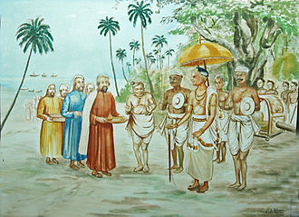
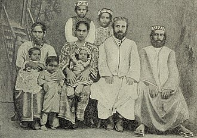
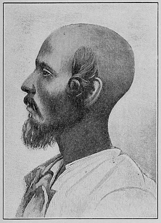
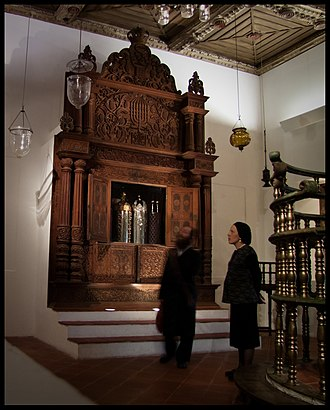
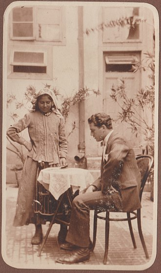

Kerala, stan leżący na malabarskim wybrzeżu Indii, od starożytności przyciągał ludzi z całego świata. Był on swoistym centrum handlowym subkontynentu z Bliskim Wschodem, Europą oraz północną i wschodnią Afryką. Jednym z bogactw Kerali były pożądane przez wszystkich przyprawy, takie jak pieprz, cynamon, kardamon i imbir. Kupcy robili tutaj fortuny- nie dziwi więc fakt, że wielu z nich podejmowało decyzję o osiedleniu się na stałe. Przywozili oni ze sobą całe dobrodziejstwo inwentarza- zwyczaje, języki, tradycje i religie. Przez wieki, wśród osiadających kupców byli Grecy, Rzymianie, Persowie, Syryjczycy, Arabowie i, oczywiście, Żydzi. Keralska wspólnota jest powszechnie uważana za najbardziej starożytną grupę żydowską w Indiach.

Nikt tak naprawdę nie wie na kiedy datować początki osadnictwa Żydów w Kerali. Historycy zazwyczaj wskazują na przełom er. Przemawia za tym fakt, że Kerala była wówczas często odwiedzana przez kupców z cesarstwa Rzymskiego. Chrześcijańska tradycja o św. Tomaszu mówi, że tym co przyciągnęło apostoła do Indii były właśnie informacje o wspólnotach żydowskich w Kerali*. Żydowskie tradycje różnią się od siebie. Jedne twierdzą, że napływ Żydów zaczął się już w czasach Salomona. Inne mówią o czasach niewoli babilońskiej, zburzeniu Drugiej Świątyni w Jerozolimie albo, że keralscy Żydzi to potomkowie ludzi wygnanych z Majorki w IV wieku. Konsensusem jest jednak to, że centrum działalności żydowskich wspólnot było portowe miasto Kodungallur, ważny ośrodek handlowy na malabarskim wybrzeżu.

Najstarszy dokument potwierdzający obecność Żydów w Kerali pochodzi jednak dopiero z okolic 1000 roku. Są to miedziane tabliczki jakie otrzymał żydowski starszy, Józef Rabban, od indyjskiego władcy. Zawierają one spis praw i przywilejów. Zakres tychże świadczy jednak, że wspólnota była już dobrze ukonstytuowana, więc jej historia jest raczej starsza niż przełom mileniów. Wszystko wskazuje na to, że potomkowie żydowskich kupców, choć zachowali religię, to generalnie wmieszali się w lokalne społeczeństwo. Żenili się z miejscowymi kobietami i posługiwali się językiem malajalam. Tabliczki wskazują, że zajmowali wysoką pozycję w społeczeństwie i byli bardzo blisko z władcami. Funkcjonowali w zasadzie jako autonomiczna wspólnota pod przewodnictwem swojej starszyzny. Mieli nawet prawo do samodzielnego zbierania podatków.

Wiemy, że w okolicach połowy XIV wieku port Kodungallur dotknęła powódź, która nie tylko zniszczyła wiele budynków, ale także zmieniła linię brzegową a to utrudniało korzystanie z portu. Działalność kupiecka zaczęła przenosić się do Koczinu- innego portowego miasta w Kerali. Część Żydów wyemigrowała bardzo szybko, bo już w połowie XIV wieku w Koczinie powstała pierwsza synagoga. Wielu zostało jednak w Kodungallur. Natknęli się jeszcze Portugalczycy w XVI wieku. Podejrzewa się, że czynnikiem, który przesądził o migracji reszty były ataki władców miasta Kozhikode w XVI wieku, którzy próbowali zyskać monopol na handel pieprzem. Większość Żydów uszła do krewniaków w Koczinie, gdzie zostali dobrze przyjęci przez lokalnego władcę- zwolnił ich z podatków jednocześnie przyznając wszystkie prawa, które mieli podatnicy.

Jak wie każdy kto czytał ten odcinek #daszwiare , portugalska infiltracja subkontynentu zwiększyła liczbę Żydów w Kerali. Przymusowo nawróceni na katolicyzm portugalscy żydzi widzieli w koloniach nie tylko okazję na dorobienie się, ale także szansę na ucieczkę przed inkwizycją. Keralscy Żydzi nazywali nowoprzybyłych paradesis (“obcy” w języku malajalam). Obydwie grupy stykały się czasem ze sobą, ale nie wymieszały się. Zapiski podróżników poświadczają odrębność- mówią o Żydach “białych” i “czarnych”. Paradesis mieli własną synagogę i nie zawierali raczej związków małżeńskich z indyjskimi Żydami. Niektórzy historycy twierdzą wręcz, że między wspólnotami dochodziło do konfliktów. Nowoprzybyli znali bowiem europejskie i bliskowschodnie języki oraz mieli kontakty z tamtejszymi wspólnotami żydowskimi w związku z czym stali się konkurencją dla tubylców.

Mimo różnic i tarć, obydwie grupy były identyfikowane przez sąsiadów jako Żydzi i utrzymywały ze sobą kontakty. Tak naprawdę centrum życia zarówno paradesis jak i tubylców była lokalna synagoga a nie większa wspólnota. Wiemy, że tych synagog było osiem i każda z nich posiadała swoje własne ziemie, budynki i księgi. Rola synagogi wykraczała poza religię- oprócz modłów, pieśni i studiowania pism udzielano ślubów, pożyczek, organizowano naukę dla dzieci, zbierano składki na przedsięwzięcia biznesowe oraz pomoc potrzebującym. Przynależność była określana patrylinearnie- dzieci stawały się członkami kongregacji ojca. Kongregacją kierowali starsi, potrafiący czytać i interpretować religijne teksty. To do nich należało ostatnie słowo w kwestii tego co i jak robić. Ciekawostką jest fakt, że księgi kupowano od Żydów na Bliskim Wschodzie, w Holandii i w… Polsce.

Portugalska dominacja, w trakcie której grupy mniejszościowe w Kerali były prześladowane (nie wyłączając miejscowych chrześcijan, których siłą zmuszono do przyjęcia katolicyzmu i zniszczono wiele z ich zabytków literackich), zakończyła się w 2. połowie XVII wieku. Miejscowi Żydzi wręcz udzielili wsparcia Holendrom, którzy w 1663 roku zdominowali Keralę. Holendrzy odnosili się do Żydów z większą tolerancją i za ich panowania paradesi jeszcze umocnili swoją pozycję w handlu. Dochodzili nawet do stanowisk administracyjnych i doradczych u Holendrów i indyjskich władców. Ograniczenie wpływów portugalskich równało się stępieniu siły inkwizycji, co pozwoliło też na większą otwartość w wyrażaniu kultury i przekonań.

Jeśli chodzi o liturgię i modły to synagogi były podobne do siebie. Wykorzystywano w nich elementy lokalne z zapożyczeniami z tradycji jemenickiej, sefardyjskiej i bagdadzkiej. Kompilacje lokalnych pieśni, modlitw i melodii nazywa się kolas (ciekawostka- są one używane we współczesnym Izraelu). Do naszych czasów zachowało się około 150 kobiecych, żydowskich pieśni w języku malajam. Pieśni te opowiadają historie biblijne, lokalne opowieści czy nawet historyjki z codziennego życia. W okolicach XIX wieku Żydzi z Koczinu zaczęli tworzyć pierwsze wydawnictwa judaistyczne w Indiach i drukować literaturę religijną, czytaną także przez imigrantów z Iraku i Bene Israel (plemiona żyjące w Indiach, uważające się za potomków starożytnych Izraelitów).

Umiejętność czytania i pisania oraz edukacja w ogóle, były ważne dla społeczności żydowskiej z Koczin. Była to zresztą typowa cecha dla wszystkich grup należących do wyższych kast w Kerali. Dzieci z tychże kast były uczone w domach lub szkołach na długo przed przybyciem Brytyjczyków (którzy lubią się pysznić tym, że przynieśli Indusom edukację). Wpływ lokalnych zwyczajów przejawiał się także we w miarę wysokim statusie kobiet. Społeczeństwo południa Indii było o wiele bardziej egalitarne niż ówczesny, europejski standard. Stąd kobiety także często umiały pisać i czytać. Niektóre z nich znały nawet hebrajski.

Fakt niskiego analfabetyzmu i łatwość w uczeniu się wśród koczińskich Żydów sprawił, że byli oni często zatrudniani w brytyjskiej administracji kolonialnej (szybko ogarniali także angielski). Uratowało to także sytuację ekonomiczną wspólnot żydowskich po tym jak handel przyprawami stał się mniej opłacalny. Gorsza sytuacja ekonomiczna w Kerali sprawiła, że koczińscy Żydzi zaczęli osiedlać się w innych regionach Indii- migrowano głównie do Bombaju i Kalkuty. Zmiana miejsca zamieszkania nie oznaczała jednak utraty tożsamości. Za wyjątkiem nielicznych paradesi, którzy potrafili się wżeniać w rodziny żydowskich imigrantów z Iraku, większość brała śluby tylko w ramach swojej grupy.

Mimo tak wielu lat spędzonych w Indiach i braku większych prześladowań (poza portugalską inkwizycją), miażdżąca większość koczińskich Żydów podjęła decyzję o wyjeździe do Izraela gdy w połowie XX wieku nadarzyła się taka okazja. Idee syjonistyczne rozprzestrzeniały się wśród indyjskich żydów już wcześniej czego wyrazem była na przykład pieśń w języku malajam mówiąca:

"Nadzieja którą mieliśmy od starożytnych czasów, aby powrócić do Ziemi nadanej nam przez Boga, Nie zniknęła!" 

Niezależnie od tego jakie były motywy (odbudowa Izraela, kiepska sytuacja gospodarcza, chęć życia w religijnym otoczeniu etc.) koczińscy Żydzi w swojej masie wybrali Izrael. Migracje zaczęły się w latach 50. a największa grupa przesiedliła się w 1954 roku. Większość z nich zamieszkiwała w rolniczych komunach mimo, że w Indiach nigdy na dużą skalę nie zajmowali się rolnictwem. Z czasem zaczęli się nawet dorabiać majątków i budować własne synagogi. Co ciekawe- “biali” paradesi pozostali w Indiach dłużej- wyjechali dopiero w latach 70. i 80. Obecnie liczbę koczińskich Żydów w Izraelu szacuje się na około 8 k. W Indiach zostało ich zaledwie kilkudziesięciu.
