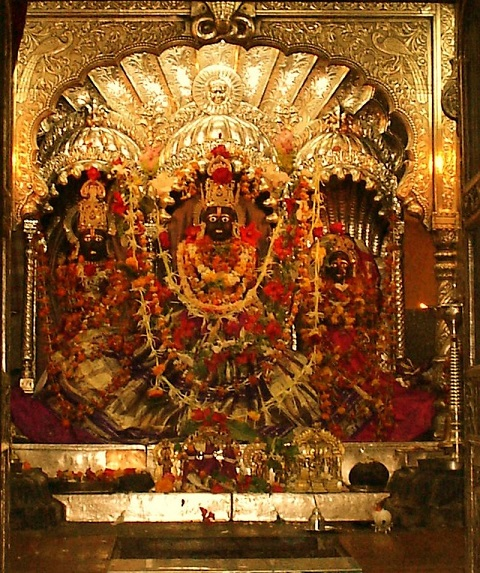
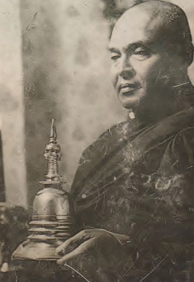
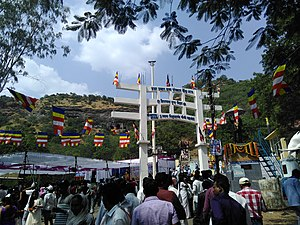

Wielu ludziom buddyzm kojarzy się przede wszystkim ze skupieniem na życiu wewnętrznym. W powszechnej opinii jest to religia polegająca przede wszystkim na samodoskonaleniu się za pomocą praktyk medytacyjnych uzupełnianych nauczaniem moralnym. Oczywiście co jakiś czas docierają do nas informacje o mnichach wywierających wpływ na rządy w swoich krajach, prowadzących agitację na rzecz jakiejś partii czy liderach politycznych powołujących się na buddyzm w swoich działaniach. Jest to często przedstawiane jako działalność poboczna, niekoniecznie zła, ale jednak odbiegająca od wzorca. Z opinią taką na pewno nie zgodziłby się Bhimrao Ramji Ambedkar dla którego zaangażowanie w sprawy polityczne i społeczne było rdzeniem i motywem przewodnim buddyzmu.

Ambedkar urodził się w kolonialnych Indiach pod koniec XIX wieku. Jego rodzina wywodziła się z kasty dalitów (“niedotykalnych”) i jako taka była pogardzana przez resztę społeczeństwa. Szczęściem w nieszczęściu był fakt, że ojciec Ambedkara był brytyjskim żołnierzem, dzięki czemu on i jego rodzeństwo mogli liczyć na edukację. W szkole byli jednak traktowani o gorzej niż dzieci z innych kast. Nie mogli na przykład siedzieć w obecności reszty klasy czy samemu nalać sobie wody (jako, że nikt nie kwapił się do obsługiwania dalitów, Ambedkar mógł pić tylko wtedy gdy w szkole był służący). Warunki życia też nie rozpieszczały- z trzynastu braci i sióstr Ambedkara przeżyła tylko czwórka. Był on jedynym z całej gromadki, który zdał testy końcowe i mógł kontynuować edukację w liceum. Warto dodać, że był on jedynym dalitem w całej szkole.

Po ukończeniu szkoły średniej dostał się do college’u i, według niego samego, był on pierwszym dalitem z kasty Mahar, który osiągnął ten level edukacji. Zdanie przezeń egzaminów z angielskiego było tak wielkim wydarzeniem, że ludzie z jego otoczenia zorganizowali specjalny festyn. Jeden z gości obecnych na celebracji wręczył Ambedkarowi biografię Buddy. Dalsza kariera edukacyjna zabrała naszego bohatera na studia do USA, konkretniej na Columbia University. W 1915 obronił magistra z ekonomii na tej uczelni, biorąc wcześniej udział także w kursach z filozofii, socjologii, psychologii i antropologii. Rok później obronił kolejną magisterkę po czym powrócił do Indii gdzie próbował pracować jako nauczyciel, księgowy i doradca biznesowy- wszystkie te interesy kończyły się jednak gdy klienci odkrywali, że Ambedkar jest dalitem.

W 1918 roku udało mu się zostać wykładowcą ekonomii politycznej w Bombaju. Był generalnie lubiany przez studentów, ale dalickie pochodzenie sprawiało, że inni nauczyciele nie traktowali go poważnie. Z powodu dyskryminacji i świadomości fatalnego położenia dalitów Ambedkar angażował się politycznie i społecznie. Mimo braku formalnego wykształcenia występował przed sądem jako prawnik dla osób z niższych kast. Pisywał również do gazet przeznaczonych dla dalitów i domagał się polityki wyrównywania szans i większych nakładów na edukację wśród biedoty. Od 1927 roku zaczął organizować masowe akcje polegające na marszach do ujęć wody (“niedotykalnym” nie wolno było dotykać pojemników na wodę jak i samej wody pitej przez inne kasty) czy wtargnięcia do świątyń (dalitom nie wolno było wchodzić do wielu hinduskich świątyń).

Ambedkar uważał, że religia hinduska jest jednym z najważniejszych elementów niesprawiedliwego systemu społecznego, który skazuje część ludzi na marną egzystencję. Z tego tytułu zaczął przeciwko niej występować. W 1927 roku publicznie spalił kopię religijnego prawa zwanego Manusmryti, który sankcjonował podziały kastowe i dyskryminację. W 1930 roku zorganizował marsz 15k dalitów, którego celem była świątynia Kalaram, ważny ośrodek pielgrzymkowy, przechowujący cudowne wizerunki Ramy (jeden z ważniejszych bogów w wielu hinduskich religiach). Dalici, chcący po raz pierwszy w historii ujrzeć cudowne przedmioty nie zostali wpuszczeni przez kapłanów.

Ambedkar zaczął postrzegać hinduizm jako niereformowalną podporę systemu kastowego i z tego powodu zaczął interesować się innymi religiami. Chrześcijaństwo czy islam były w Indiach postrzegane jako obce wiary, narzucane przez kolonizatorów- skreślało je to niejako na starcie. Przez pewien czas Ambedkar pozostawał w zażyłych stosunkach z sikhami i odbył nawet kilka spotkań z ichnimi liderami religijnymi. Zawarte w sikhizmie idee walki z niesprawiedliwością były dlań bardzo atrakcyjne. Po pewnym czasie uznał jednak, że sikhowie nie sympatyzują wcale ze sprawą dalitów i uważają ich za obywateli drugiej kategorii. Jego zainteresowania skupiły się wówczas na buddyzmie.

W 1950 roku odbył on podróż na Sri Lankę gdzie wziął udział w Światowym Kongresie Buddyjskim. Nawiązał również kontakty z indyjskimi buddystami i w trakcie ceremonii otwarcia klasztoru w indyjskim Pune ogłosił, że jest w trakcie pisania książki o buddyzmie i wraz z jej wydaniem publicznie przyjmie nauki Buddy. W międzyczasie dwukrotnie odwiedził Birmę gdzie również wziął udział w Światowym Kongresie Buddyjskimi. W 1955 roku założył Indyjskie Towarzystwo Buddystów a rok później ukończył pracę nad wyżej wspomnianą książką. Dotrzymał słowa co do publicznej konwersji. W celu jej formalnego sfinalizowania zaprosił do Nagpuru niejakiego Hammalawę Saddhatissę, wykształconego na zachodnich uniwersytetach mnicha i misjonarza ze Sri Lanki.

Do Nagpuru przybył nie tylko Saddhatissa, ale także setki tysięcy dalitów, którzy widzieli w Ambedkarze nie tylko reprezentanta ich sprawy i lidera, ale kogoś na kształt superherosa. Ceremonia przyjęcia schronienia w Trzech Klejnotach i zaakceptowania Pięciu Wskazań* przez Ambedkara trwała dwa dni. Na buddyzm przeszedł bowiem nie tylko on i jego rodzina, ale prawie wszyscy zebrani tam dalici. Ich liczbę szacuje się na około 400- 500k. Datę tę powszechnie uważa się za początek tak zwanej nfawajany, czyli Nowego Wozu (inne tradycje buddyjskie to Mahajana- Wielki Wóz, Hinajana- Mały Wóz i, czasami wyrózniana jako odrębna, Wadżrajana- Diamentowy Wóz).

W założeniu nawajana miała być powrotem do czystej nauki Buddy. Jej twórcą był sam Ambedkar, który uznał, że wszystkie inne “wozy” są tak naprawdę odejściem rdzenia przekazu buddy Siakjamuniego. I tak na przykład odrzucał twierdzenia, że Siddhartha Gautama zacząć swoje poszukiwania ponieważ chciał zrozumieć naturę cierpienia, któremu podlegają wszystkie żywe istoty. Ambedkar uznał, że początkiem drogi Buddy były starania na rzecz zaprowadzenia pokoju między grupami społecznymi i etnicznymi w państwie którym żył. Odrzucał także tradycyjną interpretację Czterech Szlachetnych Prawd. Uznał, że jej wydźwięk jest zbyt pesymistyczny i została ona włożona w usta Buddy przez umartwiających się mnichów. Sam monastycyzm uznał za absolutnie nie do przyjęcia.

 konwersji.")

Krytyce poddane zostały także takie koncepty jak anatta, karma i reinkarnacja. Anatta oznacza (w uproszczeniu ofc) brak rzeczywistego, indywidualnego “ja”. Zdaniem Ambedkara koncept ten stoi w sprzeczności z karmą i reinkarnacją- skoro nie ma jakiegoś “ja” to kto zbiera złą lub dobrą karmę i kto odradza się w kolejnych życiach? Ambedkar w ogóle odrzucał prawa karmiczne i reinkarnację uważając je za przesądy, fałszywe wierzenia mające powstrzymywać ludzi przed walką o swoje, bo przecież ich pozycja i znaczenie w tym życiu są efektem czynów z poprzednich wcieleń (więc jeśli będą grzeczni to kolejne wcielenie będzie lepsze).

Podobne zastrzeżenia miał co do idei Nirwany, która jego zdaniem nie była żadnym stanem wewnętrznym, uwolnieniem od cierpienia i lęku przed śmiercią czy innym tam przerwaniem cyklu narodzin. Ambedkar uważał te wszystkie interpretacje za wypaczenia, bo jego zdaniem Nirwana była “królestwem Sprawiedliwości na Ziemi” w którym ludzie “zostają wyzwoleni od biedy i dyskryminacji i otrzymują wsparcie aby czynić swoje życie szczęśliwym”. W dużym skrócie Ambedkar uważał po prostu, że kolejne pokolenia buddystów poszły w eskapizm, ucieczkę od realnych problemów do świata wewnętrznych przeżyć podczas gdy Budda miał jakoby opowiadał się za działaniem i społecznym zaangażowaniem na rzecz sprawiedliwości i równości “tu i teraz”.

Ambedkar zmarł po kilku tygodniach od konwersji, ale ruch który zapoczątkował trwa nadal. Najważniejszym podsumowaniem nauczania nawajany jest wydana pośmiertnie praca jej założyciela- The Buddha and His Dhamma. Nie ma tam nauczania mówiącego o medytacji, karmie, reinkarnacji czy Szlachetnych prawdach (które są obecne w niemal wszystkich historycznych szkołach buddyzmu). Tekst prezentuje buddyzm jako swego rodzaju ruch społeczno- ekonomiczny, którego celem jest poprawienie sytuacji dyskryminowanych i ubogich. Sam Ambedkar jest prezentowany jako kolejny budda i utożsamiany z Maitreją. Dla większość wyznawców nawajany jest to jedyne źródło informacji o buddyzmie, stąd nie mają oni dysonansu przy lekturze.

Wielu badaczy zajmujących się buddyzmem twierdzi, że nawajany nie powinno traktować się jako buddyjskiego nurtu a raczej coś w rodzaju nowej religii w przebraniu starej. Proponują oni nawet nazwę ambedkaryzm. Sam założyciel i jego zwolennicy są natomiast zdania, że oni nic nie wymyślili ani nie dodali do nauk Siakjamuniego- po prostu oczyścili je z pesymizmu i eskapizmu, który był efektem władzy wspólnot monastycznych i strachu przed historyczną hierarchią społeczną. Niezależnie od opinii krytyków, dalitowie uważają się za buddystów i są jako tacy identyfikowani przez państwo Indyjskie. Według cenzusu z 2011 roku w Indiach żyje około 8.4 milionów buddystów. Aż 87% z nich (czyli jakieś 7.3 miliony) to zwolennicy nawajany.
