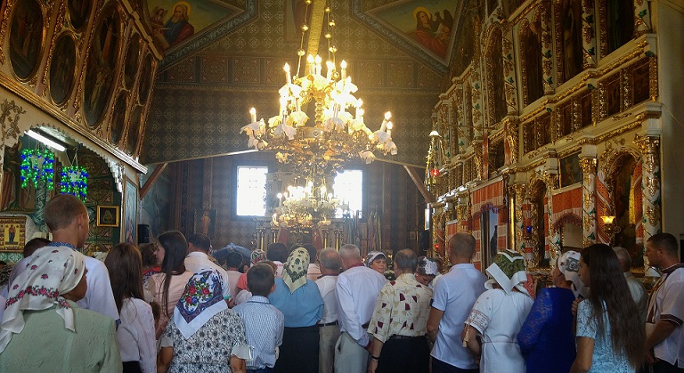
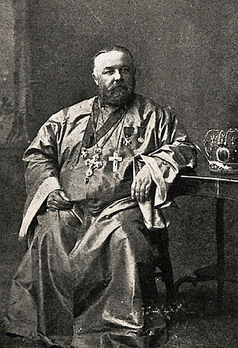
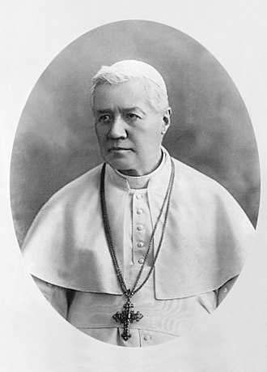
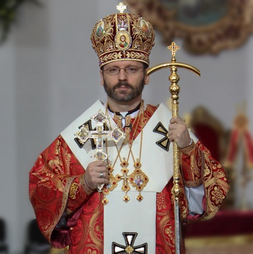

Od przełomu lat 70. i 80 XIX wieku do Stanów Zjednoczonych zaczęła migrować ruska (nie mylić z rosyjską) ludność Galicji, Bukowiny i Węgier. Ludzi tych określano różnymi mianami- Rusini, Galicyjczycy a nawet Zakarpaccy Ukraińcy. Jedną z cech, która odróżniała ich od reszty europejskich imigrantów do Stanów była religia. Większośc była wprawdzie katolikami, ale nie rzymskimi- należeli oni do tak zwanego kościoła greckokatolickiego. Jego cechą charakterystyczną było zachowanie wielu prawosławnych praktyk, wierzeń i niektórych świętych* z uznaniem uniwersalnego prymatu papieża. Wspólnoty te były pokłosiem unii między prawosławnymi kościołami a Rzymem.

Motywy tychże unii były bardzo złożone, ale nie sposób ukryć, że polityka grała tutaj bardzo dużą rolę. Zachodnia szlachta rusińska znalazła się bowiem w granicach katolickich mocarstw- najpierw Polski a następnie Habsburgów. Wielu z nich, chcąc z jednej strony zachować swoją tożsamość i zwyczaje a z drugiej wpływy i władzę, doszła do wniosku, że najlepszym rozwiązaniem będzie formalne przyłączenie się do kościoła katolickiego (mówimy tutaj o czasach w których hierarchia była ściśle powiązana z władzą i innowiercom ciężko było robić karierę). Perspektywa pozyskania nowych wiernych była także bardzo atrakcyjna dla papiestwa i dlatego obydwie strony poszły na ustępstwa.

Unicka (od unii kościelnej) hierarchia była gotowa uznać papieża za ziemskiego zwierzchnika kościoła, a w zamian papiestwo zgodziło się na zachowanie słowiańskiej liturgii, żonatych duchownych, pomijanie filoque w credo, komunię pod obiema postaciami, de facto kult świętych prawosławnych (którzy zmarli w stanie schizmy z Rzymem), prawosławne praktyki duchowe (na czele z kontrowersyjnym hezychazmem) i wiele, wiele innych. Teologowie musieli się nieźle nagimnastykować aby jakoś uzasadnić te rzeczy (np. jak pogodzić katolicką karę ekskomuniki dla osób nauczających, że dzieci powinny przyjmować komunię z faktem, że ruskie dzieci komunię przyjmowały etc.).

Unia wywołała wiele kontrowersji - w przypadku Polski oznaczała ona bowiem czasową delegalizację prawosławia. Wielu wiernych uznało biskupów za zdrajców. Próby narzucania unii miały polityczne skutki- ruska ludność słała na przykład poselstwa do Moskwy prosząc o ochronę przed “papistami” co było znakomitym pretekstem dla caratu. Dla szeregowych wiernych, których hierarchia przyjęła unię, kontrowersje z czasem ucichły. W wielu przypadkach “katolickość” była czysto teoretyczna. Do tego stopnia, że ludzie ci nadal słyszeli w kościele, że są prawosławni** (a jak przestali to skończyło się to schizmą tylawską***). Swoje robiła izolacja geograficzna. Katolik z Włoch czy Hiszpanii nie miał pojęcia o wierzeniach i praktykach ruskich chłopów z Bukowiny i vice versa.

Migracje do Stanów miały jednak wszystko zmienić. Ich głównym motywem była ekonomia- bieda i brak perspektyw. Doświadczenia pierwszych migrantów były na tyle obiecujące, że szacuje się, że do 1917 roku do USA wyjechało około 350k Rusinów. Wielu udało się do pracy w kopalniach w Pensylwanii, gdzie trafili akurat na strajki górników. Właściciele kopalń byli wniebowzięci czego jednak nie można powiedzieć o miejscowych, którzy nie byli szczęśliwi, że przybysze took ‘er jabz. Szczęśliwi nie byli też katoliccy biskupi, którzy widząc greckokatolickie praktyki łapali się za głowę i zastanawiali czy to aby na pewno jest katolicyzm. Ponadto- jeśli ci ludzie naprawdę są katolikami to jaką różnicę robi im ryt? Niech chodzą na łacińską liturgię, jak Pan Bóg przykazał.

To oczywiście nie spodobała się Rusinom. Gdy tylko mogli budowali swoje kościoły i ściągali księży z ojczyzny. Problem polegał jednak na tym, że księża ci podlegali pod miejscowych, łacińskich biskupów. Szczególnym problemem był fakt posiadania żon przez księży greckokatolickich- wzbudzało to oczywiście zazdrość i konsternację ze strony łacińskiego kleru. Papież Leon XII nakazał wówczas grekokatolikom aby do USA wysyłali tylko bezżennych duchownych (lub wdowców). Wielu Rusinów, w tym duchowni, odebrało to jako potraktowanie ich jako katolików drugiej kategorii. Zaczęli się wówczas zastanawiać czy aby na pewno są katolikami i czy unia miała sens.

 w Minneapolis.")

Jednym z wątpiących był niejaki Aleksy Toth. Przybył on do USA na zaproszenie Rusinów i miał objąć parafię greckokatolicką w Minneapolis. Był wdowcem, więc wyglądało na to, że wszystko pójdzie gładko. Rzeczywistość okazała się jednak był odmienna. Jego nowy biskup, John Ireland, wściekł się gdy okazało się, że Toth był żonaty. Zabronił mu objęcia parafii, zakazał katolikom kontaktów z nim a wręcz chciał wysłać Totha z powrotem do Europy. Aleksy odwołał się wówczas do Rzymu, który podtrzymał decyzję Irelanda. Co więcej- papież nakazał wszystkim księżom greckokatolickim, którzy kiedykolwiek mieli żonę, opuścić Stany Zjednoczone.

Toth nie zaakceptował tej decyzji i spotkał się z siedmioma innymi kapłanami, którzy podzielali jego rozgoryczenie i mieli dość niesprawiedliwego traktowania. Parafianie Totha i innych księży również byli zmęczeni nastawieniem amerykańskiego duchowieństwa i zaproponowali aby zwrócić się do rosyjskich, prawosławnych biskupów. Najbliższy, Włodzimierz, rezydował w San Francisco. Na zaproszenie parafii Totha przybył on do Minneapolis w marcu 1891 roku i krótko po tym cała parafia (około 400 osób), na czele z Aleksym, została włączona do rosyjskiej cerkwi w Ameryce. Był to kamyczek, który poruszył lawinę.

Energiczny Toth zaczął kontaktować się z innymi parafiami i zachęcać je do podobnego kroku. Szybko okazało się, że przywiązanie wielu grekokatolików do katolicyzmu było bardzo słabe albo wręcz żadne. Szacuje się, że z około 400 rusińskich parafii w USA aż 300 przeszło na prawosławie. Dane mówią, że około 75% rusińskich emigrantów porzuciło grekokatolicyzm na rzecz prawosławia. Całkowicie zmieniło to oblicze prawosławia w Ameryce. Przed przybyciem Rusinów jego wyznawcy mieszkali głównie na Alasce i stanowili miks Rosjan i rdzennych ludów Alaski. W wyniku działalności Totha i jemu podobnych, Rusini zaczęli stanowić aż 85% wiernych rosyjskiej cerkwi w Stanach.

Rzym, przestraszony masowymi konwersjami, postanowił przeciwdziałać, wysyłając w 1907 roku Sotera Ortyńskiego, greckokatolickiego biskupa, do USA. Zaczął on organizować życie kulturalne i parafialne dla tych wspólnot, które pozostały przy unii. Grekokatolicyzm w Stanach wydawał się łapać drugi oddech, ale to z kolei skandalizowało duchownych z obrządku łacińskiego. Wielu z nich nie rozumiało jakim cudem ludzie mający tak odmienne praktyki i wierzenia w ogóle mogą być uważani za katolików. Presja rzymskokatolickiego duchowieństwa i wiernych sprawiły, że papież Pius X wydał list apostolski Ea Semper. Ortyński określił list jako haniebny i uważał, że przyczyni się on do dalszych konwersji na prawosławie.

List podporządkowywał bowiem biskupstwo greckokatolickie miejscowej, łacińskiej hierarchii. Duchowni greckokatoliccy mieli kształcić się w rzymskich seminariach i żyć w celibacie (co było kuriozalne, bo postanowienia unii zezwalały im na posiadanie żon). Musieli także przysięgać, że nie wyjadą poza granice łacińskiej diecezji bez zgody jej biskupa. Łacińska hierarchia miała także prawo do usuwania greckokatolickich księży. List uniemożliwiał także przyjmowanie obrządku wschodniego przez rzymskich katolików (ruch w drugą stronę był zaś dozwolony bez przeszkód). Małżeństwa mieszane mogły być zawierane tylko w kościele rzymskim. Jeśli mężczyzna obrządku łacińskiego poślubiał Rusinkę, wszystkie dzieci musiały być obowiązkowo chrzczone w jego kościele.

Mimo krytyki ze strony greckokatolickiej instrukcje z listu pozostawały w mocy do 1913 roku. Konwersje na prawosławie trwały i dotyczyły nie tylko ludzi czujących związki z Rosją. Za przykładem Totha zaczęli iść także duchowni określający się jako Ukraińcy i powiązani z jej ruchem niepodległościowym- czyli twarde jądro grekokatolicyzmu. Jedną z takich osób był ksiądz Hryhoryj Hruszka, który redagował imigranckie pismo Ukrainska Swoboda. Po konwersji zaczął wydawać inny tytuł- Swiet, w którym oprócz idei ukraińskiej niepodległości propagował wystąpienie z unii i powrót do prawosławia. Czynnikiem, który zatrzymał proces masowych konwersji wśród Rusinów okazała się rewolucja bolszewicka. Doprowadziła ona do kryzysu prawosławnej eparchii i dała kościołowi katolickiemu czas na ogarnięcie sytuacji.

Współcześnie wschodnie kościoły katolickie działają w USA bez przeszkód i dozwolone jest nawet zmienianie obrządku z łacińskiego na wschodnie. Nie jest to prosty proces, ale w świetle prawa kanonicznego, legalny. Kościoły te są czasem wręcz promowane i prezentowane jako alternatywa dla katolików rozczarowanych Rzymem i zainteresowanych wschodnimi, mistycznymi praktykami. Sam spotkałem się z unitami, którzy polecali swoje parafie jako “best of both worlds” (łączące w sobie najlepsze cechy prawosławia i katolicyzmu). Ich działalność budzi czasem kontrowersje wśród tradycyjnych katolików, ale ogranicza się ona do internetu.
