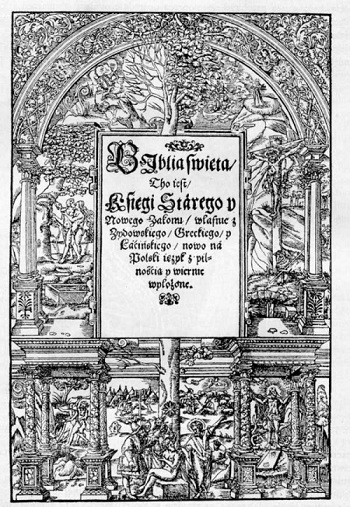
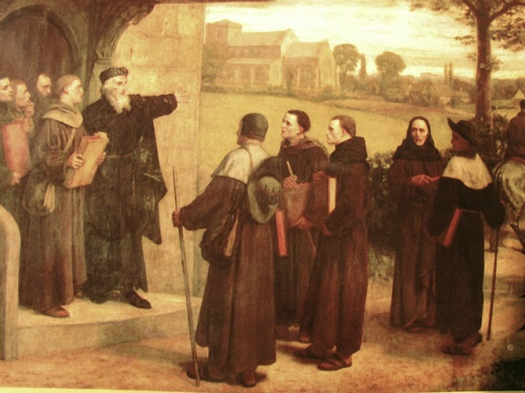
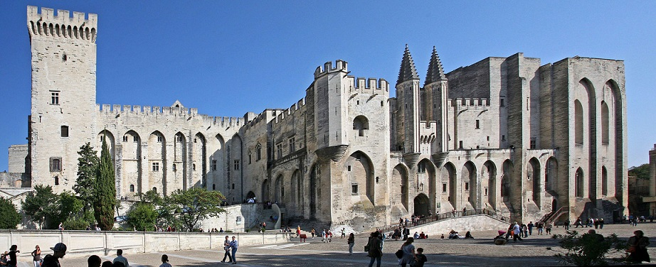

Protestantyzm nie ma u nas dobrej prasy. Mimo, że protestanci mieli swego czasu wpływ na nasze dzieje- także religijne. Pierwsze, kompletne tłumaczenie Biblii na polski to sprawka kalwinów. Dystans (lub niechęć) ma kilka przyczyn. Protestantyzm był domeną wyższych klas. Wyznawcami byli głównie magnaci, średnia szlachta i bogate mieszczaństwo. Dla ludu było to coś “nie swojskiego”. Swoje dokładała katolicka propaganda wiążąca protestantyzm z obcymi. Przełomem był “potop” w trakcie którego szlachta kolaborowała ze Szwedami. Wśród kolaborantów nie brakowało katolików, ale fakty nie są przeszkodą by kłamać. Zabór pruski jeszcze wzmocnił to przekonanie. Współcześnie propaganda nowoateistyczna, chcąc ośmieszyć religię, sięga po skrajne przykłady ze swojego protestanckiego podwórka. Anon myśli potem, że wszyscy protestanci to kreacjoniści młodej Ziemi czytający Biblię dosłownie.

Żeby choć trochę odczarować protestantyzm chciałem w kilku odcinkach (niekoniecznie chronologicznie) przedstawić korzenie XVI wiecznej reformacji. Wielu historyków uważa, że bardzo duży wpływ na myślicieli religijnych doby renesansu miał niejaki Jan Wiklef, żyjący w XIV wieku. Nie sposób oprzeć się wrażeniu, że wyprzedził swoją epokę. Był Anglikiem a Wyspy były wówczas “different kettle of fish” niż reszta Zachodu. Na kontynencie ruchy mające na celu reformę kościoła, który postrzegany był jako zdemoralizowany i zainteresowany polityką, widać już w XI wieku. Próby zmiany wywoływały różne reakcje instytucji- od brutalnych prześladowań (waldensi) do pełnego włączenia w ramy kościoła (franciszkanie). Przez kolejne kilkaset lat Zachód był areną krucjat, działalności inkwizycji, nowych zakonów, kaznodziejów i gorących debat teologicznych.

Na tym tle Wyspy malowały się jako ostoja spokoju. Oczywiście herezje się zdarzały, ale ich zasięg był mocno ograniczony, czasem tylko do wąskiego grona kilku uczonych. Historycy wskazują, że różnice między Anglią a kontynentem mogły wynikać ze scentralizowanej władzy królewskiej i kościelnej w pierwszym przypadku- heretyków dojeżdżano zanim rozpropagowali swoje poglądy. O życiu Wiklefa nie wiadomo zbyt wiele. Urodził się w okolicach 1328 roku w rodzinie pomniejszej szlachty z Wycliff-on-Tees. Dzięki wyróżniającemu go intelektowi mógł studiować na Oksfordzie. W 1351 roku został wyświęcony na księdza a pięć lat później ukończył studia. Początkowo zajmował się nauczaniem filozofii, ale cały jego ambicją było nauczania teologii (była uważana za bardziej prestiżową), co mu się w końcu udało.

Wiklef był generalnie popularny na uczelni. Miał jednak także wrogów. Widać to na przykładzie historii z oksfordzkim Canterbury College. W 1365 roku Wiklef został jego dyrektorem. Studentami byli (niekoniecznie lubiący się nawzajem) księża i zakonnicy. Wiklef był księdzem i do tego miał wątpliwości co do zasadności monastycyzmu. Konflikt z monastykami skończył się usunięciem go z funkcji dyrektora w 1370 roku. W tym samym okresie zaczęły krystalizować się religijne poglądy Jana. W jego czasach gorący był spór o uniwersalia. W uproszczeniu i na przykładzie- jaki jest związek esencji zwierząt (rzeczy które sprawiają, że zwierzę jest identyfikowalne jako zwierzę) a materialnie istniejącymi zwierzętami? Czy jest jakaś esencja, która istnieje obiektywnie w każdym zwierzęciu czy etykieta “zwierzęta” to po prostu nasza arbitralny wymysł?

, Wiklef początkowo inpirował się jego pracami.")

Całość sporu jest bardzo złożona i daleko wykracza ponad ten odcinek oraz moją wiedzę. Ważne jest jednak to jaką pozycję zajął Wiklef. Po wielu lekturach, debatach i przemyśleniach Jan uznał, że wszystkie idee są obiektywnie istniejącymi bytami, narodzonymi w Boskim Umyśle. Boskie idee są archetypami, które później manifestują się w materialnym świecie. Idea kościoła była więc niekoniecznie zbieżna z kościołem istniejącymi w materialnym świecie. Ponadto- ziemski kościół nie ma na nią monopolu i jest z nią związany o tyle, o ile realizuje jej założenia. Dzisiaj nie brzmi to może jakoś szczególnie odważnie, ale wówczas był to prawdziwy przełom. Oznaczało bowiem, że wierni mają prawo sprzeciwiać się instytucji jeśli robi ona coś co jest sprzeczne z boskim zamysłem.

W epoce, w której przekonanie o braku zbawienia poza kościołem był czymś szeroko rozpowszechnionym a zbawienie było celem wielu ludzi, miało to olbrzymie znaczenie. W myśl Wiklefa w prawdziwym kościele bożym był bowiem nie ten kto na papierze przynależy do instytucji rządzonej przez biskupów, ale ten kto realizuje boży zamysł. Opływający w luksusy biskup, zajęty polityką i wizytami w lunaparach* po prostu nie jest w kościele. Niezależnie od teologicznego kunsztu i odprawionych rytuałów. Skonfliktowany z nim wiejski kaznodzieja, który całe swoje życie poświęcił służbie Bogu i ludziom jest zaś w kościele nawet jeśli obłożono go klątwami i ekskomuniką. Dla instytucjonalnego kościoła była to niezwykle niebezpieczna idea, podważająca jego pozycję i monopol na religię.

Nie znaczy to jednak, że Wiklef odrzucał instytucję. Mieściła się ona w jego systemie- bycie faktycznym kościołem nie wynikało jednak z definicji, ale z trzymania się ideału. Poglądy te miały polityczne skutki, co dostrzegł Jan z Gaunt. Teoretycznie był on regentem, ale w praktyce rządził Anglią. Otoczył Wiklefa protekcją co sprawiło, że biskupi nie mogli go tknąć. Była to konsekwencja kontrowersji dotyczących relacji kościoła z państwem. Problem ten narastał od XI wieku i wynikające z niego napięcia znalazły ujście np. w sporze o inwestyturę czy konflikcie Bonifacego VIII** z Francją. Władza świecka do walki na froncie ideologicznym z kościelnymi teologami zaczęła rzucać swoich uczonych, krytykujących papieskie roszczenia do supremacji. Wiklef był jednym z nich.

Jego wizja kościoła była różna od tej, którą prezentowała instytucja. Źródłem inspiracji był prymitywny kościół opisany w Biblii, którą Wiklef znał na wyrywki. Jego zdaniem autorytet lidera religijnego wynikał z jego kondycji moralnej. Innymi słowy- nie jesteś wiarygodny jeśli pouczasz wszystkich o ewangelii a w twoim postępowaniu widać co innego. Był to cios w pozycję biskupów, których powaga, zdaniem kościoła, wynikała z urzędu i apostolskiej tradycji. Był to palący problem zwłaszcza, że pod koniec XIV wieku schizma awiniońska pogłębiła patologie związane z polityką i pieniędzmi wśród hierarchii a do tego zrodziła nowy problem. Papieży było kilku (zazwyczaj dwóch, ale czasem nawet trzech naraz) a biskupi żonglowali swoją lojalnością razem z władcami.

Wierni zastanawiali się skąd zatem mają wiedzieć która ekipa jest prawdziwym kościołem (niewłaściwy == piekło). Odpowiedź Wiklefa była prosta- kościół jest tam gdzie widać chrześcijańską miłość, opiekę nad słabszymi, wzajemną pomoc i szczerość wiary. Pogląd ten uderzał także w inny filar kościoła, czyli sakramenty. Sakramenty, są zdaniem katolicyzmu, przekaźnikiem łaski, którą stwórca daruje wiernym aby ich uświęcać. Uświęcanie to jest konieczne do zbawienia (bo upadły stan ludzi sam się nie regeneruje) co czyni sakramenty niezbędnymi i uzależnia wiernego od instytucji (bo tylko w jej ramach sakramenty są dostępne). W świetle poglądów Wiklefa sakramenty mogły równie dobrze istnieć poza instytucją (inna sprawa, że nie uważał ich za przekaźniki łaski).

Jako się rzekło- Wiklef nie odrzucał instytucji- uważał natomiast, że musi się ona nieustannie pilnować bo jej bycie kościołem jest warunkowe. Doceniał realną świętość i oddanie chrześcijańskim zasadom wielu katolików. Ktoś zapyta jednak- jakim zasadom i dlaczego akurat tym? Jeśli nie biskupi to kto decyduje? Odpowiedź Wiklefa była prosta: Biblia. Jego zdaniem była ona dokładnym opisem pierwotnego kościoła, który z kolei był najwierniejszym, w świecie materialnym, odbiciem boskiego ideału. Z tego powodu uważał, że cała działalność kościoła powinna wynikać z Biblii i należy usuwać te praktyki i wierzenia, których w niej nie ma. Z tego tytułu zajadle krytykował na przykład monastycyzm, który uważał za “prywatyzowanie religii”, co doprowadziło do ostrego konfliktu z zakonami.

Radykalne poglądy Wiklefa nie uszły uwadze Rzymu. W 1377 roku papież Grzegorz XI opublikował listę 18 “błędnych wniosków” i napisał:

"wybucha w tak obrzydliwym i odrażającym szaleństwie, że nie boi się podtrzymywać i publicznie głosić, a raczej przekazywać wymiocin wyssanych z własnej, jadowitej piersi, dogmatycznych propozycji i wniosków [...] które grożą obaleniem i osłabieniem całego kościoła."

Dzięki ochronie ze strony Jana z Gaunt, Wiklef lekce sobie ważył tego typu ataki. Kościół był ponadto osłabiony kryzysem schizmy awiniońskiej i nie potrafił zmusić świeckich władz do ukarania heretyka. Nauczanie Wiklefa i kiepska sytuacja moralna kleru były wodą na młyn angielskiego antyklerykalizmu. Wiklef stał się swego rodzaju celebrytą na Oksfordzie i mimo kolejnych, wezwań hierarchów do ukarania go, wykładał sobie jeszcze długo jak gdyby nigdy nic.

Tym co sprawiło, że “pałka się przegła” była kwestia eucharystii. W katolickim nauczaniu chleb i wino ulegają transsubstancjacji- czyli zachodzi w nich zmiana esencji z esencji chleba i wina, na esencję ciała i krwi Chrystusa a zatem, stają się one rzeczywistym ciałem i krwią Jezusa (nie metaforycznie). Wiklef jawnie skrytykował ten pogląd. Papiestwo, mimo trwającego kryzysu, wymogło w końcu interwencję i Wiklef został..., nie, nie spalony na stosie. Pozycja i związki z rządzącymi sprawiły, że wysłano go po prostu na przedwczesną emeryturę. Nadal jednak publicznie głosił i nauczał. Z tego powodu w 1382 roku odbył się synod angielskiego kościoła, który potępił nauczanie Wiklefa. Jego zwolennicy musieli wyrzec się “błędów” aby uniknąć procesu.

Sam Wiklef pozostał jednak niewzruszony. Nie tylko odmówił stawienia się przed papieżem w 1384 roku, ale w liście wyraził nawet opinię, że papież może być Antychrystem. Zmarł w tym samym roku. Do samego końca zajmował się pisaniem prac teologicznych i filozoficznych oraz propagowaniem swoich poglądów na kwestie religii i kościoła. Jego oficjalne potępienie przez kościół powszechny miało miejsce dopiero w 1415 roku, na soborze w Konstancji. W 1428 roku jego zwłoki zostały ekshumowane, spalone i wrzucone do rzeki. Janowi raczej nie robiło to już jednak różnicy. Różnicę robiła zapoczątkowane przez niego idea Jana, która rozlała się nie tylko po Anglii, ale także na kontynencie.
