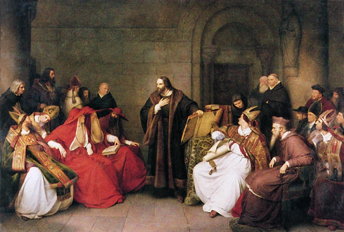
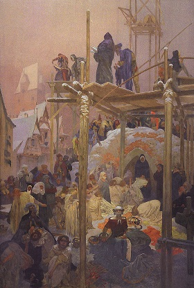
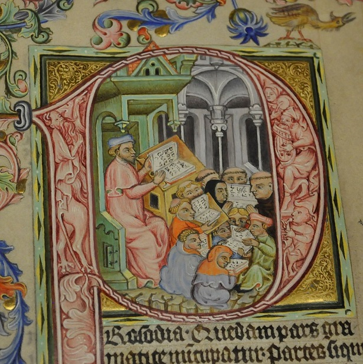
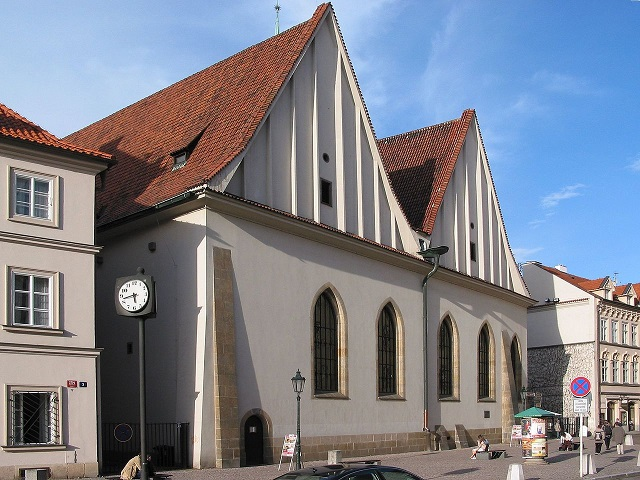
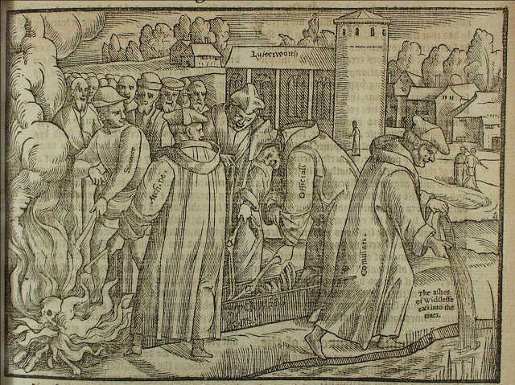
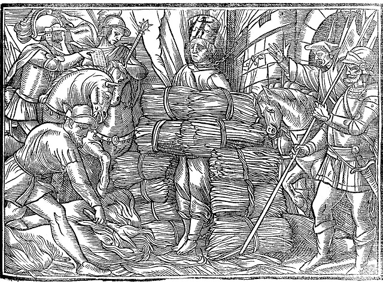

Dnia 6 lipca 1415 roku sobór obradujący w Konstancji wydał wyrok uznający Jana Husa za heretyka i oddał go w ręce władzy świeckiej żeby zrobiła to, czego “Święta Matka Kościół zrobić nie może, a co zrobione być powinno”*. Husa odarto z księżych szat i założono mu na głowę czapkę z napisem “Herezjarcha”, a potem spalono na stosie razem z jego pismami. Według relacji Hus zachował spokój i do końca głosił wiarę w Jezusa. W przeciwieństwie do wielu innych przypadków zabijania za poglądy odrzucane przez kościół, ta egzekucja doprowadziła do rewolucji, która tliła się w granicach Świętego Cesarstwa Rzymskiego. Konflikt ten zmienił zarówno religijny, polityczny jak i społeczny krajobraz Europy.

Hus i religijna reforma oraz rewolucja sygnowane jego imieniem nie pojawiły się nagle. Było to zwieńczenie procesów które zaczęły się manifestować w połowie XIV wieku. W Czechach trwał boom demograficzny i gospodarczy. Rozwój handlu sprawił, że ta dotychczas przygraniczna prowincja Cesarstwa, stała się ważnym ośrodkiem politycznym i gospodarczym. Bogactwo przyciągało osadników, głównie z germańskojęzycznych ziem. Za panowania Karola IV Praga stała się stolicą imperium i trzecim co do wielkości miastem w Europie. Władca ten miał duży wpływ na okoliczności które ukształtowały husytyzm.

W 1348 roku utworzył on pierwszą uczelnię w Europie Środkowej, Uniwersytet Karola w Pradze. Stał się on centrum życia intelektualnego całego regionu. Produktem ubocznym intelektualnych dociekań były rosnące kontrowersje na tematy polityczne i religijne. Karol, jako sojusznik awiniońskiego papiestwa, otworzył czeski kościół szeroko na jego wpływy. W dłuższym okresie czasu wywołało to opór ze strony miejscowego kleru. Jako osoba zainteresowana religią i życiem duchowym ściągnął do Czech popularnych kaznodziejów, którzy swoimi kazaniami o potrzebie odnowy życia chrześcijańskiego i kościoła przyciągali tłumy i rozpalali serca i umysły wiernych.

Początkowo nawoływania te nie różniły się zbytnio od podobnych ruchów w Europie Zachodniej. Waldhauser, spowiednik cesarza, mocno krytykował niemoralne życie jakie prowadziło wielu kościelnych dostojników i ich hipokryzję. Działalność ta trafiła na podatny grunt, zwłaszcza wśród wykładowców i studentów Uniwersytetu. W Czechach zaczęły powstawać świeckie wspólnoty, poświęcające swoje życie modlitwie i pomocy bliźnim. Wielu z ich członków żywo interesowało się Biblią i uważało, że jest ona esencją chrześcijaństwa i studia nad nią mogą odmienić życie ludzi. Waldhauser zmarł w 1369 roku, w Awinionie, gdzie bronił się przed zarzutami jakie postawili mu czescy duchowni.

Pałeczkę po nim przejął jego uczeń Jan Milicz. Był urzędnikiem dworskim, ale przeżył głęboką przemianę i został wędrownym ascetą- kaznodzieją. Pełne umartwień życie zjednało mu zwolenników i spopularyzowało nauczanie, które oprócz ewangelicznego ubóstwa i wezwania do nawrócenia było pełne ostrzeżeń przed zbliżającym się Antychrystem. Milicz rozpropagował idee Waldhausera wśród Czechów. Charakterystyczne dla niego było nawracanie prostytutek- całe zamtuzy zamieniał w świeckie, żeńskie wspólnoty religijne. Sam Karol IV pozwolił mu przerobić budynek “Wenecji, luksusowego domu uciech, na swoisty świecki klasztor. Milicz nazwał swoje wspólnoty “Jerozolimą” a ich członkowie żyli, modlili się i pracowali razem.

Prowadzili także działalność misyjną. Widzieli się jako naśladowcy wspólnot z Ewangelii. Język Jana był zresztą pełen odniesień do Nowego Testamentu i podobnie jak Jezus, mówił o rychło zbliżającym się końcu czasów i potrzebie nawrócenia. Millenaryzm jest obecny w niemal każdym wyznaniu chrześcijańskim, ale w przeszłości oczekiwanie końca było o wiele powszechniejsze. “Jerozolima” była bardzo popularna,ale miała także wrogów- Milicz krytykował duchownych i nie włączał ich do wspólnot. Oskarżono go o herezję i wezwano przed oblicze papieskie. Duchowni w Czechach spodziewali się egzekucji, ale Jan zmarł w lochu i nie doczekał się spalenia na stosie. “Jerozolimę” rozwiązano, a część członkiń, nie mogąc się utrzymać, wróciła do starego zawodu.

Nie był to jednak koniec odnowicielskich ruchów, bo na scenę wkroczył wówczas Maciej z Janowa, uczeń Milicza. Ten duchowny i intelektualista wykształcony na Uniwersytecie Karola i w Paryżu podzielał poglądy, że dla chrześcijanina ideałem powinien być pierwotny kościół opisany w Nowym Testamencie. Nie oznaczało to jednak, że odrzucał instytucję. Uważał, że nie jest ona wolna od błędów i biskupi powinni stać na straży moralnej i doktrynalnej czystości a nie zajmować się polityką i bogactwami. To mieszanie sacrum i profanum było zdaniem Macieja przyczyną wszystkich problemów w kościele i miało doprowadzić do pojawienia się Antychrysta.

Maciej poważał sakramenty i głosił, że wierni powinni jak najczęściej po nie sięgać gdyż przekazują one łaskę, potrzebną zwłaszcza w zepsutych czasach. Dlatego głosił, że komunię należy przyjmować jak najczęściej. Popularność Macieja wywołała kontrowersje. W 1388/ 1389 roku teologowie skrytykowali praktykę częstych komunii, a synod nakazał przyjmować ją max. raz w miesiącu. W 1391 roku ludzie powiązani z Maciejem zbudowali tak zwaną kaplicę Betlejemską w centrum Pragi. Stała się ona miejscem spotkań wiernych zorientowanych na reformę i nauczanie w języku narodowym. Budynek mógł pomieścić setki osób, a mimo dużych rozmiarów niemal zawsze był pełny.

Wyczekiwanie końca i fascynacja Biblią nie były jedynymi powodami istnienia czeskiego ruchu reformatorskiego. Istotna była też schizma awiniońska. Katolicy wierzyli, że aby być w kościele Chrystusa należy być w łączności z następcą świętego Piotra. Schizma awiniońska polegała na tym, że dwóch biskupów uważano za papieży. Rodziło to pytanie- który jest nim prawdę? Była to kluczowa kwestia, bo wszyscy ludzie będący w niewłaściwym kościele byli (jak wówczas wierzono) skazani na potępienie. Rozłam osłabiał kościół i powodował, że pojawiły się głosy mówiące, że przynależność do tej czy innej grupy nie jest tak naprawdę kluczowa.

Kolejnym czynnikiem mającym wpływ na ruch nazywany później husyckim był głęboki podział społeczeństwa według przynależności etnicznej. Czechy (a zwłaszcza Praga) były domem licznych społeczności niemieckojęzycznych, które dzięki poparciu władców i przewadze cywilizacyjnej szybko zaczęły dominować miejscowe elity- także kościelne i intelektualne. Widać to było jak na dłoni po Uniwersytecie Karola gdzie na każdego Czecha przypadało trzech Niemców. Oczywiście taki obrót spraw nie podobał się rdzennym możnym, mieszczaństwu i duchowieństwu, które czuły, że jeśli nic nie zrobią zostaną zaraz zmarginalizowane przez przybyszy i ich potomków.

Dużą rolę odegrała także myśl Wiklefa. Akademicy z Uniwersytetu Karola żywo interesowali się ideami, które opisywałem w poprzednim odcinku. Wizja kościoła, który jest kościołem Chrystusowym o tyle o ile wciela w życie nauczanie Jezusa była dla nich sensowna. Wiklef trafił głównie do czeskojęzycznych akademików i nie był to przypadek. Uniwersytet Karola był areną powszechnego w średniowieczu sporu o uniwersalia. Opisywałem, ale jeszcze raz- jaki jest związek esencji zwierząt (rzeczy które sprawiają, że zwierzę jest identyfikowalne jako zwierzę) z materialnie istniejącymi zwierzętami? Czy jest jakaś esencja, która istnieje obiektywnie w każdym zwierzęciu czy etykieta “zwierzęta” to po prostu nasz arbitralny wymysł?

Spór ten nakładał się w Pradze na konflikt etniczny. Zwolennikami nominalizmu (skłanianie się ku poglądowi, że nie ma żadnej esencji tylko arbitralne etykiety) byli niemieckojęzyczni uczeni. Pogląd przeciwny reprezentowali słowiańskojęzyczni akademicy. Wiklef ze swoim Boskim Umysłem jako źródłem pierwowzorów wszystkich istniejących rzeczy stał się szalenie popularny wśród Czechów. Jedna z wiklefickich prac z Pragi ma na marginesie notatkę która znakomicie podsumowuje recepcję idei oksfordzkiego uczonego na Uniwersytecie Karola: “Haha, Niemcy, haha! Precz! Precz!”.

Krytyka nominalizmu była na rękę Czechom rywalizującym z Niemcami. Krytyka rozpasania moralnego duchowieństwa i rytualizmu podobała się religijnym reformatorom. Cenili sobie oni pogląd mówiący, że prawdziwi kościół Chrystusa jest tam gdzie faktyczna moralność a nie tam gdzie tytuły. Ludzie z religijnych wspólnot żywo interesowali się Biblią, a ta była według Wiklefa najlepszym drogowskazem w kwestiach wiary i moralności. Świeckie elity były z kolei zainteresowane ograniczeniem politycznych i gospodarczych wpływów kościoła. Współgrało to z ideami Jana nawołującymi do rozdzielenia religii od spraw państwowych i ekonomicznych. Wiklefizm był orężem, którego każda z tych grup potrzebowała aby bronić i skonkretyzować swoje pomysły.

Za panowania Wacława IV, który nie był tak silnym władcą jak ojciec, Czechy, a zwłaszcza Praga stały się wrzącym kotłem sprzecznych idei, interesów i konkurujących ze sobą grup etnicznych oraz koterii możnych. Ruchy reformatorskie rozlały się z kaplicy Betlejemskiej i Uniwersytetu na całe Czechy. Ich zwolennicy przemierzali kraj, głosząc konieczność odrodzenia chrześcijaństwa i odrzucenia pogoni za bogactwem i władzą jaka cechowała wielu duchownych. Nowe idee wzięły szturmem serca Czechów. Tym który najlepiej ujął ducha czasów był Jan Hus, a do jego losów przejdziemy w następnym odcinku.
