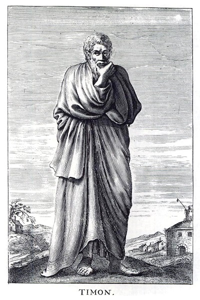
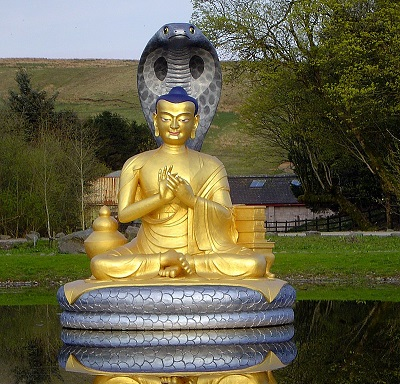
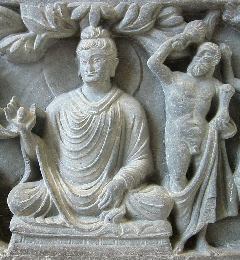

Dzisiaj zacznę nietypowo- od inspiracji do powstania tekstu. Mianowicie- rozmawiałem sobie z colegą na temat stoicyzmu i buddyzmu. Colega stwierdził, że przez “obcość” buddyzmu człowiek Zachodu będzie miał problem z jego zrozumieniem i powinien wybrać stoicyzm. Buddyzm wszak wyłonił się ze starożytnej śramany i rozwijał na Dalekim Wschodzie. Współcześni, zachodni buddyści posługują się często terminologią ukształtowaną w Azji. Ponadto- patrzy się na nich nieufnie i często podnoszona jest krytyka, że “to nieprawdziwy buddyzm”. No cóż, chyba faktycznie jest to inherentnie obca tradycja, a my możemy się rozejść...

Tak się jednak składa, że nowsze prace poświęcone Pyrronowi z Elis stawiają sprawę w innym świetle. Zacznijmy od podstaw. IV wiek p.n.e był okresem ekspansji szeroko pojętego świata greckiego. Aleksander Macedoński rozbił Achemenidów i dotarł aż do zachodnich Indii. Według spisującego żywoty filozofów Laertiosa, armii Macedończyka towarzyszyli greccy uczeni- w tym Pyrron. Po powrocie z wyprawy zasłynął on jako filozof i nauczyciel, prekursor pyrronizmu. Niestety, nie zostawił po sobie pism. Nasza wiedza bazuje na dziełach m.in. ucznia Tymona z Fliuntu i późniejszego spadkobiercy, Sekstusa Empiryka.

Zdaniem Laertiosa Pyrron, pod wpływem perskich magów* i indyjskich gimnosofistów*, przyjął “najszlachetniejszą filozofię”. Streszcza ją jako powstrzymanie się od osądów i uznanie, że nie da się rozstrzygnąć tego co jest tak naprawdę właściwe a co nie jest. Pyrron miał też uważać, że ludzkim postępowaniem kierują nieuświadomione zwyczaje i konwencje. Tymon tak podsumował poglądy swojego mistrza (za Arystotelesem):

"Ktokolwiek chce osiągnąć eudajmonię [stan pełnego, racjonalnego zadowolenia z życia] musi rozważyć te trzy pytania. Po pierwsze: jaka jest prawdziwa natura pragmata [kwestie dotyczące sensu, moralności i etyki]? Po drugie: jak powinniśmy do nich podchodzić? Po trzecie: Jaki będzie wynik takiego podejścia?"

"Jeśli chodzi o wszystkie pragmata, to są one adiaphora [niedefiniowalne, pozbawione tożsamości], astathmeta [zmienne, niestabilne] i anepikirita [niemożliwe do rozstrzygnięcia]. Z tego powodu ani nasze zmysły ani nasze doxai [poglądy, wierzenia] nie mogą powiedzieć pełnej prawdy ani całkowicie oszukać nas w kwestii pragmata. Nie możemy więc na nich polegać. Powinniśmy być adoxastous [wolni od poglądów], aklineis [wolni od inklinacji] oraz akradantous [niezachwiani] w decyzji o zrezygnowaniu z rozstrzygania na temat pragmata." 

Konkludując, o każdej pragmata możemy powiedzieć (tę formułę Pyrron radził powtarzać swoim uczniom gdy stykają się z rozważaniami na temat pragmata):

"Nie jest to niczym ponad to, czym nie jest, lub też zarówno jest jak i nie jest, bądź też z kolei ani jest ani nie jest."

Innymi słowy- pytania o słuszność i niesłuszność, sens i bezsens, sprawiedliwość i niesprawiedliwość nigdy nie doczekają się ostatecznego rozstrzygnięcia. Aby to unaocznić, pyrroniści poddawali argumenty za i przeciw kolejnym dogmatom (jak określali osądy roszczące sobie prawo do orzekania co jest właściwe, a co nie). Zaniechanie osadów i rozstrzygnięć w kwestii pragmata nie było jednak sztuką dla sztuki. Zdaniem Pyrrona i jego zwolenników prowadziło do stanu który nazwali apatheia [wolność od pasji, rozumianych tu jako cierpienie] i ataraxia [niezmącony spokój].

Historycznie pyrronistów zakwalifikowano jako sceptyków, nurt negujący dogmaty a nawet samą możliwość poznania. Na pierwszy rzut oka nie wydaje się to kontrowersyjne. Przecież Pyrron wprost twierdził, że pragmata są niemożliwe do rozstrzygnięcia. Ba! Sekstus, najsłynniejszy pyrronista, sam mówił o swojej szkole jako sceptykach. Część współczesnych badaczy twierdzi jednak, że przypisywanie pyrronistów do starożytnego sceptycyzmu jest po prostu błędem. Utożsamiali się oni wprawdzie ze sceptycyzmem, ale rozumieli go inaczej niż myśliciele i szkoły, które późniejsi badacze ochrzcili tym mianem.

Co więcej- byli oni świadomi różnic i swojej odrębności. Sekstus Empiryk pisał tak:

"(...) w przypadku filozoficznych dociekań, niektórzy mówią, że odkryli prawdę, inni, że nie może być ona odkryta a jeszcze inni cały czas dociekają." 

Tych pierwszych określał mianem dogmatyków i jako przykład podawał szkołę Arystotelesa, epikurejczyków czy stoików. Tych drugich określał mianem akademików i za przykład podawał zwolenników Klitomachusa czy Karneadesa. Trzecią opcję określał mianem sceptyków i utożsamiał ją ze swoją szkołą, czyli pyrronistami. Tymczasem późniejsi badacze mianem sceptyków ochrzcili “bramkę numer dwa”. W ten sposób wrzucono do jednego wora dwa różne nurty. Różnice najprościej będzie wytłumaczyć na przykładzie:

Wyobraźmy sobie, że grupa antycznych filozofów patrzy na nocne niebo. Jedna z podgrup obwieszcza, że liczba gwiazd jest parzysta. Za chwilę kolejna grupa mówi, że to nieprawda, bo jest nieparzysta. Wtem trzecia grupa twierdzi, że tak naprawdę nie wiemy i nie będziemy wiedzieć- nawet jeśli policzymy wszystkie gwiazdy to i tak padniemy ofiarą zawodnych zmysłów i rozumowania. Czwarta, grupa twierdzi zaś, że wprawdzie teraz nie wiemy (bo nie policzyliśmy), ale jeśli kiedyś to zrobimy, to poznamy odpowiedź. Pierwsza i druga grupa to sekstusowi dogmatycy. Trzecia- akademicy, a czwarta to właśnie sceptycy- pyrroniści. Nie negowali oni możliwości zmysłowego i rozumowego poznania wszystkich rzeczy- ufali temu co wynikało z bezpośredniego doświadczenia.

Zdaniem rewizjonistów pyrronizm z jego nieufnością do rozstrzygnięć co do pragmata, zawieszaniu osądu (ale nie odrzucający możliwości poznania) i celem jakim było osiągnięcie stanu apathei i ataraxi był czymś unikalnym w Grecji. Odmienność tłumaczy się indyjskimi wpływami, konkretnie śramaną. Był to, w dużym skrócie, zbiór filozofii i praktyk istniejących równolegle do wierzeń wedyjskich (w uproszczeniu- hinduizm), ale oddzielnych. Do naszych czasów przetrwały buddyzm i dżinizm. Teorie o indyjskich wpływach na Zachodzie są co jakiś czas podnoszone, ale zazwyczaj brak dowodów i przekonujących poszlak. W przypadku Pyrrona wiemy zaś, że był on w Indiach i miał bezpośredni kontakt z tamtejszymi myślicielami.

Myślę, że czytelnicy zauważyli już podobieństwa. Warto zacząć od podkreślenia ważności powstrzymywania się od osądów- bardzo często pojawiało się to u Buddy i u Pyrrona. Ataraxia jest unikatem w greckiej myśli. Inne szkoły utożsamiały osiągnięcie stanu docelowego z posiadaniem i praktykowaniem właściwych przekonań i poglądów. Ataraxia oznacza zaś stan w którym człowiek uwalnia się od poglądów, od konieczności rozstrzygania pragmata. Zdaniem rewizjonistów jest to po prostu buddyjska nirwana. Sam motyw “uwolnienia się” jest centralny zarówno w buddyzmie jak i pyrronizmie.

Pamiętacie trzy pytania i odpowiedzi z początku tekstu? Porównajmy je z buddyjską Trilaksaną, w której Budda mówi o naturze wszystkich dharm (termin mający wiele znaczeń, m.in kwestie dotyczące prawdziwej natury zjawisk, zdaniem rewizjonistów indyjski odpowiednik pragmata):

"Wszystkie dharmy są anitya [niestałe, niestabilne] …, wszystkie dharmy są duhkha [niesatysfakcjonujące, niedostateczne] i wszystkie dharmy są anatman [bez przyrodzonej tożsamości]."

Nietrudno zauważyć podobieństwa między trzema charakterystykami dharm i trzema charakterystykami pragmat. Są one rdzeniem odpowiednio buddyzmu i pyrronizmu a nauczanie o konieczności, odpowiednio, pozostawienia za sobą przywiązania i wstrzymania się od osądów wynikają właśnie z nich. Wspólny jest też cel- nirwana/ apatheia i ataraxia, oznaczające stan spokoju, wolny od cierpienia i przywiązań.

Kolejnym podobieństwem jest praktyka dyskutowania na temat przekonań, stawiania argumentów i kontr- oraz łuskania sprzeczności w doktrynach. Miało to na celu uświadomić dyskusyjność wszystkich wierzeń. Podobny jest również styl życia jaki przypisuje się Pyrronowi a o jakim donosi się w przypadku mędrców śramany. Słowo to oznacza “poszukującego, ascetę, tego który żyje surowo”. Pyrron nie był pierwszym greckim filozofem, który prowadził żywot podobny do pustelniczego, na uboczu (wystarczy choćby wspomnieć słynnego Diogenesa), ale rewizjoniści wskazują, że miał on udział w jego popularyzowaniu.

No właśnie- część historyków zgadza się, że pyrroniści różnili się od reszty sceptyków, ale wskazują, że różnice można wytłumaczyć rozwinięciem greckich tradycji, bez odwoływania się do Buddy i innych nurtów śramany. Historycy tacy jak Bett minimalizują wpływ pobytu w Indiach, wskazując np. na trudności językowe. Jego zdaniem uniemożliwiło to Pyrronowi dobre zaznajomienie się z indyjskimi mędrcami i wpływy, jeśli były, to raczej marginalne. Spotyka się to z kontrą rewizjonistów wskazującą, że język faktycznie mógł być problemem, ale rdzeń tego nauczania jest w zasadzie prostą praktyką i nie trzeba tutaj mieć sanskrytu na C2 żeby zrozumieć podstawy.

Z drugiej strony, niektórzy, np. Beckwith posuwają się wręcz do stwierdzenia, że pyrronizm to nie tyle filozofia inspirowana śramaną, ale po prostu buddyzm. Jego zdaniem pyrronizm jest nawet bardziej buddyjski od obecnego buddyzmu, bez odwołań do wierzeń religijnych/ parareligijnych w postaci na przykład karmy, duchowych istot, latających mnichów czy cyklów ponownych narodzin. Dyskusja na ten temat ma się dobrze, strony przerzucają się argumentami i spór jest daleki od zakończenia. Budda i Pyrron radzili by zapewne powstrzymanie się od rozstrzygnięć i dążenie do wyzwolenia się ze zbędnych przekonań.
