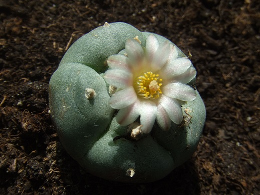

Pozbawiony kolców kaktus pejotl (Lophophora williamsii) pochodzi z terenów północnego Meksyku. Osiąga do 20cm wysokości, a na jego czubku wyrasta biały lub różowy kwiat. Kaktus ten zawiera ponad 50 znanych alkaloidów, ale jeden z nich jest wyjątkowy – to meskalina, ma działanie psychoaktywne i wywołuje halucynacje. To właśnie czubek kaktusa zawiera największe stężenie meskaliny i wysuszony jest spożywany przez wiernych Tubylczego Kościoła Amerykańskiego niczym komunia.

Tubylczy Kościół Amerykański (Native American Church of North America – NAC) jest spadkobiercą kilku innych wyznań, których wspólnym mianownikiem jest kult pejotlu (pejotyzm). Kult ten rozprzestrzenił się z Meksyku na prawie cały obszar Ameryki Północnej w latach 80. XIX w. na skutek rosnących problemów wśród rdzennych Indian: biedy, bezrobocia, przestępczości i samobójstw. Ruch oporu przeciw białym przybrał najpierw formę kultu Tańca Duchów – wierzono, że z pomocą przodków kolonizatorzy zostaną zniszczeni. Nadzieje Indian zostały zniweczone wraz z licznymi klęskami w bitwach z białymi (w tym największa pod Wounded Knee w 1890r.). Zamiast więc zbrojnego oporu, zwrócono się ku duchowości, a pejotl pomógł tubylcom oderwać się od codziennych problemów. Utworzył się nowy kult, a wpływ misjonarzy był nieuchronny, tak więc pejotyzm zawiera liczne elementy chrześcijańskie i jest niekiedy określany jako synkretyzm chrześcijaństwa i tubylczych wierzeń. Lokalne władze kilkakrotnie próbowały zakazać pejotlu jako środka odurzającego, ale badania wykazały brak skłonności do uzależnień i niską szkodliwość społeczną.

Tubylczy Kościół Amerykański liczy obecnie ok.250 tys. wiernych czyli niemal połowę wszystkich rdzennych mieszkańców Ameryki Północnej. Jest szczególnie popularny wśród Indian Kiowa, Komanczów, Nawahów oraz Indian Wielkiej Kotliny i Wielkich Jezior. Symbolem kościoła jest oczywiście kaktus pejotl oraz ołtarz w kształcie półksiężyca. Nie istnieje oficjalna doktryna, święte księgi, ani jasna hierarchia. Mimo to NAC dzieli się na dwa nurty – Drogę Połowy Księżyca oraz Tradycję Niebieskiego Księżyca, przy czym pierwszy nurt cechuje się mniejszym wpływem chrześcijaństwa. Występują w nim modlitwy do Jezusa, odwołania do Biblii oraz chrzest. Nurt Połowy Księżyca uznaje Boga i jego syna Jezusa, oraz to, że mogą bezpośrednio się z nim połączyć poprzez spożywanie pejotlu. Biali nie mają takiej możliwości, gdyż to oni zabili Jezusa. Natomiast wyznawcy nurtu Niebieskiego Księżyca wyznają Trójcę Święta, ale w sposób politeistyczny – Bóg jest utożsamiony z Wielkim Duchem, Chrystus jest czasami tożsamy jednym z bohaterów mitologii indiańskiej, a Duch Święty to Duch Pejotlowy, który umożliwia kontakt ze światem nadprzyrodzonym. Według mitologii pejotyzmu Jezus przybył do Ameryki i w trosce o ludzi stworzył specjalną roślinę, w której zamknął część swojej boskiej mocy. Dlatego nieistotnie od odłamu, obrzędy spożywania pejotlu stanowią najistotniejszy element kultu NAC.

Ceremonie odbywają się w każdy sobotni wieczór i są podobne do protestanckich nabożeństw. Wierni zbierają się w specjalnie zbudowanym tipi lub po prostu na wolnym powietrzu. Nabożeństwo zaczynają modlitwy oraz śpiewy przy akompaniamencie bębnów oraz w towarzystwie świętego ogniska. Strażnik ognia (Cedarman) wytwarza oczyszczający dym z drzewa cedrowego. W końcu następuje kulminacyjny moment – spożywanie naparu z pejotlu oraz suszonych owoców kaktusa przez wszystkich uczestników. Schemat się powtarza – modlitwy, pieśni, kolejne dary pejotlu, aż do bladego świtu. Odprawia się także specjalne ceremonie lecznicze. W trakcie nabożeństwa panuje kontemplacyjna atmosfera, wszyscy oczekują na wizje, w których otrzymają wskazówki od Boga, jak radzić sobie z codziennymi trudnościami. Pejotyści bowiem kierują się w życiu podstawowymi zasadami Kościoła – głoszenie braterskiej miłości wśród wszystkich ludzi niezależnie od pochodzenia; konieczność opiekowania się rodziną, bliskimi, starszymi i dziećmi; samowystarczalność bez czyjejkolwiek pomocy, szczególnie od białych (unikanie uczciwej pracy jest jednym z cięższych grzechów); całkowita wstrzemięźliwość od alkoholu i innych używek. Tak więc według nauki Tubylczego Kościoła Amerykańskiego życiowe problemy można rozwiązać tylko przez pracę nad sobą, a święty kaktus pejotl ma tylko za zadanie pomóc być lepszym człowiekiem.