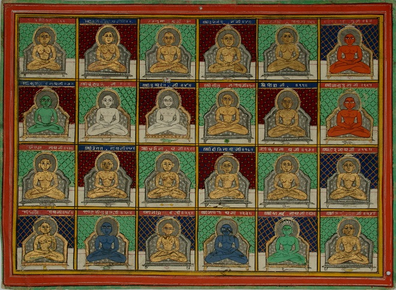
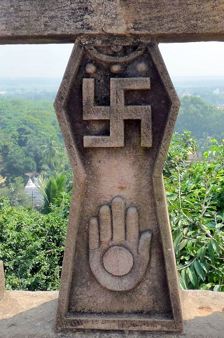
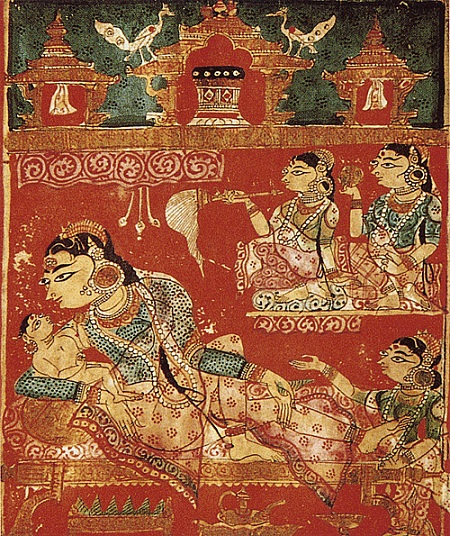
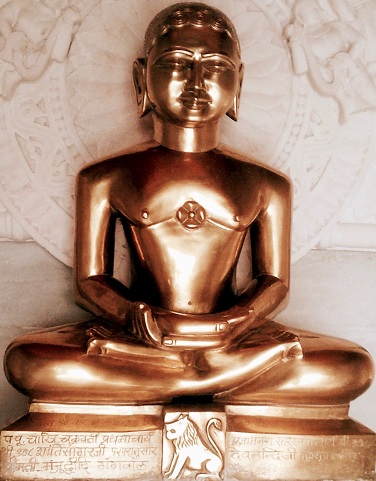
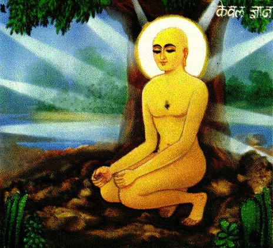
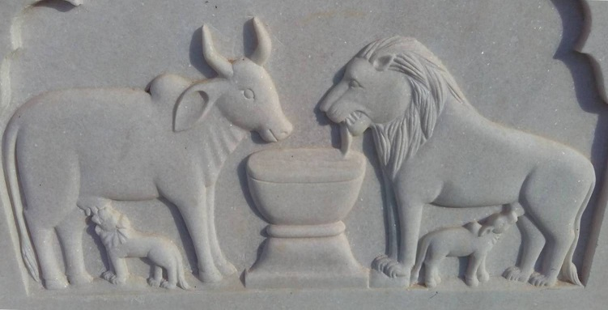

Słyszeliście kiedyś o dżinizmie? Nie, nie o tym z lampy Aladyna (wybaczcie żenujący żart prowadzącego), ale o jednej z najstarszych, ciągle istniejących religii świata. Nie? To właśnie nadrabiamy to karygodne zaniedbanie. Dżinizm to określenie na wierzenia, filozofie i praktyki których korzenie sięgają subkontynentu indyjskiego. W przeciwieństwie do “pokrewnych” hinduizmu i buddyzmu, dżinizm wciąż jest mocno ograniczony do swojego matecznika. Dzieli z wyżej wymienionymi wiele podobieństw i korzenie, ale wykazuje także oryginalne cechy pozwalające na zaklasyfikowanie go jako odrębna tradycja.

Ciekawe są początki dżinizmu. Otóż, według samych zainteresowanych, nie ma on początku. Ten pogląd jest mocno związany z indyjską kosmologią, która przedstawia umierający i odradzający się wszechświat jako proces bez startu i końca. Czas między kolejnymi “stworzeniami” i “apokalipsami” określa się mianem kalp (jednostka czasu oznaczająca bardzo, bardzo długo). Zdaniem dżinistów w każdej kalpie pojawia się szereg ludzi, którzy odkrywają dżinizm. Jest on rozumiany nie jako jakieś objawienie a uniwersalna i obiektywna rzeczywistość. Ci ludzie są więc odkrywcami dżinizmu a nie twórcami. Na podobnej zasadzie na jakiej Kopernik nie sprawił, że Ziemia zaczęła krążyć wokół Słońca- po prostu odkrył ten stan rzeczy.

Kolejni odkrywcy dżinizmu określani są mianem “tirthankara” (l.poj.) co oznacza “budowniczego przeprawy [przez bród rzeki]”. Rzeką jest tutaj pasmo kolejnych wcieleń, a celem jest drugi brzeg, metafora wyzwolenia z cyklu śmierci i narodzin. “Tirtha”, czyli “przeprawa”, to wspólnota podążająca za wskazaniami odkrywcy dżinizmu w danej epoce. Według wierzeń każda kalpa ma 24 odkrywców dżinizmu. Nasza epoka jest ostatnia dla aktualnej kalpy, a jej nauczycielem jest Mahawira (co dosłownie oznacza “Wielki Bohater”), duchowy spadkobierca Parśwy, 23 tirthankary. Dominującym wśród historyków poglądem jest, że Mahavira i Parśwa są faktycznie istniejącymi postaciami, ale historyczność ich 22 poprzedników jest mocno kwestionowana.

Mahawira jest datowany na VI/V wieku p.n.e. W życiu świeckim posługiwał się imieniem Wardhamana. Jest on wspominany nie tylko w pismach dżinijskich, ale także buddyjskich, gdzie nazywany jest Nigantha (“ten którego nie krępują więzy”). To wzmacnia twierdzenia o historyczności postaci. Problematyczne jest jednak to, że źródła o życiu Mahawiry które przetrwały do naszych czasów zostały spisane kilka wieków po jego śmierci. Zwiększa to ryzyko mitologizacji czy wręcz dodawania całkowicie wymyślonych historii. Przykładem tego mogą być opisy rzekomej walki Mahawiry z nauczycielami innych szkół, toczonej przy pomocy materializującej się, metafizycznej energii.

Dominująca tradycja podaje, że Mahawira urodził się w 599 roku p.n.e na terenie północno- wschodnich Indii (w mniej więcej tym samym regionie co Budda). Czasem przesuwa się te daty na V wiek, bazując na pismach buddyjskich, odkryciach archeologicznych i mniej popularnych przekazach. Dżinijskie teksty są spisane w prakrycie ardha magadhi, a nie sanskrycie (był on wówczas językiem sakralnym). Prawdopodobnie jest to celowy zabieg. Zwolennicy Mahawiry byli częścią nurtu indyjskiej duchowości znanego jako śramana, który istniał równolegle i oddzielnie w stosunku do tradycji wedycznych. Teorii na temat tego czym była śramana jest dużo i poświęcę im niedługo specjalny odcinek. Tutaj tylko sygnalizuję odrębność od mainstreamu.

Mahawira pochodził z kasty znanej jako kszatrija, która w olbrzymim uproszczeniu była odpowiednikiem europejskiego rycerstwa/ szlachty. Wpływ pochodzenia widać na przykład po często militarnej terminologii stosowanej w pismach dżinijskich. Samo słowo jina, od którego pochodzi nazwa religii oznacza “zdobywcę”. Dżinizm prezentował się często jako duchowa walka, w której pokonuje się słabości i przeszkody na drodze do oświecenia. Mahawira, jako członek szlachetnego rodu nie musiał za bardzo martwić się o swój byt. Nie czuł się jednak usatysfakcjonowany i spełniony w swoim życiu i zaczął poszukiwać czegoś innego. Tym czymś było życie ascety.

Mahawira przyłączył się do swoistej subkultury duchowych poszukiwaczy, ascetów i mędrców, która towarzyszyła społeczeństwu indyjskiemu od niepamiętnych czasów. Ludzie ci wyznawali różne, także niezgodne z głównym nurtem poglądy na kwestie duchowe i filozoficzne. Gromadzili wokół siebie naśladowców oraz laikat i próbowali wdrażać swoje przekonania w życie. Według dżinijskiej tradycji rodzice Mahawiry byli zwolennikami nauk Parśwy więc ze zrozumieniem przyjęli decyzję syna. W ascetycznej praktyce wielu upatrywało szansy na wyrwanie się ze świata w przenośni i dosłownie.

Każdy członek indyjskich społeczeństw miał pewne zobowiązania- rodzina, wspólnota, dbanie o dobro wspólne etc. Jednak, w myśl indyjskich wierzeń, życie w ten sposób niejako uruchamia prawo karmy- co oznacza, że po śmierci dusza dozna kolejnego wcielenia. Zaniedbanie obowiązków wcale nie wyłączało człowieka z działania prawa karmicznego. Co więcej, powodował, że kolejne wcielenie może być gorsze niż aktualne. Obowiązki o których mowa wynikały z urodzenia się w danej grupie społecznej. Co należy zatem zrobić skoro z tego kim jesteśmy wynikają rzeczy uniemożliwiające nam uwolnienie się z cyklu narodzin i śmierci?

Odpowiedź brzmiała- przestać być tym kim jesteśmy (a raczej wydaje nam się, że jesteśmy). W wielu indyjskich tradycjach złożeniu mniszych ślubów towarzyszy symboliczny pogrzeb i nadanie nowego imienia. Asceza jest więc próbą odkrycia prawdziwej natury a to ma owocować oświeceniem wyzwalającym z samsary (cyklu ponownych narodzin). Mahawira był radykalny i uważał, że tylko tak można osiągnąć pożądane efekty. Dżinijskie źródła są pełne opisów ekstremalnych postów i umartwień jakim się poddawał. Oprócz tego Mahawira praktykował medytację i prowadził życie tułacza. Tradycja podaje, że spędził 12 lat na medytacji, umartwieniach, wędrówkach i rozważaniach zanim osiągnął oświecenie.

Dżinijskie źródła określają je mianem Kevala Jnana, co dosłownie oznacza wszechwiedzę. Tradycje różnią się w kwestii tego co nastąpiło później. Część z nich przedstawia oświeconego Mahawirę w sposób bardziej ludzki mówiąc, że podróżował i nauczał o odkrytej przez siebie ścieżce prowadzącej do uwolnienia. Inne z kolei mówią, że stał się czymś na podobieństwo boskiej istoty, która przestała mieć ludzkie potrzeby i pozostawała cały czas w jednym miejscu, a wiedzę przekazywała w nadprzyrodzony sposób. Mahawira zmarł w wieku 72 lat, a dżiniści zaczęli obchodzić święto Diwali (wywodzące się z tradycji wedycznej, ale hindusi celebrują je w innym celu niż upamiętnienie nauczania i życia Mahawiry).

Nauczanie i praktyki Mahawiry rozwinięte w dżinizm potrafią być bardzo podobne do niektórych nurtów hinduizmu i buddyzmu. Do tego stopnia, że Europejczycy bardzo długo traktowali dżinizm jako jedną z buddyjskich szkół. Przykładem podobieństwa jest choćby to, że celem dżinijskich mnichów jest osiągnięcie pełnego oświecenia, przerywającego samsarę. Istnieje jednak szereg różnic. Przede wszystkim zasada ahimsy (odrzucenia przemocy) jest znacznie ostrzejsza i traktowana jako absolutnie kluczowa. Dżinijscy mnisi są przez to ściśle uzależnieni od laikatu i praktycznie nie występują w miejscach gdzie nia ma świeckich wyznawców. Nie wolno im na przykład samodzielnie przygotowywać sobie jedzenia, bo prowadzi to do śmierci mikroskopijnych form życia co “psuje karmę” (eh, te żenujące żarty).

Kolejnym przykładem radykalnej ahimsy są maseczki jakie noszą mnisi w niektórych tradycjach. Tutaj celem jest również ochrona mikroskopijnych form życia. Istnieją także specjalne miotełki, które są non stop w użyciu gdy mnich się przemieszcza. Wymiatanie drogi ma służyć ochronie małych zwierząt i owadów które mogłyby zostać zdeptane przez nieuwagę. Dżinizm dzieli z buddyzmem i niektórymi nurtami hinduizmu wymagania dotyczące mówienia prawdy i zgodności czynów ze słowami (satya). Kolejną zasadą dżinizmu jest asteya czyli zakaz używania i brania czegoś co nie zostało dobrowolnie ofiarowane. Asteya łączy się z aparigrahą czyli zasadą nieprzywiązywania się do dóbr materialnych i rzeczy ulotnych.

Zasady te są jednak o wiele surowsze w dżinizmie niż innych indyjskich religiach. Dość powiedzieć, że największa schizma (podział na Śwetambarów i Digambarów) była spowodowana konfliktem odnośnie tego czy mnisi powinni zakrywać ciało. Sam Mahawira był zadeklarowanym nudystą i zwyczaj ten wydaje się dominujący we wczesnym dżinizmie. Śwetambarowie dopuszczają odzienie, zwłaszcza przy kontaktach z laikatem, ale Digambarowie uważają to za nowinkę wypaczającą nauczanie dotyczące posiadania rzeczy. Ich zdaniem nieposiadanie musi być pełne i mnichowi nie wolno mieć nawet kawałka tkaniny.

Co ciekawe- u Śwetambarów wykształciła się instytucja mniszek, ale proces ten nie zaszedł u Digambarów. Nagie kobiety uznano za zbyt wielką pokusę. Radykalne nieposiadanie i nieprzywiązywanie się do rzeczy przejawia się także przy jedzeniu. Mnichom nie wolno jeść z miski czy talerza- mogą jeść tylko to co wzięli w dłonie. Kolejną zasadą w której przejawia się radykalizm jest brahmacharya. Dotyczy ona czystości (przede wszystkim seksualnej) słów, czynów i myśli. Kluczowa jest także medytacja, ale w przeciwieństwie do buddyzmu czy niektórych nurtów hinduizmu jej celem nie jest transformacja i urzeczywistnienie przebudzonego umysłu. Chodzi raczej o ograniczenie przywiązań i aktywności które pozwalają na działanie praw karmicznych.

Nie znaczy to jednak, że przeciętny wyznawca dżinizmu chodzi z miotełką i oddycha tak aby przypadkiem nie połknąć muchy. Zasady obowiązujące świeckich dżinistów są o wiele łagodniejsze niż te wyżej opisane, odnoszące się do mnichów. Dżinijska dieta jest generalnie wegetariańska, ale istnieją także czysto wegańskie nurty. Ponadto religijny kalendarz jest wypełniony okresami postu, medytacji i obowiązkowych prac charytatywnych. Świeckich dżinistów nie obowiązują także surowe restrykcje dotyczące posiadania, co jest skwapliwie wykorzystywane przez wielu z nich. Stereotyp łączący dżinistów z wpływową klasą wyższą nie wziął się z powietrza.

I tutaj niestety muszę urwać wpis, chociaż tak naprawdę ledwo dotknęliśmy tematu. Też jestem zawiedziony, ale opowiedzenie o tradycji liczącej sobie 2.5k lat na 3 stronach a4 to zadanie niewykonalne. Mogę wam jednak obiecać, że jeszcze wrócimy do tego jak dżinizm zmieniał się od czasów jego “wcale nie założyciela”, jak ewoluowała jego filozofia oraz jakie były koleje losu wspólnot dżinijskich.
